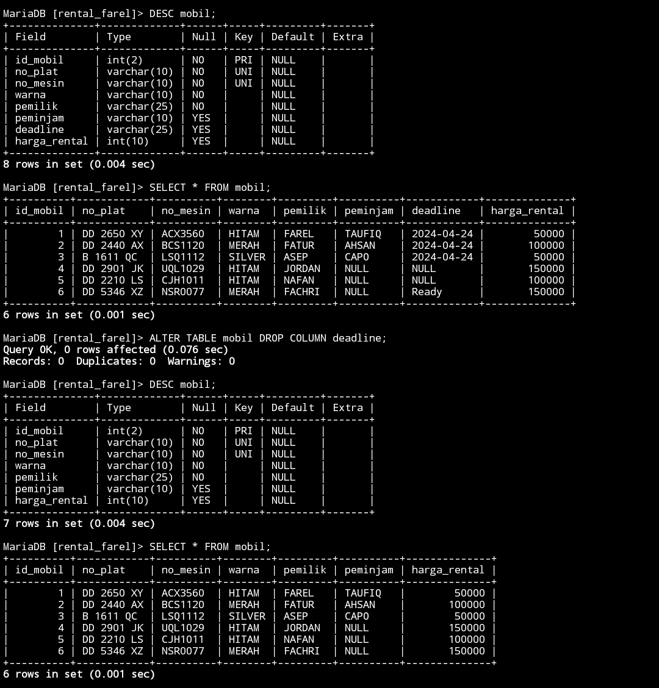

# STRUKTUR AWAL TABLE


>


# MENAMBAHKAN KOLOM


## STRUKTUR 

```MySQL

ALTER TABLE nama_tabel ADD nama_kolom varchar(10) AFTER nama_kolom;


```

## CONTOH 

```MySQL

ALTER TABLE mobil ADD batas_peminjaman varchar(10) AFTER peminjam;


```

## HASIL 

>

## ANALISIS 

- `ALTER TABLE`: Ini adalah perintah SQL yang digunakan untuk mengubah struktur tabel yang sudah ada.
- `mobil`: Ini adalah nama tabel yang akan diubah strukturnya.
- `ADD batas_peminjaman varchar(10)`: Ini adalah bagian yang menentukan perubahan yang akan dilakukan pada tabel. Perintah ADD digunakan untuk menambahkan kolom baru ke tabel. "batas_peminjaman" adalah nama kolom baru yang akan ditambahkan. varchar(10) menunjukkan tipe data kolom tersebut, yaitu karakter dengan panjang maksimum 10 karakter.
- `AFTER peminjam`: Ini adalah bagian yang menentukan posisi kolom baru dalam tabel. Dalam hal ini, kolom baru "batas_peminjaman" akan ditambahkan setelah kolom "peminjam".


## KESIMPULAN 


perintah SQL tersebut menambahkan kolom baru dengan nama "batas_peminjaman" dan tipe data `varchar(10)` ke dalam tabel "mobil", ditempatkan setelah kolom "peminjam".


## ISI DATA KOLOM , TAMBAHAN


### CONTOH 


```MySQL

UPDATE mobil SET batas_peminjaman="2024-04-24" WHERE peminjam is NOT NULL;


```


### HASIL


>


# MENGUBAH NAMA KOLOM


## STRUKTUR 

```MySQL

ALTER TABLE nama_tabel RENAME COLUMN nama_kolom TO nama_kolom_gantinya;


```

## CONTOH 

```MySQL

ALTER TABLE mobil RENAME COLUMN batas_peminjaman TO deadline;


```

## HASIL 

>


## ANALISIS 

1. `ALTER TABLE`: Ini adalah perintah SQL yang digunakan untuk mengubah struktur tabel yang sudah ada.
    
2. `mobil`: Ini adalah nama tabel yang akan diubah strukturnya.
    
3. `RENAME COLUMN`: Ini adalah bagian dari perintah ALTER TABLE yang menandakan bahwa kita akan mengubah nama kolom.
    
4. `batas_peminjaman`: Ini adalah nama kolom yang akan diubah.
    
5. `TO deadline`: Ini adalah nama baru yang akan diberikan kepada kolom tersebut. Kolom "batas_peminjaman" akan diubah menjadi "deadline".


## KESIMPULAN 

perintah SQL tersebut mengubah nama kolom dalam tabel "mobil" dari "batas_peminjaman" menjadi "deadline".


# MENGUBAH TIPE DATA KOLOM


## STRUKTUR 

```MySQL

ALTER TABLE nama_tabel MODIFY nama_kolom DATE;


```

## CONTOH 

```MySQL


ALTER TABLE mobil MODIFY deadline DATE;


```

## HASIL 

>

## ANALISIS 

1. `ALTER TABLE`: Ini adalah perintah SQL yang digunakan untuk mengubah struktur tabel yang sudah ada.
    
2. `mobil`: Ini adalah nama tabel yang akan diubah strukturnya.
    
3. `MODIFY deadline DATE`: Ini adalah bagian dari perintah ALTER TABLE yang menunjukkan bahwa kita akan mengubah definisi kolom. Kata kunci "MODIFY" digunakan untuk menentukan bahwa kita akan mengubah tipe data kolom. "deadline" adalah nama kolom yang akan diubah, dan "DATE" menunjukkan bahwa tipe data kolom tersebut akan diubah menjadi DATE.


## KESIMPULAN 

perintah SQL tersebut mengubah tipe data kolom "deadline" dalam tabel "mobil" menjadi `DATE`.


# MENAMBAHKAN CONSTRAINT


## STRUKTUR 

```MySQL

ALTER TABLE nama_tabel ALTER nama_kolom SET DEFAULT "Ready";


```

## CONTOH 

```MySQL

ALTER TABLE mobil ALTER deadline SET DEFAULT "Ready";


```

## HASIL 

>

## ANALISIS 

1. `ALTER TABLE`: Ini adalah perintah SQL yang digunakan untuk mengubah struktur tabel yang sudah ada.
    
2. `mobil`: Ini adalah nama tabel yang akan diubah strukturnya.
    
3. `ALTER deadline`: Ini menunjukkan bahwa kita akan mengubah properti dari kolom "deadline".
    
4. `SET DEFAULT "Ready"`: Ini adalah bagian yang menetapkan nilai default baru untuk kolom "deadline". Dalam hal ini, nilai default `"Ready"` akan ditetapkan untuk kolom "deadline". Ini berarti jika nilai tidak diberikan untuk kolom "deadline" saat baris baru dimasukkan ke dalam tabel, maka nilai default `"Ready"` akan digunakan.


## KESIMPULAN 


perintah SQL tersebut mengatur nilai default `"Ready"` untuk kolom "deadline" dalam tabel "mobil". Ini berarti jika nilai tidak diberikan untuk kolom "deadline" saat baris baru dimasukkan ke dalam tabel, maka nilai default `"Ready"` akan digunakan.


## TAMBAHAN 


### CONTOH


```MySQL


INSERT INTO mobil (id_mobil,no_plat,no_mesin,warna,pemilik,peminjam,harga_rental) VALUES (6,"DD 5346 XZ","NSR0077","MERAH","FACHRI",NULL,150000);


```


### HASIL


>


# MENGHAPUS CONSTRAINT 


## STRUKTUR 

```MySQL

ALTER TABLE nama_tabel ALTER nama_kolom DROP DEFAULT;


```

## CONTOH 

```MySQL

ALTER TABLE mobil ALTER deadline DROP DEFAULT;


```

## HASIL 

>

## ANALISIS 

1. `ALTER TABLE`: Ini adalah perintah SQL yang digunakan untuk mengubah struktur tabel yang sudah ada.
    
2. `mobil`: Ini adalah nama tabel yang akan diubah strukturnya.
    
3. `ALTER deadline`: Ini menunjukkan bahwa kita akan mengubah properti dari kolom "deadline".
    
4. `DROP DEFAULT`: Ini adalah bagian dari perintah `ALTER TABLE` yang menandakan bahwa kita akan menghapus nilai default yang mungkin telah ditetapkan sebelumnya untuk kolom "deadline". Dengan demikian, kolom "deadline" tidak akan memiliki nilai default lagi setelah perintah ini dijalankan.


## KESIMPULAN 

perintah SQL tersebut menghapus nilai default yang mungkin telah ditetapkan sebelumnya untuk kolom "deadline" dalam tabel "mobil". Setelah perintah ini dijalankan, kolom "deadline" tidak akan memiliki nilai default lagi.


# MENGHAPUS KOLOM


## STRUKTUR 

```MySQL

ALTER TABLE nama_tabel DROP COLUMN nama_kolom;


```

## CONTOH 

```MySQL

ALTER TABLE mobil DROP COLUMN deadline;


```

## HASIL 

>


## ANALISIS 

1. `ALTER TABLE`: Ini adalah perintah SQL yang digunakan untuk mengubah struktur tabel yang sudah ada.
    
2. `mobil`: Ini adalah nama tabel yang akan diubah strukturnya.
    
3. `DROP COLUMN deadline`: Ini adalah bagian dari perintah `ALTER TABLE` yang menunjukkan bahwa kita akan menghapus kolom dari tabel. "deadline" adalah nama kolom yang akan dihapus dari tabel "mobil". Setelah perintah ini dijalankan, kolom "deadline" akan dihapus dari struktur tabel "mobil".


## KESIMPULAN 


perintah SQL tersebut menghapus kolom "deadline" dari tabel "mobil". Setelah perintah dijalankan, kolom "deadline" tidak akan ada lagi dalam struktur tabel "mobil".


# MENGGANTI NAMA TABEL


## STRUKTUR 

```MySQL

ALTER TABLE nama_tabel RENAME TO nama_tabel_gantian;


```

## CONTOH 

```MySQL

ALTER TABLE mobil RENAME TO data_mobil;


```

## HASIL 

>

## ANALISIS 

1. `ALTER TABLE`: Ini adalah perintah SQL yang digunakan untuk mengubah struktur tabel yang sudah ada.
    
2. `mobil`: Ini adalah nama tabel yang akan diubah.
    
3. `RENAME TO data_mobil`: Ini adalah bagian dari perintah `ALTER TABLE` yang menunjukkan bahwa kita akan mengubah nama tabel. "data_mobil" adalah nama baru yang akan diberikan kepada tabel yang sebelumnya bernama "mobil". Dengan perintah ini, nama tabel "mobil" akan diubah menjadi "data_mobil".


## KESIMPULAN 


perintah SQL tersebut mengubah nama tabel "mobil" menjadi "data_mobil".


