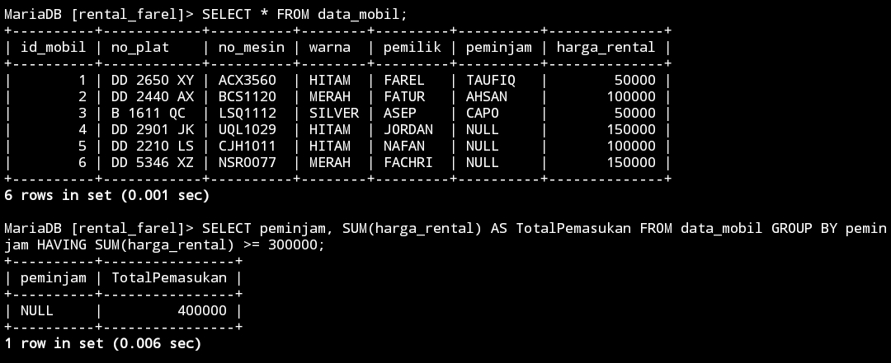

# GROUP BY

## STRUKTUR 

```MySQL


```

## CONTOH 

```MySQL

SELECT jabatan, COUNT(NIP) AS JumlahPegawai FROM pegawai2 GROUP BY jabatan;

```

## HASIL 


## ANALISIS 


## KESIMPULAN


# HAVING

## STRUKTUR 

```MySQL


```

## CONTOH 

```MySQL


```

## HASIL 


## ANALISIS 


## KESIMPULAN


# SOAL

# TAMPILKAN JUMLAH DATA MOBIL DAN KELOMPOKKAN BERDASARKAN WARNANYA


## STRUKTUR 

```MySQL


```

## CONTOH 

```MySQL

SELECT warna, COUNT(id_mobil) AS Jumlah_Warna FROM data_mobil GROUP BY warna;

```

## HASIL 

>


## ANALISIS 

1. `SELECT` warna, `COUNT`(id_mobil) `AS` Jumlah_Warna:
    
    - **warna**: Ini adalah kolom dari tabel `data_mobil` yang akan ditampilkan dalam hasil query.
    - **`COUNT`(id_mobil) `AS` Jumlah_Warna**: Fungsi `COUNT(id_mobil)` digunakan untuk menghitung jumlah baris yang memiliki nilai `id_mobil` tidak null dalam setiap kelompok warna. Hasilnya akan diberi alias `Jumlah_Warna` sehingga lebih mudah dibaca.
2. **`FROM` data_mobil**:
    
    - Ini menentukan tabel sumber data, yaitu `data_mobil`.
3. **`GROUP BY` warna**:
    
    - Klausul `GROUP BY` digunakan untuk mengelompokkan data berdasarkan kolom `warna`. Semua baris dengan nilai `warna` yang sama akan dikelompokkan bersama.


## KESIMPULAN

Kode SQL tersebut digunakan untuk menghitung jumlah mobil berdasarkan warna dalam tabel `data_mobil`. Dengan menggunakan klausa `GROUP BY`, kode ini mengelompokkan data berdasarkan kolom `warna` dan menghitung jumlah mobil untuk setiap kelompok warna menggunakan fungsi `COUNT`. Hasil dari query ini akan memberikan distribusi jumlah mobil untuk setiap warna yang ada di dalam tabel.


# Berdasarkan query ini tampilkan yg lebih besar dari 3 atau sama dengan 3 pemilik mobilnya 


## STRUKTUR 

```MySQL


```

## CONTOH 

```MySQL

SELECT peminjam, COUNT(id_mobil) AS JumlahMobil FROM data_mobil GROUP BY peminjam HAVING COUNT(id_mobil) >= 3;

```

## HASIL 

>


## ANALISIS 

1. **`SELECT` peminjam, `COUNT`(id_mobil) `AS` JumlahMobil**:
    
    - **peminjam**: Kolom dari tabel `data_mobil` yang mewakili identitas atau nama peminjam.
    - **`COUNT`(id_mobil) `AS` JumlahMobil**: Fungsi `COUNT(id_mobil)` digunakan untuk menghitung jumlah mobil yang dipinjam oleh setiap peminjam. Hasilnya diberi alias `JumlahMobil` untuk memudahkan pembacaan hasil.
2. **`FROM` data_mobil**:
    
    - Ini menentukan tabel sumber data, yaitu `data_mobil`.
3. **`GROUP BY` peminjam**:
    
    - Klausa `GROUP BY` digunakan untuk mengelompokkan data berdasarkan kolom `peminjam`. Semua baris dengan nilai `peminjam` yang sama akan dikelompokkan bersama.
4. **`HAVING COUNT`(id_mobil) `>=` 3**:
    
    - Klausa `HAVING` digunakan untuk memfilter kelompok hasil yang sudah dikelompokkan. Dalam hal ini, hanya kelompok dengan jumlah mobil (`COUNT(id_mobil)`) yang sama dengan atau lebih dari 3 yang akan disertakan dalam hasil akhir.


## KESIMPULAN

Kode SQL ini membantu untuk mengidentifikasi peminjam yang telah meminjam tiga mobil atau lebih. Dengan mengelompokkan data berdasarkan peminjam dan menerapkan filter dengan klausa `HAVING`, kita bisa fokus pada peminjam yang sering meminjam mobil, yang bisa sangat berguna untuk analisis dan pengambilan keputusan terkait peminjaman mobil.


# Tampilkan semua pemilik beserta jumlah mobilnya yang memiliki lebih atau sama dengan 3 mobil 


## STRUKTUR 

```MySQL


```

## CONTOH 

```MySQL

SELECT peminjam, COUNT(id_mobil) AS JumlahMobil FROM data_mobil GROUP BY peminjam;

```

## HASIL 

>


## ANALISIS 

### Analisis Kode:

1. **`SELECT` peminjam, `COUNT`(id_mobil) `AS` JumlahMobil**:
    
    - **peminjam**: Kolom dari tabel `data_mobil` yang mewakili identitas atau nama peminjam.
    - **`COUNT`(id_mobil) `AS` JumlahMobil**: Fungsi `COUNT(id_mobil)` digunakan untuk menghitung jumlah mobil yang dipinjam oleh setiap peminjam. Hasilnya diberi alias `JumlahMobil` untuk memudahkan pembacaan hasil.
2. **`FROM` data_mobil**:
    
    - Ini menentukan tabel sumber data, yaitu `data_mobil`.
3. **`GROUP BY` peminjam**:
    
    - Klausa `GROUP BY` digunakan untuk mengelompokkan data berdasarkan kolom `peminjam`. Semua baris dengan nilai `peminjam` yang sama akan dikelompokkan bersama.


## KESIMPULAN

Kode SQL ini membantu untuk menghitung dan menampilkan jumlah mobil yang dipinjam oleh setiap peminjam. Dengan mengelompokkan data berdasarkan kolom `peminjam` dan menghitung jumlah mobil yang dipinjam dalam setiap kelompok, kita bisa mendapatkan gambaran tentang seberapa sering masing-masing peminjam meminjam mobil. Hasil ini bisa digunakan untuk berbagai tujuan analitis, termasuk mengidentifikasi peminjam yang paling aktif.


# Berdasarkan query yang ada pada no 7 praktikum 5 tampilkan data pada tabel mobil dengan mengelompokkan berdasarkan pemiliknya. Hitung menggunakan sum total pendapatan pemilik berdasarkan angka rental


## STRUKTUR 

```MySQL


```

## CONTOH 

```MySQL

SELECT pemilik, SUM(harga_rental) AS total_pendapatan FROM mobil GROUP BY pemilik;


SELECT peminjam, SUM(harga_rental) AS total_pendapatan FROM data_mobil GROUP BY peminjam;

```

## HASIL 

>


## ANALISIS 

1. **`SELECT` pemilik, `SUM`(harga_rental) `AS` total_pendapatan**:
    
    - **pemilik**: Kolom dari tabel `mobil` yang menunjukkan pemilik dari mobil tersebut.
    - **`SUM`(harga_rental) `AS` total_pendapatan**: Fungsi `SUM(harga_rental)` digunakan untuk menjumlahkan seluruh nilai `harga_rental` (pendapatan dari rental) untuk setiap pemilik. Hasilnya diberi alias `total_pendapatan` untuk memudahkan pembacaan hasil.
2. **`FROM` mobil**:
    
    - Menentukan tabel sumber data, yaitu `mobil`.
3. **`GROUP BY` pemilik**:
    
    - Klausa `GROUP BY` digunakan untuk mengelompokkan data berdasarkan kolom `pemilik`. Semua baris dengan nilai `pemilik` yang sama akan dikelompokkan bersama.


1. **`SELECT` peminjam, `SUM`(harga_rental) `AS` total_pendapatan**:
    
    - **peminjam**: Kolom dari tabel `data_mobil` yang menunjukkan peminjam dari mobil tersebut.
    - **`SUM`(harga_rental) `AS` total_pendapatan**: Fungsi `SUM(harga_rental)` digunakan untuk menjumlahkan seluruh nilai `harga_rental` (biaya yang dibayar oleh peminjam) untuk setiap peminjam. Hasilnya diberi alias `total_pendapatan` untuk memudahkan pembacaan hasil.
2. **`FROM` data_mobil**:
    
    - Menentukan tabel sumber data, yaitu `data_mobil`.
3. **`GROUP BY` peminjam**:
    
    - Klausa `GROUP BY` digunakan untuk mengelompokkan data berdasarkan kolom `peminjam`. Semua baris dengan nilai `peminjam` yang sama akan dikelompokkan bersama.


## KESIMPULAN

1. **Query pertama** menghitung total pendapatan dari rental mobil untuk setiap pemilik mobil dalam tabel `data_mobil`. Ini berguna untuk mengetahui seberapa banyak pendapatan yang dihasilkan oleh setiap pemilik mobil dari menyewakan mobil mereka.
    
2. **Query kedua** menghitung total biaya rental yang dibayar oleh setiap peminjam mobil dalam tabel `data_mobil`. Ini berguna untuk mengetahui seberapa banyak biaya yang dikeluarkan oleh setiap peminjam untuk menyewa mobil.
    

Kedua query ini memberikan wawasan yang berbeda: yang satu dari sudut pandang pemilik mobil dan yang lainnya dari sudut pandang peminjam mobil.


# Berdasarkan praktikum 5 no 8 tampilkan jumlah pemasukan pemilik berdasarkan harga rental kelompokkan berdasarkan pemiliknya dan seleksi yang total pemasukannya atau harga rentalnya mencapai lebih besar atau sama dengan 300k


## STRUKTUR 

```MySQL


```

## CONTOH 

```MySQL

SELECT peminjam, SUM(harga_rental) AS TotalPemasukan FROM data_mobil GROUP BY peminjam HAVING SUM(harga_rental) >= 300000;

```

## HASIL 

>


## ANALISIS 

1. **`SELECT` peminjam, `SUM`(harga_rental) `AS` TotalPemasukan**:
    
    - **peminjam**: Kolom dari tabel `data_mobil` yang menunjukkan peminjam mobil.
    - **`SUM`(harga_rental) `AS` TotalPemasukan**: Fungsi `SUM(harga_rental)` digunakan untuk menjumlahkan seluruh nilai `harga_rental` (total biaya rental) untuk setiap peminjam. Hasilnya diberi alias `TotalPemasukan` untuk memudahkan pembacaan hasil.
2. **`FROM` data_mobil**:
    
    - Menentukan tabel sumber data, yaitu `data_mobil`.
3. **`GROUP BY` peminjam**:
    
    - Klausa `GROUP BY` digunakan untuk mengelompokkan data berdasarkan kolom `peminjam`. Semua baris dengan nilai `peminjam` yang sama akan dikelompokkan bersama.
4. **`HAVING SUM`(harga_rental) `>=` 300000**:
    
    - Klausa `HAVING` digunakan untuk memfilter kelompok hasil yang sudah dikelompokkan. Dalam hal ini, hanya kelompok dengan total pendapatan (hasil dari `SUM(harga_rental)`) yang sama dengan atau lebih dari 300000 yang akan disertakan dalam hasil akhir.


## KESIMPULAN

Kode SQL ini membantu untuk menghitung dan menampilkan total biaya rental yang dikeluarkan oleh setiap peminjam yang jumlahnya mencapai atau melebihi 300000. Dengan mengelompokkan data berdasarkan kolom `peminjam` dan menggunakan klausa `HAVING` untuk memfilter hasil, kita bisa fokus pada peminjam dengan pengeluaran tinggi, yang dapat berguna untuk berbagai tujuan analitis dan pengambilan keputusan terkait peminjaman mobil.


# Berdasarkan praktikum 5 no 12 tampilkan rata" pemasukan pemilik mobil kelompokkan berdasarkan pemiliknya 


## STRUKTUR 

```MySQL


```

## CONTOH 

```MySQL

SELECT pemilik, AVG(harga_rental) AS total_pemasukan FROM data_mobil GROUP BY pemilik;


SELECT peminjam, AVG(harga_rental) AS total_pemasukan FROM data_mobil GROUP BY peminjam;

```

## HASIL 

>


## ANALISIS 

1. **`SELECT` pemilik, `AVG`(harga_rental) `AS` total_pemasukan**:
    
    - **pemilik**: Kolom dari tabel `data_mobil` yang menunjukkan pemilik dari mobil tersebut.
    - **`AVG`(harga_rental) `AS` total_pemasukan**: Fungsi `AVG(harga_rental)` digunakan untuk menghitung nilai rata-rata dari `harga_rental` untuk setiap pemilik. Hasilnya diberi alias `total_pemasukan` untuk memudahkan pembacaan hasil.
2. **`FROM` data_mobil**:
    
    - Menentukan tabel sumber data, yaitu `data_mobil`.
3. **`GROUP BY `pemilik**:
    
    - Klausa `GROUP BY` digunakan untuk mengelompokkan data berdasarkan kolom `pemilik`. Semua baris dengan nilai `pemilik` yang sama akan dikelompokkan bersama.


1. **`SELECT` peminjam, `AVG`(harga_rental) `AS` total_pemasukan**:
    
    - **peminjam**: Kolom dari tabel `data_mobil` yang menunjukkan peminjam mobil.
    - **`AVG`(harga_rental) `AS` total_pemasukan**: Fungsi `AVG(harga_rental)` digunakan untuk menghitung nilai rata-rata dari `harga_rental` yang dibayar oleh setiap peminjam. Hasilnya diberi alias `total_pemasukan` untuk memudahkan pembacaan hasil.
2. **`FROM` data_mobil**:
    
    - Menentukan tabel sumber data, yaitu `data_mobil`.
3. **`GROUP BY` peminjam**:
    
    - Klausa `GROUP BY` digunakan untuk mengelompokkan data berdasarkan kolom `peminjam`. Semua baris dengan nilai `peminjam` yang sama akan dikelompokkan bersama.


## KESIMPULAN

1. **Query pertama** menghitung rata-rata pendapatan dari rental mobil untuk setiap pemilik mobil dalam tabel `data_mobil`. Ini berguna untuk memahami seberapa besar pendapatan rata-rata yang diperoleh setiap pemilik dari menyewakan mobil mereka.
    
2. **Query kedua** menghitung rata-rata biaya rental yang dibayar oleh setiap peminjam mobil dalam tabel `data_mobil`. Ini berguna untuk memahami seberapa besar rata-rata pengeluaran setiap peminjam untuk menyewa mobil.
    

Kedua query ini memberikan wawasan yang berbeda: satu dari sudut pandang pemilik mobil dan yang lainnya dari sudut pandang peminjam mobil, dengan fokus pada rata-rata pendapatan atau biaya rental.


# Berdasarkan praktikum 5 no 16 tampilkan pemasukan terbesar dan pemasukan terkecil kelompokkan berdasarkan pemiliknya dan pemasukan terkecil kelompokkan berdasarkan pemiliknya dan seleksi data pemilik yg tampil atau memiliki jumlah mobil lebih besar dari 1


## STRUKTUR 

```MySQL


```

## CONTOH 

```MySQL

SELECT pemilik, MAX(harga_rental) AS PemasukanTerbesar, MIN(harga_rental) AS PemasukanTerkecil FROM data_mobil GROUP BY pemilik HAVING COUNT(id_mobil) >= 1;


SELECT peminjam, MAX(harga_rental) AS PemasukanTerbesar, MIN(harga_rental) AS PemasukanTerkecil FROM data_mobil GROUP BY peminjam HAVING COUNT(id_mobil) > 1;

```

## HASIL 

>


## ANALISIS 

1. **`SELECT` pemilik, `MAX`(harga_rental) `AS` PemasukanTerbesar, `MIN`(harga_rental) `AS` PemasukanTerkecil**:
    
    - **pemilik**: Kolom dari tabel `data_mobil` yang menunjukkan pemilik dari mobil tersebut.
    - **`MAX`(harga_rental) `AS` PemasukanTerbesar**: Fungsi `MAX(harga_rental)` digunakan untuk menemukan nilai terbesar dari `harga_rental` untuk setiap pemilik. Hasilnya diberi alias `PemasukanTerbesar`.
    - **`MIN`(harga_rental) `AS` PemasukanTerkecil**: Fungsi `MIN(harga_rental)` digunakan untuk menemukan nilai terkecil dari `harga_rental` untuk setiap pemilik. Hasilnya diberi alias `PemasukanTerkecil`.
2. **`FROM` data_mobil**:
    
    - Menentukan tabel sumber data, yaitu `data_mobil`.
3. **`GROUP BY` pemilik**:
    
    - Klausa `GROUP BY` digunakan untuk mengelompokkan data berdasarkan kolom `pemilik`. Semua baris dengan nilai `pemilik` yang sama akan dikelompokkan bersama.
4. **`HAVING COUNT`(id_mobil) `>=` 1**:
    
    - Klausa `HAVING` digunakan untuk memfilter kelompok hasil yang sudah dikelompokkan. Dalam hal ini, hanya kelompok dengan jumlah mobil (hasil dari `COUNT(id_mobil)`) yang lebih dari atau sama dengan 1 yang akan disertakan dalam hasil akhir.


1. **`SELECT` peminjam, `MAX`(harga_rental) `AS` PemasukanTerbesar, `MIN`(harga_rental) `AS` PemasukanTerkecil**:
    
    - **peminjam**: Kolom dari tabel `data_mobil` yang menunjukkan peminjam mobil.
    - **`MAX`(harga_rental) `AS` PemasukanTerbesar**: Fungsi `MAX(harga_rental)` digunakan untuk menemukan nilai terbesar dari `harga_rental` yang dibayar oleh setiap peminjam. Hasilnya diberi alias `PemasukanTerbesar`.
    - **`MIN`(harga_rental) `AS` PemasukanTerkecil**: Fungsi `MIN(harga_rental)` digunakan untuk menemukan nilai terkecil dari `harga_rental` yang dibayar oleh setiap peminjam. Hasilnya diberi alias `PemasukanTerkecil`.
2. **`FROM` data_mobil**:
    
    - Menentukan tabel sumber data, yaitu `data_mobil`.
3. **`GROUP BY` peminjam**:
    
    - Klausa `GROUP BY` digunakan untuk mengelompokkan data berdasarkan kolom `peminjam`. Semua baris dengan nilai `peminjam` yang sama akan dikelompokkan bersama.
4. **`HAVING COUNT`(id_mobil) `>` 1**:
    
    - Klausa `HAVING` digunakan untuk memfilter kelompok hasil yang sudah dikelompokkan. Dalam hal ini, hanya kelompok dengan jumlah mobil (hasil dari `COUNT(id_mobil)`) yang lebih dari 1 yang akan disertakan dalam hasil akhir.


## KESIMPULAN

1. **Query pertama** menghitung nilai terbesar dan terkecil dari pendapatan rental mobil untuk setiap pemilik mobil dalam tabel `data_mobil`, dengan syarat pemilik tersebut memiliki setidaknya satu mobil yang terdaftar.
    
2. **Query kedua** menghitung nilai terbesar dan terkecil dari biaya rental yang dibayar oleh setiap peminjam mobil dalam tabel `data_mobil`, dengan syarat peminjam tersebut telah meminjam lebih dari satu mobil.
    

Kedua query ini memberikan wawasan yang berbeda: satu dari sudut pandang pemilik mobil dan yang lainnya dari sudut pandang peminjam mobil, dengan fokus pada nilai maksimal dan minimal dari pendapatan atau biaya rental.


