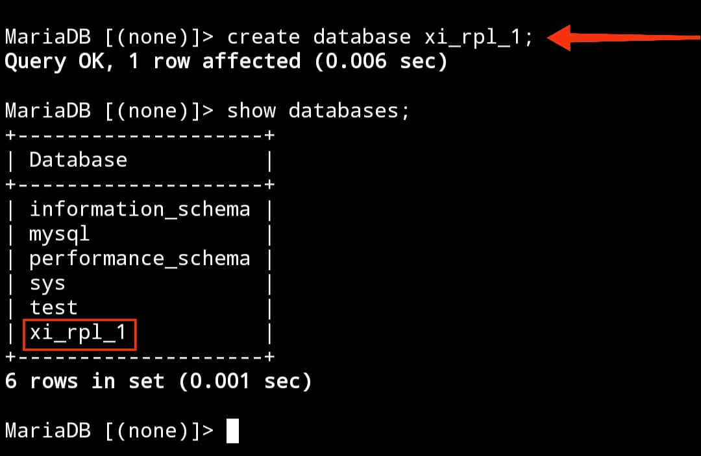

								Selasa 23-01-2024


# Instalasi MySQL

## Menggunakan Xampp/Termux

**==Termux==**

1. Buka Termux
2. Berikan akses Termux ke memori Internal `termux-setup-storage`
3. Muncul Pop-up untuk meminta izin akses ke memori internal "klik di izinkan/allow acces"
4. Lakukan Update dan sekaligus upgrade paket `pkg update && upgrade -y`
5. Jika ada konfirmasi untuk melanjutkan instalasi. Silahkan "klik y" dan "enter"
6. Instal aplikasi mariadb `pkg install mariadb` 
7. Memberikan Akses Aman ke MySQL `mysqld_safe` 
8. Hentikan Proses `Ctrl Z`
9. Masuk kedalam Admin `mysql -u root`


## Referensi Video YouTube

https://youtu.be/ez3nx3xH-y4?si=T4saycipqfBcqL1c


# Penggunaan Awal MySQL

## Query
```
mysql -u root
```

## Hasil


>


## Analisis

**==MySQL :==**

Ini adalah perintah untuk mengakses shell **MySQL**, yaitu antarmuka command-line untuk berinteraksi dengan server **MySQL**. 


**==-u root :==**

Parameter ini menentukan **pengguna** (**user**) yang akan digunakan untuk masuk ke server MySQL. Dalam hal ini "**root**" Adalah nama pengguna yang diberikan, dan "**root**" Adalah tingkat tertinggi dengan hak akses penuh. 


## Kesimpulan

**==Kesimpulan :==**

`mysql -u root` memberikan akses penuh ke server **MySQL** dengan menggunakan pengguna "**root**", yang memiliki hak akses maksimum. Penggunaan perintah ini perlu hati-hati untuk menghindari risiko keamanan

# Database

## Buat Database

Untuk membuat database di SQL, Anda dapat menggunakan perintah `CREATE DATABASE` dengan menentukan nama database yang diinginkan. Pastikan untuk memiliki hak akses yang sesuai, dan verifikasi pembuatan database dengan perintah `SHOW DATABASE`S. Pengetahuan tentang sintaks SQL dan hak akses server diperlukan untuk menjalankan operasi ini dengan sukses.


### STRUKTUR

```MySQL

CREATE DATABASE [nama_database];
```


### CONTOH

```MySQL

CREATE DATABASE xi_rpl_1;
```


### HASIL

>


### ANALISIS

Kode tersebut merupakan perintah untuk membuat database baru dengan nama "xi_rpl_1".


### KESIMPULAN


Kesimpulan dari kode tersebut adalah bahwa perintah tersebut bertujuan untuk membuat sebuah database baru dengan nama "xi_rpl_1".


## Tampilkan Database

Untuk menampilkan daftar database di MySQL, Anda dapat menggunakan perintah SQL `SHOW DATABASES;`. Perintah ini memberikan gambaran keseluruhan database yang tersedia di server MySQL. Pastikan pengguna yang digunakan memiliki izin untuk melihat database, dan gunakan perintah ini melalui antarmuka command-line atau alat manajemen database seperti phpMyAdmin.


### KODENYA

```MySQL

SHOW DATABASES;

```


### HASIL

>


### ANALISIS


Kode tersebut merupakan perintah untuk menampilkan daftar database yang ada dalam sistem database.


### KESIMPULAN


Kode "SHOW DATABASES;" digunakan untuk menampilkan daftar semua database yang ada dalam sistem basis data yang sedang digunakan. Dengan demikian, kesimpulannya adalah perintah ini bertujuan untuk memberikan informasi tentang semua database yang telah dibuat atau tersedia.


## Hapus Database

Untuk menghapus sebuah database di SQL, Anda dapat menggunakan perintah `DROP DATABASE`. Namun, perlu diingat bahwa tindakan ini permanen dan akan menghapus seluruh data di dalam database tersebut. Pastikan Anda memiliki backup data yang dibutuhkan sebelum melanjutkan.


### STRUKTUR

```MySQL

DROP DATABASE [nama_database];

```

### CONTOH

```MYSQL

DROP DATABASE xi_rpl_1;

```


### HASIL

>


### ANALISIS


Kode "DROP DATABASE xi_rpl_1;" digunakan untuk menghapus database dengan nama "xi_rpl_1". Perlu diperhatikan bahwa perintah ini bersifat permanen dan akan menghapus semua data yang terkait dengan database tersebut.


### KESIMPULAN


Kesimpulan dari kode "DROP DATABASE xi_rpl_1;" adalah bahwa perintah tersebut bertujuan untuk menghapus database permanen dengan nama "xi_rpl_1" beserta seluruh data yang terkait.


## Gunakan Database

perintah `USE` digunakan untuk beralih atau menggunakan sebuah database tertentu di server. Perintah ini sangat berguna ketika Anda bekerja dengan beberapa database di server MySQL dan ingin fokus pada satu database dalam sesi tertentu.


### STRUKTUR


```MySQL

USE [nama_database];

```


### CONTOH


```MYSQL

USE xi_rpl_1;

```


### HASIL


>


### ANALISIS


Kode "USE xi_rpl_1;" digunakan untuk beralih dan menggunakan database dengan nama "xi_rpl_1". Ini menetapkan database tersebut sebagai database aktif, sehingga perintah-perintah selanjutnya akan berlaku untuk database tersebut.


### KESIMPULAN


Kesimpulan dari kode "USE xi_rpl_1;" adalah bahwa perintah tersebut bertujuan untuk beralih dan menggunakan database aktif dengan nama "xi_rpl_1".


# Tugas Tipe Data

## Angka


-  ==INT:== Untuk menyimpan nilai bilangan bulat (integer). Misalnya, INT dapat digunakan untuk menyimpan angka seperti 1, 100, -10, dan sebagainya. 

 - ==DECIMAL: ==Digunakan untuk menyimpan nilai desimal presisi tinggi, cocok untuk perhitungan finansial atau keuangan.
 - 
 - ==FLOAT dan DOUBLE: ==Digunakan untuk menyimpan nilai desimal dengan presisi floating-point. DOUBLE memiliki presisi lebih tinggi dibandingkan FLOAT.
 
 - ==TINYINT, SMALLINT,== ==MEDIUMINT==, dan ==BIGINT: ==Tipe data ini menyimpan bilangan bulat dengan ukuran yang berbeda-beda.

   **==Contoh==** : 
```MySQL

CREATE TABLE contoh_tabel (
    id INT,
    harga DECIMAL(10, 2),
    jumlah_barang TINYINT
);
```


**==HASIL PROGRAM==** :
>


Dalam contoh tersebut, **id** menggunakan tipe data **INT**, **harga** menggunakan tipe data **DECIMAL** dengan presisi 10 digit dan 2 angka di belakang koma, dan **jumlah_barang** menggunakan tipe data **TINYINT**.


---


## Teks


- ==CHAR(N) ==Menyimpan string karakter tetap dengan panjang N. Contoh: ==CHAR(10) ==akan menyimpan string dengan panjang tepat 10 karakter.

- ==VARCHAR(N):== Menyimpan string karakter dengan panjang variabel maksimal N. Misalnya, ==VARCHAR(255) ==dapat menyimpan string hingga 255 karakter, tetapi sebenarnya hanya menyimpan panjang yang diperlukan plus beberapa overhead.

- ==TEXT: ==Digunakan untuk menyimpan teks dengan panjang variabel, tanpa batasan panjang tertentu. Cocok untuk data teks yang panjangnya tidak terduga.


**==Contoh==** :
```MySQL

CREATE TABLE farel_tabel (
    nama CHAR(50),
    alamat VARCHAR(100),
    catatan TEXT,
    status ENUM('Aktif', 'Non-Aktif')
);
```


**==HASIL PROGRAM==** :
>


Dalam contoh tersebut, **nama** menggunakan tipe data **char** dengan panjang tetap, **alamat** menggunakan tipe data **VARCHAR** dengan panjang variabel, **catatan** menggunakan tipe data **TEXT** untuk menyimpan teks yang mungkin panjangnya bervariasi, dan **status** menggunakan tipe data **ENUM** untuk membatasi nilai yang mungkin.


---


## Tanggal


- ==DATE== :  Menyimpan nilai tanggal dengan format YYYY-MM-DD.
- ==TIME==: Menyimpan nilai waktu dengan format HH:MM:SS.

- ==DATETIME: ==Menggabungkan nilai tanggal dan waktu dengan format YYYY-MM-DD HH:MM:SS.

- ==TIMESTAMP: ==Sama seperti DATETIME, tetapi dengan kelebihan diatur secara otomatis saat data dimasukkan atau diubah.

**==Contoh==** :
```MySQL

CREATE TABLE frel_Tabel (
    tanggal DATE,
    waktu TIME,
    datetimekolom DATETIME,
    timestampkolom TIMESTAMP
);
```


Dalam contoh ini, kolom **tanggal** akan menyimpan nilai tanggal, **waktu** menyimpan nilai waktu, **datetimekolom** menyimpan kombinasi tanggal dan waktu, dan **timestampkolom** akan secara otomatis diatur saat data dimasukkan atau diubah.


## Boolean


- ==BOOLEAN / TINYINT(1):== Digunakan untuk menyimpan nilai boolean, yang dapat mewakili kebenaran atau kesalahan. Representasi nilai benar adalah 1, sedangkan nilai salah direpresentasikan sebagai 0. Meskipun nilai selain 0 dianggap benar, secara umum, ketiganya seringkali digunakan secara bergantian. Seringkali, ketika Anda mendeklarasikan kolom sebagai BOOL atau BOOLEAN, MySQL mengonversinya secara otomatis menjadi TINYINT(1), yang juga dapat digunakan untuk menyimpan nilai boolean dengan 0 untuk false dan 1 untuk true.

### Menggunakan BOOLEAN

```Mysql
CREATE TABLE contohTabel (
    title VARCHAR(255),
    completed BOOLEAN
);```
Dalam contoh diatas, kita mendefinisikan kolom `completed` sebagai tipe data `BOOLEAN`. Ini merupakan cara yang sah dan umum digunakan di MySQL. Nilai yang dapat disimpan dalam kolom ini adalah `TRUE` atau `FALSE`, atau dalam representasi angka, 1 atau 0.

### Menggunakan BOOL

```Mysql
CREATE TABLE contohTabel (
    title VARCHAR(255),
    completed BOOL
);
```
Dalam contoh ini, kita menggunakan `BOOL` sebagai tipe data untuk kolom `completed`. Perlu dicatat bahwa MySQL secara otomatis mengonversi `BOOL` menjadi `TINYINT(1)`. Oleh karena itu, pada dasarnya, ini setara dengan contoh pertama. Namun, beberapa pengembang lebih suka menggunakan `BOOLEAN` untuk kejelasan.

### Menggunakan TINYINT(1)
```MySQL
CREATE TABLE contohTabel (
    title VARCHAR(255),
    completed TINYINT(1)
);
```
Dalam contoh ini, kita menggunakan `TINYINT(1)` sebagai tipe data untuk kolom `completed`. Ini adalah pendekatan yang valid karena MySQL mengonversi `BOOL` menjadi `TINYINT(1)` secara otomatis. Dalam hal ini, nilai yang dapat disimpan adalah 1 untuk `TRUE` dan 0 untuk `FALSE`.


## Tipe Data Pilihan

- ==ENUM: ==Memungkinkan Anda mendefinisikan set nilai yang mungkin dan membatasi kolom hanya dapat mengambil salah satu dari nilai tersebut.

- ==SET: ==Mirip dengan ENUM, namun dapat menyimpan satu atau lebih nilai dari himpunan yang telah ditentukan.


# Tabel 


## Buat Tabel


### STRUKTUR


```MySQL

CREATE TABLE nama_tabel ( kolom1 tipe_data(max karakter) Constraint: kunci induk constraint: data tidak boleh kosong , 
kolom2 tipe_data(max karakter) constraint: data tidak boleh kosong ,
kolom3 tipe_data(max karakter) ,
kolom4 tipe_data(max karakter) constraint: tidak ada data yang sama );

```


### CONTOH


```MySQL

CREATE TABLE pelanggan ( id_pelanggan int(4)PRIMARY KEY NOT NULL , nama_depan varchar(25) NOT NULL , nama_belakang varchar(25), no_telp char(12)UNIQUE  );
```


### HASIL


>


### ANALISIS


Kode tersebut merupakan perintah untuk membuat tabel baru bernama "pelanggan" dalam database yang aktif. Tabel ini memiliki kolom-kolom seperti "id_pelanggan" dengan tipe data integer, berperan sebagai kunci utama (PRIMARY KEY) yang tidak boleh kosong (NOT NULL), "nama_depan" dengan tipe data varchar(25) yang tidak boleh kosong, "nama_belakang" dengan tipe data varchar(25), dan "no_telp" dengan tipe data char(12) yang memiliki sifat UNIQUE, yang berarti harus memiliki nilai yang unik di antara semua entri dalam kolom tersebut.


### KESIMPULAN


Kesimpulan dari kode tersebut adalah bahwa perintah tersebut digunakan untuk membuat tabel baru bernama "pelanggan" dengan beberapa kolom seperti "id_pelanggan", "nama_depan", "nama_belakang", dan "no_telp". Kolom "id_pelanggan" diatur sebagai kunci utama yang tidak boleh kosong, "nama_depan" dan "no_telp" juga tidak boleh kosong, dan kolom "no_telp" harus memiliki nilai yang unik.


## TampilkanStrukturTabel


### STRUKTUR


```MySQL

DESC nama_tabel;
```


### CONTOH


```MySQL

DESC pelanggan;
```


### HASIL


>


### ANALISIS

Kode "DESC pelanggan;" digunakan untuk mendapatkan deskripsi atau struktur dari tabel "pelanggan". Ini memberikan informasi tentang kolom-kolom dalam tabel beserta tipe data, dan constraint (jika ada). 


### KESIMPULAN


Kesimpulan dari kode "DESC pelanggan;" adalah bahwa perintah tersebut bertujuan untuk menampilkan deskripsi atau struktur dari tabel dengan nama "pelanggan". Ini memberikan informasi tentang kolom-kolom yang ada dalam tabel, seperti nama kolom, tipe data, dan konstrain yang mungkin diterapkan.


## Tampilkan Daftar Tabel


### STRUKTUR


```MySQL
SHOW TABLES;
```


### CONTOH


```MySQL
SHOW TABLES;
```


### HASIL

>


### ANALISIS


Kode "SHOW TABLES;" digunakan untuk menampilkan daftar semua tabel yang ada dalam database yang sedang digunakan. Ini membantu pengguna untuk melihat tabel-tabel mana yang telah dibuat atau tersedia dalam database tersebut.


### KESIMPULAN


Kesimpulan dari "SHOW TABLES;" adalah perintah tersebut digunakan untuk menampilkan daftar semua tabel yang ada dalam database yang sedang digunakan.


---


## QnA


>[! faq]- Perbedaan antara PRIMARY KEY dan UNIQUE
>PRIMARY KEY: 
>Mirip seperti nomor identitas yang unik bagi setiap baris, tak boleh kosong.
>
>UNIQUE: 
>Lebih seperti nomor yang bisa digunakan untuk keperluan lain, 
>harus unik tapi bisa juga kosong.
>
>---
>
>---
>
>PRIMARY KEY :
>bertugas membedakan nilai yang ada pada tabel seperti NIS.
>
>UNIQUE :
>bertugas untuk memastikan bahwa tidak ada nilai duplikat dalam kolom tersebut.contohnya seperti,no wa,dan alamat email.
>
>


>[! faq]- Mengapa Hanya Kolom Id Pelanggan yang menggunakan Constraint "PRIMARY KEY"?
>Karena kolom ID pelanggan berperan sebagai identitas unik untuk setiap entitas pelanggan dalam basis data.
>
>---
>
>Dapat memastikan integritas data dengan mencegah duplikasi dan memastikan bahwa setiap luas dapat memiliki entitas yang jelas.


>[! faq]- Mengapa pada kolom no_telp yang menggunakan tipe data CHAR bukan VARCHAR?
>Karena nomor telepon biasanya memiliki panjang karakter yang tetap, sehingga menggunakan tipe data CHAR yang tetap panjang lebih efisien daripada VARCHAR yang panjangnya bervariasi.


>[! faq]- Mengapa Hanya kolom no_telp yang menggunakan constraint "UNIQUE"?
>Karena nomor telepon harus unik untuk setiap entitas dalam basis data, memastikan tidak ada duplikasi dengan menggunakan constraint "UNIQUE" pada kolom no_telp adalah penting.


>[! faq]- Mengapa kolom no_telp tidak memakai constraint " NOT NULL", sementara kolom lainnya Menggunakan constraint tersebut?
>Karena nomor telepon mungkin tidak selalu tersedia atau tidak wajib diisi dalam setiap entitas, oleh karena itu constraint "NOT NULL" tidak digunakan untuk kolom no_telp.


---


# INSERT


## INSERT 1 DATA


### STRUKTUR

```MySQL

INSERT INTO nama_tabel
VALUES (nilai1, nilai2, nilai3, nilai4);
```


### CONTOH

```MySQL

INSERT INTO pelanggan VALUES(1,"Farel","Alfahrezi",'083856721479');

```


### HASIL

>


### ANALISIS


Kode tersebut adalah perintah SQL yang bertujuan untuk memasukkan data baru ke dalam tabel "pelanggan". Data yang dimasukkan adalah sebagai berikut:
Data yang dimasukkan melibatkan informasi seperti ID pelanggan (1), nama depan ("Farel"), nama belakang ("Alfahrezi"), dan nomor telepon ('083856721479').
Perintah INSERT INTO digunakan untuk menambahkan data ke dalam tabel yang telah ditentukan. Sintaks VALUES digunakan untuk menentukan nilai-nilai yang akan dimasukkan ke dalam tabel, sesuai dengan urutan kolom-kolom yang telah didefinisikan dalam tabel tersebut.


### KESIMPULAN


Kesimpulan dari kode tersebut adalah sebuah perintah SQL untuk menyisipkan data ke dalam tabel pelanggan. Data yang dimasukkan mencakup ID pelanggan (1), nama depan ("Farel"), nama belakang ("Alfahrezi"), dan nomor telepon ('083856721479').


## INSERT >1 DATA


### STRUKTUR

```MySQL


INSERT INTO nama_tabel
VALUES (nilai1, nilai2, nilai3, nilai4), (nilai1, nilai2, nilai3, nilai4);

```


### CONTOH

```MySQL

INSERT INTO pelanggan VALUES (4,"zhafran","Muh_zhafran",'085222666206'), (5,"ahsan","ahsan_putar",'088777222872');

```


### HASIL

>


### ANALISIS


Kode tersebut merupakan perintah SQL untuk menyisipkan beberapa baris data sekaligus ke dalam tabel "pelanggan". Data yang dimasukkan mencakup dua baris dengan kolom-kolom yang sama seperti yang telah disebutkan sebelumnya: ID pelanggan, nama depan, nama belakang, dan nomor telepon. Baris pertama memiliki nilai ID pelanggan 4, nama depan "zhafran", nama belakang "Muh_zhafran", dan nomor telepon '085222666206'. Baris kedua memiliki nilai ID pelanggan 5, nama depan "ahsan", nama belakang "ahsan_putar", dan nomor telepon '088777222872'.


### KESIMPULAN


Kesimpulan dari kode tersebut adalah perintah SQL untuk menyisipkan dua baris data sekaligus ke dalam tabel "pelanggan". Data tersebut mencakup informasi seperti ID pelanggan, nama depan, nama belakang, dan nomor telepon untuk dua pelanggan dengan ID 4 dan 5.


## MENYEBUT KOLOM


### STRUKTUR

```MySQL

INSERT INTO nama_tabel (kolom1,kolom2) VALUES (nilai1,nilai2);

```


### CONTOH

```MySQL

INSERT INTO pelanggan (nama_depan,id_pelanggan) VALUES ("adiguna",6);

```


### HASIL

>


### ANALISIS


Kode "INSERT INTO pelanggan VALUES(1, 'Farel', 'Alfahrezi', '083856721479');" digunakan untuk menambahkan baris data baru ke dalam tabel "pelanggan". Nilai yang ditentukan untuk setiap kolom adalah, secara berurutan, 1 untuk kolom "id_pelanggan", 'Farel' untuk kolom "nama_depan", 'Alfahrezi' untuk kolom "nama_belakang", dan '083856721479' untuk kolom "no_telp".


### KESIMPULAN


Kesimpulan dari "INSERT INTO pelanggan VALUES(1, 'Farel', 'Alfahrezi', '083856721479');" adalah bahwa perintah tersebut digunakan untuk menyisipkan data baru ke dalam tabel "pelanggan" dengan nilai tertentu untuk setiap kolom. Dalam contoh ini, data baru tersebut mencakup ID pelanggan 1, nama depan "Farel", nama belakang "Alfahrezi", dan nomor telepon "083856721479".


# SELECT

## SELURUH DATA


### STRUKTUR

```MySQL

SELECT * FROM nama_tabel;

```


### CONTOH

```MySQL

SELECT * FROM pelanggan;

```


### HASIL


>


### ANALISIS


Kode "SELECT * FROM pelanggan;" digunakan untuk mengambil semua data (seluruh kolom) dari tabel "pelanggan". Ini akan menghasilkan output yang menampilkan semua baris dan kolom yang ada dalam tabel tersebut.


### KESIMPULAN


Kesimpulan dari "SELECT * FROM pelanggan;" adalah bahwa perintah tersebut bertujuan untuk menampilkan semua data (seluruh kolom) yang ada dalam tabel "pelanggan".


## DATA KOLOM TERTENTU


### STRUKTUR

```MySQL

SELECT nama_kolom1 nama_kolom2 FROM nama_tabel

```


### CONTOH

```MySQL

SELECT nama_depan FROM pelanggan;

```


```MySQL

SELECT id_pelanggan FROM pelanggan;

```


### HASIL

>


### ANALISIS


Kode "SELECT nama_depan FROM pelanggan;" digunakan untuk mengambil data dari kolom "nama_depan" dari tabel "pelanggan". Ini akan menghasilkan output yang menampilkan nilai-nilai yang ada dalam kolom "nama_depan" untuk setiap baris dalam tabel tersebut.


### KESIMPULAN


Kesimpulan dari "SELECT nama_depan FROM pelanggan;" adalah bahwa perintah tersebut digunakan untuk menampilkan nilai dari kolom "nama_depan" dari tabel "pelanggan".


## KLAUSA WHERE


### STRUKTUR


```MySQL

SELECT nama_kolom FROM nama_tabel WHERE kondisi;

```

Contoh Format Kondisi (nama_kolom, operator, nilai)

nama_kolom : seperti  id_pelanggan
Operator       : seperti  =,  >,  <,  >=,  <=,  ! =,  <> 
Nilai               : seperti  1 ,  2 ,  3


### CONTOH


```MySQL

SELECT nama_depan FROM pelanggan WHERE id_pelanggan=2;

```


```MySQL

SELECT nama_belakang FROM pelanggan WHERE id_pelanggan=1;

```


### HASIL


>


### ANALISIS


Kode "SELECT nama_depan FROM pelanggan WHERE id_pelanggan=2;" digunakan untuk mengambil nilai dari kolom "nama_depan" dari tabel "pelanggan" hanya untuk baris yang memiliki nilai "id_pelanggan" sama dengan 2. Ini memfilter data dan hanya menampilkan hasil yang memenuhi kondisi tertentu.


### KESIMPULAN


Kesimpulan dari "SELECT nama_depan FROM pelanggan WHERE id_pelanggan=2;" adalah perintah tersebut bertujuan untuk menampilkan nilai dari kolom "nama_depan" hanya untuk baris di tabel "pelanggan" yang memiliki nilai "id_pelanggan" sama dengan 2.


# UPDATE


### STRUKTUR

```MySQL

UPDATE nama_tabel SET nama_kolom  WHERE kondisi;


```


### CONTOH

```MySQL

UPDATE pelanggan SET no_telp="088889999777"  WHERE id_pelanggan="2";

```


### HASIL

>


### ANALISIS


Kode "UPDATE pelanggan SET no_telp='088889999777' WHERE id_pelanggan='2';" digunakan untuk memperbarui nilai kolom "no_telp" pada tabel "pelanggan" dengan nilai baru "088889999777" hanya untuk baris yang memiliki nilai "id_pelanggan" sama dengan 2. Ini adalah perintah untuk mengubah data yang sudah ada dalam tabel.


### KESIMPULAN


Kesimpulan dari "UPDATE pelanggan SET no_telp='088889999777' WHERE id_pelanggan='2';" adalah bahwa perintah tersebut digunakan untuk memperbarui nilai kolom "no_telp" pada tabel "pelanggan" dengan nilai baru "088889999777" hanya untuk baris yang memiliki nilai "id_pelanggan" sama dengan 2.


# HAPUS BARIS DATA


### STRUKTUR


```MySQL

DELETE FROM nama_tabel WHERE kondisi;

```


### CONTOH


```MySQL

DELETE FROM pelanggan WHERE id_pelanggan="3";

```


### HASIL


>


### ANALISIS


Kode "DELETE FROM pelanggan WHERE id_pelanggan='3';" digunakan untuk menghapus baris dari tabel "pelanggan" di mana nilai kolom "id_pelanggan" sama dengan 3. Ini adalah perintah untuk menghapus data tertentu dari tabel berdasarkan kondisi yang diberikan. Dalam contoh ini, baris dengan "id_pelanggan" 3 akan dihapus.


### KESIMPULAN


Kesimpulan dari "DELETE FROM pelanggan WHERE id_pelanggan='3';" adalah bahwa perintah tersebut digunakan untuk menghapus baris dari tabel "pelanggan" di mana nilai kolom "id_pelanggan" sama dengan 3. Ini adalah perintah untuk menghapus data tertentu dari tabel berdasarkan kondisi yang diberikan. Dalam contoh ini, baris dengan "id_pelanggan" 3 akan dihapus.


# HAPUS TABEL


### STRUKTUR


```MySQL

DROP TABLE nama_tabel;

```


### CONTOH


```MySQL

DROP TABLE pembuatan;

```


### HASIL


>


### ANALISIS


Kode "DROP TABLE pembuatan;" digunakan untuk menghapus tabel dengan nama "pembuatan". Perlu diingat bahwa perintah ini bersifat permanen dan akan menghapus seluruh struktur dan data yang terkait dengan tabel tersebut.


### KESIMPULAN


Kesimpulan dari "DROP TABLE pembuatan;" adalah bahwa perintah tersebut bertujuan untuk menghapus tabel dengan nama "pembuatan". Ini merupakan tindakan permanen dan akan menghapus seluruh struktur dan data yang terkait dengan tabel tersebut.


# Latihan"


### STRUKTUR


```MySQL

CREATE TABLE nama_tabel( id_mobil int(2) PRIMARY KEY NOT NULL , no_plat  varchar(10) UNIQUE  NOT NULL , no_mesin varchar(10) UNIQUE , warna varchar(10) NOT NULL , pemilik varchar(25) NOT NULL , peminjam varchar(10) , harga_rental int(10)  );

```


## CONTOH


```MySQL

CREATE TABLE mobil ( id_mobil int(2) PRIMARY KEY NOT NULL , no_plat  varchar(10) UNIQUE  NOT NULL , no_mesin varchar(10) UNIQUE , warna varchar(10) NOT NULL , pemilik varchar(25) NOT NULL , peminjam varchar(10) , harga_rental int(10)  );

```


---


```MySQL


INSERT INTO mobil VALUES (1,"DD 2650 XY","ACX3560","HITAM","TAUFIQ","FAREL",50000),
(2,"DD 2440 AX","BCS1120","MERAH","FATUR","AHSAN",100000),
(3,"B 1611 QC","LSQ1112","SILVER","ASEP","CAPO",50000);

```


```MySQL


INSERT INTO mobil (id_mobil,no_plat,no_mesin,warna,pemilik,harga_rental) VALUES (4,"DD 2901 JK","UQL1029","HITAM","JORDAN",'150000'),(5,"DD 2210 LS","CJH1011","HITAM","NAFAN",'100000');

```


### HASIL 


>


---


>


## TAMPILKAN STRUKTUR TABEL


### STRUKTUR


```MySQL

DESC nama_tabel

```


### CONTOH


```MySQL

DESC mobil

```


### HASIL


>


## TAMPILKAN DAFTAR TABEL


### STRUKTUR


```MySQL

SHOW TABLES;


```


### CONTOH


```MySQL

SHOW TABLES;

```


### HASIL


>


 
 


