# SELECT LANJUTAN


## AND


### STRUKTUR


```MySQL

SELECT nama_kolom1,nama_kolom2 FROM nama_tabel WHERE kondisi1 AND kondisi2;

```


### CONTOH


```MySQL

SELECT warna,pemilik FROM mobil WHERE warna="HITAM" AND pemilik="FAREL";

```


### HASIL


>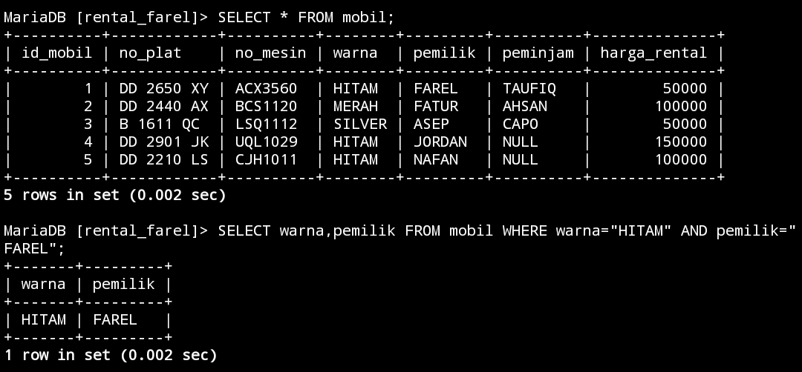


### ANALISIS


Kode SQL tersebut adalah perintah SELECT untuk mengambil data dari tabel "mobil". Kondisi WHERE menentukan bahwa data yang diambil harus memiliki nilai "HITAM" pada kolom "warna" dan nilai "FAREL" pada kolom "pemilik". Dengan kata lain, perintah ini mencari mobil berwarna hitam yang dimiliki oleh Farel dalam tabel mobil.


### KESIMPULAN


Kesimpulan dari kode tersebut adalah bahwa ia akan mengembalikan data warna dan pemilik mobil dari tabel "mobil" dimana warna mobil adalah "HITAM" dan pemilik mobil adalah "FAREL".


## OR


### STRUKTUR


```MySQL


SELECT nama_kolom1,nama_kolom2 FROM nama_tabel WHERE kondisi1 OR kondisi2;

```


### CONTOH


```MySQL

SELECT warna,pemilik FROM mobil WHERE warna="Hitam" OR pemilik="ASEP";

```


### HASIL


>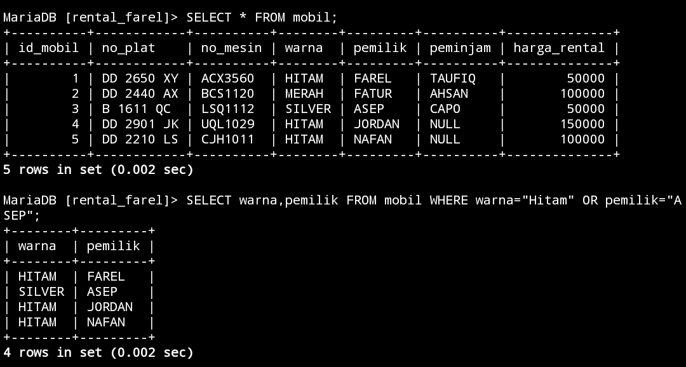


### ANALISIS


1. **SELECT warna, pemilik:** Menunjukkan bahwa data yang akan diambil hanya mencakup kolom "warna" dan "pemilik" dari tabel "mobil".
    
2. **FROM mobil:** Menunjukkan bahwa data diambil dari tabel bernama "mobil".
    
3. **WHERE warna="Hitam" OR pemilik="ASEP":** Menyatakan kondisi yang harus dipenuhi oleh data yang diambil. Kondisi ini menggunakan operator OR, yang berarti data yang akan diambil harus memiliki warna "Hitam" atau dimiliki oleh seseorang dengan nama "ASEP". Jadi, hasilnya bisa mencakup mobil berwarna hitam atau dimiliki oleh Asep, atau keduanya.
    


### KESIMPULAN


Jadi, keseluruhan kode ini akan mengembalikan data mengenai mobil dengan warna hitam atau dimiliki oleh Asep dari tabel "mobil".


Kesimpulan dari kode tersebut adalah bahwa perintah SQL tersebut akan mengembalikan data mengenai mobil dengan warna "Hitam" atau dimiliki oleh seseorang dengan nama "ASEP" dari tabel "mobil".


## BETWEEN


### STRUKTUR


```MySQL


SELECT * FROM nama_tabel WHERE nama_kolom BETWEEN nilai1 AND nilai2;

```


### CONTOH


```MySQL

SELECT * FROM mobil WHERE harga_rental BETWEEN 100000 AND 150000;

```


### HASIL


>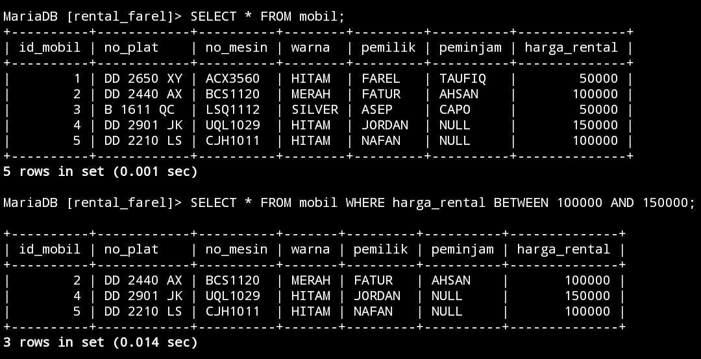


### ANALISIS


1. **SELECT** * :enunjukkan bahwa seluruh kolom (semua informasi) dari tabel "mobil" akan diambil.
    
2. **FROM mobil :** Menunjukkan bahwa data diambil dari tabel bernama "mobil".
    
3. **WHERE harga_rental BETWEEN 100000 AND 150000 :** Menyatakan kondisi yang harus dipenuhi oleh data yang diambil. Kondisi ini menggunakan operator BETWEEN untuk membatasi hasil pada rentang harga_rental antara 100.000 dan 150.000. Artinya, data yang diambil hanya akan mencakup mobil dengan harga sewa di dalam rentang tersebut.
    


### KESIMPULAN


Jadi, keseluruhan kode ini akan mengembalikan semua informasi mengenai mobil yang memiliki harga sewa antara 100.000 dan 150.000 dari tabel "mobil".


Kesimpulan dari kode tersebut adalah bahwa perintah SQL tersebut akan mengembalikan semua informasi mengenai mobil yang memiliki harga rental di antara 100.000 dan 150.000 dari tabel "mobil".


## NOT BETWEEN


### STRUKTUR


```MySQL


SELECT * FROM nama_tabel WHERE nama_kolom NOT BETWEEN nilai1 AND nilai2;

```


### CONTOH


```MySQL

SELECT * FROM mobil WHERE harga_rental NOT BETWEEN 100000 AND 150000;

```


### HASIL


>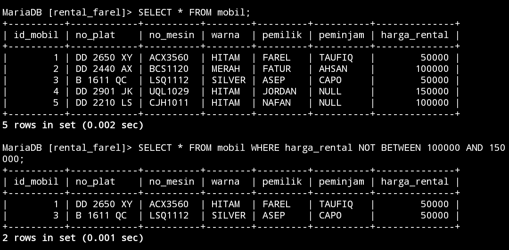


### ANALISIS


1. **SELECT** * : Menunjukkan bahwa seluruh kolom (semua informasi) dari tabel "mobil" akan diambil.
    
2. **FROM mobil:** Menunjukkan bahwa data diambil dari tabel bernama "mobil".
    
3. **WHERE harga_rental NOT BETWEEN 100000 AND 150000:** Menyatakan kondisi yang harus dipenuhi oleh data yang diambil. Kondisi ini menggunakan operator NOT BETWEEN untuk membatasi hasil pada mobil yang memiliki harga_rental di luar rentang antara 100.000 dan 150.000. Artinya, data yang diambil hanya akan mencakup mobil dengan harga sewa di luar rentang tersebut.


### KESIMPULAN


Jadi, keseluruhan kode ini akan mengembalikan semua informasi mengenai mobil yang memiliki harga sewa di luar rentang 100.000 dan 150.000 dari tabel "mobil".


## <=


### STRUKTUR


```MySQL

SELECT * FROM nama_tabel WHERE nama_kolom <= nilai1;


```


### CONTOH


```MySQL

SELECT * FROM mobil WHERE harga_rental <= 100000;

```


### HASIL


>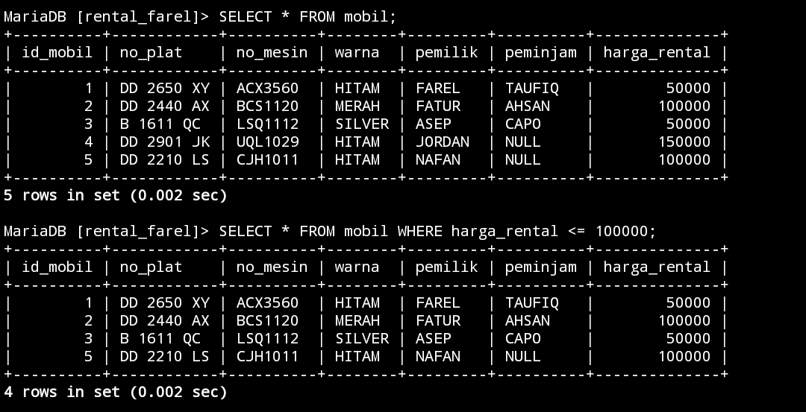


### ANALISIS


1. **SELECT** * : Menunjukkan bahwa seluruh kolom (semua informasi) dari tabel "mobil" akan diambil.
    
2. **FROM mobil:** Menunjukkan bahwa data diambil dari tabel bernama "mobil".
    
3. **WHERE harga_rental <= 100000:** Menyatakan kondisi yang harus dipenuhi oleh data yang diambil. Kondisi ini menyaring data hanya untuk mobil yang memiliki harga sewa kurang dari atau sama dengan 100.000.


### KESIMPULAN


Jadi, keseluruhan kode ini akan mengembalikan semua informasi mengenai mobil yang memiliki harga sewa kurang dari atau sama dengan 100.000 dari tabel "mobil".


## >=


### STRUKTUR


```MySQL


SELECT * FROM nama_tabel WHERE nama_kolom >= nilai1;


```


### CONTOH


```MySQL

SELECT * FROM mobil WHERE harga_rental >= 100000;

```


### HASIL


>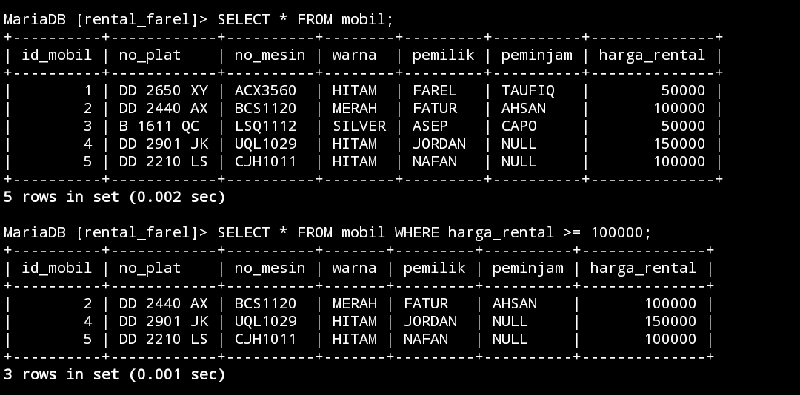


### ANALISIS


1. **SELECT** * : Menunjukkan bahwa seluruh kolom (semua informasi) dari tabel "mobil" akan diambil.
    
2. **FROM mobil:** Menunjukkan bahwa data diambil dari tabel bernama "mobil".
    
3. **WHERE harga_rental >= 100000:** Menyatakan kondisi yang harus dipenuhi oleh data yang diambil. Kondisi ini menyaring data hanya untuk mobil yang memiliki harga sewa lebih besar dari atau sama dengan 100.000.


### KESIMPULAN


Jadi, keseluruhan kode ini akan mengembalikan semua informasi mengenai mobil yang memiliki harga sewa lebih besar dari atau sama dengan 100.000 dari tabel "mobil".


## <> atau !=


### STRUKTUR


```MySQL


SELECT * FROM nama_tabel WHERE nama_kolom <> nilai1;


```


---


```MySQL


SELECT * FROM nama_tabel WHERE nama_kolom != nilai1;


```


### CONTOH


<>

```MySQL

SELECT * FROM mobil WHERE harga_rental <> 100000;

```


---


!=

```MySQL

SELECT * FROM mobil WHERE harga_rental != 100000;

```


### HASIL


<>

>


!=


>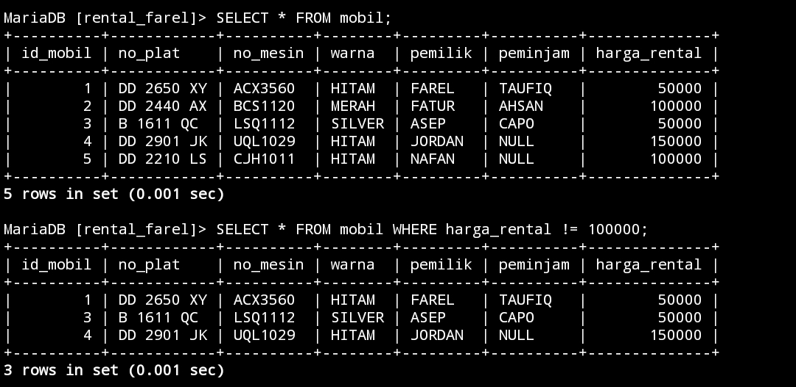


### ANALISIS


<>

1. **SELECT** * : Menunjukkan bahwa seluruh kolom (semua informasi) dari tabel "mobil" akan diambil.
    
2. **FROM mobil:** Menunjukkan bahwa data diambil dari tabel bernama "mobil".
    
3. **WHERE harga_rental <> 100000:** Menyatakan kondisi yang harus dipenuhi oleh data yang diambil. Kondisi ini menggunakan operator <> (tidak sama dengan) untuk menyaring data hanya untuk mobil yang memiliki harga sewa tidak sama dengan 100.000.


! =


1. **SELECT** * : Menunjukkan bahwa seluruh kolom (semua informasi) dari tabel "mobil" akan diambil.
    
2. **FROM mobil:** Menunjukkan bahwa data diambil dari tabel bernama "mobil".
    
3. **WHERE harga_rental != 100000:** Menyatakan kondisi yang harus dipenuhi oleh data yang diambil. Kondisi ini menggunakan operator != (tidak sama dengan) untuk menyaring data hanya untuk mobil yang memiliki harga sewa tidak sama dengan 100.000.


### KESIMPULAN


<>

Jadi, keseluruhan kode ini akan mengembalikan semua informasi mengenai mobil yang memiliki harga sewa berbeda dari 100.000 dari tabel "mobil".


! =

Jadi, keseluruhan kode ini akan mengembalikan semua informasi mengenai mobil yang memiliki harga sewa berbeda dari 100.000 dari tabel "mobil".


## TANTANGAN


### STRUKTUR


```MySQL

SELECT nama_kolom1 FROM nama_tabel WHERE kondisi;

```


### CONTOH


```MySQL

SELECT pemilik FROM mobil WHERE id_mobil=1;

```

### HASIL


>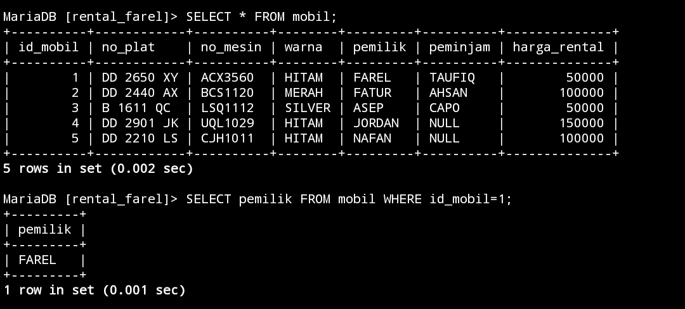


### ANALISIS


1. **SELECT pemilik:** Menunjukkan bahwa hanya kolom "pemilik" dari tabel "mobil" yang akan diambil.
    
2. **FROM mobil:** Menunjukkan bahwa data diambil dari tabel bernama "mobil".
    
3. **WHERE id_mobil=1:** Menyatakan kondisi yang harus dipenuhi oleh data yang diambil. Kondisi ini menyaring data hanya untuk mobil yang memiliki nilai "id_mobil" sama dengan 1.


### KESIMPULAN


Jadi, keseluruhan kode ini akan mengembalikan informasi mengenai pemilik mobil dengan id_mobil=1 dari tabel "mobil".


## IN 


### STRUKTUR


```MySQL


SELECT * FROM nama_tabel WHERE nama_kolom1 IN (Nilai1,Nilai2);

```


### CONTOH


```MySQL

SELECT * FROM mobil WHERE pemilik IN ("FAREL","ASEP");


SELECT * FROM mobil WHERE warna IN ("MERAH","SILVER");


```


### HASIL


>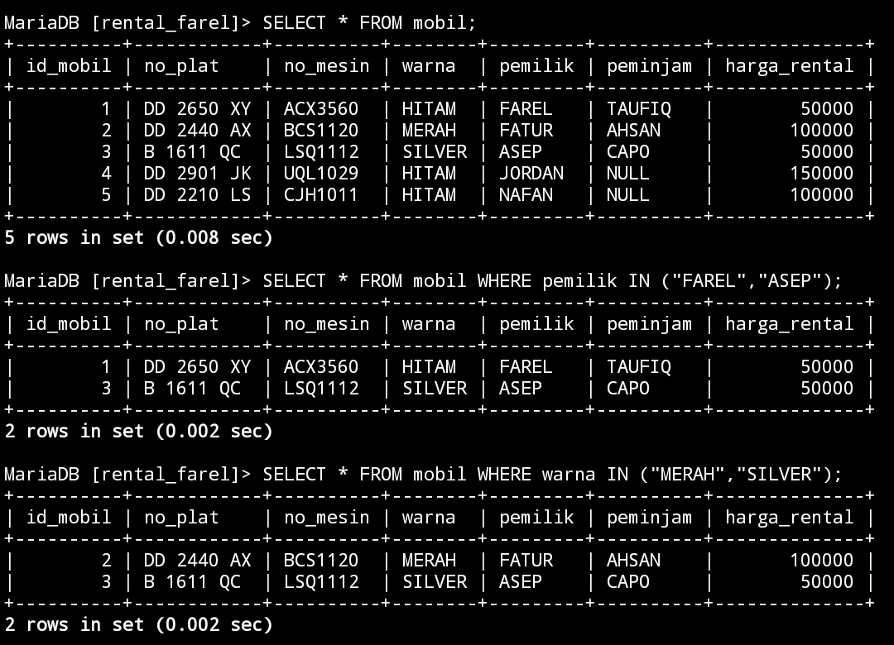


### ANALISIS


1. **Pertama:**
    
    - **SELECT** * : Menunjukkan bahwa seluruh kolom (semua informasi) dari tabel "mobil" akan diambil.
    - **FROM mobil:** Menunjukkan bahwa data diambil dari tabel bernama "mobil".
    - **WHERE pemilik IN ("FAREL", "ASEP"):** Menyatakan kondisi yang harus dipenuhi oleh data yang diambil. Kondisi ini menggunakan operator IN untuk menyaring mobil yang dimiliki oleh "FAREL" atau "ASEP".
2. **Kedua:**
    
    - **SELECT** * : Menunjukkan bahwa seluruh kolom (semua informasi) dari tabel "mobil" akan diambil.
    - **FROM mobil:** Menunjukkan bahwa data diambil dari tabel bernama "mobil".
    - **WHERE warna IN ("MERAH", "SILVER"):** Menyatakan kondisi yang harus dipenuhi oleh data yang diambil. Kondisi ini menggunakan operator IN untuk menyaring mobil yang berwarna "MERAH" atau "SILVER".


### KESIMPULAN


Keseluruhan, pernyataan SQL pertama akan mengembalikan semua informasi mengenai mobil yang dimiliki oleh "FAREL" atau "ASEP", sementara pernyataan SQL kedua akan mengembalikan semua informasi mengenai mobil yang berwarna "MERAH" atau "SILVER" dari tabel "mobil".


## IN + AND


### STRUKTUR


```MySQL

SELECT * FROM nama_tabel WHERE nama_kolom1 IN (Nilai1,Nilai2) AND kondisi1;


```


### CONTOH


```MySQL


SELECT * FROM mobil WHERE warna IN ("MERAH","SILVER") AND harga_rental = 100000;


SELECT * FROM mobil WHERE warna IN ("MERAH","SILVER") AND harga_rental = 50000;


```


### HASIL


>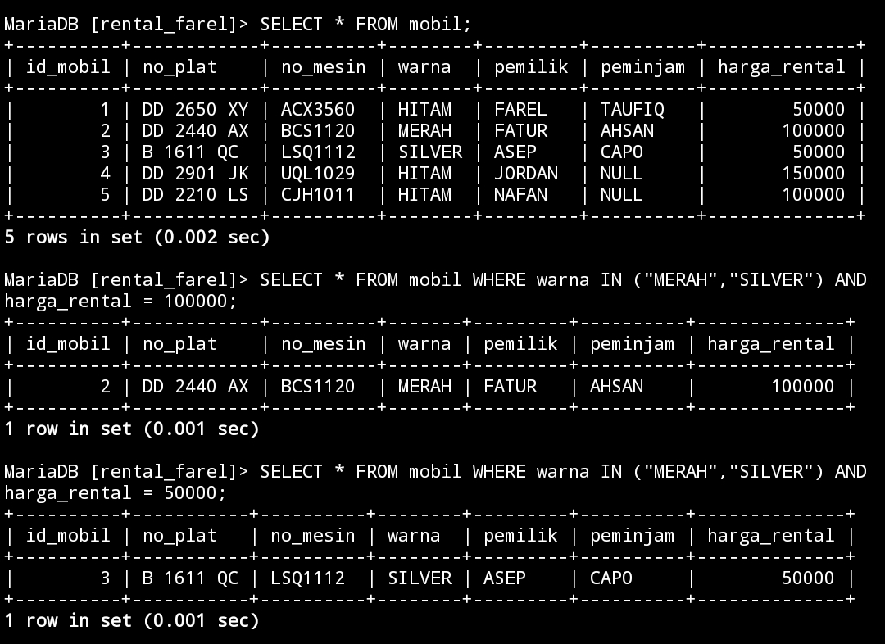


### ANALISIS


1. **Pertama:**
    
    - **SELECT** * : Menunjukkan bahwa seluruh kolom (semua informasi) dari tabel "mobil" akan diambil.
    - **FROM mobil:** Menunjukkan bahwa data diambil dari tabel bernama "mobil".
    - **WHERE warna IN ("MERAH", "SILVER") AND harga_rental = 100000:** Menyatakan kondisi yang harus dipenuhi oleh data yang diambil. Kondisi ini menggunakan operator IN untuk menyaring mobil yang berwarna "MERAH" atau "SILVER" dan memiliki harga sewa sebesar 100.000.
2. **Kedua:**
    
    - **SELECT** * : Menunjukkan bahwa seluruh kolom (semua informasi) dari tabel "mobil" akan diambil.
    - **FROM mobil:** Menunjukkan bahwa data diambil dari tabel bernama "mobil".
    - **WHERE warna IN ("MERAH", "SILVER") AND harga_rental = 50000:** Menyatakan kondisi yang harus dipenuhi oleh data yang diambil. Kondisi ini menggunakan operator IN untuk menyaring mobil yang berwarna "MERAH" atau "SILVER" dan memiliki harga sewa sebesar 50.000.


### KESIMPULAN


Keseluruhan, pernyataan SQL pertama akan mengembalikan semua informasi mengenai mobil yang berwarna "MERAH" atau "SILVER" dan memiliki harga sewa sebesar 100.000, sementara pernyataan SQL kedua akan mengembalikan semua informasi mengenai mobil yang berwarna "MERAH" atau "SILVER" dan memiliki harga sewa sebesar 50.000 dari tabel "mobil".


## IN + OR


### STRUKTUR


```MySQL


SELECT * FROM nama_tabel WHERE nama_kolom1 IN (Nilai1,Nilai2) OR kondisi1;


```


### CONTOH


```MySQL


SELECT * FROM mobil WHERE warna IN ("HITAM","MERAH") OR harga_rental = 150000;


SELECT * FROM mobil WHERE warna IN ("HITAM","MERAH") OR harga_rental = 50000;


```


### HASIL


>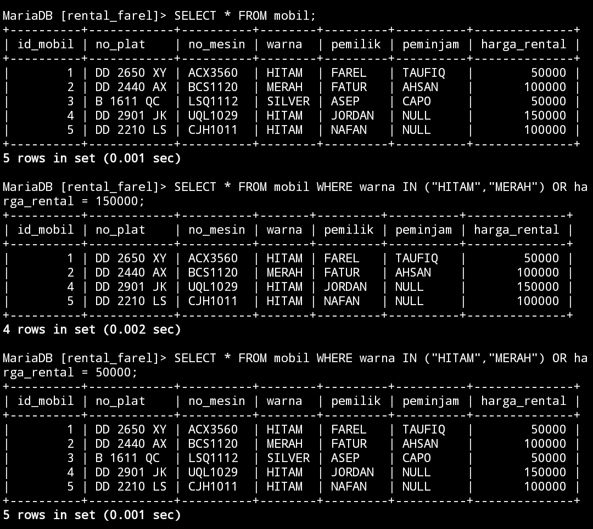


### ANALISIS


1. **Pertama:**
    
    - **SELECT** * : Menunjukkan bahwa seluruh kolom (semua informasi) dari tabel "mobil" akan diambil.
    - **FROM mobil:** Menunjukkan bahwa data diambil dari tabel bernama "mobil".
    - **WHERE warna IN ("HITAM", "MERAH") OR harga_rental = 150000:** Menyatakan kondisi yang harus dipenuhi oleh data yang diambil. Kondisi ini menggunakan operator IN untuk menyaring mobil yang berwarna "HITAM" atau "MERAH" dan mobil yang memiliki harga sewa sebesar 150.000.
2. **Kedua:**
    
    - **SELECT** * : Menunjukkan bahwa seluruh kolom (semua informasi) dari tabel "mobil" akan diambil.
    - **FROM mobil:** Menunjukkan bahwa data diambil dari tabel bernama "mobil".
    - **WHERE warna IN ("HITAM", "MERAH") OR harga_rental = 50000:** Menyatakan kondisi yang harus dipenuhi oleh data yang diambil. Kondisi ini menggunakan operator IN untuk menyaring mobil yang berwarna "HITAM" atau "MERAH" dan mobil yang memiliki harga sewa sebesar 50.000.


### KESIMPULAN


Keseluruhan, pernyataan SQL pertama akan mengembalikan semua informasi mengenai mobil yang berwarna "HITAM" atau "MERAH" atau memiliki harga sewa sebesar 150.000, sementara pernyataan SQL kedua akan mengembalikan semua informasi mengenai mobil yang berwarna "HITAM" atau "MERAH" atau memiliki harga sewa sebesar 50.000 dari tabel "mobil".


## IN + AND + OPERATOR


### STRUKTUR


```MySQL


SELECT * FROM nama_tabel WHERE nama_kolom1 IN (Nilai1,Nilai2) AND nama_kolom2 > nilai1;


SELECT * FROM nama_tabel WHERE nama_kolom1 IN (Nilai1,Nilai2) AND nama_kolom2 < nilai1;


```


## CONTOH

(>)

```MySQL

SELECT * FROM mobil WHERE warna IN ("MERAH", "HITAM") AND harga_rental > 100000;


```


(<)

```MySQL

SELECT * FROM mobil WHERE warna IN ("MERAH", "HITAM") AND harga_rental < 100000;


```


### HASIL

(>)

>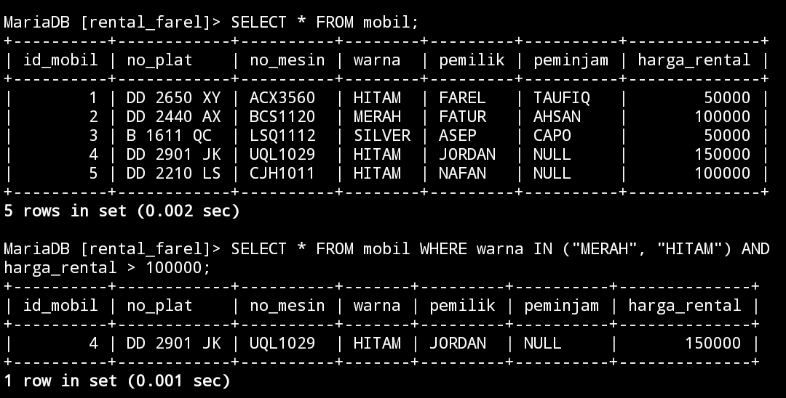


(<)


>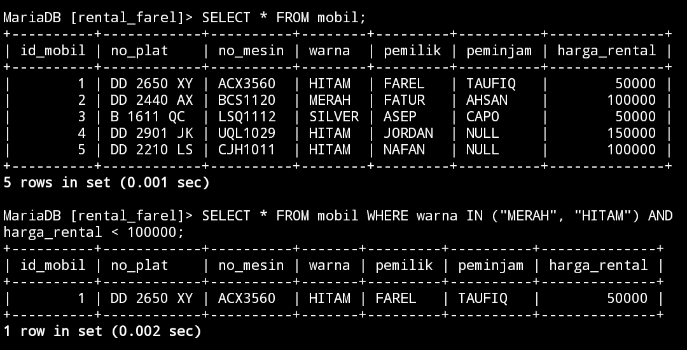


### ANALISIS


(>)

- `SELECT *`: Memilih semua kolom dari tabel yang sesuai dengan kriteria.
- `FROM mobil`: Menunjukkan bahwa kita ingin mengambil data dari tabel bernama "mobil".
- `WHERE warna IN ("MERAH", "HITAM")`: Membatasi hasil hanya untuk baris-baris di mana kolom "warna" memiliki nilai "MERAH" atau "HITAM".
- `AND harga_rental > 100000`: Menambahkan batasan tambahan, hanya mengambil baris-baris di mana nilai kolom "harga_rental" lebih besar dari 100000.


(<)

- `SELECT *`: Memilih semua kolom dari tabel yang sesuai dengan kriteria.
- `FROM mobil`: Menunjukkan bahwa kita ingin mengambil data dari tabel bernama "mobil".
- `WHERE warna IN ("MERAH", "HITAM")`: Membatasi hasil hanya untuk baris-baris di mana kolom "warna" memiliki nilai "MERAH" atau "HITAM".
- `AND harga_rental < 100000`: Menambahkan batasan tambahan, hanya mengambil baris-baris di mana nilai kolom "harga_rental" kurang dari 100000.


### KESIMPULAN


(>)

Jadi, secara keseluruhan, pernyataan SQL ini akan mengambil semua kolom dari tabel "mobil" di mana warna mobil adalah "MERAH" atau "HITAM" dan harga rentalnya lebih besar dari 100000.


(<)


Jadi, secara keseluruhan, pernyataan SQL ini akan mengambil semua kolom dari tabel "mobil" di mana warna mobil adalah "MERAH" atau "HITAM" dan harga rentalnya kurang dari 100000.


  


## LIKE


### Mencari Awalan

#### STRUKTUR


```MySQL


SELECT * FROM nama_tabel WHERE nama_kolom1 LIKE 'nilai%';


```


#### CONTOH

```mysql


SELECT * FROM mobil WHERE peminjam LIKE 'C%';


SELECT * FROM mobil WHERE pemilik LIKE 'F%';


```

#### HASIL

> 

#### ANALISIS


1. **Pertama:**
    
    - **SELECT** * : Menunjukkan bahwa seluruh kolom (semua informasi) dari tabel "mobil" akan diambil.
    - **FROM mobil:** Menunjukkan bahwa data diambil dari tabel bernama "mobil".
    - **WHERE peminjam LIKE 'C%':** Menyatakan kondisi yang harus dipenuhi oleh data yang diambil. Kondisi ini menggunakan operator LIKE untuk menyaring mobil yang memiliki peminjam dengan nama yang dimulai dengan huruf 'C'.
2. **Kedua:**
    
    - **SELECT** * : Menunjukkan bahwa seluruh kolom (semua informasi) dari tabel "mobil" akan diambil.
    - **FROM mobil:** Menunjukkan bahwa data diambil dari tabel bernama "mobil".
    - **WHERE pemilik LIKE 'F%':** Menyatakan kondisi yang harus dipenuhi oleh data yang diambil. Kondisi ini menggunakan operator LIKE untuk menyaring mobil yang memiliki pemilik dengan nama yang dimulai dengan huruf 'F'.


#### KESIMPULAN


Keseluruhan, pernyataan SQL pertama akan mengembalikan semua informasi mengenai mobil yang memiliki peminjam dengan nama yang dimulai dengan huruf 'C', sementara pernyataan SQL kedua akan mengembalikan semua informasi mengenai mobil yang memiliki pemilik dengan nama yang dimulai dengan huruf 'F' dari tabel "mobil".


### Mencari Akhiran

#### STRUKTUR


```MySQL

SELECT * FROM nama_tabel WHERE nama_kolom1 LIKE '%nilai';


```


#### CONTOH

```mysql


SELECT * FROM mobil WHERE pemilik LIKE '%UR';


SELECT * FROM mobil WHERE peminjam LIKE '%O';


```

#### HASIL

> 

#### ANALISIS


1. **Pertama:**
    
    - **SELECT** * : Menunjukkan bahwa seluruh kolom (semua informasi) dari tabel "mobil" akan diambil.
    - **FROM mobil:** Menunjukkan bahwa data diambil dari tabel bernama "mobil".
    - **WHERE pemilik LIKE '%UR':** Menyatakan kondisi yang harus dipenuhi oleh data yang diambil. Kondisi ini menggunakan operator LIKE untuk menyaring mobil yang memiliki pemilik dengan nama yang diakhiri dengan 'UR'.
2. **Kedua:**
    
    - **SELECT** * : Menunjukkan bahwa seluruh kolom (semua informasi) dari tabel "mobil" akan diambil.
    - **FROM mobil:** Menunjukkan bahwa data diambil dari tabel bernama "mobil".
    - **WHERE peminjam LIKE '%O':** Menyatakan kondisi yang harus dipenuhi oleh data yang diambil. Kondisi ini menggunakan operator LIKE untuk menyaring mobil yang memiliki peminjam dengan nama yang diakhiri dengan 'O'.


#### KESIMPULAN


Keseluruhan, pernyataan SQL pertama akan mengembalikan semua informasi mengenai mobil yang memiliki pemilik dengan nama yang diakhiri dengan 'UR', sementara pernyataan SQL kedua akan mengembalikan semua informasi mengenai mobil yang memiliki peminjam dengan nama yang diakhiri dengan 'O' dari tabel "mobil".


### Mencari Awalan & Akhiran

#### STRUKTUR


```MySQL

SELECT * FROM nama_tabel WHERE nama_kolom1 LIKE 'nilai1%nilai1';


```


#### CONTOH

```mysql


SELECT * FROM mobil WHERE pemilik LIKE 'F%L';


SELECT * FROM mobil WHERE peminjam LIKE 'Ah%N';


```

#### HASIL

> 

#### ANALISIS


1. **Pertama:**
    
    - **SELECT** * : Menunjukkan bahwa seluruh kolom (semua informasi) dari tabel "mobil" akan diambil.
    - **FROM mobil:** Menunjukkan bahwa data diambil dari tabel bernama "mobil".
    - **WHERE pemilik LIKE 'F%L':** Menyatakan kondisi yang harus dipenuhi oleh data yang diambil. Kondisi ini menggunakan operator LIKE untuk menyaring mobil yang memiliki pemilik dengan nama yang diawali dengan 'F' dan diakhiri dengan 'L'.
2. **Kedua:**
    
    - **SELECT** * : Menunjukkan bahwa seluruh kolom (semua informasi) dari tabel "mobil" akan diambil.
    - **FROM mobil:** Menunjukkan bahwa data diambil dari tabel bernama "mobil".
    - **WHERE peminjam LIKE 'Ah%N':** Menyatakan kondisi yang harus dipenuhi oleh data yang diambil. Kondisi ini menggunakan operator LIKE untuk menyaring mobil yang memiliki peminjam dengan nama yang diawali dengan 'Ah' dan diakhiri dengan 'N'.


#### KESIMPULAN


Keseluruhan, pernyataan SQL pertama akan mengembalikan semua informasi mengenai mobil yang memiliki pemilik dengan nama yang diawali dengan 'F' dan diakhiri dengan 'L', sementara pernyataan SQL kedua akan mengembalikan semua informasi mengenai mobil yang memiliki peminjam dengan nama yang diawali dengan 'Ah' dan diakhiri dengan 'N' dari tabel "mobil".


### Mencari Berdasarkan Total Karakter

#### STRUKTUR


```MySQL


SELECT * FROM nama_tabel WHERE nama_kolom1 LIKE 'nilai____';


```


#### CONTOH

```mysql


SELECT * FROM mobil WHERE pemilik LIKE 'F____';


SELECT * FROM mobil WHERE pemilik LIKE '____';


```

#### HASIL

> 

#### ANALISIS


1. **Pertama:**
    
    - **SELECT** * : Menunjukkan bahwa seluruh kolom (semua informasi) dari tabel "mobil" akan diambil.
    - **FROM mobil:** Menunjukkan bahwa data diambil dari tabel bernama "mobil".
    - **WHERE pemilik LIKE 'F____':** Menyatakan kondisi yang harus dipenuhi oleh data yang diambil. Kondisi ini menggunakan operator LIKE untuk menyaring mobil yang memiliki pemilik dengan nama yang dimulai dengan 'F' dan memiliki empat karakter setelahnya.
2. **Kedua:**
    
    - **SELECT** * : Menunjukkan bahwa seluruh kolom (semua informasi) dari tabel "mobil" akan diambil.
    - **FROM mobil:** Menunjukkan bahwa data diambil dari tabel bernama "mobil".
    - **WHERE pemilik LIKE '____':** Menyatakan kondisi yang harus dipenuhi oleh data yang diambil. Kondisi ini menggunakan operator LIKE untuk menyaring mobil yang memiliki pemilik dengan nama yang memiliki tepat empat karakter.


#### KESIMPULAN


Keseluruhan, pernyataan SQL pertama akan mengembalikan semua informasi mengenai mobil yang memiliki pemilik dengan nama yang dimulai dengan 'F' dan memiliki empat karakter setelahnya, sementara pernyataan SQL kedua akan mengembalikan semua informasi mengenai mobil yang memiliki pemilik dengan nama yang tepat empat karakter dari tabel "mobil".


### KOMBINASI

#### STRUKTUR


```MySQL


SELECT * FROM nama_tabel WHERE nama_kolom1 LIKE '____nilai%';


```


#### CONTOH

```mysql


SELECT * FROM mobil WHERE pemilik LIKE '_____N%';


SELECT * FROM mobil WHERE peminjam LIKE '__U%';


```

#### HASIL

> 

#### ANALISIS


1. **Pertama:**
    
    - **SELECT** * : Menunjukkan bahwa seluruh kolom (semua informasi) dari tabel "mobil" akan diambil.
    - **FROM mobil:** Menunjukkan bahwa data diambil dari tabel bernama "mobil".
    - **WHERE pemilik LIKE '_____N%':** Menyatakan kondisi yang harus dipenuhi oleh data yang diambil. Kondisi ini menggunakan operator LIKE untuk menyaring mobil yang memiliki pemilik dengan nama yang memiliki lima karakter di awal, diakhiri dengan 'N', dan kemudian bisa diikuti oleh karakter apa pun.
2. **Kedua:**
    
    - **SELECT** * : Menunjukkan bahwa seluruh kolom (semua informasi) dari tabel "mobil" akan diambil.
    - **FROM mobil:** Menunjukkan bahwa data diambil dari tabel bernama "mobil".
    - **WHERE peminjam LIKE '__U%':** Menyatakan kondisi yang harus dipenuhi oleh data yang diambil. Kondisi ini menggunakan operator LIKE untuk menyaring mobil yang memiliki peminjam dengan nama yang memiliki dua karakter di awal, diikuti oleh 'U', dan kemudian bisa diikuti oleh karakter apa pun.


#### KESIMPULAN


Keseluruhan, pernyataan SQL pertama akan mengembalikan semua informasi mengenai mobil yang memiliki pemilik dengan nama yang memiliki lima karakter di awal, diakhiri dengan 'N', dan kemudian bisa diikuti oleh karakter apa pun. Pernyataan SQL kedua akan mengembalikan semua informasi mengenai mobil yang memiliki peminjam dengan nama yang memiliki dua karakter di awal, diikuti oleh 'U', dan kemudian bisa diikuti oleh karakter apa pun dari tabel "mobil".


### NOT LIKE

#### STRUKTUR


```MySQL


SELECT * FROM nama_tabel WHERE nama_kolom1 NOT LIKE 'nilai%';


```


#### CONTOH

```mysql


SELECT * FROM mobil WHERE pemilik NOT LIKE 'F%';


SELECT * FROM mobil WHERE pemilik NOT LIKE 'J%';


```

#### HASIL

> 

#### ANALISIS


1. **Pertama:**
    
    - **SELECT** * : Menunjukkan bahwa seluruh kolom (semua informasi) dari tabel "mobil" akan diambil.
    - **FROM mobil:** Menunjukkan bahwa data diambil dari tabel bernama "mobil".
    - **WHERE pemilik NOT LIKE 'F%':** Menyatakan kondisi yang harus dipenuhi oleh data yang diambil. Kondisi ini menggunakan operator NOT LIKE untuk menyaring mobil yang memiliki pemilik dengan nama yang tidak diawali oleh 'F'.
2. **Kedua:**
    
    - **SELECT** * : Menunjukkan bahwa seluruh kolom (semua informasi) dari tabel "mobil" akan diambil.
    - **FROM mobil:** Menunjukkan bahwa data diambil dari tabel bernama "mobil".
    - **WHERE pemilik NOT LIKE 'J%':** Menyatakan kondisi yang harus dipenuhi oleh data yang diambil. Kondisi ini menggunakan operator NOT LIKE untuk menyaring mobil yang memiliki pemilik dengan nama yang tidak diawali oleh 'J'.


#### KESIMPULAN


Keseluruhan, pernyataan SQL pertama akan mengembalikan semua informasi mengenai mobil yang memiliki pemilik dengan nama yang tidak diawali oleh 'F', sementara pernyataan SQL kedua akan mengembalikan semua informasi mengenai mobil yang memiliki pemilik dengan nama yang tidak diawali oleh 'J' dari tabel "mobil".


