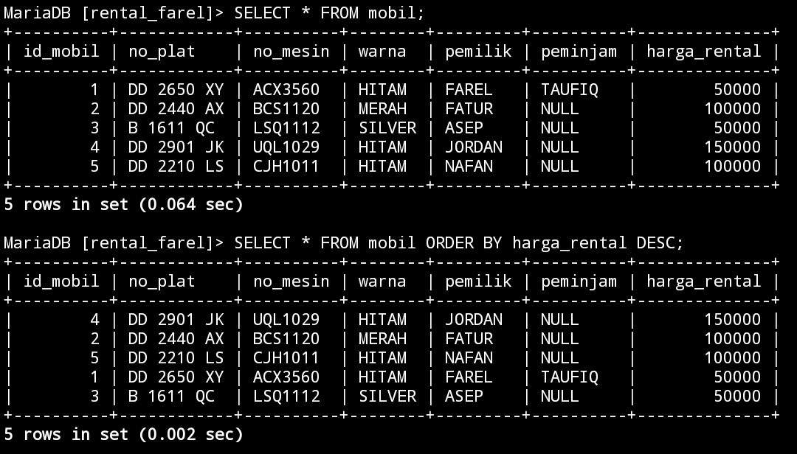

# SELECT LANJUTAN


## AND


### STRUKTUR


```MySQL

SELECT nama_kolom1,nama_kolom2 FROM nama_tabel WHERE kondisi1 AND kondisi2;

```


### CONTOH


```MySQL

SELECT warna,pemilik FROM mobil WHERE warna="HITAM" AND pemilik="FAREL";

```


### HASIL


>


### ANALISIS


`SELECT warna, pemilik` : Ini menunjukkan bahwa kita ingin mengambil nilai dari kolom "`warna`" dan "`pemilik`".

`FROM mobil` : Ini menunjukkan bahwa kita ingin mengambil data dari tabel "mobil".

`WHERE warna="HITAM" AND pemilik="FAREL"` : Ini adalah klausa yang digunakan untuk memberikan kriteria pencarian. Dalam hal ini, kita hanya ingin mendapatkan data dari baris yang memiliki nilai "warna" sama dengan `"HITAM"` dan nilai `"pemilik"` sama dengan `"FAREL"`.


### KESIMPULAN


Jadi, perintah ini akan mengambil nilai kolom "`warna`" dan "`pemilik`" dari baris-baris di dalam tabel "mobil" di mana nilai "`warna`" sama dengan "`HITAM`" dan nilai "`pemilik`" sama dengan "`FAREL`".


## OR


### STRUKTUR


```MySQL


SELECT nama_kolom1,nama_kolom2 FROM nama_tabel WHERE kondisi1 OR kondisi2;

```


### CONTOH


```MySQL

SELECT warna,pemilik FROM mobil WHERE warna="Hitam" OR pemilik="ASEP";

```


### HASIL


>


### ANALISIS


`SELECT warna, pemilik` : Menunjukkan bahwa data yang akan diambil hanya mencakup kolom "`warna`" dan "`pemilik`" dari tabel "mobil".
    
`FROM mobil` : Menunjukkan bahwa data diambil dari tabel bernama "mobil".
    
`WHERE warna="Hitam" OR pemilik="ASEP"` : Menyatakan kondisi yang harus dipenuhi oleh data yang diambil. Kondisi ini menggunakan operator `OR`, yang berarti data yang akan diambil harus memiliki warna "`Hitam`" atau dimiliki oleh seseorang dengan nama "`ASEP`". Jadi, hasilnya bisa mencakup mobil berwarna hitam atau dimiliki oleh Asep, atau keduanya.
    


### KESIMPULAN


Jadi, keseluruhan kode ini akan mengembalikan data mengenai mobil dengan warna `hitam` atau dimiliki oleh `Asep` dari tabel "mobil".


Kesimpulan dari kode tersebut adalah bahwa perintah SQL tersebut akan mengembalikan data mengenai mobil dengan warna "`Hitam`" atau dimiliki oleh seseorang dengan nama "`ASEP`" dari tabel "mobil".


## BETWEEN


### STRUKTUR


```MySQL


SELECT * FROM nama_tabel WHERE nama_kolom BETWEEN nilai1 AND nilai2;

```


### CONTOH


```MySQL

SELECT * FROM mobil WHERE harga_rental BETWEEN 100000 AND 150000;

```


### HASIL


>


### ANALISIS


`SELECT *` :enunjukkan bahwa seluruh kolom (semua informasi) dari tabel "mobil" akan diambil.
    
`FROM mobil` : Menunjukkan bahwa data diambil dari tabel bernama "mobil".
    
`WHERE harga_rental BETWEEN 100000 AND 150000;` : Menyatakan kondisi yang harus dipenuhi oleh data yang diambil. Kondisi ini menggunakan operator `BETWEEN` untuk membatasi hasil pada rentang `harga_rental` antara `100.000` dan `150.000`. Artinya, data yang diambil hanya akan mencakup mobil dengan harga sewa di dalam rentang tersebut.


### KESIMPULAN


Jadi, keseluruhan kode ini akan mengembalikan semua informasi mengenai mobil yang memiliki harga sewa antara `100.000` dan `150.000` dari tabel "mobil".


Kesimpulan dari kode tersebut adalah bahwa perintah SQL tersebut akan mengembalikan semua informasi mengenai mobil yang memiliki harga rental di antara `100.000` dan `150.000` dari tabel "mobil".


## NOT BETWEEN


### STRUKTUR


```MySQL


SELECT * FROM nama_tabel WHERE nama_kolom NOT BETWEEN nilai1 AND nilai2;

```


### CONTOH


```MySQL

SELECT * FROM mobil WHERE harga_rental NOT BETWEEN 100000 AND 150000;

```


### HASIL


>


### ANALISIS


`SELECT *` : Menunjukkan bahwa seluruh kolom (semua informasi) dari tabel "mobil" akan diambil.
    
`FROM mobil` : Menunjukkan bahwa data diambil dari tabel bernama "mobil".
    
`WHERE harga_rental NOT BETWEEN 100000 AND 150000;`  : Menyatakan kondisi yang harus dipenuhi oleh data yang diambil. Kondisi ini menggunakan operator `NOT BETWEEN` untuk membatasi hasil pada mobil yang memiliki `harga_rental` di luar rentang antara `100.000` dan `150.000`. Artinya, data yang diambil hanya akan mencakup mobil dengan harga sewa di luar rentang tersebut.


### KESIMPULAN


Jadi, keseluruhan kode ini akan mengembalikan semua informasi mengenai mobil yang memiliki harga sewa di luar rentang `100.000` dan `150.000` dari tabel "mobil".


## <=


### STRUKTUR


```MySQL

SELECT * FROM nama_tabel WHERE nama_kolom <= nilai1;


```


### CONTOH


```MySQL

SELECT * FROM mobil WHERE harga_rental <= 100000;

```


### HASIL


>


### ANALISIS


`Select *` : Menunjukkan bahwa seluruh kolom (semua informasi) dari tabel "mobil" akan diambil.
    
`FROM mobil` : Menunjukkan bahwa data diambil dari tabel bernama "mobil".
    
`WHERE harga_rental <= 100000` : Menyatakan kondisi yang harus dipenuhi oleh data yang diambil. Kondisi ini menyaring data hanya untuk mobil yang memiliki harga sewa kurang dari atau sama dengan 100.000.


### KESIMPULAN


Jadi, keseluruhan kode ini akan mengembalikan semua informasi mengenai mobil yang memiliki harga sewa kurang dari atau sama dengan `100.000` dari tabel "mobil".


## >=


### STRUKTUR


```MySQL


SELECT * FROM nama_tabel WHERE nama_kolom >= nilai1;


```


### CONTOH


```MySQL

SELECT * FROM mobil WHERE harga_rental >= 100000;

```


### HASIL


>


### ANALISIS


`SELECT *` : Menunjukkan bahwa seluruh kolom (semua informasi) dari tabel "mobil" akan diambil.
    
`FROM mobil` : Menunjukkan bahwa data diambil dari tabel bernama "mobil".
    
`WHERE harga_rental >= 100000` : Menyatakan kondisi yang harus dipenuhi oleh data yang diambil. Kondisi ini menyaring data hanya untuk mobil yang memiliki harga sewa lebih besar dari atau sama dengan `100.000`.


### KESIMPULAN


Jadi, keseluruhan kode ini akan mengembalikan semua informasi mengenai mobil yang memiliki harga sewa lebih besar dari atau sama dengan `100.000` dari tabel "mobil".


## <> atau !=


### STRUKTUR


<>

```MySQL


SELECT * FROM nama_tabel WHERE nama_kolom <> nilai1;


```


---


!=

```MySQL


SELECT * FROM nama_tabel WHERE nama_kolom != nilai1;


```


### CONTOH


<>

```MySQL

SELECT * FROM mobil WHERE harga_rental <> 100000;

```


---


!=

```MySQL

SELECT * FROM mobil WHERE harga_rental != 100000;

```


### HASIL


<>

>


!=


>


### ANALISIS


<>

`SELECT *` : Menunjukkan bahwa seluruh kolom (semua informasi) dari tabel "mobil" akan diambil.
    
`FROM mobil` : Menunjukkan bahwa data diambil dari tabel bernama "mobil".
    
`WHERE harga_rental <> 100000` : Menyatakan kondisi yang harus dipenuhi oleh data yang diambil. Kondisi ini menggunakan operator `<>` (tidak sama dengan) untuk menyaring data hanya untuk mobil yang memiliki harga sewa tidak sama dengan `100.000`.


! =


`SELECT *` : Menunjukkan bahwa seluruh kolom (semua informasi) dari tabel "mobil" akan diambil.
    
`FROM mobil` : Menunjukkan bahwa data diambil dari tabel bernama "mobil".
    
`WHERE harga_rental != 100000` : Menyatakan kondisi yang harus dipenuhi oleh data yang diambil. Kondisi ini menggunakan operator `!=` (tidak sama dengan) untuk menyaring data hanya untuk mobil yang memiliki harga sewa tidak sama dengan `100.000`.


### KESIMPULAN


<>

Jadi, keseluruhan kode ini akan mengembalikan semua informasi mengenai mobil yang memiliki harga sewa berbeda dari `100.000` dari tabel "mobil".


! =

Jadi, keseluruhan kode ini akan mengembalikan semua informasi mengenai mobil yang memiliki harga sewa berbeda dari `100.000` dari tabel "mobil".


## TANTANGAN


### STRUKTUR


```MySQL

SELECT nama_kolom1 FROM nama_tabel WHERE kondisi;

```


### CONTOH


```MySQL

SELECT pemilik FROM mobil WHERE id_mobil=1;

```

### HASIL


>


### ANALISIS


`SELECT pemilik` : Menunjukkan bahwa hanya kolom "pemilik" dari tabel "mobil" yang akan diambil.
    
`FROM mobil` : Menunjukkan bahwa data diambil dari tabel bernama "mobil".
    
`WHERE id_mobil=1` : Menyatakan kondisi yang harus dipenuhi oleh data yang diambil. Kondisi ini menyaring data hanya untuk mobil yang memiliki nilai "`id_mobil`" sama dengan `1`.


### KESIMPULAN


Jadi, keseluruhan kode ini akan mengembalikan informasi mengenai `pemilik` mobil dengan `id_mobil=1` dari tabel "mobil".


## TANTANGAN LOGIN


### STRUKTUR


```MySQL

SELECT nama_kolom1 FROM nama_tabel WHERE kondisi;

```


### CONTOH


```MySQL

SELECT nama FROM akun WHERE id=2;

```

### HASIL


>


### ANALISIS


`SELECT nama` : Menunjukkan bahwa hanya kolom "nama" dari tabel "akun" yang akan diambil.
    
`FROM akun` : Menunjukkan bahwa data diambil dari tabel bernama "akun".
    
`WHERE id=2` : Menyatakan kondisi yang harus dipenuhi oleh data yang diambil. Kondisi ini menyaring data hanya untuk akun yang memiliki nilai "`id`" sama dengan `2`.


1. **Perintah `SELECT`**:
    
    - Perintah **`SELECT`** digunakan untuk mengambil atau menampilkan data dari database. Dalam konteks ini, kita ingin mengambil data kolom **nama** dari tabel **akun**.
2. **`FROM`**:
    
    - **`FROM`** digunakan untuk menentukan tabel mana yang akan digunakan untuk mengambil data. Di sini, tabel yang digunakan adalah **akun**.
3. **Kondisi `WHERE`**:
    
    - Kondisi **`WHERE`** digunakan untuk memfilter baris-baris tertentu yang sesuai dengan kriteria yang ditentukan. Dalam kode ini, kondisinya adalah **id=2**, yang artinya kita hanya akan mengambil baris yang memiliki nilai **id** sama dengan 2.


### KESIMPULAN


Jadi, keseluruhan kode ini akan mengembalikan informasi mengenai `nama` akun dengan `id=2` dari tabel "akun".


Jadi, secara keseluruhan, kode SQL **`SELECT` nama `FROM` akun `WHERE` id=2;** akan mengambil nilai dari kolom **nama** dari tabel **akun** di mana nilai **id** adalah 2. Misalnya, jika ada baris di dalam tabel **akun** yang memiliki **id** = 2, perintah ini akan mengembalikan nilai dari kolom **nama** untuk baris tersebut.


## IN 


### STRUKTUR


```MySQL


SELECT * FROM nama_tabel WHERE nama_kolom1 IN (Nilai1,Nilai2);

```


### CONTOH


```MySQL

SELECT * FROM mobil WHERE pemilik IN ("FAREL","ASEP");


SELECT * FROM mobil WHERE warna IN ("MERAH","SILVER");


```


### HASIL


>


### ANALISIS


1. **Pertama:**
    
    - `SELECT *` : Menunjukkan bahwa seluruh kolom (semua informasi) dari tabel "mobil" akan diambil.
    - `FROM mobil` : Menunjukkan bahwa data diambil dari tabel bernama "mobil".
    - `WHERE pemilik IN ("FAREL", "ASEP")` : Menyatakan kondisi yang harus dipenuhi oleh data yang diambil. Kondisi ini menggunakan operator `IN` untuk menyaring mobil yang dimiliki oleh "`FAREL`" atau "`ASEP`".
2. **Kedua:**
    
    - SELECT * : Menunjukkan bahwa seluruh kolom (semua informasi) dari tabel "mobil" akan diambil.
    
    - FROM mobil: Menunjukkan bahwa data diambil dari tabel bernama "`mobil`".
    
    - `WHERE warna IN ("MERAH", "SILVER")` : Menyatakan kondisi yang harus dipenuhi oleh data yang diambil. Kondisi ini menggunakan operator `IN` untuk menyaring mobil yang berwarna "`MERAH`" atau "`SILVER`".


### KESIMPULAN


Keseluruhan, pernyataan SQL pertama akan mengembalikan semua informasi mengenai mobil yang dimiliki oleh "`FAREL`" atau "`ASEP`", sementara pernyataan SQL kedua akan mengembalikan semua informasi mengenai mobil yang berwarna "`MERAH`" atau "`SILVER`" dari tabel "mobil".


## IN + AND


### STRUKTUR


```MySQL

SELECT * FROM nama_tabel WHERE nama_kolom1 IN (Nilai1,Nilai2) AND kondisi1;


```


### CONTOH


```MySQL


SELECT * FROM mobil WHERE warna IN ("MERAH","SILVER") AND harga_rental = 100000;


SELECT * FROM mobil WHERE warna IN ("MERAH","SILVER") AND harga_rental = 50000;


```


### HASIL


>


### ANALISIS


1. **Pertama:**
    
    - `select *` : Menunjukkan bahwa seluruh kolom (semua informasi) dari tabel "mobil" akan diambil.
    
    - `FROM mobil` : Menunjukkan bahwa data diambil dari tabel bernama "mobil".
    
    -  `WHERE warna IN ("MERAH","SILVER") AND harga_rental = 100000;` : Menyatakan kondisi yang harus dipenuhi oleh data yang diambil. Kondisi ini menggunakan operator `IN` untuk menyaring mobil yang berwarna "`MERAH`" atau "`SILVER`" dan memiliki harga sewa sebesar `100.000`.
    
1. **Kedua:**
    
    - `SELECT *` : Menunjukkan bahwa seluruh kolom (semua informasi) dari tabel "mobil" akan diambil.
    - `FROM mobil` : Menunjukkan bahwa data diambil dari tabel bernama "mobil".
    - `WHERE warna IN ("MERAH","SILVER") AND harga_rental = 50000;` : Menyatakan kondisi yang harus dipenuhi oleh data yang diambil. Kondisi ini menggunakan operator IN untuk menyaring mobil yang berwarna "MERAH" atau "SILVER" dan memiliki harga sewa sebesar 50.000.


### KESIMPULAN


Keseluruhan, pernyataan SQL pertama akan mengembalikan semua informasi mengenai mobil yang berwarna "`MERAH`" atau "`SILVER`" dan memiliki harga sewa sebesar `100.000`, sementara pernyataan SQL kedua akan mengembalikan semua informasi mengenai mobil yang berwarna "`MERAH`" atau "`SILVER`" dan memiliki harga sewa sebesar `50.000` dari tabel "mobil".


## IN + OR


### STRUKTUR


```MySQL


SELECT * FROM nama_tabel WHERE nama_kolom1 IN (Nilai1,Nilai2) OR kondisi1;


```


### CONTOH


```MySQL


SELECT * FROM mobil WHERE warna IN ("HITAM","MERAH") OR harga_rental = 150000;


SELECT * FROM mobil WHERE warna IN ("HITAM","MERAH") OR harga_rental = 50000;


```


### HASIL


>


### ANALISIS


1. **Pertama:**
    
    - `SELECT *` : Menunjukkan bahwa seluruh kolom (semua informasi) dari tabel "mobil" akan diambil.
    - `FROM mobil` : Menunjukkan bahwa data diambil dari tabel bernama "mobil".
    - `WHERE warna IN ("HITAM","MERAH") OR harga_rental = 150000;` : Menyatakan kondisi yang harus dipenuhi oleh data yang diambil. Kondisi ini menggunakan operator IN untuk menyaring mobil yang berwarna "HITAM" atau "MERAH" dan mobil yang memiliki harga sewa sebesar 150.000.
2. **Kedua:**
    
    - `SELECT *` : Menunjukkan bahwa seluruh kolom (semua informasi) dari tabel "mobil" akan diambil.
    - `FROM mobil` : Menunjukkan bahwa data diambil dari tabel bernama "mobil".
    - `WHERE warna IN ("HITAM","MERAH") OR harga_rental = 50000;` : Menyatakan kondisi yang harus dipenuhi oleh data yang diambil. Kondisi ini menggunakan operator IN untuk menyaring mobil yang berwarna "HITAM" atau "MERAH" dan mobil yang memiliki harga sewa sebesar 50.000.


### KESIMPULAN


Keseluruhan, pernyataan SQL pertama akan mengembalikan semua informasi mengenai mobil yang berwarna "`HITAM`" atau "`MERAH`" atau memiliki harga sewa sebesar `150.000`, sementara pernyataan SQL kedua akan mengembalikan semua informasi mengenai mobil yang berwarna "`HITAM`" atau "`MERAH`" atau memiliki harga sewa sebesar `50.000` dari tabel "mobil".


## IN + AND + OPERATOR


### STRUKTUR


```MySQL


SELECT * FROM nama_tabel WHERE nama_kolom1 IN (Nilai1,Nilai2) AND nama_kolom2 > nilai1;


SELECT * FROM nama_tabel WHERE nama_kolom1 IN (Nilai1,Nilai2) AND nama_kolom2 < nilai1;


```


### CONTOH

(>)

```MySQL

SELECT * FROM mobil WHERE warna IN ("MERAH", "HITAM") AND harga_rental > 100000;


```


(<)

```MySQL

SELECT * FROM mobil WHERE warna IN ("MERAH", "HITAM") AND harga_rental < 100000;


```


### HASIL

(>)

>


(<)


>


### ANALISIS


(>)

- `SELECT *`: Memilih semua kolom dari tabel yang sesuai dengan kriteria.
- `FROM mobil`: Menunjukkan bahwa kita ingin mengambil data dari tabel bernama "mobil".
- `WHERE warna IN ("MERAH", "HITAM")`: Membatasi hasil hanya untuk baris-baris di mana kolom "`warna`" memiliki nilai "`MERAH`" atau "`HITAM`".
- `AND harga_rental > 100000`: Menambahkan batasan tambahan, hanya mengambil baris-baris di mana nilai kolom "`harga_rental`" lebih besar dari `100000`.


(<)

- `SELECT *`: Memilih semua kolom dari tabel yang sesuai dengan kriteria.
- `FROM mobil`: Menunjukkan bahwa kita ingin mengambil data dari tabel bernama "mobil".
- `WHERE warna IN ("MERAH", "HITAM")`: Membatasi hasil hanya untuk baris-baris di mana kolom "`warna`" memiliki nilai "`MERAH`" atau "`HITAM`".
- `AND harga_rental < 100000`: Menambahkan batasan tambahan, hanya mengambil baris-baris di mana nilai kolom "`harga_rental`" kurang dari `100000`.


### KESIMPULAN


(>)

Jadi, secara keseluruhan, pernyataan SQL ini akan mengambil semua kolom dari tabel "mobil" di mana `warna` mobil adalah "`MERAH`" atau "`HITAM`" dan harga rentalnya lebih besar dari `100000`.


(<)


Jadi, secara keseluruhan, pernyataan SQL ini akan mengambil semua kolom dari tabel "mobil" di mana `warna` mobil adalah "`MERAH`" atau "`HITAM`" dan harga rentalnya kurang dari `100000`.


  


## LIKE

### Mencari Awalan

#### STRUKTUR


```MySQL


SELECT * FROM nama_tabel WHERE nama_kolom1 LIKE 'nilai%';


```


#### CONTOH

```mysql


SELECT * FROM mobil WHERE peminjam LIKE 'C%';


SELECT * FROM mobil WHERE pemilik LIKE 'F%';


```

#### HASIL

> 

#### ANALISIS


1. **Pertama:**
    
    - `SELECT *` : Menunjukkan bahwa seluruh kolom (semua informasi) dari tabel "mobil" akan diambil.
    - `FROM mobil` : Menunjukkan bahwa data diambil dari tabel bernama "mobil".
    - `WHERE peminjam LIKE 'C%'` : Menyatakan kondisi yang harus dipenuhi oleh data yang diambil. Kondisi ini menggunakan operator LIKE untuk menyaring mobil yang memiliki peminjam dengan nama yang dimulai dengan huruf '`C`'.
2. **Kedua:**
    
    - `SELECT *` : Menunjukkan bahwa seluruh kolom (semua informasi) dari tabel "mobil" akan diambil.
    - `FROM mobil` : Menunjukkan bahwa data diambil dari tabel bernama "mobil".
    - `WHERE pemilik LIKE 'F%'` : Menyatakan kondisi yang harus dipenuhi oleh data yang diambil. Kondisi ini menggunakan operator LIKE untuk menyaring mobil yang memiliki pemilik dengan nama yang dimulai dengan huruf 'F'.


#### KESIMPULAN


Keseluruhan, pernyataan SQL pertama akan mengembalikan semua informasi mengenai mobil yang memiliki peminjam dengan nama yang dimulai dengan huruf '`C'`, sementara pernyataan SQL kedua akan mengembalikan semua informasi mengenai mobil yang memiliki pemilik dengan nama yang dimulai dengan huruf '`F`' dari tabel "mobil".


### Mencari Akhiran

#### STRUKTUR


```MySQL

SELECT * FROM nama_tabel WHERE nama_kolom1 LIKE '%nilai';


```


#### CONTOH

```mysql


SELECT * FROM mobil WHERE pemilik LIKE '%UR';


SELECT * FROM mobil WHERE peminjam LIKE '%O';


```

#### HASIL

> 

#### ANALISIS


1. **Pertama:**
    
    - `SELECT *` : Menunjukkan bahwa seluruh kolom (semua informasi) dari tabel "mobil" akan diambil.
    - `FROM mobil` : Menunjukkan bahwa data diambil dari tabel bernama "mobil".
    - `WHERE pemilik LIKE '%UR'` : Menyatakan kondisi yang harus dipenuhi oleh data yang diambil. Kondisi ini menggunakan operator `LIKE` untuk menyaring mobil yang memiliki pemilik dengan nama yang diakhiri dengan '`UR`'.
2. **Kedua:**
    
    - `SELECT *` : Menunjukkan bahwa seluruh kolom (semua informasi) dari tabel "mobil" akan diambil.
    - `FROM mobil` : Menunjukkan bahwa data diambil dari tabel bernama "mobil".
    - `WHERE peminjam LIKE '%O'` : Menyatakan kondisi yang harus dipenuhi oleh data yang diambil. Kondisi ini menggunakan operator LIKE untuk menyaring mobil yang memiliki peminjam dengan nama yang diakhiri dengan 'O'.


#### KESIMPULAN


Keseluruhan, pernyataan SQL pertama akan mengembalikan semua informasi mengenai mobil yang memiliki pemilik dengan nama yang diakhiri dengan '`UR`', sementara pernyataan SQL kedua akan mengembalikan semua informasi mengenai mobil yang memiliki peminjam dengan nama yang diakhiri dengan '`O`' dari tabel "mobil".


### Mencari Awalan & Akhiran

#### STRUKTUR


```MySQL

SELECT * FROM nama_tabel WHERE nama_kolom1 LIKE 'nilai1%nilai1';


```


#### CONTOH

```mysql


SELECT * FROM mobil WHERE pemilik LIKE 'F%L';


SELECT * FROM mobil WHERE peminjam LIKE 'Ah%N';


```

#### HASIL

> 

#### ANALISIS


1. **Pertama:**
    
    - `SELECT *` : Menunjukkan bahwa seluruh kolom (semua informasi) dari tabel "mobil" akan diambil.
    - `FROM mobil` : Menunjukkan bahwa data diambil dari tabel bernama "mobil".
    - `WHERE pemilik LIKE 'F%L'` : Menyatakan kondisi yang harus dipenuhi oleh data yang diambil. Kondisi ini menggunakan operator LIKE untuk menyaring mobil yang memiliki pemilik dengan nama yang diawali dengan 'F' dan diakhiri dengan 'L'.
2. **Kedua:**
    
    - `SELECT *` : Menunjukkan bahwa seluruh kolom (semua informasi) dari tabel "mobil" akan diambil.
    - `FROM mobil` : Menunjukkan bahwa data diambil dari tabel bernama "mobil".
    - `WHERE peminjam LIKE 'Ah%N'` : Menyatakan kondisi yang harus dipenuhi oleh data yang diambil. Kondisi ini menggunakan operator `LIKE` untuk menyaring mobil yang memiliki peminjam dengan nama yang diawali dengan 'Ah' dan diakhiri dengan 'N'.


#### KESIMPULAN


Keseluruhan, pernyataan SQL pertama akan mengembalikan semua informasi mengenai mobil yang memiliki pemilik dengan nama yang diawali dengan '`F`' dan diakhiri dengan '`L'`, sementara pernyataan SQL kedua akan mengembalikan semua informasi mengenai mobil yang memiliki peminjam dengan nama yang diawali dengan '`Ah`' dan diakhiri dengan `N` dari tabel "mobil".


### Mencari Berdasarkan Total Karakter

#### STRUKTUR


```MySQL


SELECT * FROM nama_tabel WHERE nama_kolom1 LIKE 'nilai____';


```


#### CONTOH

```mysql


SELECT * FROM mobil WHERE pemilik LIKE 'F____';


SELECT * FROM mobil WHERE pemilik LIKE '____';


```

#### HASIL

> 

#### ANALISIS


1. **Pertama:**
    
    - `SELECT *` : Menunjukkan bahwa seluruh kolom (semua informasi) dari tabel "mobil" akan diambil.
    - `FROM mobil` : Menunjukkan bahwa data diambil dari tabel bernama "mobil".
    - `WHERE pemilik LIKE 'F____'` : Menyatakan kondisi yang harus dipenuhi oleh data yang diambil. Kondisi ini menggunakan operator LIKE untuk menyaring mobil yang memiliki pemilik dengan nama yang dimulai dengan 'F' dan memiliki empat karakter setelahnya.
2. **Kedua:**
    
    - `SELECT *` : Menunjukkan bahwa seluruh kolom (semua informasi) dari tabel "mobil" akan diambil.
    - `FROM mobil` : Menunjukkan bahwa data diambil dari tabel bernama "mobil".
    - `WHERE pemilik LIKE '____';`  : Menyatakan kondisi yang harus dipenuhi oleh data yang diambil. Kondisi ini menggunakan operator LIKE untuk menyaring mobil yang memiliki pemilik dengan nama yang memiliki tepat empat karakter.


#### KESIMPULAN


Keseluruhan, pernyataan SQL pertama akan mengembalikan semua informasi mengenai mobil yang memiliki pemilik dengan nama yang dimulai dengan '`F`' dan memiliki empat karakter setelahnya, sementara pernyataan SQL kedua akan mengembalikan semua informasi mengenai mobil yang memiliki pemilik dengan nama yang tepat empat karakter dari tabel "mobil".


### KOMBINASI

#### STRUKTUR


```MySQL


SELECT * FROM nama_tabel WHERE nama_kolom1 LIKE '____nilai%';


```


#### CONTOH

```mysql


SELECT * FROM mobil WHERE pemilik LIKE '_____N%';


SELECT * FROM mobil WHERE peminjam LIKE '__U%';


```

#### HASIL

> 

#### ANALISIS


1. **Pertama:**
    
    - `SELECT *` : Menunjukkan bahwa seluruh kolom (semua informasi) dari tabel "mobil" akan diambil.
    - `FROM mobil` : Menunjukkan bahwa data diambil dari tabel bernama "mobil".
    - `WHERE pemilik LIKE '_____N%' `: Menyatakan kondisi yang harus dipenuhi oleh data yang diambil. Kondisi ini menggunakan operator LIKE untuk menyaring mobil yang memiliki pemilik dengan nama yang memiliki lima karakter di awal, diakhiri dengan 'N', dan kemudian bisa diikuti oleh karakter apa pun.
2. **Kedua:**
    
    - `SELECT *` : Menunjukkan bahwa seluruh kolom (semua informasi) dari tabel "mobil" akan diambil.
    - `From Mobil` : Menunjukkan bahwa data diambil dari tabel bernama "mobil".
    - `WHERE peminjam LIKE '__U%'` : Menyatakan kondisi yang harus dipenuhi oleh data yang diambil. Kondisi ini menggunakan operator `LIKE` untuk menyaring mobil yang memiliki peminjam dengan nama yang memiliki dua karakter di awal, diikuti oleh '`U`', dan kemudian bisa diikuti oleh karakter apa pun.


#### KESIMPULAN


Keseluruhan, pernyataan SQL pertama akan mengembalikan semua informasi mengenai mobil yang memiliki pemilik dengan nama yang memiliki lima karakter di awal, diakhiri dengan '`N`', dan kemudian bisa diikuti oleh karakter apa pun. Pernyataan SQL kedua akan mengembalikan semua informasi mengenai mobil yang memiliki peminjam dengan nama yang memiliki dua karakter di awal, diikuti oleh '`U`', dan kemudian bisa diikuti oleh karakter apa pun dari tabel "mobil".


### NOT LIKE

#### STRUKTUR


```MySQL


SELECT * FROM nama_tabel WHERE nama_kolom1 NOT LIKE 'nilai%';


```


#### CONTOH

```mysql


SELECT * FROM mobil WHERE pemilik NOT LIKE 'F%';


SELECT * FROM mobil WHERE pemilik NOT LIKE 'J%';


```

#### HASIL

> 

#### ANALISIS


1. **Pertama:**
    
    - `SELECT *` : Menunjukkan bahwa seluruh kolom (semua informasi) dari tabel "mobil" akan diambil.
    - `FROM mobil` : Menunjukkan bahwa data diambil dari tabel bernama "mobil".
    - `WHERE pemilik NOT LIKE 'F%'` : Menyatakan kondisi yang harus dipenuhi oleh data yang diambil. Kondisi ini menggunakan operator NOT LIKE untuk menyaring mobil yang memiliki pemilik dengan nama yang tidak diawali oleh 'F'.
2. **Kedua:**
    
    - `SELECT *` : Menunjukkan bahwa seluruh kolom (semua informasi) dari tabel "mobil" akan diambil.
    - `FROM mobil` : Menunjukkan bahwa data diambil dari tabel bernama "mobil".
    - `WHERE pemilik NOT LIKE 'J%'` : Menyatakan kondisi yang harus dipenuhi oleh data yang diambil. Kondisi ini menggunakan operator NOT LIKE untuk menyaring mobil yang memiliki pemilik dengan nama yang tidak diawali oleh 'J'.


#### KESIMPULAN


Keseluruhan, pernyataan SQL pertama akan mengembalikan semua informasi mengenai mobil yang memiliki pemilik dengan nama yang tidak diawali oleh '`F'`, sementara pernyataan SQL kedua akan mengembalikan semua informasi mengenai mobil yang memiliki pemilik dengan nama yang tidak diawali oleh `'J'` dari tabel "mobil".


### NULL & NOT NULL

#### NULL

##### STRUKTUR 


```MySQL

SELECT * FROM nama_table WHERE nama_kolom IS NULL;

```


##### CONTOH 


```MySQL

SELECT * FROM mobil WHERE peminjam IS NULL;


```


##### HASIL 


>


##### ANALISIS 

`SELECT` : Perintah ini memilih semua kolom dari tabel yang akan diambil. Penggunaan tanda bintang (`*`) berarti kita ingin mengambil semua kolom tanpa kecuali.

`FROM mobil` : Ini adalah klausa yang menentukan tabel mana yang akan digunakan dalam query, dalam hal ini adalah tabel "mobil".

`WHERE peminjam IS NULL` : Ini adalah klausa yang digunakan untuk memfilter baris-baris dalam tabel. Kondisi di sini adalah "`peminjam IS NULL`", yang berarti kita hanya ingin baris-baris di mana nilai kolom "`peminjam`" adalah `NULL`.


##### KESIMPULAN 

Jadi, secara keseluruhan, perintah SQL tersebut akan mengambil semua kolom dari tabel "mobil" di mana mobil belum dipinjam oleh siapa pun, karena nilai kolom "`peminjam`" pada baris-baris tersebut adalah `NULL`.


#### NOT NULL


##### STRUKTUR 


```MySQL

SELECT * FROM nama_table WHERE nama_kolom IS NOT NULL;

```

##### CONTOH 


```MySQL


SELECT * FROM mobil WHERE peminjam IS NOT NULL;


```

##### HASIL 


>


##### ANALISIS 

`SELECT` : Ini memilih semua kolom dari tabel yang akan diambil. Penggunaan tanda bintang (`*`) berarti kita ingin mengambil semua kolom tanpa kecuali.

`FROM mobil` : Ini menentukan tabel mana yang akan digunakan dalam query, dalam hal ini adalah tabel "mobil".

`WHERE peminjam IS NOT NULL` : Ini adalah klausa yang digunakan untuk memfilter baris-baris dalam tabel. Kondisi di sini adalah "`peminjam IS NOT NULL`", yang berarti kita hanya ingin baris-baris di mana nilai kolom "`peminjam`" tidak `NULL`.


##### KESIMPULAN 

Jadi, secara keseluruhan, perintah SQL tersebut akan mengambil semua kolom dari tabel "mobil" di mana mobil sudah dipinjam oleh seseorang, karena nilai kolom "`peminjam`" pada baris-baris tersebut bukan `NULL`.


### ORDER BY & LIMIT

#### Mengurutkan data dari data terkecil


##### STRUKTUR 


```MySQL

SELECT * FROM nama_table ORDER BY nama_kolom ASC;


```


##### CONTOH 


```MySQL

SELECT * FROM mobil ORDER BY harga_rental ASC;


```


##### HASIL 

>


##### ANALISIS 

`SELECT` : Ini adalah perintah untuk memilih semua kolom dari tabel "mobil". Dengan menggunakan tanda bintang (`*`), kita memilih semua kolom yang tersedia dalam tabel.

`FROM mobil` : Ini menunjukkan sumber data dari mana kita akan mengambil informasi, yaitu tabel "mobil". Ini diasumsikan bahwa tabel "mobil" berisi informasi tentang kendaraan yang tersedia untuk disewa.

`ORDER BY harga_rental ASC` : Perintah ini menginstruksikan database untuk mengurutkan hasil berdasarkan nilai kolom "`harga_rental`" secara ascending. Artinya, data akan diurutkan dari nilai `harga rental` yang terendah ke tertinggi. `ASC` singkatan dari "ascending".


##### KESIMPULAN 

Jadi, secara keseluruhan, perintah SQL ini akan mengambil semua data dari tabel "mobil" dan mengurutkannya berdasarkan `harga rental` secara ascending, sehingga pengguna dapat melihat kendaraan yang memiliki harga rental terendah terlebih dahulu.


#### Mengurutkan data dari data terbesar 

##### STRUKTUR 


```MySQL

SELECT * FROM nama_table ORDER BY nama_kolom DESC;


```


##### CONTOH 


```MySQL

SELECT * FROM mobil ORDER BY harga_rental DESC;


```


##### HASIL 

>


##### ANALISIS 

`SELECT` : Perintah ini memilih semua kolom dari tabel "mobil". Tanda bintang (`*`) digunakan untuk memilih semua kolom yang ada dalam tabel.

`FROM mobil` : Ini menunjukkan sumber data dari mana kita akan mengambil informasi, yaitu tabel "mobil". Kita mengasumsikan bahwa tabel "mobil" berisi informasi tentang kendaraan yang tersedia untuk disewa.

`ORDER BY harga_rental DESC` : Perintah ini menginstruksikan database untuk mengurutkan hasil berdasarkan nilai kolom "`harga_rental`" secara descending. Artinya, data akan diurutkan dari harga rental yang tertinggi ke terendah. Kata kunci `DESC` merupakan singkatan dari "descending".


##### KESIMPULAN 

Jadi, secara keseluruhan, perintah SQL ini akan mengambil semua data dari tabel "mobil" dan mengurutkannya berdasarkan harga rental secara descending, sehingga pengguna dapat melihat kendaraan yang memiliki harga rental tertinggi terlebih dahulu.


#### LIMIT

##### STRUKTUR 

```MySQL


SELECT * FROM nama_tabel WHERE nama_kolom = isi_kolom_tersebut ORDER BY nama_kolom ASC LIMIT 2;


```


##### CONTOH 

```MySQL


SELECT * FROM data_mobil WHERE warna = 'HITAM' ORDER BY harga_rental ASC LIMIT 2;


```


##### HASIL 

>


##### ANALISIS 

1. `SELECT *`: Ini adalah pernyataan SQL yang memilih semua kolom dari tabel yang ditentukan.
2. `FROM data_mobil`: Ini menunjukkan bahwa kita memilih data dari tabel bernama `data_mobil`.
3. `WHERE warna = 'HITAM'`: Ini adalah klausa `WHERE` yang memfilter baris berdasarkan nilai kolom `warna`, dimana nilai `warna` harus sama dengan 'HITAM'.
4. `ORDER BY harga_rental ASC`: Ini mengurutkan hasil berdasarkan nilai kolom `harga_rental` secara `ASC` ascending (dari yang terkecil ke yang terbesar).
5. `LIMIT 2`: Ini membatasi jumlah baris hasil yang ditampilkan menjadi 2 baris pertama yang sesuai dengan kriteria tersebut. Jadi, hanya dua mobil dengan warna hitam yang memiliki harga rental terendah akan ditampilkan.


##### KESIMPULAN


Kode SQL tersebut akan mengambil data dari tabel `data_mobil` dimana mobil memiliki warna 'HITAM', kemudian akan diurutkan berdasarkan harga rental dari yang terendah ke tertinggi, dan yang terakhir, hanya akan menampilkan 2 mobil pertama yang memenuhi kriteria tersebut.


### DISTINCT

#### STRUKTUR 


```MySQL

SELECT DISTINCT(nama_kolom) FROM nama_table;


```


#### CONTOH 


```MySQL

SELECT DISTINCT(warna) FROM mobil;


```


#### HASIL 

>


#### ANALISIS 

`SELECT DISTINCT(warna)` : Perintah ini mengambil nilai unik dari kolom "`warna`" dalam tabel `mobil`. Kata kunci `DISTINCT` digunakan untuk menghilangkan duplikat, sehingga hanya nilai unik dari kolom "`warna`" yang akan ditampilkan.

`FROM mobil` : Ini menunjukkan sumber data dari mana kita akan mengambil informasi, yaitu tabel "`mobil`". Kita mengasumsikan bahwa tabel "`mobil`" berisi informasi tentang kendaraan yang tersedia untuk disewa.


#### KESIMPULAN 

Jadi, secara keseluruhan, perintah SQL ini akan mengambil semua nilai unik dari kolom "`warna`" dalam tabel "`mobil`". Ini bermanfaat jika kita ingin melihat daftar semua warna yang tersedia untuk kendaraan dalam database, tanpa adanya duplikasi.


### DISTINCT + ORDER BY


#### STRUKTUR 


```MySQL

SELECT DISTINCT(nama_kolom) FROM nama_table ORDER BY nama_kolom DESC;


```


#### CONTOH 


```MySQL

SELECT DISTINCT(warna) FROM mobil ORDER BY warna DESC;


```


#### HASIL 

>


#### ANALISIS 

`SELECT DISTINCT(warna)` : Perintah ini mengambil nilai unik dari kolom "`warna`" dalam tabel "`mobil`". Ini berarti hanya nilai unik dari kolom "`warna`" yang akan ditampilkan, tanpa adanya duplikasi.

`FROM mobil` : Ini menunjukkan bahwa data diambil dari tabel "`mobil`". Tabel "`mobil`" diasumsikan berisi informasi tentang kendaraan, dan kita tertarik untuk melihat nilai unik dari kolom "`warna`" yang terdapat dalam tabel ini.

`ORDER BY warna DESC` : Perintah ini menginstruksikan database untuk mengurutkan hasil berdasarkan nilai kolom "`warna`" secara descending. Artinya, data akan diurutkan berdasarkan warna secara descending, dari warna yang terbesar ke yang terkecil.


#### KESIMPULAN 

Jadi, secara keseluruhan, perintah SQL ini akan mengambil nilai unik dari kolom "`warna`" dalam tabel "`mobil`", menghilangkan duplikat, dan mengurutkannya berdasarkan warna secara descending. Ini berguna jika kita ingin melihat daftar semua warna yang tersedia untuk kendaraan dalam database, diurutkan dari warna yang paling banyak muncul ke yang paling sedikit muncul, atau berdasarkan aturan lain yang sesuai dengan kebutuhan.


### CONCAT , CONCAT_WS , AS

#### CONCAT

##### STRUKTUR 


```MySQL

SELECT CONCAT(nama_kolom1,nama_kolom2) FROM nama_table;


SELECT CONCAT(nama_kolom1," ",nama_kolom2) FROM nama_table;


```


Tanda (" ") itu sama dengan spasi, untuk kasih spasi antara kolom1 dan kolom2

##### CONTOH 


```MySQL

SELECT CONCAT(pemilik,warna) FROM mobil;


SELECT CONCAT(pemilik," ",warna) FROM mobil;


```


##### HASIL 

> 


##### ANALISIS 

`SELECT CONCAT(pemilik,warna)` : Ini adalah perintah untuk menggabungkan nilai dari dua kolom, yaitu "`pemilik`" dan "`warna`", menggunakan fungsi `CONCAT`. Ini akan menghasilkan satu string yang terdiri dari nilai kolom "`pemilik`" diikuti oleh nilai kolom "`warna`" tanpa ada spasi atau karakter pemisah di antara keduanya.

`FROM mobil` : Ini menentukan tabel yang digunakan adalah "`mobil`".


`SELECT CONCAT(pemilik," ",warna)` : Ini adalah perintah untuk menggabungkan nilai dari dua kolom, yaitu "`pemilik`" dan "`warna`", menggunakan fungsi CONCAT. Dalam kasus ini, ada spasi di antara tanda kutip ganda `(" "`) di antara nilai kolom "`pemilik`" dan nilai kolom "`warna`". Ini akan menghasilkan satu string yang terdiri dari nilai kolom "`pemilik`", diikuti oleh spasi, dan kemudian diikuti oleh nilai kolom "`warna`".

`FROM mobil` : Ini menentukan tabel yang digunakan adalah "`mobil`".


##### KESIMPULAN 

Jadi, perintah ini akan menghasilkan satu kolom hasil yang berisi hasil penggabungan nilai dari kolom "`pemilik`" dan "`warna`" tanpa ada spasi di antara keduanya. Misalnya, jika nilai kolom "`pemilik`" adalah "`Ahsan`" dan nilai kolom "`warna`" adalah "`Merah`", maka hasilnya akan menjadi "`AhsanMerah`".


Jadi, perintah ini akan menghasilkan satu kolom hasil yang berisi hasil penggabungan nilai dari kolom "`pemilik`" dan "`warna`", dengan spasi di antara keduanya. Misalnya, jika nilai kolom "`pemilik`" adalah "`Ahsan`" dan nilai kolom "`warna`" adalah "`Merah`", maka hasilnya akan menjadi "`Ahsan` `Merah`".


#### CONCAT_WS


##### STRUKTUR 


```MySQL

SELECT CONCAT_WS("-",nama_kolom1,nama_kolom2,nama_kolom3) FROM nama_table;


```


##### CONTOH 


```MySQL

SELECT CONCAT_WS("-",no_plat,no_mesin,id_mobil) FROM mobil;


SELECT CONCAT_WS("-",warna,pemilik,peminjam,harga_rental) FROM mobil;


```


##### HASIL 


> 


##### ANALISIS 


`SELECT CONCAT_WS("-",no_plat,no_mesin,id_mobil)` : Ini adalah perintah untuk menggabungkan nilai dari tiga kolom, yaitu "`no_plat`", "`no_mesin`", dan "`id_mobil`", menggunakan fungsi `CONCAT_WS`. Fungsi `CONCAT_WS` digunakan untuk menggabungkan nilai-nilai dengan pemisah yang ditentukan, dalam hal ini tanda strip (`"-"`). Ini akan menghasilkan satu string yang terdiri dari nilai kolom "`no_plat`", diikuti oleh tanda strip, diikuti oleh nilai kolom "`no_mesin`", diikuti lagi oleh tanda strip, dan akhirnya diikuti oleh nilai kolom "`id_mobil`".

`FROM mobil` : Ini menentukan tabel yang digunakan adalah "`mobil`".


##### KESIMPULAN 

Jadi, perintah ini akan menghasilkan satu kolom hasil yang berisi hasil penggabungan nilai dari kolom "`no_plat`", "`no_mesin`", dan "`id_mobil`", dengan tanda strip `"-"` di antara keduanya. Misalnya, jika nilai kolom "`no_plat`" adalah "`ABC123`", nilai kolom "`no_mesin`" adalah "`123456`", dan nilai kolom "`id_mobil`" adalah "`789`", maka hasilnya akan menjadi "`ABC123-123456-789`".


#### AS

##### STRUKTUR 


```MySQL

SELECT CONCAT_WS("+",nama_kolom1,nama_kolom2) AS COLLAB FROM nama_table;


SELECT nama_kolom1 + nama_kolom2 AS NOMOR FROM nama_table;


```


##### CONTOH 


```MySQL

SELECT CONCAT_WS("+",pemilik,peminjam) AS COLLAB FROM mobil;


SELECT harga_rental + id_mobil AS nomor FROM mobil;


```


##### HASIL 


> 


##### ANALISIS 

`SELECT CONCAT_WS("+",pemilik,peminjam)` : Ini adalah perintah untuk menggabungkan nilai dari dua kolom, yaitu "`pemilik`" dan "`peminjam`", menggunakan fungsi `CONCAT_WS`. Fungsi `CONCAT_WS` digunakan untuk menggabungkan nilai-nilai dengan pemisah yang ditentukan, dalam hal ini tanda tambah (`"+"`). Ini akan menghasilkan satu string yang terdiri dari nilai kolom "`pemilik`", diikuti oleh tanda tambah, diikuti oleh nilai kolom "`peminjam`".

`AS COLLAB` : Ini memberikan nama alias "`COLLAB`" untuk kolom hasil penggabungan.

`FROM mobil` : Ini menentukan tabel yang digunakan adalah "`mobil`".


`SELECT harga_rental + id_mobil AS nomor` : Ini adalah perintah untuk melakukan penjumlahan antara nilai kolom "`harga_rental`" dan "`id_mobil`". Hasil penjumlahan ini kemudian diberi alias "`nomor`".

`FROM mobil` : Ini menentukan tabel yang digunakan adalah "`mobil`".


##### KESIMPULAN 

Jadi, perintah ini akan menghasilkan satu kolom hasil yang berisi hasil penggabungan nilai dari kolom "`pemilik`" dan "`peminjam`", dengan tanda tambah `"+"` di antara keduanya. Misalnya, jika nilai kolom "`pemilik`" adalah "`Ahsan`" dan nilai kolom "`peminjam`" adalah "`Adiguna`", maka hasilnya akan menjadi "`Ahsan+Adiguna`".


Jadi, perintah ini akan menghasilkan satu kolom hasil yang berisi hasil penjumlahan dari nilai kolom "`harga_rental`" dan "`id_mobil`", yang diberi nama alias "`nomor`". Misalnya, jika nilai kolom "`harga_rental`" adalah `1000` dan nilai kolom "`id_mobil`" adalah `123`, maka hasilnya akan menjadi `1123`.


### VIEW

#### Membuat tabel virtual 
##### STRUKTUR 


```MySQL

CREATE VIEW nama_table AS SELECT nama_kolom1,nama_kolom2 FROM nama_table(tabel Yang sudah ada) WHERE nama_kolom2 > Nilai Yang diinginkan

```


##### CONTOH 


```MySQL


CREATE VIEW harga_promo AS SELECT no_plat, harga_rental FROM mobil WHERE harga_rental > 100000;


```


##### HASIL 


>


##### ANALISIS 

`CREATE VIEW harga_promo` : Ini adalah perintah untuk membuat sebuah view baru dengan nama "`harga_promo`".

`AS` : Ini menandakan bahwa definisi dari view akan dimulai setelah kata kunci "`AS`".

`SELECT no_plat, harga_rental` : Ini adalah perintah untuk memilih dua kolom, yaitu "`no_plat`" dan "`harga_rental`", dari tabel "`mobil`".

`FROM mobil` : Ini menentukan bahwa data akan diambil dari tabel "`mobil`".

`WHERE harga_rental > 100000` : Ini adalah klausa WHERE yang membatasi hasil query hanya pada baris-baris di mana harga rental lebih dari `100000`.


##### KESIMPULAN 

Jadi, secara keseluruhan, perintah ini membuat sebuah view bernama "`harga_promo`" yang berisi data `nomor_plat` dan `harga_rental` mobil yang memiliki `harga_rental` lebih dari `100000`.


#### Menampilkan tabel Virtual


##### STRUKTUR 


```MySQL

SELECT * FROM nama_tabel;

```

##### CONTOH 


```MySQL

SELECT * FROM harga_promo;

```

##### HASIL 

>


##### ANALISIS 

Ini adalah perintah untuk mengambil semua kolom dari view "`harga_promo`". Saat dieksekusi, perintah ini akan mengembalikan semua data yang ada dalam view "`harga_promo`", yaitu data `nomor_plat` dan `harga_rental` mobil yang memenuhi kriteria yang telah ditetapkan sebelumnya (`harga_rental` lebih dari `100000`).


##### KESIMPULAN 

Jadi, perintah ini akan menghasilkan hasil yang sama seperti jika kita menjalankan query `SELECT` dengan kolom-kolom yang didefinisikan dalam pembuatan `view harga_promo`, yaitu `no_plat` dan `harga_rental`.


#### Menghapus Tabel Virtual 


##### STRUKTUR 

```MySQL

DROP VIEW nama_tabel;


```


##### CONTOH 

```MySQL

DROP VIEW harga_promo;


```


##### HASIL 

>


##### ANALISIS 

Ini adalah perintah untuk menghapus view yang telah dibuat sebelumnya dengan nama "`harga_promo`". Saat dieksekusi, perintah ini akan menghapus definisi view "`harga_promo`" beserta seluruh data yang disimpan di dalamnya dari database.


##### KESIMPULAN 

Dengan menggunakan perintah ini, view "`harga_promo`" yang telah dibuat sebelumnya akan dihapus dan tidak akan lagi tersedia untuk digunakan dalam query SQL. Ini berguna jika view tersebut tidak lagi diperlukan atau perlu diperbarui.


### TANTANGAN

#### NO 1

##### STRUKTUR 

```MySQL

CREATE VIEW nama_tabel AS SELECT nama_kolom1,nama_kolom2,nama_kolom3 FROM nama_tabel WHERE nama_kolom2 IS NULL;


```

##### CONTOH 


```MySQL

CREATE VIEW null_peminjam AS SELECT no_plat, peminjam, harga_rental FROM mobil WHERE peminjam IS NULL;


```

##### HASIL 


>


##### ANALISIS 

`CREATE VIEW null_peminjam` : Ini adalah perintah untuk membuat view baru dengan nama "`null_peminjam`".

`AS` : Ini menandakan bahwa definisi dari view akan dimulai setelah kata kunci "`AS`".

`SELECT no_plat, peminjam, harga_rental` : Ini adalah perintah untuk memilih tiga kolom, yaitu "`no_plat`", "`peminjam`", dan "`harga_rental`", dari tabel "`mobil`".

`FROM mobil` : Ini menentukan bahwa data akan diambil dari tabel "`mobil`".

`WHERE peminjam IS NULL` : Ini adalah klausa `WHERE` yang membatasi hasil query hanya pada baris-baris di mana nilai kolom "`peminjam`" adalah `NULL`.


##### KESIMPULAN 

Jadi, perintah ini akan membuat sebuah view bernama "`null_peminjam`" yang berisi data `nomor_plat`, `peminjam`, dan `harga_rental` mobil yang belum dipinjam oleh siapapun (peminjamnya `NULL`).


#### NO 2


##### STRUKTUR 


```MySQL

UPDATE nama_tabel SET nama_kolom WHERE kondisi;

```

##### CONTOH 


```MySQL


UPDATE mobil SET peminjam=NULL WHERE id_mobil=2;


```

##### HASIL 


>


##### ANALISIS 

`UPDATE mobil` : Ini adalah perintah untuk mengupdate data dalam tabel "`mobil`".

`SET peminjam=NULL` : Ini adalah bagian dari perintah `UPDATE` yang menetapkan nilai kolom "`peminjam`" menjadi `NULL`.

`WHERE id_mobil=2` : Ini adalah klausa `WHERE` yang membatasi operasi update hanya pada baris yang memiliki nilai kolom "`id_mobil`" sama dengan `2`.


##### KESIMPULAN 

Jadi, perintah ini akan mengubah nilai kolom "`peminjam`" menjadi `NULL` pada baris di mana nilai kolom "`id_mobil`" adalah `2` dalam tabel "`mobil`". Artinya, mobil dengan ID `2` tidak lagi memiliki peminjam setelah perintah ini dieksekusi.


### AGREGASI

#### SUM

##### STRUKTUR 

```MySQL

SELECT SUM(nama_kolom) FROM nama_table WHERE kondisi_opsional;

```

##### CONTOH 

```MySQL

SELECT SUM(harga_rental) FROM mobil;


SELECT SUM(harga_rental) FROM mobil WHERE warna = "HITAM";


```

##### HASIL


>


##### ANALISIS 


- `SELECT SUM(harga_rental)`: Ini adalah pernyataan SQL untuk menghitung jumlah (`SUM`) dari kolom `harga_rental`.
- `FROM mobil`: Ini menunjukkan bahwa kita ingin melakukan penghitungan dari tabel bernama "mobil".


- `SELECT SUM(harga_rental)`: Seperti sebelumnya, pernyataan ini menghitung jumlah (`SUM`) dari kolom `harga_rental`.
- `FROM mobil`: Sama seperti sebelumnya, menunjukkan bahwa kita ingin melakukan penghitungan dari tabel `"mobil".`
- `WHERE warna = "HITAM"`: Ini adalah klausa `WHERE` yang memfilter baris-baris di mana nilai kolom warna adalah `"HITAM".`


##### KESIMPULAN 


Jadi, kode ini menghitung total harga rental dari semua mobil dalam tabel "mobil".


Jadi, kode ini menghitung total harga rental dari mobil-mobil yang berwarna hitam dalam tabel "mobil".


#### COUNT

##### STRUKTUR 

```MySQL

SELECT COUNT(nama_kolom) AS jumlah FROM nama_table WHERE kondisi_opsional;

```

##### CONTOH 


```MySQL

SELECT COUNT(pemilik) FROM mobil;


SELECT COUNT(peminjam) FROM mobil;


SELECT COUNT(pemilik) AS jumlah_hitam FROM mobil WHERE warna = "HITAM";


```

##### HASIL


>


##### ANALISIS 


- `SELECT COUNT(pemilik)`: Ini adalah pernyataan SQL untuk menghitung jumlah baris (`COUNT`) di mana nilai kolom `pemilik` tidak null.
- `FROM mobil`: Ini menunjukkan bahwa kita ingin melakukan penghitungan dari tabel "`mobil`".


- `SELECT COUNT(peminjam)`: Seperti sebelumnya, pernyataan ini menghitung jumlah baris (`COUNT`) di mana nilai kolom `peminjam` tidak null.
- `FROM mobil`: Sama seperti sebelumnya, menunjukkan bahwa kita ingin melakukan penghitungan dari tabel "`mobil`".


- `SELECT COUNT(pemilik) AS jumlah_hitam`: Ini adalah pernyataan yang sama dengan kode pertama, namun hasilnya akan diberi label alias `jumlah_hitam`.
- `FROM mobil WHERE warna = "HITAM"`: Ini menunjukkan bahwa kita hanya ingin menghitung baris-baris di mana nilai kolom `warna` adalah "`HITAM`".


##### KESIMPULAN 


Jadi, kode ini menghitung jumlah entitas mobil yang memiliki nilai tidak null dalam kolom `pemilik`.


Kode ini menghitung jumlah entitas mobil yang memiliki nilai tidak null dalam kolom `peminjam`.


Kode ini menghitung jumlah entitas mobil yang memiliki nilai tidak null dalam kolom `pemilik`, tetapi hanya untuk mobil-mobil berwarna `hitam`.


#### MIN


##### STRUKTUR 

```MySQL

SELECT MIN(nama_kolom) AS minimal FROM nama_table WHERE kondisi_opsional;

```

##### CONTOH 


```MySQL

SELECT MIN(harga_rental) AS minimal FROM mobil;


SELECT MIN(harga_rental) AS minimal_merah FROM mobil WHERE warna = "MERAH";


```

##### HASIL


>


##### ANALISIS 


- `SELECT MIN(harga_rental) AS minimal`: Ini adalah pernyataan SQL untuk mengambil nilai minimum (MIN) dari kolom `harga_rental`, dengan memberikan alias `minimal` pada hasilnya.
- `FROM mobil`: Ini menunjukkan bahwa kita ingin melakukan pengambilan nilai minimum dari tabel "`mobil`".


- `SELECT MIN(harga_rental) AS minimal_merah`: Sama seperti kode pertama, namun hasilnya diberi alias `minimal_merah`.
- `FROM mobil WHERE warna = "MERAH"`: Ini menunjukkan bahwa kita hanya ingin mengambil nilai minimum dari data-data yang memiliki nilai kolom `warna` adalah "`MERAH`".


##### KESIMPULAN 


Jadi, kode ini mengambil nilai minimum dari kolom `harga_rental` dari semua data dalam tabel "`mobil`".


Kode ini mengambil nilai minimum dari kolom `harga_rental` dari data-data yang memiliki warna "`MERAH`" dalam tabel "`mobil`".


#### MAX


##### STRUKTUR 


```MySQL

SELECT MAX(nama_kolom) AS maximal FROM nama_table WHERE kondisi_opsional;


```


##### CONTOH 


```MySQL

SELECT MAX(harga_rental) AS maximal FROM mobil;


SELECT MAX(harga_rental) AS maximal FROM mobil WHERE warna = "SILVER";


```

##### HASIL


>


##### ANALISIS 


- `SELECT MAX(harga_rental) AS maximal`: Ini adalah pernyataan SQL untuk mengambil nilai maksimum (`MAX`) dari kolom `harga_rental`, dengan memberikan alias `maximal` pada hasilnya.
- `FROM mobil`: Ini menunjukkan bahwa kita ingin melakukan pengambilan nilai maksimum dari tabel "`mobil`".


- `SELECT MAX(harga_rental) AS maximal`: Sama seperti kode pertama, namun hasilnya diberi alias `maximal`.
- `FROM mobil WHERE warna = "SILVER"`: Ini menunjukkan bahwa kita hanya ingin mengambil nilai maksimum dari data-data yang memiliki nilai kolom `warna` adalah "SILVER".


##### KESIMPULAN 


Jadi, kode ini mengambil nilai maksimum dari kolom `harga_rental` dari semua data dalam tabel "`mobil`".


Kode ini mengambil nilai maksimum dari kolom `harga_rental` dari data-data yang memiliki warna "`SILVER`" dalam tabel "`mobil`".


#### AVG


##### STRUKTUR 

```MySQL


SELECT AVG(nama_kolom) AS rata_rata FROM nama_table WHERE kondisi_opsional;


```

##### CONTOH 

```MySQL

SELECT AVG(harga_rental) AS rata_rata FROM mobil;


SELECT AVG(harga_rental) AS rata_rata FROM mobil WHERE warna = "HITAM";


```

##### HASIL


>


##### ANALISIS 


- `SELECT AVG(harga_rental) AS rata_rata`: Ini adalah pernyataan SQL untuk mengambil nilai rata-rata (AVG) dari kolom `harga_rental`, dengan memberikan alias `rata_rata` pada hasilnya.
- `FROM mobil`: Ini menunjukkan bahwa kita ingin melakukan pengambilan nilai rata-rata dari tabel "`mobil`".


- `SELECT AVG(harga_rental) AS rata_rata`: Sama seperti kode pertama, namun hasilnya diberi alias `rata_rata`.
- `FROM mobil WHERE warna = "HITAM"`: Ini menunjukkan bahwa kita hanya ingin mengambil nilai rata-rata dari data-data yang memiliki nilai kolom `warna` adalah "`HITAM`".


##### KESIMPULAN 


Jadi, kode ini mengambil nilai rata-rata dari kolom `harga_rental` dari semua data dalam tabel "`mobil`".


Kode ini mengambil nilai rata-rata dari kolom `harga_rental` dari data-data yang memiliki warna "`HITAM`" dalam tabel "`mobil`".


