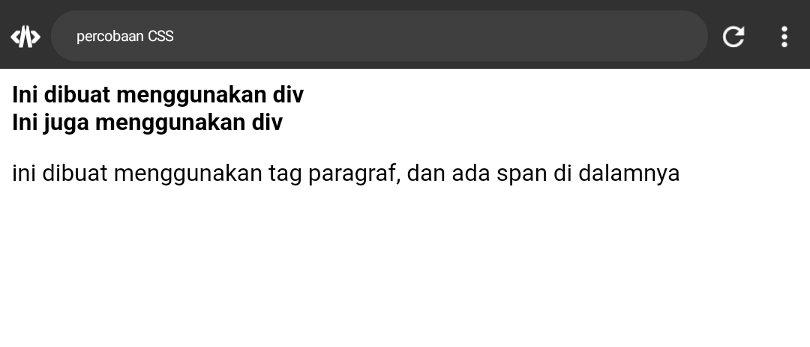

# ANATOMI CSS


>


## SELECTOR


Selector dalam CSS adalah pola atau kriteria yang digunakan untuk memilih elemen HTML tertentu. Contohnya termasuk selector elemen (misalnya, `p`), selector ID (misalnya, `#header`), dan selector kelas (misalnya, `.menu`). Selector memungkinkan penerapan aturan gaya CSS pada elemen-elemen yang sesuai dengan kriteria yang ditentukan.


## PROPERTY


Property dalam CSS adalah karakteristik atau atribut yang dapat diatur pada elemen HTML untuk mengatur tampilan atau perilakunya. Contohnya termasuk `color` untuk warna teks, `font-size` untuk ukuran font, dan `margin-top` untuk jarak atas. Properti diikuti oleh nilai tertentu untuk mengatur elemen sesuai kebutuhan desain.


Property dalam CSS adalah atribut yang digunakan untuk mengatur tampilan elemen HTML, seperti warna, ukuran, dan tata letak.


## PROPERTY VALUE


Dalam CSS, "property value" adalah nilai yang diberikan kepada suatu properti untuk mengatur tampilan atau perilaku elemen HTML. Contohnya termasuk `color: blue`, `font-size: 16px`, dan `margin-top: 10px`, di mana "blue", "16px", dan "10px" adalah nilai properti yang menentukan bagaimana elemen akan ditampilkan atau diatur.


# PERCOBAAN PERTAMA


## PENJELASAN


Kode HTML tersebut merupakan kerangka dasar sebuah halaman web. Terdapat dua elemen `<p>` yang berisi teks "WELCOME CSS!!!" dan dihubungkan dengan file CSS eksternal "style.css" menggunakan tag `<link>` di dalam bagian `<head>`.

Kemudian, dalam file CSS "style.css", aturan tersebut (p { color: aqua; }) menentukan bahwa teks pada semua elemen `<p>` dalam halaman tersebut akan memiliki warna aqua. Jadi, teks "WELCOME CSS!!!" pada kedua elemen `<p>` akan memiliki warna teks aqua.


## KODE


**FILE HTML**

```HTML


<!DOCTYPE html>
<html>
  <head>
    <title>percobaan CSS</title>
    
<link rel="stylesheet" href="style.css">

  </head>
  <body>
    
    
    <p>
      WELCOME CSS!!!
    </p>
    
    <p>
      WELCOME CSS!!!
    </p>
    
    
    
    </body>
    </html>


```


**FILE CSS**

```CSS


p {
    color: aqua;
  }


```


## HASIL


>


## KESIMPULAN


Kode HTML menciptakan halaman web sederhana dengan dua elemen paragraf `<p>` yang berisi teks "WELCOME CSS!!!". Kode CSS yang terhubung dengan halaman tersebut menetapkan warna teks aqua untuk semua elemen `<p>`. Jadi, hasilnya akan menampilkan teks "WELCOME CSS!!!" dengan warna aqua di halaman web.


# PERCOBAAN KEDUA


## FONT SIZE

### KODE


```css

button{
        height: 50px;
        width: 150px;
        font-size: 30px;
      }

```


### Before

>


### After


>


> [!PENJELASAN]
> Kode tersebut adalah aturan CSS yang mengatur gaya (style) dari elemen `<button>` pada halaman web.
> 
 height: 50px;: Menetapkan tinggi (height) tombol menjadi 50 piksel.
width: 150px;: Menetapkan lebar (width) tombol menjadi 150 piksel.
font-size: 30px;: Menetapkan ukuran font menjadi 30 piksel untuk teks di dalam tombol.
Jadi, aturan tersebut akan membuat tombol memiliki tinggi 50 piksel, lebar 150 piksel, dan teks di dalamnya memiliki ukuran font 30 piksel.


## BACKGROUND COLOR

### KODE


```css

button{
        height: 50px;
        width: 150px;
        background-color: red;
      }

```


### Before


>


### After


>


> [!PENJELASAN]
> 
> Kode tersebut adalah aturan CSS yang mengatur gaya (style) dari elemen `<button>` pada halaman web.
> 
height: 50px;: Menetapkan tinggi (height) tombol menjadi 50 piksel.
width: 150px;: Menetapkan lebar (width) tombol menjadi 150 piksel.
background-color: red;: Menetapkan warna latar belakang (background color) tombol menjadi merah.
Jadi, aturan tersebut akan membuat tombol memiliki tinggi 50 piksel, lebar 150 piksel, dan latar belakangnya berwarna merah.


## BORDER RADIUS

### KODE


```css

button{
        height: 50px;
        width: 150px;
        border-radius: 10px;
      }


```


### Before


>


### After


>


> [!PENJELASAN]
> 
> Kode tersebut adalah aturan CSS yang mengatur gaya (style) dari elemen `<button>` pada halaman web.
> 
height: 50px;: Menetapkan tinggi (height) tombol menjadi 50 piksel.
width: 150px;: Menetapkan lebar (width) tombol menjadi 150 piksel.
border-radius: 10px;: Menetapkan radius sudut (border radius) tombol menjadi 10 piksel.
Jadi, aturan tersebut akan membuat tombol memiliki tinggi 50 piksel, lebar 150 piksel, dan sudut-sudutnya dibulatkan dengan radius 10 piksel. Ini memberikan efek estetis dengan ujung sudut yang lebih lembut pada tombol.


---
---


# CARA PEMANGGILAN CSS

---

## SECARA INTERNAL

### PENJELASAN


Pemanggilan CSS secara internal dalam HTML mengacu pada menempatkan aturan gaya CSS langsung di dalam tag `<style>` di bagian `<head>` dokumen HTML yang sama. Ini memungkinkan spesifikasi gaya untuk aplikasi langsung pada halaman tersebut.


### KODE


```HTML


<!DOCTYPE html>
<html>
  <head>
    <title>percobaan CSS</title>
    
    
    <style>
      
      p{
        color: red;
      }
      
      
      span{
        color: blue;
      }
      
      </style>
    
  </head>
  <body>


<div>
      Ini dibuat menggunakan div
    </div>
    <div>
      Ini juga menggunakan div
    </div>
    
    
    
    <p>
      ini dibuat menggunakan tag paragraf,
      <span>
        dan ada span di dalamnya
      </span>
    </p>
    
    
    </body>
    </html>


```


### HASIL


>


### KESIMPULAN


Jadi, pemanggilan CSS secara internal dalam HTML melibatkan penempatan aturan gaya CSS di dalam tag `<style>` di bagian `<head>` halaman. Ini memungkinkan penentuan gaya secara langsung untuk elemen-elemen di dalam halaman tersebut tanpa memerlukan file eksternal. Meskipun cocok untuk halaman kecil, untuk proyek yang lebih besar atau penanganan yang lebih terpusat, pemanggilan eksternal mungkin lebih disarankan.


---


## SECARA INLINE

### PENJELASAN


Pemanggilan CSS secara inline dalam HTML melibatkan penggunaan properti gaya langsung pada tag HTML individual menggunakan atribut `style`.


### KODE


```HTML


  <body>


<div>
      Ini dibuat menggunakan div
    </div>
    <div>
      Ini juga menggunakan div
    </div>
    
    
    
    <p style="color: aqua;">
      ini dibuat menggunakan tag paragraf,
      <span style="color: lightblue;">
        dan ada span di dalamnya
      </span>
    </p>
    
    
    </body>


```


### HASIL


>


### KESIMPULAN


Jadi, pemanggilan CSS secara inline dalam HTML melibatkan penggunaan atribut `style` pada tag HTML individual untuk menentukan aturan gaya langsung. Ini memberikan fleksibilitas untuk menentukan gaya khusus untuk elemen-elemen tertentu tanpa perlu menggunakan file eksternal atau menambahkan tag `<style>` di bagian `<head>`. Meskipun efektif untuk aturan gaya yang spesifik, pemanggilan CSS secara inline dapat membuat HTML menjadi kurang terbaca dan lebih sulit dikelola jika digunakan secara berlebihan. Sebagai alternatif, pemanggilan CSS eksternal atau internal mungkin lebih disarankan untuk proyek yang lebih besar atau kompleks.


---


## SECARA EXTERNAL

### PENJELASAN


Pemanggilan CSS secara eksternal dalam HTML melibatkan penggunaan file terpisah dengan ekstensi `nama_file.css` yang mengandung aturan-aturan gaya CSS. File ini kemudian dihubungkan atau dimasukkan ke dalam halaman HTML menggunakan tag `<link rel="stylesheet">`


Keuntungan pemanggilan CSS secara eksternal termasuk:

1. **Pemisahan Konten**: Gaya terpisah dari struktur HTML, mempermudah pemeliharaan dan pengembangan.
2. **Kemudahan Pembaruan**: Perubahan pada aturan gaya dapat diterapkan secara global dengan memodifikasi satu file CSS.
3. **Caching**: Browser dapat menyimpan file CSS sehingga mempercepat waktu muat halaman untuk pengunjung yang kembali.


### KODE


**FILE HTML**

```HTML


<!DOCTYPE html>
<html>
  <head>
    <title>percobaan CSS</title>
    
<link rel="stylesheet" href="style.css">

  </head>
  <body>


<div>
      Ini dibuat menggunakan div
    </div>
    <div>
      Ini juga menggunakan div
    </div>
    
    
    
    <p>
      ini dibuat menggunakan tag paragraf,
      <span>
        dan ada span di dalamnya
      </span>
    </p>
    
    
    </body>
    </html>
    


```


**FILE CSS**

```CSS


div {
    color: aqua;
  }


```


### HASIL


>


### KESIMPULAN


Jadi, pemanggilan CSS secara eksternal dalam HTML melibatkan penggunaan file terpisah dengan ekstensi `.css`, yang kemudian dihubungkan atau dimasukkan ke dalam halaman HTML menggunakan tag `<link rel="stylesheet">` .  Pendekatan ini memberikan keuntungan dalam pemisahan konten, kemudahan pembaruan, dan pemanfaatan caching oleh browser. Ini sangat disarankan untuk proyek-proyek yang lebih besar dan kompleks karena meningkatkan keterbacaan, pemeliharaan, dan kinerja.


---
---


# Selector CSS

---

## Selector nama elemen

### PENJELASAN


Selector nama elemen dalam CSS digunakan untuk memilih semua elemen HTML dengan nama elemen tertentu. Ini adalah cara paling sederhana untuk menargetkan sekelompok elemen dan memberikan aturan gaya yang sama.


### KODE


**FILE HTML**

```HTML


<!DOCTYPE html>
<html>
  <head>
    <title>percobaan CSS</title>
    
<link rel="stylesheet" href="style.css">

  </head>
  <body>


<!--
    
    <button>
      klik disini
    </button>  
    
    -->
    
    
    <p>
      WELCOME CSS!!!
    </p>
    
    <p>
      WELCOME CSS!!!
    </p>
    
    
    
    </body>
    </html>


```


**FILE CSS**

```CSS


p {
    color: aqua;
  }


```


### HASIL


>


### KESIMPULAN


Jadi, selector nama elemen dalam CSS digunakan untuk memilih dan memberikan aturan gaya kepada semua elemen HTML dengan jenis tertentu. Ini adalah cara sederhana dan efektif untuk memberikan gaya secara konsisten pada sekelompok elemen yang serupa. 


## Class 

### PENJELASAN


Selector class dalam CSS digunakan untuk memilih dan memberikan aturan gaya kepada elemen-elemen yang memiliki kelas tertentu. Dengan menggunakan selector class, Anda dapat memberikan gaya yang sama untuk beberapa elemen tanpa mempengaruhi elemen-elemen lain yang mungkin memiliki struktur HTML yang sama.


### KODE


**FILE HTML**

```HTML


<!DOCTYPE html>
<html>
  <head>
    <title>percobaan CSS</title>
    
<link rel="stylesheet" href="style.css">

  </head>
  <body>


    
    
    <p class="p1">
      WELCOME CSS!!!
    </p>
    
    <p class="p2">
      WELCOME CSS!!!
    </p>
    
    
    
    </body>
    </html>


```


**FILE CSS**

```CSS


  .p1 {
    color: blue;
  }
  
  
  
  .p2 {
    color: lightblue;
  }


```


### HASIL


>


### KESIMPULAN


Jadi, selector class dalam CSS digunakan untuk memilih dan memberikan aturan gaya kepada elemen-elemen yang memiliki kelas tertentu. Ini memungkinkan konsistensi gaya untuk sekelompok elemen yang mungkin memiliki struktur HTML yang berbeda. Dengan menggunakan kelas, Anda dapat memberikan aturan gaya yang sama untuk beberapa elemen tanpa mempengaruhi elemen-elemen lain. Penggunaan kelas dapat meningkatkan fleksibilitas dan pemeliharaan dalam pengembangan web dengan memungkinkan pengelompokan dan pemberian gaya yang konsisten pada elemen-elemen yang sejenis.


## Id 

### PENJELASAN


Selector ID dalam CSS digunakan untuk memilih dan memberikan aturan gaya kepada elemen yang memiliki ID tertentu. Uniknya, setiap ID hanya dapat diberikan kepada satu elemen dalam halaman HTML, sehingga selector ID sangat spesifik dan cocok untuk kasus-kasus di mana elemen tersebut unik.


Penting untuk diingat bahwa satu elemen hanya dapat memiliki satu ID, dan nama ID harus unik di dalam satu halaman HTML.


### KODE


**FILE HTML**

```HTML


<!DOCTYPE html>
<html>
  <head>
    <title>percobaan CSS</title>
    
<link rel="stylesheet" href="style.css">

  </head>
  <body>

    
    
    <p id="p1">
      WELCOME CSS!!!
    </p>
    
    <p class="p2">
      WELCOME CSS!!!
    </p>
    
    
    
    </body>
    </html>


```


**FILE CSS**

```CSS


  #p1 {
    color: red;
  }
  
  
  
  .p2 {
    color: lightblue;
  }


```


### HASIL


>


### KESIMPULAN


Jadi, selector ID dalam CSS digunakan untuk memilih dan memberikan aturan gaya kepada elemen yang memiliki ID tertentu. ID bersifat unik, sehingga satu elemen hanya dapat memiliki satu ID, dan setiap ID hanya dapat diberikan kepada satu elemen dalam halaman HTML. Penggunaan selector ID cocok untuk memberikan aturan gaya yang sangat spesifik hanya untuk satu elemen, memastikan bahwa aturan gaya tersebut hanya berlaku untuk elemen dengan ID yang sesuai. Meskipun sangat spesifik, sebaiknya penggunaan ID dipertimbangkan dengan bijak untuk menghindari kekakuan dan memastikan pemeliharaan yang mudah dalam pengembangan web.


---

# MATERI FONT


# TEXT 

---

## Text-align

### PENJELASAN


 `text-align` dalam CSS adalah properti yang digunakan untuk mengatur penataan horizontal teks di dalam suatu elemen HTML. Nilai yang umum digunakan untuk text-align adalah:

Terbagi Menjadi 4 bagian yaitu :

1. `left`: Membuat teks terletak di sebelah kiri elemen.
2. `right`: Membuat teks terletak di sebelah kanan elemen.
3. `center`: Membuat teks terletak di tengah elemen.
4. `justify`: Membuat teks terletak di sepanjang garis kiri dan kanan elemen, mencoba untuk membuat setiap baris rata di kedua sisi.


### KODE


**FILE HTML**

```HTML


<!DOCTYPE html>
<html>
  <head>
    <title>percobaan CSS</title>
    
<link rel="stylesheet" href="style.css">

  </head>
  <body>


<div>
      Ini dibuat menggunakan div
    </div>
    <div>
      Ini juga menggunakan div
    </div>
    
    
    
    <p>
      ini dibuat menggunakan tag paragraf,
      <span>
        dan ada span di dalamnya
      </span>
    </p>
    
    
    </body>
    </html>


```


**FILE CSS**

```CSS


div {
text-align: center;
  
  }


```


### HASIL


>


### KESIMPULAN


Jadi, `text-align` dalam CSS digunakan untuk mengatur penataan horizontal teks di dalam elemen HTML. Nilai umumnya mencakup left, right, center, dan justify. Misalnya, text-align: center; akan menengahkan teks secara horizontal di dalam elemen yang dipilih.


## Text-decoration

### PENJELASAN


`text-decoration` dalam CSS adalah properti yang digunakan untuk mengatur dekorasi teks, seperti garis bawah, garis atas, garis tengah, atau menghapus dekorasi teks. Beberapa nilai umum untuk `text-decoration` meliputi:

Terbagi Menjadi 5 bagian yaitu :

1. `none`: Menghapus semua dekorasi teks.
2. `underline`: Menambahkan garis bawah pada teks.
3. `overline`: Menambahkan garis atas pada teks.
4. `line-through`: Menambahkan garis tengah pada teks.
5. `inherit`: Mengambil nilai dari elemen induk.


### KODE


**FILE HTML**

```HTML


<!DOCTYPE html>
<html>
  <head>
    <title>percobaan CSS</title>
    
<link rel="stylesheet" href="style.css">

  </head>
  <body>


<div>
      Ini dibuat menggunakan div
    </div>
    <div>
      Ini juga menggunakan div
    </div>
    
    
    
    <p>
      ini dibuat menggunakan tag paragraf,
      <span>
        dan ada span di dalamnya
      </span>
    </p>
    
    
    </body>
    </html>


```


**FILE CSS**

```CSS

div {
text-decoration: line-through;
  
  }


```


### HASIL

>


### KESIMPULAN


Jadi, `text-decoration` dalam CSS digunakan untuk mengatur dekorasi teks seperti garis bawah, garis atas, garis tengah, atau menghapus dekorasi. Nilai umumnya mencakup none, underline, overline, line-through, dan inherit. Misalnya, text-decoration: underline; akan menambahkan garis bawah pada teks di dalam elemen yang dipilih.


## Text-transfrom

### PENJELASAN


`text-transform` dalam CSS adalah properti yang digunakan untuk mengubah tampilan huruf pada teks. Properti ini dapat memodifikasi teks menjadi huruf kapital, huruf kecil, atau membuat huruf awal setiap kata menjadi huruf kapital. Beberapa nilai umum untuk text-transform meliputi:

Terbagi Menjadi 4 bagian yaitu :

1. `uppercase`: Mengubah semua huruf menjadi huruf kapital.
2. `lowercase`: Mengubah semua huruf menjadi huruf kecil.
3. `capitalize`: Membuat huruf awal setiap kata menjadi huruf kapital.
4. `none`: Tidak melakukan transformasi pada huruf.


### KODE


**FILE HTML**

```HTML


<!DOCTYPE html>
<html>
  <head>
    <title>percobaan CSS</title>
    
<link rel="stylesheet" href="style.css">

  </head>
  <body>


<div>
      Ini dibuat menggunakan div
    </div>
    <div>
      Ini juga menggunakan div
    </div>
    
    
    
    <p>
      ini dibuat menggunakan tag paragraf,
      <span>
        dan ada span di dalamnya
      </span>
    </p>
    
    
    </body>
    </html>


```


**FILE CSS**

```CSS

div {
text-transform: uppercase;
  
  }


```


### HASIL


>


### KESIMPULAN


Jadi, `text-transform` dalam CSS digunakan untuk mengubah tampilan huruf pada teks. Nilai umumnya mencakup uppercase untuk huruf kapital, lowercase untuk huruf kecil, capitalize untuk membuat huruf awal setiap kata menjadi huruf kapital, dan none untuk tanpa transformasi huruf. Misalnya, text-transform: uppercase; akan membuat teks di dalam elemen tertentu ditampilkan dalam huruf kapital.


## Text-indent

### PENJELASAN


`text-indent` dalam CSS adalah properti yang digunakan untuk mengatur jarak atau indentasi pada awal paragraf atau blok teks. Nilai yang dapat digunakan dalam `text-indent` biasanya berupa panjang atau persentase, dan bahkan nilai negatif untuk mengatur indentasi mundur.


### KODE


**FILE HTML**

```HTML


<!DOCTYPE html>
<html>
  <head>
    <title>percobaan CSS</title>
    
<link rel="stylesheet" href="style.css">

  </head>
  <body>


<div>
      Ini dibuat menggunakan div
    </div>
    <div>
      Ini juga menggunakan div
    </div>
    
    
    
    <p>
      ini dibuat menggunakan tag paragraf,
      <span>
        dan ada span di dalamnya
      </span>
    </p>
    
    
    </body>
    </html>


```


**FILE CSS**

```CSS


div {
text-indent: 100px;
  
  }


```


### HASIL


>


### KESIMPULAN


Jadi, `text-indent` digunakan untuk mengontrol jarak atau indentasi pada awal paragraf atau blok teks di dalam elemen HTML.


## Letter-spacing

### PENJELASAN


`letter-spacing` dalam CSS adalah properti yang digunakan untuk mengatur jarak antara huruf dalam teks. Nilai yang diberikan dapat berupa bilangan positif untuk meningkatkan jarak antara huruf, atau bilangan negatif untuk mengurangi jarak antara huruf.


### KODE


**FILE HTML**

```HTML


<!DOCTYPE html>
<html>
  <head>
    <title>percobaan CSS</title>
    
<link rel="stylesheet" href="style.css">

  </head>
  <body>


<div>
      Ini dibuat menggunakan div
    </div>
    <div>
      Ini juga menggunakan div
    </div>
    
    
    
    <p>
      ini dibuat menggunakan tag paragraf,
      <span>
        dan ada span di dalamnya
      </span>
    </p>
    
    
    </body>
    </html>


```


**FILE CSS**

```CSS

div {
letter-spacing: 8px;
  
  }


```


### HASIL


>


### KESIMPULAN


Jadi, `letter-spacing` digunakan untuk mengatur jarak antara huruf dalam teks di dalam elemen HTML.


## Line-height

### PENJELASAN


`line-height` dalam CSS adalah properti yang digunakan untuk mengatur tinggi garis atau ruang di antara baris teks di dalam suatu elemen HTML. Nilai yang dapat digunakan dalam `line-height` termasuk bilangan, persentase, dan nilai normal.


### KODE


**FILE HTML**

```HTML


<!DOCTYPE html>
<html>
  <head>
    <title>percobaan CSS</title>
    
<link rel="stylesheet" href="style.css">

  </head>
  <body>


<div>
      Ini dibuat menggunakan div
    </div>
    <div>
      Ini juga menggunakan div
    </div>
    
    
    
    <p>
      ini dibuat menggunakan tag paragraf,
      <span>
        dan ada span di dalamnya
      </span>
    </p>
    
    
    </body>
    </html>


```


**FILE CSS**

```CSS


div {
line-height: 100px;
  
  }


```


### HASIL


>


### KESIMPULAN


Jadi, `line-height` digunakan untuk mengontrol ruang di antara baris teks di dalam elemen HTML, dan nilai yang digunakan dapat memengaruhi keterbacaan dan tata letak halaman.


## Word-spacing

### PENJELASAN


`word-spacing` dalam CSS adalah properti yang digunakan untuk mengatur jarak antara kata-kata dalam teks. Nilai yang dapat digunakan dalam `word-spacing` biasanya berupa panjang atau persentase.


### KODE


**FILE HTML**

```HTML


<!DOCTYPE html>
<html>
  <head>
    <title>percobaan CSS</title>
    
<link rel="stylesheet" href="style.css">

  </head>
  <body>


<div>
      Ini dibuat menggunakan div
    </div>
    <div>
      Ini juga menggunakan div
    </div>
    
    
    
    <p>
      ini dibuat menggunakan tag paragraf,
      <span>
        dan ada span di dalamnya
      </span>
    </p>
    
    
    </body>
    </html>


```


**FILE CSS**

```CSS


div {
word-spacing: 50px;
  
  }


```


### HASIL


>


### KESIMPULAN


Jadi, `word-spacing` digunakan untuk mengatur jarak antara kata-kata dalam teks di dalam elemen HTML. Penggunaan yang bijak dapat memengaruhi tata letak dan estetika teks.


---
---

# BACKGROUND

---

## Background-image

### PENJELASAN


`background-image` dalam CSS adalah properti yang digunakan untuk menetapkan gambar sebagai latar belakang elemen HTML. Gambar ini dapat berupa file JPEG, PNG, GIF, atau format gambar lainnya. Properti ini diaplikasikan pada elemen HTML, dan gambar yang ditetapkan sebagai latar belakang akan ditampilkan di belakang isi elemen tersebut.


### KODE


**FILE HTML**

```HTML


<!DOCTYPE html>
<html>
  <head>
    <title>percobaan CSS</title>
    
<link rel="stylesheet" href="style.css">

  </head>
  <body>


<div>
      Ini dibuat menggunakan div
    </div>
    <div>
      Ini juga menggunakan div
    </div>
    
    
    
    <p>
      ini dibuat menggunakan tag paragraf,
      <span>
        dan ada span di dalamnya
      </span>
    </p>
    
    
    </body>
    </html>


```


**FILE CSS**

```CSS


div {
    
  background-image: url('Asep.jpg');
  height: 100vh;
  }


```


### HASIL


>


### KESIMPULAN


Jadi, `background-image` digunakan untuk menetapkan gambar sebagai latar belakang elemen HTML dan bisa dikombinasikan dengan properti lain untuk pengaturan lebih lanjut.


## Background-size

### PENJELASAN


`background-size` dalam CSS adalah properti yang digunakan untuk mengontrol ukuran gambar latar belakang yang ditetapkan menggunakan `background-image`. Properti ini memungkinkan Anda menyesuaikan bagaimana gambar latar belakang akan ditampilkan dalam hal ukuran.

Nilai umum untuk `background-size` terbagi menjadi 3 bagian yaitu :

1. `%,px,vh`: Ukuran gambar latar belakang diatur sesuai dengan keinginan anda.
2. `cover`: Gambar diperbesar atau diperkecil agar selalu mencakup seluruh elemen, dengan memotong jika diperlukan.
3. `contain`: Gambar diperbesar atau diperkecil agar selalu terlihat sepenuhnya di dalam elemen, tanpa memotong.


### KODE


**FILE HTML**

```HTML


<!DOCTYPE html>
<html>
  <head>
    <title>percobaan CSS</title>
    
<link rel="stylesheet" href="style.css">

  </head>
  <body>


<div>
      Ini dibuat menggunakan div
    </div>
    <div>
      Ini juga menggunakan div
    </div>
    
    
    
    <p>
      ini dibuat menggunakan tag paragraf,
      <span>
        dan ada span di dalamnya
      </span>
    </p>
    
    
    </body>
    </html>


```


**FILE CSS**

```CSS


div {
    
  background-image: url('Asep.jpg');
  height: 100vh;
background-size: cover;
  }


```


### HASIL


>


### KESIMPULAN


Jadi, `background-size` memungkinkan pengontrolan ukuran gambar latar belakang di dalam elemen HTML.


## Background-repeat

### PENJELASAN


`background-repeat` dalam CSS adalah properti yang digunakan untuk mengontrol apakah dan bagaimana gambar latar belakang diulang di dalam elemen HTML. Properti ini memungkinkan penyesuaian pengulangan gambar, baik secara horizontal (sumbu x) maupun vertikal (sumbu y).

Nilai umum untuk `background-repeat` terbagi menjadi 4 bagian yaitu :

1. `repeat`: Gambar akan diulang baik secara horizontal maupun vertikal.
2. `repeat-x`: Gambar akan diulang hanya secara horizontal.
3. `repeat-y`: Gambar akan diulang hanya secara vertikal.
4. `no-repeat`: Gambar tidak diulang dan ditampilkan hanya sekali.


### KODE


**FILE HTML**

```HTML


<!DOCTYPE html>
<html>
  <head>
    <title>percobaan CSS</title>
    
<link rel="stylesheet" href="style.css">

  </head>
  <body>


<div>
      Ini dibuat menggunakan div
    </div>
    <div>
      Ini juga menggunakan div
    </div>
    
    
    
    <p>
      ini dibuat menggunakan tag paragraf,
      <span>
        dan ada span di dalamnya
      </span>
    </p>
    
    
    </body>
    </html>


```


**FILE CSS**

```CSS


div {
    
  background-image: url('Asep.jpg');
  height: 100vh;
background-size: 100px;
background-repeat: repeat;
}


```


### HASIL


>


### KESIMPULAN


Jadi, `background-repeat` memungkinkan kontrol terhadap pengulangan gambar latar belakang di dalam elemen HTML.


## Background-attachment

### PENJELASAN


`background-attachment` dalam CSS adalah properti yang digunakan untuk mengontrol apakah gambar latar belakang akan tetap diam atau mengikuti guliran (scrolling) halaman. Properti ini mempengaruhi bagaimana gambar latar belakang akan ditampilkan ketika halaman di-scroll.

Nilai umum untuk `background-attachment` terbagi menjadi 2 bagian yaitu :

1. `scroll`: Gambar latar belakang akan mengikuti guliran halaman.
2. `fixed`: Gambar latar belakang akan tetap diam dan tidak bergerak saat halaman di-scroll.


### KODE


**FILE HTML**

```HTML


<!DOCTYPE html>
<html>
  <head>
    <title>percobaan CSS</title>
    
<link rel="stylesheet" href="style.css">

  </head>
  <body>


<div>
      Ini dibuat menggunakan div
    </div>
    <div>
      Ini juga menggunakan div
    </div>
    
    
    
    <p>
      ini dibuat menggunakan tag paragraf,
      <span>
        dan ada span di dalamnya
      </span>
    </p>
    
    
    </body>
    </html>


```


**FILE CSS**

```CSS


div {
    
  background-image: url('Asep.jpg');
  height: 100vh;
background-size: 100px;
background-repeat: no-repeat;
background-attachment: fixed;
}
  


```


### HASIL


>


### KESIMPULAN


Jadi, `background-attachment` memungkinkan kontrol terhadap perilaku gambar latar belakang terhadap guliran halaman.


## Background-position

### PENJELASAN


`background-position` dalam CSS adalah properti yang digunakan untuk menentukan posisi awal dari gambar latar belakang di dalam elemen HTML. Properti ini memungkinkan Anda menentukan posisi horizontal dan vertikal dari gambar latar belakang.

Nilai yang dapat digunakan dalam `background-position` terbagi menjadi 3 bagian yaitu :

1. Nilai persentase: Menentukan posisi relatif gambar latar belakang terhadap elemen, baik secara horizontal maupun vertikal.
2. Nilai panjang: Menentukan posisi gambar latar belakang dengan menggunakan satuan panjang seperti piksel.
3. Nilai kata kunci: Seperti `top`, `bottom`, `left`, `right`, dan `center` untuk menentukan posisi secara spesifik.


### KODE


**FILE HTML**

```HTML


<!DOCTYPE html>
<html>
  <head>
    <title>percobaan CSS</title>
    
<link rel="stylesheet" href="style.css">

  </head>
  <body>


<div>
      Ini dibuat menggunakan div
    </div>
    <div>
      Ini juga menggunakan div
    </div>
    
    
    
    <p>
      ini dibuat menggunakan tag paragraf,
      <span>
        dan ada span di dalamnya
      </span>
    </p>
    
    
    </body>
    </html>


```


**FILE CSS**

```CSS


div {
    
  background-image: url('Asep.jpg');
  height: 100vh;
background-size: 100px;
background-repeat: no-repeat;
background-attachment: fixed;
background-position: center;
}


```


### HASIL


>


### KESIMPULAN


Jadi, `background-position` memungkinkan Anda menentukan posisi awal gambar latar belakang di dalam elemen HTML.


---
---

# FONT

---

## Font-size

### PENJELASAN


`font-size` dalam CSS adalah properti yang digunakan untuk menentukan ukuran teks di dalam elemen HTML. Properti ini mengontrol tinggi huruf dalam ukuran yang relatif terhadap dimensi elemen atau ukuran font yang ditentukan.

Nilai yang dapat digunakan dalam `font-size` terbagi menjadi 2 bagian yaitu :

Nilai absolut: Seperti piksel (px), poin (pt), sentimeter (cm), dan inci (in).
Nilai relatif: Seperti persentase (%) dari ukuran font induk atau em (em), yang sama dengan ukuran font dari elemen induk.


### KODE


**FILE HTML**

```HTML


<!DOCTYPE html>
<html>
  <head>
    <title>percobaan CSS</title>
    
<link rel="stylesheet" href="style.css">

  </head>
  <body>


<div>
      Ini dibuat menggunakan div
    </div>
    <div>
      Ini juga menggunakan div
    </div>
    
    
    
    <p>
      ini dibuat menggunakan tag paragraf,
      <span>
        dan ada span di dalamnya
      </span>
    </p>
    
    
    </body>
    </html>


```


**FILE CSS**

```CSS


div {

  font-size: 30px;
} 


```


### HASIL


>


### KESIMPULAN


Jadi, `font-size` digunakan untuk menentukan ukuran teks di dalam elemen HTML, yang dapat ditentukan dalam nilai absolut atau relatif.


## Font-style

### PENJELASAN


`font-style` dalam CSS adalah properti yang digunakan untuk mengatur gaya huruf dari teks di dalam elemen HTML. Properti ini memungkinkan Anda memberikan efek miring (italic) atau normal pada teks.

Nilai yang dapat digunakan dalam `font-style` terbagi menjadi 3 bagian yaitu :

1. `normal`: Menetapkan gaya huruf normal (tidak miring).
2. `italic`: Menetapkan gaya huruf miring (italic).
3. `oblique`: Menetapkan gaya huruf miring (serupa dengan `italic`, tetapi tidak selalu mengubah bentuk huruf).


### KODE


**FILE HTML**

```HTML


<!DOCTYPE html>
<html>
  <head>
    <title>percobaan CSS</title>
    
<link rel="stylesheet" href="style.css">

  </head>
  <body>


<div>
      Ini dibuat menggunakan div
    </div>
    <div>
      Ini juga menggunakan div
    </div>
    
    
    
    <p>
      ini dibuat menggunakan tag paragraf,
      <span>
        dan ada span di dalamnya
      </span>
    </p>
    
    
    </body>
    </html>


```


**FILE CSS**

```CSS


div {

  font-style: italic;
}


```


### HASIL


>


### KESIMPULAN


Jadi, `font-style` digunakan untuk mengatur apakah teks di dalam elemen HTML akan ditampilkan dalam gaya huruf miring atau normal.


## Font-weight

### PENJELASAN


`font-weight` dalam CSS adalah properti yang digunakan untuk mengatur ketebalan atau berat huruf pada teks di dalam elemen HTML. Properti ini memungkinkan Anda memberikan efek tebal atau ringan pada teks.

Nilai yang dapat digunakan dalam `font-weight` terbagi menjadi 2 bagian yaitu :

1. Nilai numerik: Angka dari 100 hingga 900, dengan kenaikan berarti peningkatan ketebalan huruf.
2. Nilai kata kunci: Seperti `normal` (nilai default), `bold`, dan `lighter`.


### KODE


**FILE HTML**

```HTML


<!DOCTYPE html>
<html>
  <head>
    <title>percobaan CSS</title>
    
<link rel="stylesheet" href="style.css">

  </head>
  <body>


<div>
      Ini dibuat menggunakan div
    </div>
    <div>
      Ini juga menggunakan div
    </div>
    
    
    
    <p>
      ini dibuat menggunakan tag paragraf,
      <span>
        dan ada span di dalamnya
      </span>
    </p>
    
    
    </body>
    </html>


```


**FILE CSS**

```CSS


div {

  font-weight: bold;
}


```


### HASIL


>


### KESIMPULAN


Jadi, `font-weight` digunakan untuk mengatur berat atau ketebalan huruf pada teks di dalam elemen HTML. Nilai numerik atau kata kunci dapat digunakan untuk menentukan tingkat ketebalan huruf.


## Font-family

### PENJELASAN


`font-family` dalam CSS adalah properti yang digunakan untuk menentukan jenis font yang akan digunakan untuk menampilkan teks di dalam elemen HTML. Properti ini memungkinkan Anda menentukan beberapa jenis font dalam urutan prioritas, sehingga browser akan mencari dan menggunakan jenis font pertama yang tersedia pada sistem pengguna.

Nilai yang dapat digunakan dalam `font-family` terbagi menjadi 2 bagian yaitu :

1. Nama font: Nama font yang ingin digunakan, seperti "Arial", "Times New Roman", atau nama font kustom.
2. Nama generic font: Nama font generik yang menjadi alternatif jika font yang ditentukan tidak tersedia. Contoh: `serif`, `sans-serif`, `monospace`, `cursive`.


### KODE


**FILE HTML**

```HTML


<!DOCTYPE html>
<html>
  <head>
    <title>percobaan CSS</title>
    
<link rel="stylesheet" href="style.css">

  </head>
  <body>


<div>
      Ini dibuat menggunakan div
    </div>
    <div>
      Ini juga menggunakan div
    </div>
    
    
    
    <p>
      ini dibuat menggunakan tag paragraf,
      <span>
        dan ada span di dalamnya
      </span>
    </p>
    
    
    </body>
    </html>


```


**FILE CSS**

```CSS


div {

  font-family: Monospace;
}


```


### HASIL


>


### KESIMPULAN


Jadi, `font-family` digunakan untuk menentukan jenis font yang akan digunakan untuk menampilkan teks di dalam elemen HTML, dengan memberikan beberapa jenis font dalam urutan prioritas.


---
---

# BOX MODEL

---


## HEIGHT & WIDTH


### PENJELASAN


-  **Height (Tinggi)**: Ini mengacu pada dimensi vertikal suatu objek atau ruang. Dalam konteks fisik, tinggi adalah jarak dari bagian bawah suatu objek ke bagian atasnya. Dalam konteks digital, tinggi sering kali merujuk pada jumlah piksel vertikal dalam gambar, layar, atau elemen visual lainnya.
    
-  **Width (Lebar)**: Ini mengacu pada dimensi horizontal suatu objek atau ruang. Dalam konteks fisik, lebar adalah jarak dari sisi kiri suatu objek ke sisi kanannya. Dalam konteks digital, lebar sering kali merujuk pada jumlah piksel horizontal dalam gambar, layar, atau elemen visual lainnya.


### KODE


**FILE HTML**

```HTML


<!DOCTYPE html>
<html>
  <head>
    <title>percobaan CSS</title>
    
<link rel="stylesheet" href="style.css">

  </head>
  <body>


    
    <button>
      klik disini
    </button>
    
    
    
    </body>
    </html>


```


**FILE CSS**

```CSS


button {

  height: 60px;
  width: 200px;
  
}


```


### HASIL


>


### KESIMPULAN


Height dan width adalah dua dimensi yang digunakan untuk mengukur objek, baik secara fisik maupun digital. Tinggi mengacu pada dimensi vertikal, sedangkan lebar mengacu pada dimensi horizontal suatu objek atau ruang. Keduanya penting untuk mendefinisikan ukuran dan proporsi suatu entitas.


## Border


### border-width


#### PENJELASAN


`border-width` adalah properti CSS yang digunakan untuk menentukan lebar border (batas) dari sebuah elemen HTML. Properti ini dapat diterapkan pada elemen-elemen seperti `<div>`, `<p>`, atau elemen lainnya yang memiliki border.

Nilai dari `border-width` dapat berupa bilangan bulat atau pecahan, serta dapat ditentukan dalam satuan ukuran seperti piksel (px), sentimeter (cm), atau persen (%). Beberapa contoh nilai yang dapat diberikan adalah `1px`, `2px`, `0.5em`, atau `3%`.

Jika elemen tersebut memiliki border, tetapi `border-width` tidak ditentukan, maka nilai defaultnya adalah `medium`, tetapi biasanya browser memiliki nilai default yang berbeda-beda.


#### KODE


**FILE HTML**

```HTML

<!DOCTYPE html>
<html>
  <head>
    <title>percobaan CSS</title>
    
<link rel="stylesheet" href="style.css">

  </head>
  <body>


    
    <button>
      klik disini
    </button>
    
    
    
    </body>
    </html>


```


**FILE CSS**

```CSS

button {
    
  border-width: 8px;

}


```


#### HASIL


>


#### KESIMPULAN


`border-width` adalah properti CSS yang digunakan untuk menentukan lebar border dari sebuah elemen HTML. Nilainya dapat berupa bilangan bulat, pecahan, dan dapat diukur dalam satuan seperti piksel atau persen. Properti ini memungkinkan pengaturan visual batas elemen pada halaman web.


### border-color


#### PENJELASAN


`border-color` adalah properti CSS yang digunakan untuk menentukan warna dari border (batas) suatu elemen HTML. Properti ini memungkinkan penentuan warna yang berbeda untuk setiap sisi dari border, yaitu atas, kanan, bawah, dan kiri.

Nilai dari `border-color` bisa berupa nama warna seperti "red", kode warna hexadecimal seperti "#ff0000", atau menggunakan nilai RGB atau RGBA. Selain itu, kita dapat menentukan warna untuk setiap sisi border menggunakan notasi empat nilai atau tiga nilai (untuk tiga sisi).


#### KODE


**FILE HTML**

```HTML


<!DOCTYPE html>
<html>
  <head>
    <title>percobaan CSS</title>
    
<link rel="stylesheet" href="style.css">

  </head>
  <body>


    
    <button>
      klik disini
    </button>
    
    
    
    </body>
    </html>


```


**FILE CSS**

```CSS

button {
    
  border-width: 8px;
  border-color: lightblue;  

}


```


#### HASIL


>


#### KESIMPULAN


`border-color` memungkinkan penentuan warna border sesuai kebutuhan desain pada elemen HTML.


### border-style


#### PENJELASAN


`border-style` adalah properti CSS yang digunakan untuk menentukan jenis atau gaya dari border (batas) suatu elemen HTML. Properti ini memungkinkan pengaturan visual untuk bagaimana border ditampilkan, misalnya sebagai garis lurus, putus-putus, bergelombang, dan sebagainya.

Beberapa nilai umum yang dapat digunakan untuk `border-style` antara lain:

- **solid**: Menampilkan border sebagai garis solid.
- **dashed**: Menampilkan border sebagai garis putus-putus.
- **dotted**: Menampilkan border sebagai titik-titik.
- **double**: Menampilkan dua garis solid yang berdekatan.
- **groove**: Memberikan efek cekung pada border.
- **ridge**: Memberikan efek timbul pada border.
- **inset**: Menampilkan efek cekung yang terlihat seperti masuk ke dalam halaman.
- **outset**: Menampilkan efek timbul yang terlihat seperti keluar dari halaman.


#### KODE


**FILE HTML**

```HTML


<!DOCTYPE html>
<html>
  <head>
    <title>percobaan CSS</title>
    
<link rel="stylesheet" href="style.css">

  </head>
  <body>


    
    <button>
      klik disini
    </button>
    
    
    
    </body>
    </html>


```


**FILE CSS**

```CSS


button {
    
  border-style: dotted;

}


```


#### HASIL


>


#### KESIMPULAN


`border-style` memungkinkan kita untuk menentukan tampilan visual dari border elemen HTML, memberikan fleksibilitas dalam desain halaman web.


### border-radius


#### PENJELASAN


`border-radius` adalah properti CSS yang digunakan untuk memberikan sudut melengkung pada border (batas) suatu elemen HTML. Properti ini dapat membuat elemen memiliki sudut yang bulat atau elips, menggantikan sudut tajam yang biasanya dimiliki oleh border.

Nilai dari `border-radius` dapat berupa satu nilai untuk mengatur semua empat sudut sekaligus, atau dua nilai untuk mengatur sudut horizontal dan sudut vertikal secara terpisah. Selain itu, kita juga dapat menggunakan empat nilai untuk mengatur sudut masing-masing sisi secara terpisah.


#### KODE


**FILE HTML**

```HTML


<!DOCTYPE html>
<html>
  <head>
    <title>percobaan CSS</title>
    
<link rel="stylesheet" href="style.css">

  </head>
  <body>


    
    <button>
      klik disini
    </button>
    
    
    
    </body>
    </html>


```


**FILE CSS**

```CSS


button {
    
  border-radius: 20px 5px 20px 5px;

}


```


#### HASIL


>


#### KESIMPULAN


`border-radius` memberikan kemampuan untuk menghasilkan sudut melengkung pada border elemen HTML, menambahkan elemen desain yang lebih estetis.


---


## Margin


---


### margin-left


#### PENJELASAN


margin-left adalah properti CSS yang digunakan untuk menentukan jarak atau ruang kosong antara batas kiri suatu elemen HTML dan elemen lain di sekitarnya. Properti ini memungkinkan pengaturan margin (luas tambahan di sekitar elemen) pada sisi kiri elemen.

Nilai dari margin-left dapat berupa bilangan bulat, pecahan, atau dalam satuan ukuran seperti piksel (px), sentimeter (cm), atau persen (%). Nilai positif akan menambahkan margin di sebelah kiri elemen, sedangkan nilai negatif akan membuat elemen tersebut menumpuk pada elemen di sebelah kirinya.


#### KODE


**FILE HTML**

```HTML


<!DOCTYPE html>
<html>
  <head>
    <title>percobaan CSS</title>
    
<link rel="stylesheet" href="style.css">

  </head>
  <body>


    
    <button>
      klik disini
    </button>
    
    
    
    </body>
    </html>


```


**FILE CSS**

```CSS


button {
    
  margin-left: 100px;
  
}


```


#### HASIL


>


#### KESIMPULAN


margin-left adalah properti CSS yang digunakan untuk menentukan jarak antara batas kiri suatu elemen HTML dengan elemen lain di sekitarnya. Nilainya dapat berupa bilangan bulat, pecahan, atau dalam satuan ukuran seperti piksel, sentimeter, atau persen. Properti ini memungkinkan pengaturan margin pada sisi kiri elemen, memengaruhi tata letak horizontal dan penempatan elemen dalam halaman web.


Dengan menggunakan properti ini, kita dapat mengontrol posisi horizontal suatu elemen dalam halaman web dan memberikan tata letak yang diinginkan.


### margin-right


#### PENJELASAN


`margin-right` adalah properti CSS yang digunakan untuk menentukan jarak atau ruang kosong antara batas kanan suatu elemen HTML dengan elemen lain di sekitarnya. Properti ini memungkinkan pengaturan margin (luas tambahan di sekitar elemen) pada sisi kanan elemen.

Nilai dari `margin-right` dapat berupa bilangan bulat, pecahan, atau dalam satuan ukuran seperti piksel (px), sentimeter (cm), atau persen (%). Nilai positif akan menambahkan margin di sebelah kanan elemen, sedangkan nilai negatif akan membuat elemen tersebut menumpuk pada elemen di sebelah kanannya.


#### KODE


FILE HTML

```HTML


<!DOCTYPE html>
<html>
  <head>
    <title>percobaan CSS</title>
    
<link rel="stylesheet" href="style.css">

  </head>
  <body>


    
    <button>
      klik disini
    </button>
    <button>
      klik disini
    </button>
    
    
    
    </body>
    </html>


```


**FILE CSS**

```CSS


button {
    
margin-right: 100px;

}


```


#### HASIL


**BEFORE**

>


**AFTER**

>


#### KESIMPULAN


Dengan menggunakan properti ini, kita dapat mengontrol posisi horizontal suatu elemen dalam halaman web dan memberikan tata letak yang diinginkan.


### margin-top


#### PENJELASAN


`margin-top` adalah properti CSS yang digunakan untuk menentukan jarak atau ruang kosong antara batas atas suatu elemen HTML dengan elemen lain di atasnya. Properti ini memungkinkan pengaturan margin (luas tambahan di sekitar elemen) pada sisi atas elemen.

Nilai dari `margin-top` dapat berupa bilangan bulat, pecahan, atau dalam satuan ukuran seperti piksel (px), sentimeter (cm), atau persen (%). Nilai positif akan menambahkan margin di atas elemen, sedangkan nilai negatif akan membuat elemen tersebut menumpuk pada elemen di atasnya.


#### KODE


**FILE HTML**

```HTML


<!DOCTYPE html>
<html>
  <head>
    <title>percobaan CSS</title>
    
<link rel="stylesheet" href="style.css">

  </head>
  <body>


    
    <button>
      klik disini
    </button>
    
    
    
    </body>
    </html>


```


**FILE CSS**

```CSS


button {
    
margin-top: 100px;

}


```


#### HASIL


>


#### KESIMPULAN


Dengan menggunakan properti ini, kita dapat mengontrol posisi vertikal suatu elemen dalam halaman web dan memberikan tata letak yang diinginkan.


### margin-bottom


#### PENJELASAN


`margin-bottom` adalah properti CSS yang digunakan untuk menentukan jarak atau ruang kosong antara batas bawah suatu elemen HTML dengan elemen lain di bawahnya. Properti ini memungkinkan pengaturan margin (luas tambahan di sekitar elemen) pada sisi bawah elemen.

Nilai dari `margin-bottom` dapat berupa bilangan bulat, pecahan, atau dalam satuan ukuran seperti piksel (px), sentimeter (cm), atau persen (%). Nilai positif akan menambahkan margin di bawah elemen, sedangkan nilai negatif akan membuat elemen tersebut menumpuk pada elemen di bawahnya.


#### KODE


**FILE HTML**

```HTML


<!DOCTYPE html>
<html>
  <head>
    <title>percobaan CSS</title>
    
<link rel="stylesheet" href="style.css">

  </head>
  <body>


    
    <button>
      klik disini
    </button>
    <br>
    <button>
      klik disini
    </button>
    
    
    
    </body>
    </html>


```


**FILE CSS**

```CSS


button {
    
margin-bottom: 100px;

}


```


#### HASIL


**BEFORE**

>


**AFTER**

>


#### KESIMPULAN


Dengan menggunakan properti ini, kita dapat mengontrol posisi vertikal suatu elemen dalam halaman web dan memberikan tata letak yang diinginkan.


---


## Padding


### padding-left


#### PENJELASAN


`padding-left` adalah properti CSS yang digunakan untuk menentukan ruang kosong di sebelah kiri konten suatu elemen HTML di dalam batas atau border elemen tersebut. Properti ini memungkinkan pengaturan padding (ruang tambahan di dalam elemen) pada sisi kiri elemen.

Nilai dari `padding-left` dapat berupa bilangan bulat, pecahan, atau dalam satuan ukuran seperti piksel (px), sentimeter (cm), atau persen (%). Nilai ini menentukan seberapa besar ruang kosong yang akan diberikan di sebelah kiri konten elemen.


#### KODE


**FILE HTML**

```HTML


<!DOCTYPE html>
<html>
  <head>
    <title>percobaan CSS</title>
    
<link rel="stylesheet" href="style.css">

  </head>
  <body>


    
    <button>
      klik disini
    </button>
    
    
    
    </body>
    </html>


```


**FILE CSS**

```CSS

button {
  
    height: 170px;
    width: 400px;
    padding-left: 100px;

}


```


#### HASIL


>


#### KESIMPULAN


Dengan menggunakan properti ini, kita dapat mengatur seberapa besar jarak antara konten dan batas kiri elemen, mempengaruhi tata letak dan penampilan elemen pada halaman web.


### padding-right


#### PENJELASAN


`padding-right` adalah properti CSS yang digunakan untuk menentukan ruang kosong di sebelah kanan konten suatu elemen HTML di dalam batas atau border elemen tersebut. Properti ini memungkinkan pengaturan padding (ruang tambahan di dalam elemen) pada sisi kanan elemen.

Nilai dari `padding-right` dapat berupa bilangan bulat, pecahan, atau dalam satuan ukuran seperti piksel (px), sentimeter (cm), atau persen (%). Nilai ini menentukan seberapa besar ruang kosong yang akan diberikan di sebelah kanan konten elemen.


#### KODE


**FILE HTML**

```HTML


<!DOCTYPE html>
<html>
  <head>
    <title>percobaan CSS</title>
    
<link rel="stylesheet" href="style.css">

  </head>
  <body>


    
    <button>
      klik disini
    </button>
    
    
    
    </body>
    </html>


```


**FILE CSS**

```CSS


button {
  
    height: 170px;
    width: 400px;
    padding-right: 150px;

}


```


#### HASIL


>


#### KESIMPULAN


Dengan menggunakan properti ini, kita dapat mengatur seberapa besar jarak antara konten dan batas kanan elemen, mempengaruhi tata letak dan penampilan elemen pada halaman web.


### padding-top


#### PENJELASAN


`padding-top` adalah properti CSS yang digunakan untuk menentukan ruang kosong di atas konten suatu elemen HTML di dalam batas atau border elemen tersebut. Properti ini memungkinkan pengaturan padding (ruang tambahan di dalam elemen) pada sisi atas elemen.

Nilai dari `padding-top` dapat berupa bilangan bulat, pecahan, atau dalam satuan ukuran seperti piksel (px), sentimeter (cm), atau persen (%). Nilai ini menentukan seberapa besar ruang kosong yang akan diberikan di atas konten elemen.


#### KODE


**FILE HTML**

```HTML


<!DOCTYPE html>
<html>
  <head>
    <title>percobaan CSS</title>
    
<link rel="stylesheet" href="style.css">

  </head>
  <body>


    
    <button>
      klik disini
    </button>
    
    
    
    </body>
    </html>


```


**FILE CSS**

```CSS


button {
  
    height: 170px;
    width: 400px;
    padding-top: 100px;

}


```


#### HASIL


>


#### KESIMPULAN


Dengan menggunakan properti ini, kita dapat mengatur seberapa besar jarak antara konten dan batas atas elemen, mempengaruhi tata letak dan penampilan elemen pada halaman web.


### padding-bottom


#### PENJELASAN


`padding-bottom` adalah properti CSS yang digunakan untuk menentukan ruang kosong di bawah konten suatu elemen HTML di dalam batas atau border elemen tersebut. Properti ini memungkinkan pengaturan padding (ruang tambahan di dalam elemen) pada sisi bawah elemen.

Nilai dari `padding-bottom` dapat berupa bilangan bulat, pecahan, atau dalam satuan ukuran seperti piksel (px), sentimeter (cm), atau persen (%). Nilai ini menentukan seberapa besar ruang kosong yang akan diberikan di bawah konten elemen.


#### KODE


**FILE HTML**

```HTML


<!DOCTYPE html>
<html>
  <head>
    <title>percobaan CSS</title>
    
<link rel="stylesheet" href="style.css">

  </head>
  <body>


    
    <button>
      klik disini
    </button>
    
    
    
    </body>
    </html>


```


**FILE CSS**

```CSS


button {
  
    height: 170px;
    width: 400px;
    padding-bottom: 100px;

}


```


#### HASIL


>


#### KESIMPULAN


Dengan menggunakan properti ini, kita dapat mengatur seberapa besar jarak antara konten dan batas bawah elemen, mempengaruhi tata letak dan penampilan elemen pada halaman web.


---


# LATIHAN"

## KODE 


**FILE HTML**

```HTML


<!DOCTYPE html>
<html>
  <head>
    <title>percobaan CSS</title>
    
<link rel="stylesheet" href="style.css">

  </head>
  <body>


<span>


  
      Selamat Datang
  <br>
  di 
  <b>Web Farel</b>
  
</span>
    
    <button>
      klik disini
    </button>
    
    
    
    </body>
    </html>


```


**FILE CSS**

```CSS


span {
  font-size: 40px;
  color: white;
}
  

img {
 
  border-radius: 100px;
  
  
}


body {
  background-color: lightblue;
  background-repeat: no-repeat;
  background-position: ;
  
}


button {
  background-color: transparent;
  color: yellow;
  border: 3px dotted yellow;
  height: 80px;
 width: 150px;
 font-weight: bold;
  margin-top: 100px;
  margin-left: 30%;


```


## HASIL


>


