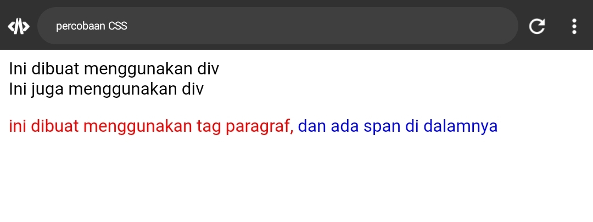
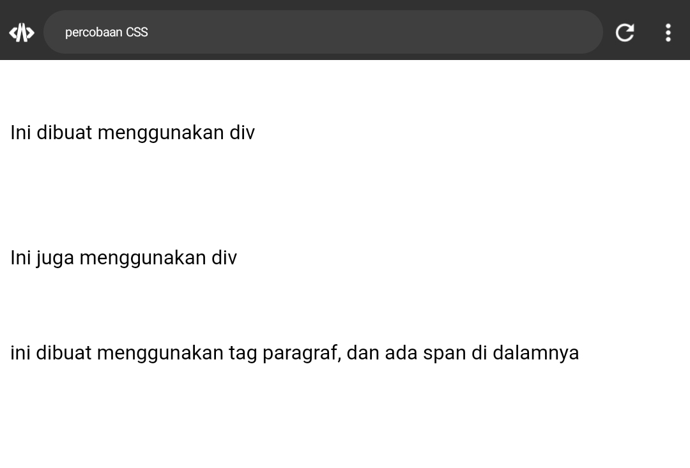
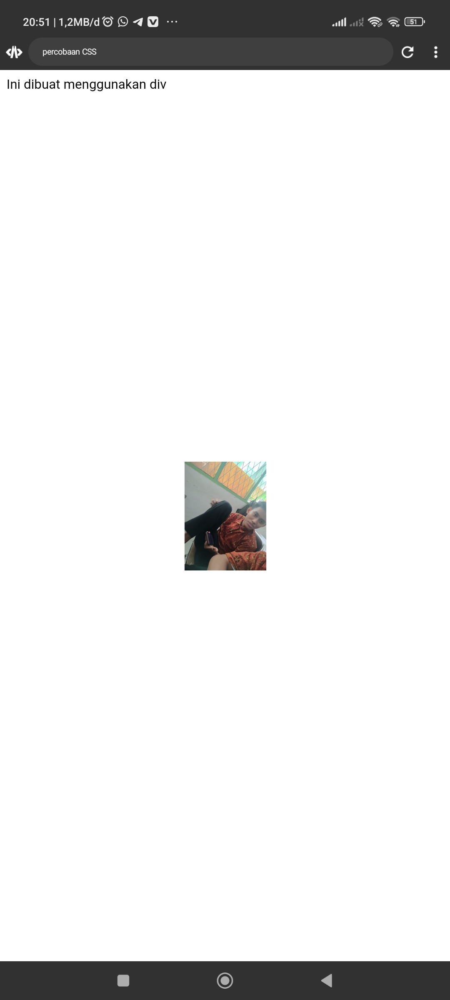
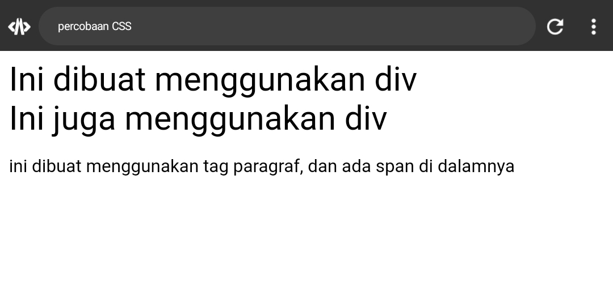
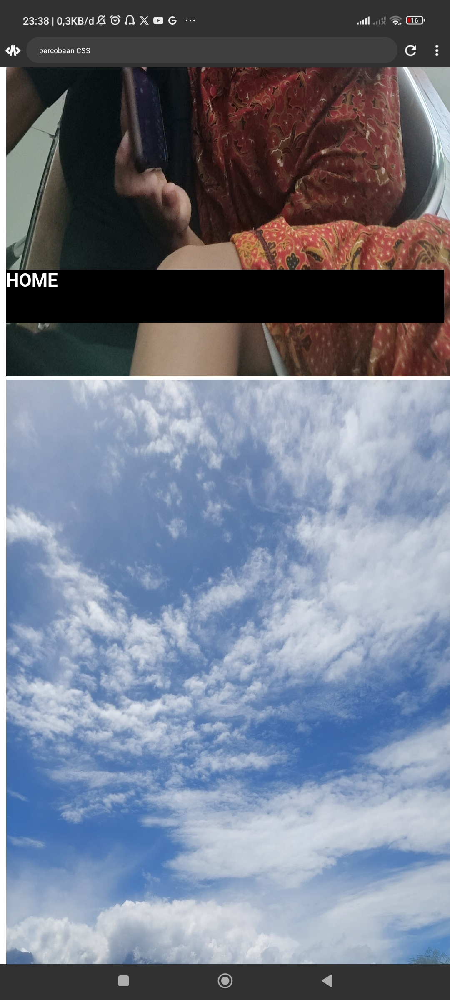

# ANATOMI CSS


>


## SELECTOR


Selector dalam CSS adalah pola atau kriteria yang digunakan untuk memilih elemen HTML tertentu. Contohnya termasuk selector elemen (misalnya, `p`), selector ID (misalnya, `#header`), dan selector kelas (misalnya, `.menu`). Selector memungkinkan penerapan aturan gaya CSS pada elemen-elemen yang sesuai dengan kriteria yang ditentukan.


## PROPERTY


Property dalam CSS adalah karakteristik atau atribut yang dapat diatur pada elemen HTML untuk mengatur tampilan atau perilakunya. Contohnya termasuk `color` untuk warna teks, `font-size` untuk ukuran font, dan `margin-top` untuk jarak atas. Properti diikuti oleh nilai tertentu untuk mengatur elemen sesuai kebutuhan desain.


Property dalam CSS adalah atribut yang digunakan untuk mengatur tampilan elemen HTML, seperti warna, ukuran, dan tata letak.


## PROPERTY VALUE


Dalam CSS, "property value" adalah nilai yang diberikan kepada suatu properti untuk mengatur tampilan atau perilaku elemen HTML. Contohnya termasuk `color: blue`, `font-size: 16px`, dan `margin-top: 10px`, di mana "blue", "16px", dan "10px" adalah nilai properti yang menentukan bagaimana elemen akan ditampilkan atau diatur.


# PERCOBAAN PERTAMA


## PENJELASAN


Kode HTML tersebut merupakan kerangka dasar sebuah halaman web. Terdapat dua elemen `<p>` yang berisi teks "WELCOME CSS!!!" dan dihubungkan dengan file CSS eksternal "style.css" menggunakan tag `<link>` di dalam bagian `<head>`.

Kemudian, dalam file CSS "`style.css`", aturan tersebut `(p { color: aqua; })` menentukan bahwa teks pada semua elemen `<p>` dalam halaman tersebut akan memiliki warna aqua. Jadi, teks "WELCOME CSS!!!" pada kedua elemen `<p>` akan memiliki warna teks aqua.


## KODE


**FILE HTML**

```HTML


<!DOCTYPE html>
<html>
  <head>
    <title>percobaan CSS</title>
    
<link rel="stylesheet" href="style.css">

  </head>
  <body>
    
    
    <p>
      WELCOME CSS!!!
    </p>
    
    <p>
      WELCOME CSS!!!
    </p>
    
    
    
    </body>
    </html>


```


**FILE CSS**

```CSS


p {
    color: aqua;
  }


```


## HASIL


>


## KESIMPULAN


Kode HTML menciptakan halaman web sederhana dengan dua elemen paragraf `<p>` yang berisi teks "WELCOME CSS!!!". Kode CSS yang terhubung dengan halaman tersebut menetapkan warna teks aqua untuk semua elemen `<p>`. Jadi, hasilnya akan menampilkan teks "WELCOME CSS!!!" dengan warna aqua di halaman web.


# PERCOBAAN KEDUA


## FONT SIZE

### KODE


```css

button{
        height: 50px;
        width: 150px;
        font-size: 30px;
      }

```


### Before

>


### After


>


> [!PENJELASAN]
> Kode tersebut adalah aturan CSS yang mengatur gaya (style) dari elemen `<button>` pada halaman web.
height: 50px;: Menetapkan tinggi (height) tombol menjadi 50 piksel.
width: 150px;: Menetapkan lebar (width) tombol menjadi 150 piksel.
font-size: 30px;: Menetapkan ukuran font menjadi 30 piksel untuk teks di dalam tombol.
Jadi, aturan tersebut akan membuat tombol memiliki tinggi 50 piksel, lebar 150 piksel, dan teks di dalamnya memiliki ukuran font 30 piksel.


> [!PENJELASAN]
> Ukuran font, atau font size, mengacu pada besarnya teks pada suatu dokumen atau halaman. Diukur dalam poin, semakin besar nilai poinnya, semakin besar ukuran teksnya. Contohnya, font size 12pt biasanya digunakan untuk teks biasa, sementara font size 18pt mungkin digunakan untuk judul yang lebih besar. Penyesuaian font size dapat memengaruhi keterbacaan dan tata letak dokumen.


## BACKGROUND COLOR

### KODE


```css

button{
        height: 50px;
        width: 150px;
        background-color: red;
      }

```


### Before


>


### After


>


> [!PENJELASAN]
> 
> Kode tersebut adalah aturan CSS yang mengatur gaya (style) dari elemen `<button>` pada halaman web.
height: 50px;: Menetapkan tinggi (height) tombol menjadi 50 piksel.
width: 150px;: Menetapkan lebar (width) tombol menjadi 150 piksel.
background-color: red;: Menetapkan warna latar belakang (background color) tombol menjadi merah.
Jadi, aturan tersebut akan membuat tombol memiliki tinggi 50 piksel, lebar 150 piksel, dan latar belakangnya berwarna merah.


> [!PENJELASAN]
> Warna latar belakang, atau background color, merujuk pada warna yang diterapkan pada latar belakang suatu elemen, seperti halaman web, dokumen, atau elemen desain grafis. Memilih background color yang sesuai dapat mempengaruhi tampilan keseluruhan dan membantu menonjolkan elemen lain di dalamnya. Misalnya, warna latar belakang yang kontras dapat meningkatkan daya baca teks atau menyorot elemen desain tertentu.


## BORDER RADIUS

### KODE


```css

button{
        height: 50px;
        width: 150px;
        border-radius: 10px;
      }


```


### Before


>


### After


>


> [!PENJELASAN]
> 
> Kode tersebut adalah aturan CSS yang mengatur gaya (style) dari elemen `<button>` pada halaman web.
height: 50px;: Menetapkan tinggi (height) tombol menjadi 50 piksel.
width: 150px;: Menetapkan lebar (width) tombol menjadi 150 piksel.
border-radius: 10px;: Menetapkan radius sudut (border radius) tombol menjadi 10 piksel.
Jadi, aturan tersebut akan membuat tombol memiliki tinggi 50 piksel, lebar 150 piksel, dan sudut-sudutnya dibulatkan dengan radius 10 piksel. Ini memberikan efek estetis dengan ujung sudut yang lebih lembut pada tombol.


> [!PENJELASAN]
> Border radius merujuk pada sudut lengkung di ujung elemen, seperti kotak atau persegi panjang. Ini memungkinkan pembentukan sudut yang lebih lembut dengan memberikan efek melengkung pada tepi elemen tersebut. Menggunakan properti border radius pada elemen, seperti di CSS untuk desain web, dapat memberikan tampilan yang lebih estetis dan ramah mata. Nilai border radius dapat diatur dalam piksel atau persentase, memberikan fleksibilitas dalam menentukan sejauh mana lengkung yang diinginkan pada sudut elemen.


---
---


# CARA PEMANGGILAN CSS


## SECARA INTERNAL

### PENJELASAN


Pemanggilan CSS secara internal dalam HTML mengacu pada menempatkan aturan gaya CSS langsung di dalam tag `<style>` di bagian `<head>` dokumen HTML yang sama. Ini memungkinkan spesifikasi gaya untuk aplikasi langsung pada halaman tersebut.


### KODE


```HTML


<!DOCTYPE html>
<html>
  <head>
    <title>percobaan CSS</title>
    
    
    <style>
      
      p{
        color: red;
      }
      
      
      span{
        color: blue;
      }
      
      </style>
    
  </head>
  <body>


<div>
      Ini dibuat menggunakan div
    </div>
    <div>
      Ini juga menggunakan div
    </div>
    
    
    
    <p>
      ini dibuat menggunakan tag paragraf,
      <span>
        dan ada span di dalamnya
      </span>
    </p>
    
    
    </body>
    </html>


```


### HASIL


>


### KESIMPULAN


Jadi, pemanggilan CSS secara internal dalam HTML melibatkan penempatan aturan gaya CSS di dalam tag `<style>` di bagian `<head>` halaman. Ini memungkinkan penentuan gaya secara langsung untuk elemen-elemen di dalam halaman tersebut tanpa memerlukan file eksternal. Meskipun cocok untuk halaman kecil, untuk proyek yang lebih besar atau penanganan yang lebih terpusat, pemanggilan eksternal mungkin lebih disarankan.


## SECARA INLINE

### PENJELASAN


Pemanggilan CSS secara inline dalam HTML melibatkan penggunaan properti gaya langsung pada tag HTML individual menggunakan atribut `style`.


### KODE


```HTML


  <body>


<div>
      Ini dibuat menggunakan div
    </div>
    <div>
      Ini juga menggunakan div
    </div>
    
    
    
    <p style="color: aqua;">
      ini dibuat menggunakan tag paragraf,
      <span style="color: lightblue;">
        dan ada span di dalamnya
      </span>
    </p>
    
    
    </body>


```


### HASIL


>


### KESIMPULAN


Jadi, pemanggilan CSS secara inline dalam HTML melibatkan penggunaan atribut `style` pada tag HTML individual untuk menentukan aturan gaya langsung. Ini memberikan fleksibilitas untuk menentukan gaya khusus untuk elemen-elemen tertentu tanpa perlu menggunakan file eksternal atau menambahkan tag `<style>` di bagian `<head>`. Meskipun efektif untuk aturan gaya yang spesifik, pemanggilan CSS secara inline dapat membuat HTML menjadi kurang terbaca dan lebih sulit dikelola jika digunakan secara berlebihan. Sebagai alternatif, pemanggilan CSS eksternal atau internal mungkin lebih disarankan untuk proyek yang lebih besar atau kompleks.


## SECARA EXTERNAL

### PENJELASAN


Pemanggilan CSS secara eksternal dalam HTML melibatkan penggunaan file terpisah dengan ekstensi `nama_file.css` yang mengandung aturan-aturan gaya CSS. File ini kemudian dihubungkan atau dimasukkan ke dalam halaman HTML menggunakan tag `<link rel="stylesheet">`


Keuntungan pemanggilan CSS secara eksternal termasuk:

1. **Pemisahan Konten**: Gaya terpisah dari struktur HTML, mempermudah pemeliharaan dan pengembangan.
2. **Kemudahan Pembaruan**: Perubahan pada aturan gaya dapat diterapkan secara global dengan memodifikasi satu file CSS.
3. **Caching**: Browser dapat menyimpan file CSS sehingga mempercepat waktu muat halaman untuk pengunjung yang kembali.


### KODE


**FILE HTML**

```HTML


<!DOCTYPE html>
<html>
  <head>
    <title>percobaan CSS</title>
    
<link rel="stylesheet" href="style.css">

  </head>
  <body>


<div>
      Ini dibuat menggunakan div
    </div>
    <div>
      Ini juga menggunakan div
    </div>
    
    
    
    <p>
      ini dibuat menggunakan tag paragraf,
      <span>
        dan ada span di dalamnya
      </span>
    </p>
    
    
    </body>
    </html>
    


```


**FILE CSS**

```CSS


div {
    color: aqua;
  }


```


### HASIL


>


### KESIMPULAN


Jadi, pemanggilan CSS secara eksternal dalam HTML melibatkan penggunaan file terpisah dengan ekstensi `.css`, yang kemudian dihubungkan atau dimasukkan ke dalam halaman HTML menggunakan tag `<link rel="stylesheet">` .  Pendekatan ini memberikan keuntungan dalam pemisahan konten, kemudahan pembaruan, dan pemanfaatan caching oleh browser. Ini sangat disarankan untuk proyek-proyek yang lebih besar dan kompleks karena meningkatkan keterbacaan, pemeliharaan, dan kinerja.


# Selector CSS


## Selector nama elemen

### PENJELASAN


Selector nama elemen dalam CSS digunakan untuk memilih semua elemen HTML dengan nama elemen tertentu. Ini adalah cara paling sederhana untuk menargetkan sekelompok elemen dan memberikan aturan gaya yang sama.


### KODE


**FILE HTML**

```HTML


<!DOCTYPE html>
<html>
  <head>
    <title>percobaan CSS</title>
    
<link rel="stylesheet" href="style.css">

  </head>
  <body>
    
    
    <p>
      WELCOME CSS!!!
    </p>
    
    <p>
      WELCOME CSS!!!
    </p>
    
    
    
    </body>
    </html>


```


**FILE CSS**

```CSS


p {
    color: aqua;
  }


```


### HASIL


>


### KESIMPULAN


Jadi, selector nama elemen dalam CSS digunakan untuk memilih dan memberikan aturan gaya kepada semua elemen HTML dengan jenis tertentu. Ini adalah cara sederhana dan efektif untuk memberikan gaya secara konsisten pada sekelompok elemen yang serupa. 


## Class 

### PENJELASAN


Selector class dalam CSS digunakan untuk memilih dan memberikan aturan gaya kepada elemen-elemen yang memiliki kelas tertentu. Dengan menggunakan selector class, Anda dapat memberikan gaya yang sama untuk beberapa elemen tanpa mempengaruhi elemen-elemen lain yang mungkin memiliki struktur HTML yang sama.


### KODE


**FILE HTML**

```HTML


<!DOCTYPE html>
<html>
  <head>
    <title>percobaan CSS</title>
    
<link rel="stylesheet" href="style.css">

  </head>
  <body>


    
    
    <p class="p1">
      WELCOME CSS!!!
    </p>
    
    <p class="p2">
      WELCOME CSS!!!
    </p>
    
    
    
    </body>
    </html>


```


**FILE CSS**

```CSS


  .p1 {
    color: blue;
  }
  
  
  
  .p2 {
    color: lightblue;
  }


```


### HASIL


>


### KESIMPULAN


Jadi, selector class dalam CSS digunakan untuk memilih dan memberikan aturan gaya kepada elemen-elemen yang memiliki kelas tertentu. Ini memungkinkan konsistensi gaya untuk sekelompok elemen yang mungkin memiliki struktur HTML yang berbeda. Dengan menggunakan kelas, Anda dapat memberikan aturan gaya yang sama untuk beberapa elemen tanpa mempengaruhi elemen-elemen lain. Penggunaan kelas dapat meningkatkan fleksibilitas dan pemeliharaan dalam pengembangan web dengan memungkinkan pengelompokan dan pemberian gaya yang konsisten pada elemen-elemen yang sejenis.


## Id 

### PENJELASAN


Selector ID dalam CSS digunakan untuk memilih dan memberikan aturan gaya kepada elemen yang memiliki ID tertentu. Uniknya, setiap ID hanya dapat diberikan kepada satu elemen dalam halaman HTML, sehingga selector ID sangat spesifik dan cocok untuk kasus-kasus di mana elemen tersebut unik.


Penting untuk diingat bahwa satu elemen hanya dapat memiliki satu ID, dan nama ID harus unik di dalam satu halaman HTML.


### KODE


**FILE HTML**

```HTML


<!DOCTYPE html>
<html>
  <head>
    <title>percobaan CSS</title>
    
<link rel="stylesheet" href="style.css">

  </head>
  <body>

    
    
    <p id="p1">
      WELCOME CSS!!!
    </p>
    
    <p class="p2">
      WELCOME CSS!!!
    </p>
    
    
    
    </body>
    </html>


```


**FILE CSS**

```CSS


  #p1 {
    color: red;
  }
  
  
  
  .p2 {
    color: lightblue;
  }


```


### HASIL


>


### KESIMPULAN


Jadi, selector ID dalam CSS digunakan untuk memilih dan memberikan aturan gaya kepada elemen yang memiliki ID tertentu. ID bersifat unik, sehingga satu elemen hanya dapat memiliki satu ID, dan setiap ID hanya dapat diberikan kepada satu elemen dalam halaman HTML. Penggunaan selector ID cocok untuk memberikan aturan gaya yang sangat spesifik hanya untuk satu elemen, memastikan bahwa aturan gaya tersebut hanya berlaku untuk elemen dengan ID yang sesuai. Meskipun sangat spesifik, sebaiknya penggunaan ID dipertimbangkan dengan bijak untuk menghindari kekakuan dan memastikan pemeliharaan yang mudah dalam pengembangan web.


# TEXT 


## Text-align

### PENJELASAN


 `text-align` dalam CSS adalah properti yang digunakan untuk mengatur penataan horizontal teks di dalam suatu elemen HTML. Nilai yang umum digunakan untuk text-align adalah:

Terbagi Menjadi 4 bagian yaitu :

1. `left`: Membuat teks terletak di sebelah kiri elemen.
2. `right`: Membuat teks terletak di sebelah kanan elemen.
3. `center`: Membuat teks terletak di tengah elemen.
4. `justify`: Membuat teks terletak di sepanjang garis kiri dan kanan elemen, mencoba untuk membuat setiap baris rata di kedua sisi.


### KODE


**FILE HTML**

```HTML


<!DOCTYPE html>
<html>
  <head>
    <title>percobaan CSS</title>
    
<link rel="stylesheet" href="style.css">

  </head>
  <body>


<div>
      Ini dibuat menggunakan div
    </div>
    <div>
      Ini juga menggunakan div
    </div>
    
    
    
    <p>
      ini dibuat menggunakan tag paragraf,
      <span>
        dan ada span di dalamnya
      </span>
    </p>
    
    
    </body>
    </html>


```


**FILE CSS**

```CSS


div {
text-align: center;
  
  }


```


### HASIL


>


### KESIMPULAN


Jadi, `text-align` dalam CSS digunakan untuk mengatur penataan horizontal teks di dalam elemen HTML. Nilai umumnya mencakup left, right, center, dan justify. Misalnya, text-align: center; akan menengahkan teks secara horizontal di dalam elemen yang dipilih.


## Text-decoration

### PENJELASAN


`text-decoration` dalam CSS adalah properti yang digunakan untuk mengatur dekorasi teks, seperti garis bawah, garis atas, garis tengah, atau menghapus dekorasi teks. Beberapa nilai umum untuk `text-decoration` meliputi:

Terbagi Menjadi 5 bagian yaitu :

1. `none`: Menghapus semua dekorasi teks.
2. `underline`: Menambahkan garis bawah pada teks.
3. `overline`: Menambahkan garis atas pada teks.
4. `line-through`: Menambahkan garis tengah pada teks.
5. `inherit`: Mengambil nilai dari elemen induk.


### KODE


**FILE HTML**

```HTML


<!DOCTYPE html>
<html>
  <head>
    <title>percobaan CSS</title>
    
<link rel="stylesheet" href="style.css">

  </head>
  <body>


<div>
      Ini dibuat menggunakan div
    </div>
    <div>
      Ini juga menggunakan div
    </div>
    
    
    
    <p>
      ini dibuat menggunakan tag paragraf,
      <span>
        dan ada span di dalamnya
      </span>
    </p>
    
    
    </body>
    </html>


```


**FILE CSS**

```CSS

div {
text-decoration: line-through;
  
  }


```


### HASIL

>


### KESIMPULAN


Jadi, `text-decoration` dalam CSS digunakan untuk mengatur dekorasi teks seperti garis bawah, garis atas, garis tengah, atau menghapus dekorasi. Nilai umumnya mencakup none, underline, overline, line-through, dan inherit. Misalnya, text-decoration: underline; akan menambahkan garis bawah pada teks di dalam elemen yang dipilih.


## Text-transfrom

### PENJELASAN


`text-transform` dalam CSS adalah properti yang digunakan untuk mengubah tampilan huruf pada teks. Properti ini dapat memodifikasi teks menjadi huruf kapital, huruf kecil, atau membuat huruf awal setiap kata menjadi huruf kapital. Beberapa nilai umum untuk text-transform meliputi:

Terbagi Menjadi 4 bagian yaitu :

1. `uppercase`: Mengubah semua huruf menjadi huruf kapital.
2. `lowercase`: Mengubah semua huruf menjadi huruf kecil.
3. `capitalize`: Membuat huruf awal setiap kata menjadi huruf kapital.
4. `none`: Tidak melakukan transformasi pada huruf.


### KODE


**FILE HTML**

```HTML


<!DOCTYPE html>
<html>
  <head>
    <title>percobaan CSS</title>
    
<link rel="stylesheet" href="style.css">

  </head>
  <body>


<div>
      Ini dibuat menggunakan div
    </div>
    <div>
      Ini juga menggunakan div
    </div>
    
    
    
    <p>
      ini dibuat menggunakan tag paragraf,
      <span>
        dan ada span di dalamnya
      </span>
    </p>
    
    
    </body>
    </html>


```


**FILE CSS**

```CSS

div {
text-transform: uppercase;
  
  }


```


### HASIL


>


### KESIMPULAN


Jadi, `text-transform` dalam CSS digunakan untuk mengubah tampilan huruf pada teks. Nilai umumnya mencakup uppercase untuk huruf kapital, lowercase untuk huruf kecil, capitalize untuk membuat huruf awal setiap kata menjadi huruf kapital, dan none untuk tanpa transformasi huruf. Misalnya, text-transform: uppercase; akan membuat teks di dalam elemen tertentu ditampilkan dalam huruf kapital.


## Text-indent

### PENJELASAN


`text-indent` dalam CSS adalah properti yang digunakan untuk mengatur jarak atau indentasi pada awal paragraf atau blok teks. Nilai yang dapat digunakan dalam `text-indent` biasanya berupa panjang atau persentase, dan bahkan nilai negatif untuk mengatur indentasi mundur.


### KODE


**FILE HTML**

```HTML


<!DOCTYPE html>
<html>
  <head>
    <title>percobaan CSS</title>
    
<link rel="stylesheet" href="style.css">

  </head>
  <body>


<div>
      Ini dibuat menggunakan div
    </div>
    <div>
      Ini juga menggunakan div
    </div>
    
    
    
    <p>
      ini dibuat menggunakan tag paragraf,
      <span>
        dan ada span di dalamnya
      </span>
    </p>
    
    
    </body>
    </html>


```


**FILE CSS**

```CSS


div {
text-indent: 100px;
  
  }


```


### HASIL


>


### KESIMPULAN


Jadi, `text-indent` digunakan untuk mengontrol jarak atau indentasi pada awal paragraf atau blok teks di dalam elemen HTML.


## Letter-spacing

### PENJELASAN


`letter-spacing` dalam CSS adalah properti yang digunakan untuk mengatur jarak antara huruf dalam teks. Nilai yang diberikan dapat berupa bilangan positif untuk meningkatkan jarak antara huruf, atau bilangan negatif untuk mengurangi jarak antara huruf.


### KODE


**FILE HTML**

```HTML


<!DOCTYPE html>
<html>
  <head>
    <title>percobaan CSS</title>
    
<link rel="stylesheet" href="style.css">

  </head>
  <body>


<div>
      Ini dibuat menggunakan div
    </div>
    <div>
      Ini juga menggunakan div
    </div>
    
    
    
    <p>
      ini dibuat menggunakan tag paragraf,
      <span>
        dan ada span di dalamnya
      </span>
    </p>
    
    
    </body>
    </html>


```


**FILE CSS**

```CSS

div {
letter-spacing: 8px;
  
  }


```


### HASIL


>


### KESIMPULAN


Jadi, `letter-spacing` digunakan untuk mengatur jarak antara huruf dalam teks di dalam elemen HTML.


## Line-height

### PENJELASAN


`line-height` dalam CSS adalah properti yang digunakan untuk mengatur tinggi garis atau ruang di antara baris teks di dalam suatu elemen HTML. Nilai yang dapat digunakan dalam `line-height` termasuk bilangan, persentase, dan nilai normal.


### KODE


**FILE HTML**

```HTML


<!DOCTYPE html>
<html>
  <head>
    <title>percobaan CSS</title>
    
<link rel="stylesheet" href="style.css">

  </head>
  <body>


<div>
      Ini dibuat menggunakan div
    </div>
    <div>
      Ini juga menggunakan div
    </div>
    
    
    
    <p>
      ini dibuat menggunakan tag paragraf,
      <span>
        dan ada span di dalamnya
      </span>
    </p>
    
    
    </body>
    </html>


```


**FILE CSS**

```CSS


div {
line-height: 100px;
  
  }


```


### HASIL


>


### KESIMPULAN


Jadi, `line-height` digunakan untuk mengontrol ruang di antara baris teks di dalam elemen HTML, dan nilai yang digunakan dapat memengaruhi keterbacaan dan tata letak halaman.


## Word-spacing

### PENJELASAN


`word-spacing` dalam CSS adalah properti yang digunakan untuk mengatur jarak antara kata-kata dalam teks. Nilai yang dapat digunakan dalam `word-spacing` biasanya berupa panjang atau persentase.


### KODE


**FILE HTML**

```HTML


<!DOCTYPE html>
<html>
  <head>
    <title>percobaan CSS</title>
    
<link rel="stylesheet" href="style.css">

  </head>
  <body>


<div>
      Ini dibuat menggunakan div
    </div>
    <div>
      Ini juga menggunakan div
    </div>
    
    
    
    <p>
      ini dibuat menggunakan tag paragraf,
      <span>
        dan ada span di dalamnya
      </span>
    </p>
    
    
    </body>
    </html>


```


**FILE CSS**

```CSS


div {
word-spacing: 50px;
  
  }


```


### HASIL


>


### KESIMPULAN


Jadi, `word-spacing` digunakan untuk mengatur jarak antara kata-kata dalam teks di dalam elemen HTML. Penggunaan yang bijak dapat memengaruhi tata letak dan estetika teks.


# BACKGROUND


## Background-image

### PENJELASAN


`background-image` dalam CSS adalah properti yang digunakan untuk menetapkan gambar sebagai latar belakang elemen HTML. Gambar ini dapat berupa file JPEG, PNG, GIF, atau format gambar lainnya. Properti ini diaplikasikan pada elemen HTML, dan gambar yang ditetapkan sebagai latar belakang akan ditampilkan di belakang isi elemen tersebut.


### KODE


**FILE HTML**

```HTML


<!DOCTYPE html>
<html>
  <head>
    <title>percobaan CSS</title>
    
<link rel="stylesheet" href="style.css">

  </head>
  <body>


<div>
      Ini dibuat menggunakan div
    </div>
    <div>
      Ini juga menggunakan div
    </div>
    
    
    
    <p>
      ini dibuat menggunakan tag paragraf,
      <span>
        dan ada span di dalamnya
      </span>
    </p>
    
    
    </body>
    </html>


```


**FILE CSS**

```CSS


div {
    
  background-image: url('Asep.jpg');
  height: 100vh;
  }


```


### HASIL


>


### KESIMPULAN


Jadi, `background-image` digunakan untuk menetapkan gambar sebagai latar belakang elemen HTML dan bisa dikombinasikan dengan properti lain untuk pengaturan lebih lanjut.


## Background-size

### PENJELASAN


`background-size` dalam CSS adalah properti yang digunakan untuk mengontrol ukuran gambar latar belakang yang ditetapkan menggunakan `background-image`. Properti ini memungkinkan Anda menyesuaikan bagaimana gambar latar belakang akan ditampilkan dalam hal ukuran.

Nilai umum untuk `background-size` terbagi menjadi 3 bagian yaitu :

1. `%,px,vh`: Ukuran gambar latar belakang diatur sesuai dengan keinginan anda.
2. `cover`: Gambar diperbesar atau diperkecil agar selalu mencakup seluruh elemen, dengan memotong jika diperlukan.
3. `contain`: Gambar diperbesar atau diperkecil agar selalu terlihat sepenuhnya di dalam elemen, tanpa memotong.


### KODE


**FILE HTML**

```HTML


<!DOCTYPE html>
<html>
  <head>
    <title>percobaan CSS</title>
    
<link rel="stylesheet" href="style.css">

  </head>
  <body>


<div>
      Ini dibuat menggunakan div
    </div>
    <div>
      Ini juga menggunakan div
    </div>
    
    
    
    <p>
      ini dibuat menggunakan tag paragraf,
      <span>
        dan ada span di dalamnya
      </span>
    </p>
    
    
    </body>
    </html>


```


**FILE CSS**

```CSS


div {
    
  background-image: url('Asep.jpg');
  height: 100vh;
background-size: cover;
  }


```


### HASIL


>


### KESIMPULAN


Jadi, `background-size` memungkinkan pengontrolan ukuran gambar latar belakang di dalam elemen HTML.


## Background-repeat

### PENJELASAN


`background-repeat` dalam CSS adalah properti yang digunakan untuk mengontrol apakah dan bagaimana gambar latar belakang diulang di dalam elemen HTML. Properti ini memungkinkan penyesuaian pengulangan gambar, baik secara horizontal (sumbu x) maupun vertikal (sumbu y).

Nilai umum untuk `background-repeat` terbagi menjadi 4 bagian yaitu :

1. `repeat`: Gambar akan diulang baik secara horizontal maupun vertikal.
2. `repeat-x`: Gambar akan diulang hanya secara horizontal.
3. `repeat-y`: Gambar akan diulang hanya secara vertikal.
4. `no-repeat`: Gambar tidak diulang dan ditampilkan hanya sekali.


### KODE


**FILE HTML**

```HTML


<!DOCTYPE html>
<html>
  <head>
    <title>percobaan CSS</title>
    
<link rel="stylesheet" href="style.css">

  </head>
  <body>


<div>
      Ini dibuat menggunakan div
    </div>
    <div>
      Ini juga menggunakan div
    </div>
    
    
    
    <p>
      ini dibuat menggunakan tag paragraf,
      <span>
        dan ada span di dalamnya
      </span>
    </p>
    
    
    </body>
    </html>


```


**FILE CSS**

```CSS


div {
    
  background-image: url('Asep.jpg');
  height: 100vh;
background-size: 100px;
background-repeat: repeat;
}


```


### HASIL


>


### KESIMPULAN


Jadi, `background-repeat` memungkinkan kontrol terhadap pengulangan gambar latar belakang di dalam elemen HTML.


## Background-attachment

### PENJELASAN


`background-attachment` dalam CSS adalah properti yang digunakan untuk mengontrol apakah gambar latar belakang akan tetap diam atau mengikuti guliran (scrolling) halaman. Properti ini mempengaruhi bagaimana gambar latar belakang akan ditampilkan ketika halaman di-scroll.

Nilai umum untuk `background-attachment` terbagi menjadi 2 bagian yaitu :

1. `scroll`: Gambar latar belakang akan mengikuti guliran halaman.
2. `fixed`: Gambar latar belakang akan tetap diam dan tidak bergerak saat halaman di-scroll.


### KODE


**FILE HTML**

```HTML


<!DOCTYPE html>
<html>
  <head>
    <title>percobaan CSS</title>
    
<link rel="stylesheet" href="style.css">

  </head>
  <body>


<div>
      Ini dibuat menggunakan div
    </div>
    <div>
      Ini juga menggunakan div
    </div>
    
    
    
    <p>
      ini dibuat menggunakan tag paragraf,
      <span>
        dan ada span di dalamnya
      </span>
    </p>
    
    
    </body>
    </html>


```


**FILE CSS**

```CSS


div {
    
  background-image: url('Asep.jpg');
  height: 100vh;
background-size: 100px;
background-repeat: no-repeat;
background-attachment: fixed;
}
  


```


### HASIL


>


### KESIMPULAN


Jadi, `background-attachment` memungkinkan kontrol terhadap perilaku gambar latar belakang terhadap guliran halaman.


## Background-position

### PENJELASAN


`background-position` dalam CSS adalah properti yang digunakan untuk menentukan posisi awal dari gambar latar belakang di dalam elemen HTML. Properti ini memungkinkan Anda menentukan posisi horizontal dan vertikal dari gambar latar belakang.

Nilai yang dapat digunakan dalam `background-position` terbagi menjadi 3 bagian yaitu :

1. Nilai persentase: Menentukan posisi relatif gambar latar belakang terhadap elemen, baik secara horizontal maupun vertikal.
2. Nilai panjang: Menentukan posisi gambar latar belakang dengan menggunakan satuan panjang seperti piksel.
3. Nilai kata kunci: Seperti `top`, `bottom`, `left`, `right`, dan `center` untuk menentukan posisi secara spesifik.


### KODE


**FILE HTML**

```HTML


<!DOCTYPE html>
<html>
  <head>
    <title>percobaan CSS</title>
    
<link rel="stylesheet" href="style.css">

  </head>
  <body>


<div>
      Ini dibuat menggunakan div
    </div>
    <div>
      Ini juga menggunakan div
    </div>
    
    
    
    <p>
      ini dibuat menggunakan tag paragraf,
      <span>
        dan ada span di dalamnya
      </span>
    </p>
    
    
    </body>
    </html>


```


**FILE CSS**

```CSS


div {
    
  background-image: url('Asep.jpg');
  height: 100vh;
background-size: 100px;
background-repeat: no-repeat;
background-attachment: fixed;
background-position: center;
}


```


### HASIL


>


### KESIMPULAN


Jadi, `background-position` memungkinkan Anda menentukan posisi awal gambar latar belakang di dalam elemen HTML.


# FONT


## Font-size

### PENJELASAN


`font-size` dalam CSS adalah properti yang digunakan untuk menentukan ukuran teks di dalam elemen HTML. Properti ini mengontrol tinggi huruf dalam ukuran yang relatif terhadap dimensi elemen atau ukuran font yang ditentukan.

Nilai yang dapat digunakan dalam `font-size` terbagi menjadi 2 bagian yaitu :

Nilai absolut: Seperti piksel (`px`), poin (`pt`), sentimeter (`cm`), dan inci (`in`).
Nilai relatif: Seperti persentase (`%`) dari ukuran font induk atau em (`em`), yang sama dengan ukuran font dari elemen induk.


### KODE


**FILE HTML**

```HTML


<!DOCTYPE html>
<html>
  <head>
    <title>percobaan CSS</title>
    
<link rel="stylesheet" href="style.css">

  </head>
  <body>


<div>
      Ini dibuat menggunakan div
    </div>
    <div>
      Ini juga menggunakan div
    </div>
    
    
    
    <p>
      ini dibuat menggunakan tag paragraf,
      <span>
        dan ada span di dalamnya
      </span>
    </p>
    
    
    </body>
    </html>


```


**FILE CSS**

```CSS


div {

  font-size: 30px;
} 


```


### HASIL


>


### KESIMPULAN


Jadi, `font-size` digunakan untuk menentukan ukuran teks di dalam elemen HTML, yang dapat ditentukan dalam nilai absolut atau relatif.


## Font-style

### PENJELASAN


`font-style` dalam CSS adalah properti yang digunakan untuk mengatur gaya huruf dari teks di dalam elemen HTML. Properti ini memungkinkan Anda memberikan efek miring (italic) atau normal pada teks.

Nilai yang dapat digunakan dalam `font-style` terbagi menjadi 3 bagian yaitu :

1. `normal`: Menetapkan gaya huruf normal (tidak miring).
2. `italic`: Menetapkan gaya huruf miring (italic).
3. `oblique`: Menetapkan gaya huruf miring (serupa dengan `italic`, tetapi tidak selalu mengubah bentuk huruf).


### KODE


**FILE HTML**

```HTML


<!DOCTYPE html>
<html>
  <head>
    <title>percobaan CSS</title>
    
<link rel="stylesheet" href="style.css">

  </head>
  <body>


<div>
      Ini dibuat menggunakan div
    </div>
    <div>
      Ini juga menggunakan div
    </div>
    
    
    
    <p>
      ini dibuat menggunakan tag paragraf,
      <span>
        dan ada span di dalamnya
      </span>
    </p>
    
    
    </body>
    </html>


```


**FILE CSS**

```CSS


div {

  font-style: italic;
}


```


### HASIL


>


### KESIMPULAN


Jadi, `font-style` digunakan untuk mengatur apakah teks di dalam elemen HTML akan ditampilkan dalam gaya huruf miring atau normal.


## Font-weight

### PENJELASAN


`font-weight` dalam CSS adalah properti yang digunakan untuk mengatur ketebalan atau berat huruf pada teks di dalam elemen HTML. Properti ini memungkinkan Anda memberikan efek tebal atau ringan pada teks.

Nilai yang dapat digunakan dalam `font-weight` terbagi menjadi 2 bagian yaitu :

1. Nilai numerik: Angka dari 100 hingga 900, dengan kenaikan berarti peningkatan ketebalan huruf.
2. Nilai kata kunci: Seperti `normal` (nilai default), `bold`, dan `lighter`.


### KODE


**FILE HTML**

```HTML


<!DOCTYPE html>
<html>
  <head>
    <title>percobaan CSS</title>
    
<link rel="stylesheet" href="style.css">

  </head>
  <body>


<div>
      Ini dibuat menggunakan div
    </div>
    <div>
      Ini juga menggunakan div
    </div>
    
    
    
    <p>
      ini dibuat menggunakan tag paragraf,
      <span>
        dan ada span di dalamnya
      </span>
    </p>
    
    
    </body>
    </html>


```


**FILE CSS**

```CSS


div {

  font-weight: bold;
}


```


### HASIL


>


### KESIMPULAN


Jadi, `font-weight` digunakan untuk mengatur berat atau ketebalan huruf pada teks di dalam elemen HTML. Nilai numerik atau kata kunci dapat digunakan untuk menentukan tingkat ketebalan huruf.


## Font-family

### PENJELASAN


`font-family` dalam CSS adalah properti yang digunakan untuk menentukan jenis font yang akan digunakan untuk menampilkan teks di dalam elemen HTML. Properti ini memungkinkan Anda menentukan beberapa jenis font dalam urutan prioritas, sehingga browser akan mencari dan menggunakan jenis font pertama yang tersedia pada sistem pengguna.

Nilai yang dapat digunakan dalam `font-family` terbagi menjadi 2 bagian yaitu :

1. Nama font: Nama font yang ingin digunakan, seperti "Arial", "Times New Roman", atau nama font kustom.
2. Nama generic font: Nama font generik yang menjadi alternatif jika font yang ditentukan tidak tersedia. Contoh: `serif`, `sans-serif`, `monospace`, `cursive`.


### KODE


**FILE HTML**

```HTML


<!DOCTYPE html>
<html>
  <head>
    <title>percobaan CSS</title>
    
<link rel="stylesheet" href="style.css">

  </head>
  <body>


<div>
      Ini dibuat menggunakan div
    </div>
    <div>
      Ini juga menggunakan div
    </div>
    
    
    
    <p>
      ini dibuat menggunakan tag paragraf,
      <span>
        dan ada span di dalamnya
      </span>
    </p>
    
    
    </body>
    </html>


```


**FILE CSS**

```CSS


div {

  font-family: Monospace;
}


```


### HASIL


>


### KESIMPULAN


Jadi, `font-family` digunakan untuk menentukan jenis font yang akan digunakan untuk menampilkan teks di dalam elemen HTML, dengan memberikan beberapa jenis font dalam urutan prioritas.


# BOX MODEL


## HEIGHT & WIDTH


### PENJELASAN


-  **Height (Tinggi)**: Ini mengacu pada dimensi vertikal suatu objek atau ruang. Dalam konteks fisik, tinggi adalah jarak dari bagian bawah suatu objek ke bagian atasnya. Dalam konteks digital, tinggi sering kali merujuk pada jumlah piksel vertikal dalam gambar, layar, atau elemen visual lainnya.
    
-  **Width (Lebar)**: Ini mengacu pada dimensi horizontal suatu objek atau ruang. Dalam konteks fisik, lebar adalah jarak dari sisi kiri suatu objek ke sisi kanannya. Dalam konteks digital, lebar sering kali merujuk pada jumlah piksel horizontal dalam gambar, layar, atau elemen visual lainnya.


### KODE


**FILE HTML**

```HTML


<!DOCTYPE html>
<html>
  <head>
    <title>percobaan CSS</title>
    
<link rel="stylesheet" href="style.css">

  </head>
  <body>


    
    <button>
      klik disini
    </button>
    
    
    
    </body>
    </html>


```


**FILE CSS**

```CSS


button {

  height: 60px;
  width: 200px;
  
}


```


### HASIL


>


### KESIMPULAN


`Height` dan `width` adalah dua dimensi yang digunakan untuk mengukur objek, baik secara fisik maupun digital. Tinggi mengacu pada dimensi vertikal, sedangkan lebar mengacu pada dimensi horizontal suatu objek atau ruang. Keduanya penting untuk mendefinisikan ukuran dan proporsi suatu entitas.


## Border

### border-width

#### PENJELASAN


`border-width` adalah properti CSS yang digunakan untuk menentukan lebar border (batas) dari sebuah elemen HTML. Properti ini dapat diterapkan pada elemen-elemen seperti `<div>`, `<p>`, atau elemen lainnya yang memiliki border.

Nilai dari `border-width` dapat berupa bilangan bulat atau pecahan, serta dapat ditentukan dalam satuan ukuran seperti piksel (px), sentimeter (cm), atau persen (%). Beberapa contoh nilai yang dapat diberikan adalah `1px`, `2px`, `0.5em`, atau `3%`.

Jika elemen tersebut memiliki border, tetapi `border-width` tidak ditentukan, maka nilai defaultnya adalah `medium`, tetapi biasanya browser memiliki nilai default yang berbeda-beda.


#### KODE


**FILE HTML**

```HTML

<!DOCTYPE html>
<html>
  <head>
    <title>percobaan CSS</title>
    
<link rel="stylesheet" href="style.css">

  </head>
  <body>


    
    <button>
      klik disini
    </button>
    
    
    
    </body>
    </html>


```


**FILE CSS**

```CSS

button {
    
  border-width: 8px;

}


```


#### HASIL


>


#### KESIMPULAN


`border-width` adalah properti CSS yang digunakan untuk menentukan lebar border dari sebuah elemen HTML. Nilainya dapat berupa bilangan bulat, pecahan, dan dapat diukur dalam satuan seperti piksel atau persen. Properti ini memungkinkan pengaturan visual batas elemen pada halaman web.


### border-color

#### PENJELASAN


`border-color` adalah properti CSS yang digunakan untuk menentukan warna dari border (batas) suatu elemen HTML. Properti ini memungkinkan penentuan warna yang berbeda untuk setiap sisi dari border, yaitu atas, kanan, bawah, dan kiri.

Nilai dari `border-color` bisa berupa nama warna seperti "`red`", kode warna hexadecimal seperti "`#ff0000`", atau menggunakan nilai `RGB` atau `RGBA`. Selain itu, kita dapat menentukan warna untuk setiap sisi border menggunakan notasi empat nilai atau tiga nilai (untuk tiga sisi).


#### KODE


**FILE HTML**

```HTML


<!DOCTYPE html>
<html>
  <head>
    <title>percobaan CSS</title>
    
<link rel="stylesheet" href="style.css">

  </head>
  <body>


    
    <button>
      klik disini
    </button>
    
    
    
    </body>
    </html>


```


**FILE CSS**

```CSS

button {
    
  border-width: 8px;
  border-color: lightblue;  

}


```


#### HASIL


>


#### KESIMPULAN


`border-color` memungkinkan penentuan warna border sesuai kebutuhan desain pada elemen HTML.


### border-style

#### PENJELASAN


`border-style` adalah properti CSS yang digunakan untuk menentukan jenis atau gaya dari border (batas) suatu elemen HTML. Properti ini memungkinkan pengaturan visual untuk bagaimana border ditampilkan, misalnya sebagai garis lurus, putus-putus, bergelombang, dan sebagainya.

Beberapa nilai umum yang dapat digunakan untuk `border-style` antara lain:

- `solid`: Menampilkan border sebagai garis solid.
- `dashed`: Menampilkan border sebagai garis putus-putus.
- `dotted`: Menampilkan border sebagai titik-titik.
- `double`: Menampilkan dua garis solid yang berdekatan.
- `groove`: Memberikan efek cekung pada border.
- `ridge`: Memberikan efek timbul pada border.
- `inset`: Menampilkan efek cekung yang terlihat seperti masuk ke dalam halaman.
- `outset`: Menampilkan efek timbul yang terlihat seperti keluar dari halaman.


#### KODE


**FILE HTML**

```HTML


<!DOCTYPE html>
<html>
  <head>
    <title>percobaan CSS</title>
    
<link rel="stylesheet" href="style.css">

  </head>
  <body>


    
    <button>
      klik disini
    </button>
    
    
    
    </body>
    </html>


```


**FILE CSS**

```CSS


button {
    
  border-style: dotted;

}


```


#### HASIL


>


#### KESIMPULAN


`border-style` memungkinkan kita untuk menentukan tampilan visual dari border elemen HTML, memberikan fleksibilitas dalam desain halaman web.


### border-radius

#### PENJELASAN


`border-radius` adalah properti CSS yang digunakan untuk memberikan sudut melengkung pada `border` (batas) suatu elemen HTML. Properti ini dapat membuat elemen memiliki sudut yang bulat atau elips, menggantikan sudut tajam yang biasanya dimiliki oleh border.

Nilai dari `border-radius` dapat berupa satu nilai untuk mengatur semua empat sudut sekaligus, atau dua nilai untuk mengatur sudut horizontal dan sudut vertikal secara terpisah. Selain itu, kita juga dapat menggunakan empat nilai untuk mengatur sudut masing-masing sisi secara terpisah.


#### KODE


**FILE HTML**

```HTML


<!DOCTYPE html>
<html>
  <head>
    <title>percobaan CSS</title>
    
<link rel="stylesheet" href="style.css">

  </head>
  <body>


    
    <button>
      klik disini
    </button>
    
    
    
    </body>
    </html>


```


**FILE CSS**

```CSS


button {
    
  border-radius: 20px 5px 20px 5px;

}


```


#### HASIL


>


#### KESIMPULAN


`border-radius` memberikan kemampuan untuk menghasilkan sudut melengkung pada border elemen HTML, menambahkan elemen desain yang lebih estetis.


## Margin


### margin-left

#### PENJELASAN


`margin-left` adalah properti CSS yang digunakan untuk menentukan jarak atau ruang kosong antara batas kiri suatu elemen HTML dan elemen lain di sekitarnya. Properti ini memungkinkan pengaturan margin (luas tambahan di sekitar elemen) pada sisi kiri elemen.

Nilai dari `margin-left` dapat berupa bilangan bulat, pecahan, atau dalam satuan ukuran seperti piksel (`px`), sentimeter (`cm`), atau persen (`%`). Nilai positif akan menambahkan margin di sebelah kiri elemen, sedangkan nilai negatif akan membuat elemen tersebut menumpuk pada elemen di sebelah kirinya.


#### KODE


**FILE HTML**

```HTML


<!DOCTYPE html>
<html>
  <head>
    <title>percobaan CSS</title>
    
<link rel="stylesheet" href="style.css">

  </head>
  <body>


    
    <button>
      klik disini
    </button>
    
    
    
    </body>
    </html>


```


**FILE CSS**

```CSS


button {
    
  margin-left: 100px;
  
}


```


#### HASIL


>


#### KESIMPULAN


`margin-left` adalah properti CSS yang digunakan untuk menentukan jarak antara batas kiri suatu elemen HTML dengan elemen lain di sekitarnya. Nilainya dapat berupa bilangan bulat, pecahan, atau dalam satuan ukuran seperti piksel, sentimeter, atau persen. Properti ini memungkinkan pengaturan margin pada sisi kiri elemen, memengaruhi tata letak horizontal dan penempatan elemen dalam halaman web.


Dengan menggunakan properti ini, kita dapat mengontrol posisi horizontal suatu elemen dalam halaman web dan memberikan tata letak yang diinginkan.


### margin-right

#### PENJELASAN


`margin-right` adalah properti CSS yang digunakan untuk menentukan jarak atau ruang kosong antara batas kanan suatu elemen HTML dengan elemen lain di sekitarnya. Properti ini memungkinkan pengaturan margin (luas tambahan di sekitar elemen) pada sisi kanan elemen.

Nilai dari `margin-right` dapat berupa bilangan bulat, pecahan, atau dalam satuan ukuran seperti piksel (px), sentimeter (cm), atau persen (%). Nilai positif akan menambahkan margin di sebelah kanan elemen, sedangkan nilai negatif akan membuat elemen tersebut menumpuk pada elemen di sebelah kanannya.


#### KODE


FILE HTML

```HTML


<!DOCTYPE html>
<html>
  <head>
    <title>percobaan CSS</title>
    
<link rel="stylesheet" href="style.css">

  </head>
  <body>


    
    <button>
      klik disini
    </button>
    <button>
      klik disini
    </button>
    
    
    
    </body>
    </html>


```


**FILE CSS**

```CSS


button {
    
margin-right: 100px;

}


```


#### HASIL


**BEFORE**

>


**AFTER**

>


#### KESIMPULAN


Dengan menggunakan properti ini, kita dapat mengontrol posisi horizontal suatu elemen dalam halaman web dan memberikan tata letak yang diinginkan.


### margin-top

#### PENJELASAN


`margin-top` adalah properti CSS yang digunakan untuk menentukan jarak atau ruang kosong antara batas atas suatu elemen HTML dengan elemen lain di atasnya. Properti ini memungkinkan pengaturan margin (luas tambahan di sekitar elemen) pada sisi atas elemen.

Nilai dari `margin-top` dapat berupa bilangan bulat, pecahan, atau dalam satuan ukuran seperti piksel (px), sentimeter (cm), atau persen (%). Nilai positif akan menambahkan margin di atas elemen, sedangkan nilai negatif akan membuat elemen tersebut menumpuk pada elemen di atasnya.


#### KODE


**FILE HTML**

```HTML


<!DOCTYPE html>
<html>
  <head>
    <title>percobaan CSS</title>
    
<link rel="stylesheet" href="style.css">

  </head>
  <body>


    
    <button>
      klik disini
    </button>
    
    
    
    </body>
    </html>


```


**FILE CSS**

```CSS


button {
    
margin-top: 100px;

}


```


#### HASIL


>


#### KESIMPULAN


Dengan menggunakan properti ini, kita dapat mengontrol posisi vertikal suatu elemen dalam halaman web dan memberikan tata letak yang diinginkan.


### margin-bottom

#### PENJELASAN


`margin-bottom` adalah properti CSS yang digunakan untuk menentukan jarak atau ruang kosong antara batas bawah suatu elemen HTML dengan elemen lain di bawahnya. Properti ini memungkinkan pengaturan margin (luas tambahan di sekitar elemen) pada sisi bawah elemen.

Nilai dari `margin-bottom` dapat berupa bilangan bulat, pecahan, atau dalam satuan ukuran seperti piksel (px), sentimeter (cm), atau persen (%). Nilai positif akan menambahkan margin di bawah elemen, sedangkan nilai negatif akan membuat elemen tersebut menumpuk pada elemen di bawahnya.


#### KODE


**FILE HTML**

```HTML


<!DOCTYPE html>
<html>
  <head>
    <title>percobaan CSS</title>
    
<link rel="stylesheet" href="style.css">

  </head>
  <body>


    
    <button>
      klik disini
    </button>
    <br>
    <button>
      klik disini
    </button>
    
    
    
    </body>
    </html>


```


**FILE CSS**

```CSS


button {
    
margin-bottom: 100px;

}


```


#### HASIL


**BEFORE**

>


**AFTER**

>


#### KESIMPULAN


Dengan menggunakan properti ini, kita dapat mengontrol posisi vertikal suatu elemen dalam halaman web dan memberikan tata letak yang diinginkan.


## Padding


### padding-left

#### PENJELASAN


`padding-left` adalah properti CSS yang digunakan untuk menentukan ruang kosong di sebelah kiri konten suatu elemen HTML di dalam batas atau border elemen tersebut. Properti ini memungkinkan pengaturan padding (ruang tambahan di dalam elemen) pada sisi kiri elemen.

Nilai dari `padding-left` dapat berupa bilangan bulat, pecahan, atau dalam satuan ukuran seperti piksel (px), sentimeter (cm), atau persen (%). Nilai ini menentukan seberapa besar ruang kosong yang akan diberikan di sebelah kiri konten elemen.


#### KODE


**FILE HTML**

```HTML


<!DOCTYPE html>
<html>
  <head>
    <title>percobaan CSS</title>
    
<link rel="stylesheet" href="style.css">

  </head>
  <body>


    
    <button>
      klik disini
    </button>
    
    
    
    </body>
    </html>


```


**FILE CSS**

```CSS

button {
  
    height: 170px;
    width: 400px;
    padding-left: 100px;

}


```


#### HASIL


>


#### KESIMPULAN


Dengan menggunakan properti ini, kita dapat mengatur seberapa besar jarak antara konten dan batas kiri elemen, mempengaruhi tata letak dan penampilan elemen pada halaman web.


### padding-right


#### PENJELASAN


`padding-right` adalah properti CSS yang digunakan untuk menentukan ruang kosong di sebelah kanan konten suatu elemen HTML di dalam batas atau border elemen tersebut. Properti ini memungkinkan pengaturan padding (ruang tambahan di dalam elemen) pada sisi kanan elemen.

Nilai dari `padding-right` dapat berupa bilangan bulat, pecahan, atau dalam satuan ukuran seperti piksel (px), sentimeter (cm), atau persen (%). Nilai ini menentukan seberapa besar ruang kosong yang akan diberikan di sebelah kanan konten elemen.


#### KODE


**FILE HTML**

```HTML


<!DOCTYPE html>
<html>
  <head>
    <title>percobaan CSS</title>
    
<link rel="stylesheet" href="style.css">

  </head>
  <body>


    
    <button>
      klik disini
    </button>
    
    
    
    </body>
    </html>


```


**FILE CSS**

```CSS


button {
  
    height: 170px;
    width: 400px;
    padding-right: 150px;

}


```


#### HASIL


>


#### KESIMPULAN


Dengan menggunakan properti ini, kita dapat mengatur seberapa besar jarak antara konten dan batas kanan elemen, mempengaruhi tata letak dan penampilan elemen pada halaman web.


### padding-top

#### PENJELASAN


`padding-top` adalah properti CSS yang digunakan untuk menentukan ruang kosong di atas konten suatu elemen HTML di dalam batas atau border elemen tersebut. Properti ini memungkinkan pengaturan padding (ruang tambahan di dalam elemen) pada sisi atas elemen.

Nilai dari `padding-top` dapat berupa bilangan bulat, pecahan, atau dalam satuan ukuran seperti piksel (px), sentimeter (cm), atau persen (%). Nilai ini menentukan seberapa besar ruang kosong yang akan diberikan di atas konten elemen.


#### KODE


**FILE HTML**

```HTML


<!DOCTYPE html>
<html>
  <head>
    <title>percobaan CSS</title>
    
<link rel="stylesheet" href="style.css">

  </head>
  <body>


    
    <button>
      klik disini
    </button>
    
    
    
    </body>
    </html>


```


**FILE CSS**

```CSS


button {
  
    height: 170px;
    width: 400px;
    padding-top: 100px;

}


```


#### HASIL


>


#### KESIMPULAN


Dengan menggunakan properti ini, kita dapat mengatur seberapa besar jarak antara konten dan batas atas elemen, mempengaruhi tata letak dan penampilan elemen pada halaman web.


### padding-bottom

#### PENJELASAN


`padding-bottom` adalah properti CSS yang digunakan untuk menentukan ruang kosong di bawah konten suatu elemen HTML di dalam batas atau border elemen tersebut. Properti ini memungkinkan pengaturan padding (ruang tambahan di dalam elemen) pada sisi bawah elemen.

Nilai dari `padding-bottom` dapat berupa bilangan bulat, pecahan, atau dalam satuan ukuran seperti piksel (px), sentimeter (cm), atau persen (%). Nilai ini menentukan seberapa besar ruang kosong yang akan diberikan di bawah konten elemen.


#### KODE


**FILE HTML**

```HTML


<!DOCTYPE html>
<html>
  <head>
    <title>percobaan CSS</title>
    
<link rel="stylesheet" href="style.css">

  </head>
  <body>


    
    <button>
      klik disini
    </button>
    
    
    
    </body>
    </html>


```


**FILE CSS**

```CSS


button {
  
    height: 170px;
    width: 400px;
    padding-bottom: 100px;

}


```


#### HASIL


>


#### KESIMPULAN


Dengan menggunakan properti ini, kita dapat mengatur seberapa besar jarak antara konten dan batas bawah elemen, mempengaruhi tata letak dan penampilan elemen pada halaman web.


## STUDI KASUS 

### DESKRIPSI 


1. **DOCTYPE HTML**: Mendefinisikan jenis dokumen HTML yang digunakan.
2. **Elemen `<html>`**: Memulai dan mengelilingi seluruh konten halaman web.
3. **Elemen `<head>`**: Berisi informasi tentang dokumen, seperti judul halaman dan gaya CSS internal.
4. **Elemen `<title>`**: Menentukan judul halaman yang akan ditampilkan di bilah judul browser.
5. **Elemen `<style>`**: Berisi aturan CSS internal untuk mengatur tampilan elemen-elemen di halaman.
6. **Selektor `span`**: Mengatur gaya untuk teks yang terdapat di dalam elemen `<span>`.
    - `font-size`: Menentukan ukuran font.
    - `color`: Menentukan warna teks.
7. **Selektor `img`**: Mengatur gaya untuk gambar.
    - `border-radius`: Memberikan efek sudut melengkung pada gambar.
8. **Selektor `body`**: Mengatur gaya untuk elemen body halaman.
    - `background-color`: Menentukan warna latar belakang.
    - `background-repeat`: Menentukan apakah gambar latar belakang diulang atau tidak (dalam kasus ini, tidak diulang).
    - `background-position`: Menentukan posisi latar belakang (dalam kasus ini, tidak ditentukan).
9. **Selektor `button`**: Mengatur gaya untuk tombol.
    - `background-color`: Menentukan warna latar belakang.
    - `color`: Menentukan warna teks tombol.
    - `border`: Menentukan gaya garis pinggir tombol.
    - `height` dan `width`: Menentukan tinggi dan lebar tombol.
    - `font-weight`: Menentukan ketebalan font teks tombol.
    - `margin-top` dan `margin-left`: Menentukan jarak antara tombol dan tepi atas dan kiri halaman.
10. **Elemen `<body>`**: Memulai bagian tubuh dari halaman web, di mana konten aktual dari halaman ditempatkan.
11. **Elemen `<span>`**: Digunakan untuk mengelompokkan teks dan gambar.
12. **Elemen ``**: Menampilkan gambar dengan atribut `src` yang menunjukkan lokasi gambar, serta atribut `height` dan `width` untuk menentukan ukuran gambar.
13. **Elemen teks biasa**: Menampilkan teks statis di dalam elemen `<span>`.
14. **Elemen `<button>`**: Membuat tombol dengan teks "klik disini".


### KODE 


**FILE HTML**

```HTML


<!DOCTYPE html>
<html>
  <head>
    <title>percobaan CSS</title>
    
<link rel="stylesheet" href="style.css">

  </head>
  <body>


<span>


  
      Selamat Datang
  <br>
  di 
  <b>Web Farel</b>
  
</span>
    
    <button>
      klik disini
    </button>
    
    
    
    </body>
    </html>


```


**FILE CSS**

```CSS


span {
  font-size: 40px;
  color: white;
}
  

img {
 
  border-radius: 100px;
  
  
}


body {
  background-color: lightblue;
  background-repeat: no-repeat;
  background-position: ;
  
}


button {
  background-color: transparent;
  color: yellow;
  border: 3px dotted yellow;
  height: 80px;
 width: 150px;
 font-weight: bold;
  margin-top: 100px;
  margin-left: 30%;


```


### HASIL


>


# PSEUDO CLASSES


## hover

### PENJELASAN 

Digunakan untuk menerapkan gaya ketika pengguna mengarahkan kursor mouse ke atas elemen. Contohnya adalah mengubah warna latar belakang tombol saat kursor diarahkan ke atasnya.


Digunakan untuk menerapkan gaya pada elemen saat pengguna mengarahkan kursor mouse ke atasnya. Ini sering digunakan untuk memberikan umpan balik visual kepada pengguna, seperti mengubah warna latar belakang atau menampilkan animasi, untuk meningkatkan interaktivitas dan responsivitas antarmuka.


### KODE 

**FILE HTML**

```HTML


<!DOCTYPE html>
<html>
  <head>
    <title>percobaan CSS</title>
    
<link rel="stylesheet" href="style.css">

  </head>
  <body>


<button>Klik disini</button>

    
   
   
  </body>
    </html>
    


```


**FILE CSS**

```CSS


button {
  height: 70px;
  width: 100px;
  
}

button:hover {
  
  transform: scale(.5);
  
  transition: all 1s ease-in;
  
  height: 140px;
  width: 200px;
  background-color: red;
  font-size: 40px;
  font-weight: bold;
  
  
}


```


### HASIL 


**BEFORE** 

>


**AFTER** 

>


### KESIMPULAN

Secara keseluruhan, pseudo-class `:hover` dalam CSS memungkinkan desainer web untuk memberikan respons visual tambahan saat pengguna mengarahkan kursor mouse ke atas suatu elemen. Ini memungkinkan penambahan efek visual, seperti perubahan warna, transisi, atau animasi, yang meningkatkan interaktivitas antarmuka pengguna dan memberikan umpan balik visual yang jelas kepada pengguna tentang status elemen yang sedang diinteraksikan. Dengan menggunakan pseudo-class `:hover`, desainer web dapat meningkatkan pengalaman pengguna dengan membuat situs web lebih dinamis dan menarik.


## active

### PENJELASAN 

Menerapkan gaya pada elemen saat sedang dalam keadaan aktif, biasanya saat elemen tersebut sedang ditekan. Contohnya adalah mengubah warna tombol saat tombol tersebut ditekan.


Menerapkan gaya pada elemen saat elemen tersebut sedang dalam keadaan aktif, biasanya saat sedang ditekan oleh pengguna. Ini memberikan umpan balik visual saat pengguna berinteraksi dengan tombol, tautan, atau elemen interaktif lainnya, membantu memperjelas tindakan yang sedang dilakukan.


### KODE 

**FILE HTML**

```HTML


<!DOCTYPE html>
<html>
  <head>
    <title>percobaan CSS</title>
    
<link rel="stylesheet" href="style.css">

  </head>
  <body>


<button>Klik disini</button>

    
   
   
  </body>
    </html>


```


**FILE CSS**

```CSS


button {
  height: 70px;
  width: 100px;
  
}

button:active {
  
  transform: scale(.5);
  
  transition: all 1s ease-in;
  
  height: 140px;
  width: 200px;
  background-color: red;
  font-size: 40px;
  font-weight: bold;
  
  
}


```


### HASIL 

**BEFORE** 

>


**AFTER** 

>


### KESIMPULAN

pseudo-class `:active` dalam CSS memberikan cara untuk memberikan respons visual saat suatu elemen sedang dalam keadaan aktif, biasanya saat sedang ditekan oleh pengguna. Ini memungkinkan desainer web untuk memberikan umpan balik visual yang jelas kepada pengguna tentang tindakan yang sedang dilakukan, seperti mengubah tampilan tombol atau tautan saat tombol tersebut sedang ditekan. Dengan menggunakan pseudo-class `:active`, desainer dapat meningkatkan interaktivitas antarmuka pengguna dan membuat pengalaman pengguna lebih responsif.


## visited


### PENJELASAN 

Digunakan untuk menerapkan gaya pada tautan yang sudah pernah dikunjungi oleh pengguna.


Menerapkan gaya pada tautan yang telah dikunjungi oleh pengguna. Hal ini membantu pengguna untuk melacak halaman yang telah mereka kunjungi sebelumnya, memudahkan navigasi dalam situs web dengan menandai tautan yang sudah dilihat.


### KODE 

**FILE HTML**

```HTML


<!DOCTYPE html>
<html>
  <head>
    <title>percobaan CSS</title>
    
<link rel="stylesheet" href="style.css">

  </head>
  <body>


    <h1>Visited Link</h1>
    <ul>
        <li><a  href="#">Link 1 (Unvisited)</a></li>
        <li><a class="a" href="#">Link 2 (Visited)</a></li>
        <li><a href="#">Link 3 (Unvisited)</a></li>
        <li><a class="a" href="#">Link 4 (Visited)</a></li>
    </ul>

    
   
   
  </body>
    </html>


```


**FILE CSS**

```CSS


.a {
    color: blue;
}

/* Visited link */
.a:visited {
    color: red;
}


```


### HASIL 


**BEFORE**

>


**AFTER** 

>


### KESIMPULAN

pseudo-class `:visited` dalam CSS digunakan untuk memberikan gaya pada tautan yang telah dikunjungi oleh pengguna. Ini memungkinkan desainer web untuk memberikan indikasi visual kepada pengguna tentang halaman mana yang sudah mereka kunjungi sebelumnya, membantu dalam navigasi situs web. Dengan menggunakan pseudo-class `:visited`, pengguna dapat dengan mudah melacak halaman yang sudah mereka kunjungi, meningkatkan pengalaman pengguna dan memudahkan navigasi.


# Transition


## transition

### PENJELASAN


`Transition` dalam CSS adalah properti yang memungkinkan perubahan halus antara dua keadaan elemen ketika terjadi perubahan pada properti tertentu. Dengan menggunakan `transition`, perubahan seperti perubahan warna, ukuran, atau posisi elemen dapat dibuat lebih mulus dan estetis. Properti ini memungkinkan kontrol terhadap durasi, fungsi pemulus, dan properti mana yang akan mengalami perubahan transisi. Dalam hal ini, `transition` menyediakan cara yang lebih elegan untuk memberikan efek animasi pada elemen-elemen dalam desain web.


### KODE


**FILE HTML**

```HTML


<!DOCTYPE html>
<html>
  <head>
    <title>percobaan CSS</title>
    
<link rel="stylesheet" href="style.css">

  </head>
  <body>

   
  <div class="box"></div>
   

  </body>
    </html>
    


```


**FILE CSS**

```CSS


.box {
  width: 100px;
  height: 100px;
  background-color: blue;
  transition: width 1s, height 1s, background-color 1s;
}

.box:hover {
  width: 150px;
  height: 150px;
  background-color: red;
}


```


### HASIL


**BEFORE**

>


**AFTER**

>


### KESIMPULAN


Jadi `transition` dalam CSS adalah properti yang memungkinkan perubahan halus antara dua keadaan elemen ketika terjadi perubahan pada properti tertentu. Dengan menentukan durasi, fungsi pemulus, dan properti yang berubah, `transition` memberikan kemampuan untuk menciptakan efek animasi yang lebih estetis dan halus pada elemen-elemen dalam desain web. Ini merupakan alat yang berguna untuk meningkatkan pengalaman pengguna dengan memberikan perubahan yang lebih menarik dan mudah diikuti.


## transition-delay

### PENJELASAN


`Transition-delay` dalam CSS adalah properti yang digunakan untuk menunda dimulainya efek transisi pada suatu elemen setelah perubahan properti terjadi. Dengan kata lain, properti ini memungkinkan Anda untuk mengatur jeda waktu antara perubahan properti dan dimulainya animasi transisi. Ini memberikan fleksibilitas dalam mengontrol timing dari animasi CSS, sehingga Anda dapat menciptakan efek yang lebih kompleks dan dinamis dalam desain web Anda.


### KODE


**FILE HTML**

```HTML


<!DOCTYPE html>
<html>
  <head>
    <title>percobaan CSS</title>
    
<link rel="stylesheet" href="style.css">

  </head>
  <body>

   
  <div class="box"></div>
   

  </body>
    </html>


```


**FILE CSS**

```CSS


  .box {
  width: 100px;
  height: 100px;
  background-color: lightblue;
  transition: width 1s, height 1s, background-color 1s;
}

.box:hover {
  width: 150px;
  height: 150px;
  background-color: black;
  transition-delay: 0.5s;
}


```


### HASIL


**BEFORE**

>


**AFTER**

>


### KESIMPULAN


Dengan `transition-delay` dalam CSS, Anda dapat menentukan waktu tunda sebelum dimulainya efek transisi pada suatu elemen setelah perubahan properti terjadi. Ini memberikan fleksibilitas tambahan untuk mengendalikan timing animasi dan meningkatkan keberagaman efek transisi dalam desain web. Properti ini memungkinkan Anda memberikan jeda waktu yang disesuaikan, menambahkan dimensi dinamis dan kreatif pada elemen-elemen halaman.


## transition-duration

### PENJELASAN


`Transition-duration` dalam CSS adalah properti yang menentukan durasi waktu yang dibutuhkan untuk menyelesaikan efek transisi pada suatu elemen. Properti ini memungkinkan Anda mengontrol seberapa cepat atau lambat perubahan properti akan terjadi ketika terjadi peristiwa seperti `hover` atau perubahan keadaan lainnya.

Dalam penggunaannya, Anda dapat menentukan waktu dalam satuan detik (`s`) atau milidetik (`ms`). Sebagai contoh, `1s` berarti perubahan akan memakan waktu 1 detik, sementara `500ms` akan menghasilkan durasi 500 milidetik.


### KODE


**FILE HTML**

```HTML

<!DOCTYPE html>
<html>
  <head>
    <title>percobaan CSS</title>
    
<link rel="stylesheet" href="style.css">

  </head>
  <body>

   
  <div class="box"></div>
   

  </body>
    </html>


```


**FILE CSS**

```CSS

.box {
  width: 100px;
  height: 100px;
  background-color: purple;
  transition: width 2s, height 2s, background-color 2s;
  
}

.box:hover {
  width: 150px;
  height: 150px;
  background-color: aqua;
  transition-duration: 1s;
}


```


### HASIL

**BEFORE**

>


**AFTER**

>


### KESIMPULAN


Dengan menggunakan `transition-duration`, Anda dapat mencapai efek transisi yang tepat sesuai dengan kebutuhan desain, memberikan elemen-elemen pada halaman web Anda perubahan yang terlihat lebih halus dan estetis.


## transition-property

### PENJELASAN


`Transition-property` dalam CSS adalah properti yang memungkinkan Anda menentukan properti atau propertis mana yang akan mengalami efek transisi. Saat Anda mendefinisikan elemen dengan _transition-property_, Anda secara spesifik memilih propertis yang akan mengalami perubahan animasi ketika suatu peristiwa memicu transisi, seperti hover atau perubahan keadaan lainnya.


### KODE

**FILE HTML**

```HTML


<!DOCTYPE html>
<html>
  <head>
    <title>percobaan CSS</title>
    
<link rel="stylesheet" href="style.css">

  </head>
  <body>

   
  <div class="box"></div>
   

  </body>
    </html>


```


**FILE CSS**

```CSS


.box {
  width: 100px;
  height: 100px;
  background-color: yellow;
  transition-property: width, height, background-color;
  transition-duration: 1s;
}

.box:hover {
  width: 150px;
  height: 150px;
  background-color: orange;
}


```


### HASIL


**BEFORE**

>


**AFTER**

>


### KESIMPULAN


`Transition-property` memberikan tingkat kontrol yang tinggi terhadap elemen yang mengalami animasi. Dengan menentukan propertis yang spesifik, Anda dapat mengarahkan efek transisi hanya pada aspek-aspek tertentu, meningkatkan fleksibilitas dan kejelasan dalam desain animasi CSS. Hal ini memungkinkan penciptaan perubahan halus dan estetis pada propertis yang diinginkan, sementara propertis lainnya tetap tidak terpengaruh oleh efek transisi.


## transition-timing-function

### PENJELASAN


`Transition-timing-function` dalam CSS adalah properti yang menentukan kurva waktu atau fungsi pemulus yang menggambarkan bagaimana perubahan antara dua nilai properti terjadi selama durasi transisi. Dengan kata lain, properti ini mengendalikan bagaimana kecepatan perubahan properti tersebut berubah dari awal hingga akhir efek transisi.


### KODE


**FILE HTML**

```HTML


<!DOCTYPE html>
<html>
  <head>
    <title>percobaan CSS</title>
    
<link rel="stylesheet" href="style.css">

  </head>
  <body>

   
  <div class="box"></div>
   

  </body>
    </html>


```


**FILE CSS**

```CSS


.box {
  width: 100px;
  height: 100px;
  background-color: blue;
  transition-property: width;
  transition-duration: 1s;
  transition-timing-function: ease-in-out;
}

.box:hover {
  width: 250px;
}


```


### HASIL


**BEFORE**

>


**AFTER**

>


### KESIMPULAN


`Transition-timing-function` memberikan kontrol atas karakteristik kecepatan perubahan dalam efek transisi. Dengan memilih fungsi pemulus yang sesuai, Anda dapat menciptakan efek transisi yang lebih alami dan halus, meningkatkan pengalaman visual pengguna. Properti ini memberikan fleksibilitas tambahan dalam mendefinisikan kecepatan perubahan properti selama transisi, memungkinkan desainer untuk mencapai hasil animasi yang sesuai dengan kebutuhan desain dan estetika.


# Transform


## transform: scale

### PENJELASAN


`transform: scale` adalah properti CSS yang digunakan untuk memodifikasi ukuran elemen. Dengan menggunakan nilai dari `scale`, Anda dapat memperbesar (scaling up) atau memperkecil (scaling down) elemen tersebut. Properti ini memanipulasi ukuran elemen tanpa memengaruhi posisi atau layout elemen lainnya.


### KODE


**FILE HTML**

```HTML


<!DOCTYPE html>
<html>
  <head>
    <title>percobaan CSS</title>
    
<link rel="stylesheet" href="style.css">

  </head>
  <body>

   
  <div class="box"></div>
   

  </body>
    </html>


```


**FILE CSS**

```CSS


  .box {
  width: 100px;
  height: 100px;
  background-color: blue;
  transition: transform 0.5s ease-in-out;
}

.box:hover {
  transform: scale(1.5);
}


```


### HASIL


**BEFORE**

>


**AFTER**

>


### KESIMPULAN


`transform: scale` memberikan kemampuan untuk mengubah ukuran elemen dengan cara yang fleksibel dan responsif. Dengan menggunakan nilai skala, desainer dapat menciptakan efek perubahan ukuran yang halus dan dinamis tanpa memerlukan manipulasi layout atau dimensi lainnya. Properti ini berguna untuk animasi, responsivitas, dan menciptakan tata letak yang menarik dalam desain web.


## transform: scaleX

### PENJELASAN


`transform: scaleX` adalah properti CSS yang digunakan untuk memodifikasi skala elemen hanya sepanjang sumbu horizontal (X). Dengan menggunakan nilai dari `scaleX`, Anda dapat memperbesar (scaling up) atau memperkecil (scaling down) elemen hanya pada sumbu horizontal tanpa memengaruhi sumbu vertikal.


### KODE


**FILE HTML**

```HTML


<!DOCTYPE html>
<html>
  <head>
    <title>percobaan CSS</title>
    
<link rel="stylesheet" href="style.css">

  </head>
  <body>

   
  <div class="box"></div>
   

  </body>
    </html>


```


**FILE CSS**

```CSS


  .box {
  width: 100px;
  height: 100px;
  background-color: blue;
  transition: transform 0.5s ease-in-out;
}

.box:hover {
  transform: scaleX(3.5);
}


```


### HASIL


**BEFORE**

>


**AFTER**

>


### KESIMPULAN


`transform: scaleX` memberikan kontrol spesifik terhadap perubahan skala elemen hanya pada sumbu horizontal. Properti ini berguna ketika Anda ingin mengubah lebar elemen tanpa memengaruhi tinggi atau menghasilkan efek perubahan dimensi yang berorientasi secara horizontal. Penggunaannya dapat meningkatkan fleksibilitas dalam desain dan animasi CSS.


## transform: rotate

### PENJELASAN


`transform: rotate` adalah properti CSS yang digunakan untuk memutar elemen pada tata koordinat. Dengan menggunakan nilai dari `rotate`, Anda dapat mengatur sudut rotasi elemen tersebut dalam derajat.


### KODE


**FILE HTML**

```HTML


<!DOCTYPE html>
<html>
  <head>
    <title>percobaan CSS</title>
    
<link rel="stylesheet" href="style.css">

  </head>
  <body>

   
  <div class="box"></div>
   

  </body>
    </html>


```


**FILE CSS**

```CSS


  .box {
  width: 100px;
  height: 100px;
  background-color: blue;
  transition: transform 0.5s ease-in-out;
}

.box:hover {
  transform: rotate(45deg);
}


```


### HASIL


**BEFORE**

>


**AFTER**

>


### KESIMPULAN


`transform: rotate` memberikan kemampuan untuk membuat efek rotasi pada elemen, meningkatkan fleksibilitas dalam desain web dan animasi. Dengan menggunakan nilai sudut, desainer dapat menciptakan perputaran elemen dengan tingkat presisi yang tinggi.


## transform: skew

### PENJELASAN


`transform: skew` adalah properti CSS yang digunakan untuk memiringkan elemen pada sumbu X dan/atau Y. Dengan menggunakan nilai dari `skew`, Anda dapat memberikan efek miring pada elemen tersebut.


### KODE


**FILE HTML**

```HTML


<!DOCTYPE html>
<html>
  <head>
    <title>percobaan CSS</title>
    
<link rel="stylesheet" href="style.css">

  </head>
  <body>

   
  <div class="box"></div>
   

  </body>
    </html>


```


**FILE CSS**

```CSS


  .box {
  width: 100px;
  height: 100px;
  background-color: blue;
  transition: transform 0.5s ease-in-out;
}

.box:hover {
  transform: skew(45deg);
}


```


### HASIL


**BEFORE**

>


**AFTER**

>


### KESIMPULAN


`transform: skew` memberikan kemampuan untuk memberikan efek miring pada elemen, baik pada sumbu horizontal (X) maupun vertical (Y). Properti ini memungkinkan desainer untuk menciptakan tata letak yang dinamis, memberikan sentuhan artistik, atau menyesuaikan elemen untuk mencapai efek yang diinginkan. Penggunaannya dapat meningkatkan fleksibilitas dalam desain dan animasi CSS, memberikan elemen-elemen halaman web aspek visual yang lebih menarik.


## transform: skewX

### PENJELASAN


`transform: skewX` adalah properti CSS yang digunakan untuk memiringkan elemen hanya pada sumbu horizontal (X). Dengan menggunakan nilai dari `skewX`, Anda dapat memberikan efek miring pada elemen tersebut hanya pada sumbu X.


### KODE


**FILE HTML**

```HTML


<!DOCTYPE html>
<html>
  <head>
    <title>percobaan CSS</title>
    
<link rel="stylesheet" href="style.css">

  </head>
  <body>

   
  <div class="box"></div>
   

  </body>
    </html>


```


**FILE CSS**

```CSS


.box {
  width: 100px;
  height: 100px;
  background-color: blue;
  transition: transform 0.5s ease-in-out;
}

.box:hover {
  transform: skewX(45deg);
}


```


### HASIL


**BEFORE**

>


**AFTER**

>


### KESIMPULAN


`transform: skewX` memberikan kontrol yang spesifik terhadap efek miring elemen hanya pada sumbu horizontal. Properti ini berguna ketika Anda ingin memberikan elemen efek miring tanpa memengaruhi sumbu vertikal.


## transform: translate

### PENJELASAN


`transform: translate` adalah properti CSS yang digunakan untuk menggeser atau memindahkan elemen dari posisi awalnya. Dengan menggunakan nilai dari `translate`, Anda dapat menggeser elemen tersebut pada sumbu X dan/atau Y.


### KODE


**FILE HTML**

```HTML


<!DOCTYPE html>
<html>
  <head>
    <title>percobaan CSS</title>
    
<link rel="stylesheet" href="style.css">

  </head>
  <body>

   
  <div class="box"></div>
   

  </body>
    </html>


```


**FILE CSS**

```CSS


.box {
  width: 100px;
  height: 100px;
  background-color: blue;
  transition: transform 0.5s ease-in-out;
}

.box:hover {
  transform: translate(50px, 20px);
}


```


### HASIL


**BEFORE**

>


**AFTER**

>


### KESIMPULAN


`transform: translate` memberikan kemampuan untuk memindahkan elemen dari posisi aslinya, baik ke arah horizontal maupun vertikal. Properti ini sangat berguna dalam menyesuaikan tata letak elemen pada halaman web, misalnya, dalam responsivitas atau animasi pergerakan.


## transform: matrix 

### PENJELASAN


`transform: matrix` adalah properti CSS yang memungkinkan transformasi kombinasi linear pada elemen menggunakan matriks 4x4. Matriks ini merinci seluruh transformasi seperti translasi, rotasi, dan scaling dalam satu properti.


### KODE


**FILE HTML**

```HTML


<!DOCTYPE html>
<html>
  <head>
    <title>percobaan CSS</title>
    
<link rel="stylesheet" href="style.css">

  </head>
  <body>

   
  <div class="box"></div>
   

  </body>
    </html>


```


**FILE CSS**

```CSS


  .box {
  width: 100px;
  height: 100px;
  background-color: blue;
  transition: transform 0.5s ease-in-out;
}

.box:hover {
  transform: matrix(1, 0.5, 0.5, 1, 0, 0);
}


```


### HASIL


**BEFORE**

>


**AFTER**

>


### KESIMPULAN


`transform: matrix` memberikan tingkat kontrol yang sangat tinggi terhadap transformasi elemen dengan menyediakan matriks yang merinci seluruh transformasi dalam satu properti. Meskipun kuat, penggunaan `matrix` bisa lebih kompleks dan biasanya lebih digunakan dalam kasus di mana kontrol presisi dan kebebasan dalam transformasi dibutuhkan. Properti ini memungkinkan desainer untuk menggabungkan transformasi secara efisien, tetapi dapat menjadi lebih sulit dibaca dan dimengerti dibandingkan dengan properti transform lainnya.


## STUDI KASUS 


### DESKRIPSI 


1. **DOCTYPE HTML**: Menandakan jenis dokumen HTML yang digunakan.
2. **Elemen `<html>`**: Memulai dan mengelilingi seluruh konten halaman web.
3. **Elemen `<head>`**: Berisi informasi tentang dokumen, seperti judul dan gaya CSS internal.
4. **Elemen `<title>`**: Menentukan judul halaman yang akan ditampilkan di bilah judul browser.
5. **Elemen `<style>`**: Berisi aturan CSS internal untuk mengatur tampilan elemen-elemen di halaman.
6. **Selektor `span`**: Mengatur gaya untuk teks yang terdapat di dalam elemen `<span>`.
    - `font-size`: Menentukan ukuran font.
    - `color`: Menentukan warna teks.
7. **Selektor `img`**: Mengatur gaya untuk gambar.
    - `border-radius`: Memberikan efek sudut melengkung pada gambar.
8. **Selektor `body`**: Mengatur gaya untuk elemen body halaman.
    - `background-color`: Menentukan warna latar belakang.
    - `background-repeat`: Menentukan apakah gambar latar belakang diulang atau tidak (dalam kasus ini, tidak diulang).
    - `background-position`: Menentukan posisi latar belakang (dalam kasus ini, tidak ditentukan).
9. **Selektor `button`**: Mengatur gaya untuk tombol.
    - `background-color`: Menentukan warna latar belakang.
    - `color`: Menentukan warna teks tombol.
    - `border`: Menentukan gaya garis pinggir tombol.
    - `height` dan `width`: Menentukan tinggi dan lebar tombol.
    - `font-weight`: Menentukan ketebalan font teks tombol.
    - `margin-top` dan `margin-left`: Menentukan jarak antara tombol dan tepi atas dan kiri halaman.
10. **Pseudoselektor `button:hover`**: Mengatur gaya tambahan yang akan diterapkan pada tombol ketika mouse mengarah ke atasnya.

- `background-color`: Menentukan warna latar belakang saat tombol dihover.


### KODE 


**FILE HTML**

```HTML


<!DOCTYPE html>
<html>
  <head>
    <title>percobaan CSS</title>
    
<link rel="stylesheet" href="style.css">

  </head>
  <body>


<span>


  
      Selamat Datang
  <br>
  di 
  <b>Web Farel</b>
  
</span>
    
    <button>
      klik disini
    </button>
    
    
    
    </body>
    </html>
    


```


**FILE CSS**

```CSS

span {
  font-size: 40px;
  color: white;
}
  

img {
 
  border-radius: 100px;
  
  
}


body {
  background-color: lightblue;
  background-repeat: no-repeat;
  background-position: ;
  
}


button {
  background-color: transparent;
  color: yellow;
  border: 3px dotted yellow;
  height: 80px;
 width: 150px;
 font-weight: bold;
  margin-top: 100px;
  margin-left: 30%;

}

button:hover {
  background-color: red;
  
}


```


### HASIL 


**BEFORE** 

>


**AFTER** 

>


# FLEXBOX 


## display flex

### PENJELASAN


`display: flex` adalah properti CSS yang digunakan untuk mengubah perilaku tata letak dari elemen menjadi model tata letak fleksibel (flexbox). Dengan menggunakan flexbox, elemen-elemen di dalam kontainer dapat disusun secara dinamis dalam satu dimensi, baik secara horizontal maupun vertikal. Properti ini memberikan kontrol yang lebih besar terhadap tata letak dan penempatan elemen-elemen di dalamnya.


### KODE


**FILE HTML**

```HTML


<!DOCTYPE html>
<html>
  <head>
    <title>percobaan CSS</title>
    
<link rel="stylesheet" href="style.css">

  </head>
  <body>

   
<div class="container">
  <div class="item">Item 1</div>
  <div class="item">Item 2</div>
  <div class="item">Item 3</div>
</div>
   

  </body>
    </html>


```


**FILE CSS**

```CSS


  .container {
  display: flex;
}

.item {
  width: 100px;
  height: 100px;
  background-color: blue;
  margin: 10px;
}


```


### HASIL

>

### KESIMPULAN


`display: flex` memberikan fleksibilitas yang besar dalam mengatur tata letak elemen-elemen dalam sebuah kontainer. Dengan menggunakan flexbox, desainer dapat dengan mudah mengatur tata letak secara dinamis dan responsif. 


## flex-direction

### PENJELASAN


`flex-direction` adalah properti CSS yang digunakan dalam model tata letak flexbox untuk menentukan arah utama atau sumbu utama (main axis) dari kontainer flex dan urutan tata letak elemen di dalamnya. Properti ini mengontrol apakah elemen-elemen dalam kontainer akan disusun secara horizontal atau vertikal, serta arah tata letak elemen-elemen tersebut.


### KODE


**FILE HTML**

```HTML


<!DOCTYPE html>
<html>
  <head>
    <title>percobaan CSS</title>
    
<link rel="stylesheet" href="style.css">

  </head>
  <body>

   
<div class="container">
  <div class="item">Item 1</div>
  <div class="item">Item 2</div>
  <div class="item">Item 3</div>
</div>
   

  </body>
    </html>


```


**FILE CSS**

```CSS


.container {
  display: flex;
  flex-direction: column;
}

.item {
  width: 100px;
  height: 100px;
  background-color: blue;
  margin: 10px;
}


```


### HASIL

>


### KESIMPULAN


`flex-direction` memberikan fleksibilitas dalam mengatur arah dan urutan tata letak elemen dalam model flexbox. Dengan menggunakan properti ini, desainer dapat dengan mudah mengatur tata letak elemen secara horizontal atau vertikal sesuai dengan kebutuhan desain. Properti ini sangat berguna untuk menciptakan tata letak responsif dan dinamis dalam desain web modern.


## align-items

### PENJELASAN


`align-items` adalah properti CSS yang digunakan dalam model tata letak flexbox untuk mengatur cara elemen-elemen anak (child elements) dalam kontainer flexbox sejajar dengan sumbu lintang atau sumbu vertikal. Properti ini memungkinkan Anda mengontrol penempatan elemen anak di dalam kontainer, baik secara vertikal maupun horizontal, tergantung pada arah utama (main axis) dari kontainer flexbox.


### KODE


**FILE HTML**

```HTML


<!DOCTYPE html>
<html>
  <head>
    <title>percobaan CSS</title>
    
<link rel="stylesheet" href="style.css">

  </head>
  <body>

   
<div class="container">
  <div class="item">Item 1</div>
  <div class="item">Item 2</div>
  <div class="item">Item 3</div>
</div>
   

  </body>
    </html>


```


**FILE CSS**

```CSS


.container {
  display: flex;
  align-items: center;
  height: 200px; 
}

.item {
  width: 100px;
  height: 100px;
  background-color: blue;
  margin: 10px;
}


```


### HASIL

>


### KESIMPULAN


`align-items` memberikan kontrol terhadap penempatan elemen-elemen anak dalam kontainer flexbox. Dengan menggunakan properti ini, desainer dapat dengan mudah mengatur posisi vertikal atau horizontal elemen-elemen anak, meningkatkan fleksibilitas dalam mendesain tata letak responsif dan dinamis dalam desain web modern. Properti ini bekerja baik ketika digunakan bersama dengan properti lainnya dalam model tata letak flexbox.


## justify-content

### PENJELASAN


`justify-content` adalah properti CSS yang digunakan dalam model tata letak flexbox untuk mengatur cara elemen-elemen anak (child elements) dalam kontainer flexbox didistribusikan sepanjang sumbu utama (main axis). Properti ini memungkinkan Anda mengontrol penyebaran atau penempatan elemen anak horizontal di dalam kontainer flex.


### KODE


**FILE HTML**

```HTML


<!DOCTYPE html>
<html>
  <head>
    <title>percobaan CSS</title>
    
<link rel="stylesheet" href="style.css">

  </head>
  <body>

   
<div class="container">
  <div class="item">Item 1</div>
  <div class="item">Item 2</div>
  <div class="item">Item 3</div>
</div>
   

  </body>
    </html>


```


**FILE CSS**

```CSS


.container {
  display: flex;
  justify-content: space-around;
}

.item {
  width: 100px;
  height: 100px;
  background-color: blue;
  margin: 10px;
}


```


### HASIL

>


### KESIMPULAN


`justify-content` memberikan fleksibilitas dalam mendistribusikan elemen-elemen anak secara horizontal di dalam kontainer flexbox. Dengan menggunakan properti ini, desainer dapat mengatur penyebaran atau penempatan elemen-elemen anak dengan mudah, meningkatkan kemampuan untuk menciptakan tata letak responsif dan dinamis dalam desain web modern. Properti ini dapat digunakan bersama dengan properti lainnya dalam model tata letak flexbox untuk mencapai hasil yang diinginkan.


## STUDI KASUS

### DESKRIPSI


- **DOCTYPE HTML**: Menandakan bahwa ini adalah dokumen HTML versi terbaru.
- **Elemen `<html>`**: Merupakan elemen utama yang mengelilingi seluruh konten halaman web.
- **Elemen `<head>`**: Berisi informasi tentang dokumen, seperti judul dan tautan ke stylesheet.
- **Elemen `<title>`**: Menentukan judul halaman yang akan ditampilkan di bilah judul browser.
- **Elemen `<style>`**: Ini adalah bagian dari CSS internal yang menentukan gaya visual untuk elemen-elemen di halaman.
- **Kelas `.main-container`**: Mendefinisikan gaya untuk kontainer utama yang mengatur tata letak dan warna latar belakangnya.
- **Kelas `.item`**: Menentukan gaya untuk elemen-elemen dengan kelas ini, termasuk ukuran font dan jenis huruf.
- **Kelas** `.item1`**: Mengatur gaya untuk gambar, termasuk ukuran, bentuk, dan border.
- **Kelas `.hero-container`**: Merupakan kontainer untuk elemen-elemen di dalamnya, dengan pengaturan tata letak yang berbeda.
- **Kelas `.item01`**: Mendefinisikan gaya untuk teks di dalam kontainer tersebut, termasuk warna dan bobot huruf.
- **Elemen `<span>`**: Digunakan untuk mengaplikasikan gaya khusus (bold) pada sebagian teks.
- **Kelas `.item02`**: Mengatur gaya untuk sebuah tombol, termasuk ukuran, warna, dan efek hover.
- **Pseudoelemen `:hover`**: Mendefinisikan gaya tambahan yang akan diterapkan ketika tombol dihover.
- **Properti `transform`**: Mengatur transformasi elemen, dalam hal ini menggunakan skala.
- **Properti `transition`**: Menentukan bagaimana perubahan gaya harus diterapkan secara halus (dalam hal ini, durasi dan jenis animasi).
- **Elemen `<div>`**: Digunakan untuk mengelompokkan elemen-elemen HTML ke dalam sebuah kotak.
- **Elemen ``**: Menampilkan gambar di halaman web dengan atribut `src` yang menunjukkan lokasi gambar.
- **Elemen `<h1>`**: Merupakan judul atau teks utama halaman, dalam hal ini diberi gaya khusus menggunakan kelas `.item01`.
- **Elemen `<button>`**: Tombol yang ketika di klik akan melakukan aksi tertentu. Dalam hal ini, diberi gaya khusus menggunakan kelas `.item02`.

### KODE


**FILE HTML**

```HTML

<!DOCTYPE html>
<html>
  <head>
    <title>percobaan CSS</title>
    
<link rel="stylesheet" href="style.css">

  </head>
  <body>

<div class="main-container">
  

 

  
  
  <div class="hero-container">
    
    
    <h1 class="item item01">
      Selamat Datang 
      <br>
      di 
      <span>Web Farel!</span>
    </h1>
    
  <br>
    
    <button class="item02">
      klik disini
    </button>
    
    
  </div>
  
  
</div>
   
   
  <body>
    </html>

```


**FILE CSS**

```CSS


.main-container {
  
  width: 100%;
  height: 350px;
  background-color: purple;
  display: flex;
  flex-direction: row-reverse;
  align-items: center;
  justify-content: space-around;
  
  
}


.item {
  
  font-size: 27pt;
  font-family: Consolas,Monospace;
  text-align: center;
  
  
}


.item1 {
  
  height: 170px;
  width: 170px;
  border: 5px solid white;
  border-radius: 100%;
  
  
  
}


.hero-container {
  
  display: flex;
  flex-direction: column;
  align-items: flex-end;
  
  
  
}


.item01 {
  color: white;
  font-weight: 100;
  
}


span {
  font-weight: bold;
  
}


.item02 {
  
  height: 50px;
  width: 100px;
  background-color: transparent;
  border: 3px dashed orange;
  color: orange;
  
  
}


.item02:hover {
  
  height: 100px;
  width: 250px;
  background-color: white;
  border: 5px dashed red;
  color: black;
  font-size: 30px;
  font-weight: bold;
  
  cursor: pointer;
  
transform: scale(0.5);
  
transition: all 1s ease-in-out; 


  
}


```


### HASIL


>


>


# POSITION


## Relative

### PENJELASAN 


Saat Anda mengatur sebuah elemen dengan `position` : `relative`, elemen tersebut tetap berada di dalam aliran dokumen normal dan akan mempertahankan ruang yang diambilnya dalam aliran dokumen.
Namun, elemen tersebut menjadi relatif terhadap posisi normalnya. Ini berarti, ketika Anda menggunakan properti `top`, `bottom`, `left`, atau `right`, elemen akan digeser dari posisi normalnya sesuai dengan nilai yang diberikan.
Elemen-elemen lain dalam dokumen tetap memperhitungkan ruang yang ditempati oleh elemen yang memiliki `position`: `relative`.


### KODE

**FILE HTML**

```HTML


<!DOCTYPE html>
<html>
  <head>
    <title>percobaan CSS</title>
    
<link rel="stylesheet" href="style.css">

  </head>
  <body>


   <div class="container">
   
  <div class="item1"></div>
  <div class="item2"></div>

   </div>
   
   
   
  </body>
    </html>


```


**FILE CSS**

```CSS

.container {
  height: 100vh;
  width: 100vh;
  background-color: black;
}


.item1 {
  height: 100px;
  width: 100px;
  background-color: red;
}


.item2 {
    position: relative;
    top: 50px;
    left: 50px;
    background-color: lightgreen;
    height: 100px;
    width: 100px;
  }

```


### HASIL 


**BEFORE**


>


**AFTER**


>


### KESIMPULAN 


Jadi, dalam konteks kode CSS yang Anda berikan, ketika `position`: `relative` digunakan pada .item2, itu membuat elemen tersebut tetap dalam aliran dokumen normal, tetapi digeser 50 piksel ke bawah dan 50 piksel ke kanan dari posisi normalnya.


## ABSOLUTE

### PENJELASAN 

Ketika Anda mengatur sebuah elemen dengan `position`: `absolute`, elemen tersebut dihapus dari aliran normal dokumen dan ditempatkan secara terpisah di dalam tata letak dokumen.
Elemen dengan `position`: `absolute` tidak lagi memengaruhi posisi elemen-elemen lain di dalam dokumen, sehingga elemen-elemen lainnya dapat menimpa atau menutupi elemen yang memiliki `posisi` `absolut`.
Elemen yang menggunakan `position`: `absolute` ditempatkan relatif terhadap elemen yang memiliki posisi terdekat yang bukan statis. Jika tidak ada elemen yang memiliki posisi lain selain statis, maka elemen akan ditempatkan relatif terhadap elemen `<html>`.
Properti `top`, `bottom`, `left`, dan `right` digunakan untuk menentukan posisi elemen tersebut secara spesifik, dengan merujuk pada tepi elemen yang memiliki posisi yang tidak statis terdekat.


### KODE 

**FILE HTML**

```HTML


<!DOCTYPE html>
<html>
  <head>
    <title>percobaan CSS</title>
    
<link rel="stylesheet" href="style.css">

  </head>
  <body>


   <div class="container">
   
  <div class="item1"></div>
  <div class="item2"></div>

   </div>
   
   
   
  </body>
    </html>
    

```


**FILE CSS**

```CSS

.container {
  height: 100vh;
  width: 100vh;
  background-color: black;
}


.item1 {
  height: 100px;
  width: 100px;
  background-color: red;
}


.item2 {
    position: absolute;
    top: 50px;
    left: 50px;
    background-color: lightgreen;
    height: 100px;
    width: 100px;
  }


```

### HASIL 

**BEFORE**
>


**AFTER**
>


### KESIMPULAN 


Jadi, penggunaan position: absolute memungkinkan Anda untuk secara tepat menentukan posisi suatu elemen di dalam layout, terlepas dari posisi elemen-elemen lainnya.


## FIXED

### PENJELASAN 

`position: fixed;` adalah properti CSS yang digunakan untuk menetapkan suatu elemen pada posisi yang tetap relatif terhadap viewport, yang berarti elemen tersebut akan tetap berada di lokasi yang sama bahkan saat pengguna menggulir halaman. Ini sering digunakan untuk membuat elemen-elemen seperti menu navigasi tetap terlihat di layar saat pengguna menggulir halaman web.


### KODE 


**FILE HTML**

```HTML


<!DOCTYPE html>
<html>
  <head>
    <title>percobaan CSS</title>
    
<link rel="stylesheet" href="Latihan2.css">

  </head>
  <body>
    
    
<nav>
  <h1>HOME</h1>
</nav>


    
    
  

   
   
  </body>
    </html>
    


```


**FILE CSS**

```CSS


nav {
  background-color: black;
  height: 70px;
  width: 100%;
  position: fixed;
}

h1 {
  color: white;
  
  
}


img {
  width: 100vw;
  height: 100vh;
}


```


### HASIL 


**BEFORE**

>


**AFTER** 

>


### KESIMPULAN 

Dengan menggunakan `position: fixed;`, elemen akan tetap berada pada posisi yang sama di layar bahkan saat pengguna menggulir halaman, membuatnya berguna untuk membuat elemen-elemen seperti menu navigasi tetap terlihat.


## STICKY

### PENJELASAN 

`position: sticky;` adalah properti CSS yang mengizinkan suatu elemen untuk tetap berada di posisi tertentu relatif terhadap viewport atau container saat pengguna menggulir halaman. Ketika elemen dengan `position: sticky;` melewati batas yang telah ditentukan, ia akan "menempel" pada posisi tersebut, mirip dengan `position: fixed;`, sehingga tetap terlihat di layar meskipun pengguna terus menggulir.


### KODE 


**FILE HTML**

```HTML


<!DOCTYPE html>
<html>
  <head>
    <title>percobaan CSS</title>
    
<link rel="stylesheet" href="Latihan2.css">

  </head>
  <body>
    
    
<div class="container">
    
<nav>
  <h1>HOME</h1>
</nav>


</div>
  

   
   
  </body>
    </html>
    


```


**FILE CSS**

```CSS


.container {
  height: 100vh;
}


nav {
  background-color: black;
  height: 70px;
  width: 100%;
  position: sticky;
  top: 100vh;
  
}

h1 {
  color: white;
  
  
}


img {
  width: 100vw;
  height: 100vh;
}


```


### HASIL 


**BEFORE**

>


**AFTER**

>


### KESIMPULAN 

Dengan menggunakan `position: sticky;`, Anda dapat membuat elemen tetap berada di posisi tertentu relatif terhadap viewport atau container saat pengguna menggulir halaman. Saat elemen melewati batas yang telah ditentukan, ia akan "menempel" pada posisi tersebut, mirip dengan `position: fixed;`, sehingga tetap terlihat di layar. Ini berguna untuk membuat elemen seperti judul, menu navigasi, atau kolom tetap terlihat saat pengguna menavigasi halaman.


## STUDI KASUS

### DESKRIPSI 


1. Gambar (`img`):
    
    - Memiliki tinggi 50% dari tinggi viewport (`50vh`).
    - Lebar 100% dari lebar kontainer.
2. Kelas `.container`:
    
    - Menampilkan konten secara fleksibel dalam arah kolom (`flex-direction: column`).
    - Memiliki margin sebesar 30 piksel.
3. Judul (`h1`):
    
    - Ukuran font sebesar 40 piksel.
4. Kelas `.p`:
    
    - Ukuran font paragraf sebesar 25 piksel.
5. Kelas `.container2`:
    
    - Menampilkan konten secara fleksibel dalam arah baris (`flex-direction: row`).
    - Memiliki latar belakang berwarna abu-abu (`background-color: #EEEEEE`).
    - Tinggi elemen sebesar 90 piksel.
    - Menyusun elemen secara merata di sepanjang sumbu utama dengan jarak yang sama di antara mereka (`justify-content: space-between`).
    - Padding sebesar 20 piksel di sekitar konten.
    - Menyusun elemen secara vertikal di tengah kontainer (`align-items: center`).
6. Kelas `.h1`:
    
    - Berat font sebesar 500 (lebih tebal dari biasanya).
7. Kelas `.img`:
    
    - Tinggi gambar sebesar 50 piksel.
    - Lebar gambar sebesar 50 piksel.
8. Kelas `.im`:
    
    - Tinggi gambar sebesar 100 piksel.
    - Lebar gambar sebesar 100 piksel.
9. Tombol (`button`):
    
    - Berada pada posisi absolut di halaman.
    - Memiliki radius sudut sebesar 100 piksel.
    - Tidak memiliki garis batas.
    - Berada di atas dengan jarak 540 piksel dari bagian atas halaman dan 420 piksel dari kiri halaman.


### KODE

**FILE HTML**

```HTML


<!DOCTYPE html>
<html>
  <head>
    <title>percobaan CSS</title>
    
<link rel="stylesheet" href="Latihan2.css">

  </head>
  <body>
    
    
    
  
    
  <div class="container">
    
    <p>Thursday, July 16,2015</p>
    
    <h1>The standard chunk of Lorem Ipsum</h1>
    
    <p class="p">Sed posuere consectetur est at lobortis.
    Aenean eu leo quam. </p>
    
  </div>
  
  
  
  
    
    <footer class="container2">
      <h1 class="h1">Read more</h1>
      
    </footer>
    
    
  <button>
    
    
    
  </button>
    
    
  

   
   
  </body>
    </html>


```


**FILE CSS**

```CSS


img {
  height: 50vh;
  width: 100%;
  
}


.container {
  display: flex;
  flex-direction: column;
  margin: 30px;
}

h1 {
  font-size: 40px;
}

.p {
  font-size: 25px;
}

.container2 {
  display: flex;
  flex-direction: row;
  background-color: #EEEEEE;
  height: 90px;
  justify-content: space-between;
  padding: 20px;
  align-items: center;
  
  
}

.h1 {
  font-weight: 500;
}

.img {
  height: 50px;
  width: 50px;
  
  
  
}

.im {
  height: 100px;
  width: 100px;
}

button {
  position: absolute;
  border-radius: 100px;
  border: none;
  top: 540px;
  left: 420px;
}


```


### HASIL 


>
