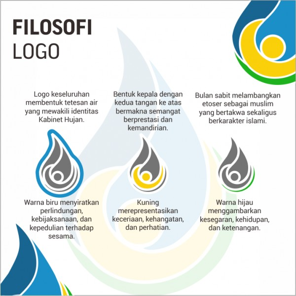

														Rabu 10-January-2024
# Pengantar_web
**Web adalah** ==Lorem== Ipsum latihan latihan latihan latihan 

## Daftar Materi
1. Definisi Web
	Web adalah
2. Protokol web
	Protokol web adalah
3. Tools web
	Tools web adalah
## Teman Kelompok

- Ahsan
- BomBom
- Asep
- Farel

## Membuat Ceklis
- [x] Asep Garis keras
- [x] Ahsan Garis Keras

## Block Qoutes
> rehan adalah Bestie 
> kamu sayang aku


## Faq 
> [!faq]- Daftar Orang Gammara
> >Nafan gammara
> >Asep Ganteng


# HTML 


HTML dimulai dengan tag   `<html>` dan diakhiri dengan tag  `</html>`

`

# CSS 

Ini Program CSS

```css
body{	
	Background-color;
}
```


Ini Program C++

```c++
#include <iostream>

using namespace std;

int main()
{
	cout<<"[PROGRAM PERHITUNGAN NILAI AKHIR]"<<endl;
	
	//ini pendeklarasian variabel
	string nama,kelas;
	
	
	int nilai_absen,nilai_tugas,nilai_ujian,nilai_sikap,nilai_akhir;
	
	cout<<"masukkan namamu: ";
	cin>>nama;
	cout<<"masukkan kelasmu : ";
	cin>>kelas;
	
	cout<<"========================="<<endl;
	
	cout<<"masukkan nilai absensimu: ";
	cin>>nilai_absen;
	cout<<"masukkan nilai tugasmu : ";
	cin>>nilai_tugas;
	cout<<"masukkan nilai ujianmu : ";
	cin>>nilai_ujian;
	cout<<"masukkan nilai sikapmu : ";
	cin>>nilai_sikap;
	
	
	cout<<"======================="<<endl;
	
	
	nilai_akhir = (nilai_absen+nilai_tugas+nilai_ujian+nilai_sikap)/4;
	cout<<endl;
	cout<<"nilai akhirmu adalah :"<<nilai_akhir;
	
}
}
```

# File GAMBAR VIDEO AUDIO


 

 [Gambar_Menang](Asets/IMG_11.jpg)

 [Video_Ml](Asets/VID_10.MP4)


# Link 

[]()


# Note 
[[Note]]


!![[]]
