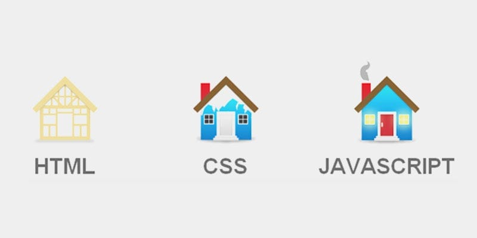

								Rabu 17-january-2024
# Deskripsi Dalam Bentuk Rumah

- **HTML** adalah Sebuah rangka atau Pondasi untuk membuat sebuah Rumah. 
- **CSS** adalah Desain awal dari sebuah Rumah seperti cat, atap, jendela, Pintu, Cerobong Asap yg belum mengeluarkan Asap. 
- **JavaScript** adalah Sebuah Interaksi Dimana di Gambar Cerobong tersebut Mengeluarkan Asap, Mengapa dia Mengeluarkan Asap karena ada Interaksi Yg dilakukan di dalam rumah tersebut yaitu Memasak.
	Gambar Jendela, mengapa gambar jendela mengeluarkan cahaya karena di dalam rumah tersebut ada interaksi yg dilakukan yaitu Orang yang menyalakan saklar lampu. 

 