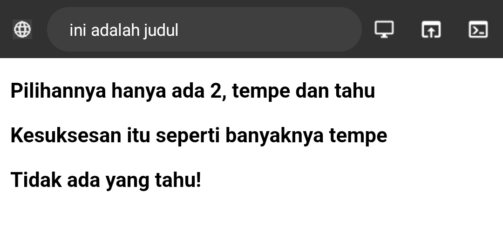

									Rabu 17-January-2024

# STRUKTUR DASAR HTML


**==STRUKTUR HTML==** :

```html
< !DOCTYPE html>
<html>
<head>
<tittle> ini adalah judul </tittle>
</head>
<body>
<p> ini adalah paragraf yang akan ditampilkan di browser </p>
</body>
</html>
```

---


**==CONTOH HTML==** :

```html
<!DOCTYPE html>
<html>
<head>
<title>ini adalah judul</title>
</head>
<body>
<p> Pilihannya hanya ada 2, tempe dan tahu </p>
<p> Kesuksesan itu seperti banyaknya tempe </p>
<p> Tidak ada yang tahu! </p>
</body>
</html>
```


> [!INFO]- HASIL DARI HTML
> >
> >


---


==Tag== <!DOCTYPE html> Memberitahukan web browser bahwa dokumen **HTML** adalah versi 5

==Tag== ==Pembuka== `<html>` menandai awal sebuah dokumen HTML Sampai dengan Tag Penutup `</html>`

di dalam ==Tag Pembuka== `<html>` dan ==Tag Penutup== `</html>` . ada yang namanya ==Tag Pembuka== `<head>` berisi informasi tentang halaman html sebagai dengan ==Tag Penutup== `</head>` . Biasanya dalam Tag **head** terdapat ==Tag== `<title>` untuk memberikan informasi judul halaman HTML. 

Apapun Tag yang berada di antara ==Tag pembuka== `<body>` sampai dengan ==Tag Penutup== `</body>` akan ditampilkan di web browser. 


---


# Anatomi Elemen HTML

**Elemen** adalah suatu kesatuan dan sebuah Tag yang dimulai dari ==Tag pembuka== hingga ke ==Tag penutup==. **ELEMEN** HTML secara garis besar terdiri atas tiga bagian yaitu **Tag pembuka** dan **Tag penutup**, **konten/Isi tag**, dan **atribut tag**,
>


**==Elemen Untuk Membuat Link==** :
```html
<a href="https://chat.openai.com/">klik di sini</a>
```


**==HASIL PROGRAM==** :
>
> 
> Jika kalian Klik "==klik di sini==" Maka yang tampil adalah
>


---

## Pembuka & Penutup

### Tag Pembuka
`<a`:  adalah Tag Pembuka
`<a>`: Ini adalah tag pembuka untuk elemen anchor atau tautan.


### Tag Penutup
`/a>`: adalah Tag Penutup
`</a>`: Tag penutup untuk elemen anchor, mengakhiri bagian tautan. 


---


## Atribut Tag

### Nama Atribut


**"Nama Atribut"** mengacu pada kata kunci yang menentukan jenis tautan atau sumber daya yang akan dihubungkan.


`href` , `href=""`: Atribut `href` digunakan untuk menentukan URL atau alamat yang akan ditautkan. Isi dari tanda kutip ganda akan berisi URL atau path ke halaman atau sumber eksternal.


### Nilai Atribut


**Nilai atribut** adalah URL atau path yang menunjukkan lokasi dokumen atau sumber daya yang ingin dihubungkan oleh elemen tersebut. Atribut `href` digunakan terutama dalam elemen `<a>` (anchor) untuk membuat tautan hyperlink.


`href="https://chat.openai.com/"`: Atribut `href` menentukan URL atau alamat yang ditautkan, dalam hal ini, ke [klik di sini](https://chat.openai.com/) 


---


## Konten/Isi Tag


**konten** atau **isi tag** ditempatkan di antara ==tag pembuka== `(<a>)` dan ==tag penutup== `(</a>)`. Konten ini biasanya berupa teks atau elemen HTML lain yang mewakili teks tautan.


- `Klik di sini`: Ini adalah teks yang akan ditampilkan sebagai tautan.


--- 


# Tag Dasar
## Heading


Tag `<h1>` to `<h6>` merupakan tag heading dalam HTML yang digunakan untuk menandai tingkatan atau level judul pada halaman web. `<h1>` adalah level judul tertinggi (heading 1), sementara `<h6>` adalah level judul terendah (heading 6). Semakin tinggi tingkatannya, semakin kecil ukuran fontnya. Contohnya:

`<h1></h1>` Heading Level 1

`<h2></h2>` Heading Level 2

`<h3></h3>` Heading Level 3

`<h4></h4>` Heading Level 4

`<h5></h5>` Heading Level 5

`<h6></h6>` Heading Level 6


**==HASIL PROGRAM==** :
>


---

## Paragraf


### `<p></p>`:

Elemen `<p>` dalam HTML digunakan untuk mendefinisikan sebuah paragraf. Paragraf adalah blok teks yang umumnya dipisahkan dari paragraf lainnya dengan spasi vertikal.


**==KODE PROGRAM==**

```html
<p>Pilihannya hanya ada 2, tempe dan tahu</p>
<p>Kesuksesan itu seperti banyaknya tempe</p>
<p>Tidak ada yang tahu!</p>
```


**==HASIL PROGRAM==** :
>


---


### `<b></b>`:

Elemen `<b>` dalam HTML digunakan untuk menandai teks yang secara visual harus dibuat tebal (bold). Ini adalah salah satu dari beberapa elemen HTML yang digunakan untuk memberikan penekanan atau gaya pada teks.


**==KODE PROGRAM==**

```html
<p> <b>Pilihannya hanya ada 2, tempe dan tahu</b> </p>
<p> <b>Kesuksesan itu seperti banyaknya tempe</b> </p>
<p> <b>Tidak ada yang tahu!</b> </p>
```


**==HASIL PROGRAM==** :
>


---


### `<i></i>`:

Elemen `<i>` dalam HTML digunakan untuk menandai teks yang secara visual harus dibuat miring (italic). Ini adalah salah satu elemen HTML yang digunakan untuk memberikan gaya atau penekanan pada teks.


**==KODE PROGRAM==**

```html
<p> <i>Pilihannya hanya ada 2, tempe dan tahu</i> </p>
<p> <i>Kesuksesan itu seperti banyaknya tempe</i> </p>
<p> <i>Tidak ada yang tahu!</i> </p>
```


**==HASIL PROGRAM==** :
>


---


### `<u></u>`:

Elemen `<u>` dalam HTML digunakan untuk menandai teks yang secara visual harus diberi garis bawah (underlined). Ini adalah salah satu elemen HTML yang digunakan untuk memberikan gaya pada teks.


**==KODE PROGRAM==** :

```html
<p> <u>Pilihannya hanya ada 2, tempe dan tahu</u> </p>
<p> <u>Kesuksesan itu seperti banyaknya tempe</u> </p>
<p> <u>Tidak ada yang tahu!</u> </p>
```


**==HASIL PROGRAM==** :
>


---
---


> [!INFO] INFO `<br>` & `<hr>` 
> Namun Perlu Kita Ketahui, tidak semua Tag yang ditulis secara berpasangan, ada juga beberapa Tag yang ditulis tanpa memiliki Tag penutup. Berikut Beberapa Contoh Tag yang tidak memiliki Tag penutup seperti:
>- `<br>`: untuk break row ( baris baru )
>- `<hr>`: untuk Horizontal Line ( garis horizontal )


### `<br>`:

Elemen `<br>` dalam HTML digunakan untuk membuat pemisah baris atau "break line" (baris baru). 
**Elemen ini tidak memiliki tag penutup karena bersifat self-closing, yang berarti tidak memiliki konten di dalamnya.


**==KODE PROGRAM==** :

```html
<p>Pilihannya hanya ada 2, tempe dan tahu</p>
<br>
<p>Kesuksesan itu seperti banyaknya tempe</p>
<p>Tidak ada <br> yang tahu!</p>
```


**==HASIL PROGRAM==** :
>


### `<hr>`:

Elemen `<hr>` dalam HTML digunakan untuk membuat sebuah "horizontal line" (garis horizontal) atau pemisah visual antara konten.
**Elemen `<hr>` juga bersifat self-closing, sehingga tidak memerlukan tag penutup.**


**==KODE PROGRAM==** :

```html
<p>Pilihannya hanya ada 2, tempe dan tahu</p>
<hr>
<p>Kesuksesan itu seperti banyaknya tempe</p>
<p>Tidak ada yang tahu!</p>
```


**==HASIL PROGRAM==** :
>


---


**==PROGRAM Gabungan (latihan")==** :

```html
<br>
<p> <b>Pilihannya hanya ada 2, tempe dan tahu</b> </p>
<hr>
<p> <i>Kesuksesan itu seperti banyaknya tempe</i> </p>

<p> <u>Tidak ada yang tahu!</u> </p>
<br>
<br>
<a href="https://chat.openai.com/">klik di sini</a>
```


**==HASIL PROGRAM==** :
>


---


### Atribut `align`

**Atribut `align`** berguna untuk mengontrol penempatan atau perataan elemen dalam sebuah dokumen atau tampilan halaman web.
`align="left"` akan membuat paragraf menjadi rata kiri.
`align="right"` akan membuat paragraf menjadi rata kanan.
`Align="center"` akan membuat paragraf menjadi rata tengah.
`align="justify"`akan membuat paragraf rata kanan dan kiri.

 

**==KODE PROGRAM==** :

```html
<h3>Belajar Menggunakan Elemen Tag HTML </h3>
<p align="left">
Sebuah rumah yang berisikan satu keluarga yaitu,ayah,ibu,dan 3 anaknya. </p>
<p align="right">
Sebuah rumah yang berisikan satu keluarga yaitu,ayah,ibu,dan 3 anaknya.</p>
<p align="center">
Sebuah rumah yang berisikan satu keluarga yaitu,ayah,ibu,dan 3 anaknya.</p>
<p align="justify">
Sebuah rumah yang berisikan satu keluarga yaitu,ayah,ibu,dan 3 anaknya.</p>
```


**==HASIL PROGRAM==** :
>


---


## **Komentar** 

Html juga mempunyai Tag khusus untuk komentar.Untuk membuat komentar di HTML kita menggunakan awalan `<!--` dan penutup 
`-->`.

> [! INFO] INFO!! Komentar tidak akan di tampilkan pada halaman website namun programmer biasanya menggunakan komentar untuk memperjelas kode program


**==KODE PROGRAM==** :

```html
<!-- ini komentar,tidak akan tampil di browser -->
<p>ini bukan komentar, dan akan tampil di browser</p>
```


**==HASIL PROGRAM==** :
>


 
___

## **List**

**List** adalah fungsi dalam HTML yang digunakan untuk menampilkan daftar dari sesuatu.Tag HTML terdiri dari 2 jenis ,`<ol>` ordered list (berurutan),dan `<ul> `urdered list (tidak berurutan). oredered list `<ol>` akan ditampilkan dengan angka atau huruf sedangkan undered list `<ul>`dengan bulatan atau kotak ataupun simbol lainnya.

>[!INFO] !! Untuk menampilkan list dalam HTML dapat menggunakan tag `<ol>`...`<\ol>` atau` <ul>`...`</ul>`namun perlu dengan menyisipkan elemen `<li>` untuk membuat daftar list


**==KODE PROGRAM==**  `<ul>` :

```html
<h1>Peralatan Kelas</h1>
<ul>
  <li>sapu</li>
  <li>pel</li>
  <li>gelas</li>
  <li>kipas</li>
  <li>dispenser</li>
</ul>
```


**==HASIL PROGRAM==** `<ul>` :
>


---


**==KODE PROGRAM==**  `<ol>` :

```html
<h1>list kalimat</h1>
<ol>
  <li>ini kalimat pertama</li>
  <li>ini kalimat kedua</li>
  <li>ini kalimat ketiga</li>
  <li>ini kalimat keempat</li>
  <li>ini kalimat kelima</li>
</ol>
```


**==HASIL PROGRAM==** `<ol>` :
>


---

## Link
**Link** dapat ditemukan di hampir semua halaman web. Link/Tautan memungkinkan sebuah teks yang ketika di-klik akan pindah ke halaman lainnya. HTML Menggunakan tag `<a>` untuk keperluan ini. Link ditulis dengan `<a>` yang merupakan singkatan dari anchor (jangkar). 


Setiap tag `<a>` setidaknya memiliki sebuah atribut `href` Dimana `href` berisi alamat yang dituju. `href` adalah singkatan dari hypertext reference. 

Atribut Penting Lainnya dari tag `<a>` adalah `target` . Atribut target menentukan tempat untuk membuka dokumen yang ditautkan. Atribut `target` memiliki beberapa nilai salah satunya `_blank` yang berfungi untuk membuka tautan di tab baru. 


**==KODE PROGRAM==** :

```html
<h3>Menggunakan Tag Anchor</h3>
<br>
<a href ="https://www.google.com" target="_blank">klik disini untuk ke google</a><br>
<br>
<a href ="https://www.instagram.com/f4r3llllll?igsh=c3pyYnFkdXMyOTA3">klik disini untuk melihat profil ku!</a>
```


**==HASIL PROGRAM==** :
>


---


## Multimedia


### Gambar

Dalam HTML gambar didefinisikan dengan tag `` . Tag `` adalah tag kosong, hanya berisi atribut saja, dan tidak memiliki tag penutup. 

Atribut `src` setidaknya mesti ada dalam tag ini untuk menentukan URL (alamat web) dari gambar yang ingin ditampilkan. 

Atribut `alt` menyediakan teks alternatif untuk gambar, jika pengguna karena beberapa alasan tidak dapat melihatnya (karena koneksi lambat, kesalahan pada atribut `src` ,atau jika web browser telah disetting untuk tidak menampilkan gambar). Jika browser tidak dapat menentukan gambar, maka akan muncul nilai pada atribut `alt` . 

Dalam tag `` terdapat juga atribut `width` dan `height` untuk mengatur ukuran gambar, pada versi HTML5 standar satuan ukuran gambar adalah pixel. 

- Misalnya dalam folder root terdapat file gambar bernama logo.png. untuk menampilkan gambar tersebut kita hanya perlu mengisi nama gambar beserta jenis ekstensi file gambar ke dalam atribut `src` , Contohnya `src = "logo.png"` 
- untuk menampilkan dari internet carilah link gambar yang akan ditampilkan lalu masukkan dalam nilai atribut `src` , contohnya **`https://namasitus.com/gambar.png`**

**==KODE PROGRAM==** :

```html

```


**==HASIL PROGRAM==** :
>


**==SCREENSHOT FOLDER==** :

>


---


### Video 

Fitur HTML 5 mencakup dukungan audio dan video asli tanpa memerlukan flash. tag `<audio>` dan `<vidio>` pada HTML 5 mempermudah penambahan media ke dalam halaman web. Yang penting untuk diatur pada tag ini adalah atribut `src` yang berfungsi untuk mengidentifikasi sumber media. Selain itu, terdapat pula atribut `controls`agar pengguna dapat memutar dan menjeda media.


**==KODE PROGRAM==** :

```html

<video src="VID-01.mp4" controls width="400"></video>
```


**==HASIL PROGRAM==** :
>


---


### Audio

Seperti yang telah dibahas sebelumnya bahwasanya tag `<audio>` merupakan bagian fitur **HTML5** untuk menampilkan audio asli dihalaman web tanpa memerlukan flash sebagaimana pada HTML versi 4. Yang penting untuk diatur pada tag ini adalah atribut `src` yang berfungi untuk mengidentifikasi sumber media. Selain itu, terdapat pula atribut `controls` agar pengguna dapat memutar dan menjeda media. 

**==KODE PROGRAM==** :

```html 
<audio src="Aud01.mp3" controls >
  Browser anda tidak mendukung elemen 
  <audio>.</audio>
```


> [!INFO]
> Konten berupa teks "Browser anda tidak mendukung elemen `<audio>`." Pada tag `<audio>` akan ditampilkan jika browser tidak mendukung elemen tersebut. Sehingga sebenarnya bagian ini dapat dihilangkan.


**==HASIL PROGRAM==** :
>


---


### Halaman web lain

 **Elemen** <`iframe>` dapat digunakan untuk menampilkan halaman website lain dalam suatu website. Atau menampilkan dokumen html lain dalam sebuah website. Mudahnya, bisa dibilang website dalam website

**Contoh penggunaannya seperti ini**. Jika kita mempunyai website sekolah, lalu di website tersebut ingin menampilkan alamat dalam google maps sekolah. Agar memudahkan pengunjung website,kita bisa langsung tampilkan saja halaman sekolah yang ada digoogle maps

Dalam tag inframe ada beberapa atribut yang penting seperti : 
- src,untuk mencari sumber halaman html atau web yang akan ditampilkan didalam frame
- width dan height, untuk mengatur ukuran panjang dan lebar dari frame.


**==KODE PROGRAM==** :

```html

<iframe src="https://www.smkn7makassar.sch.id/" width="100%" height="600%">
```


**==HASIL PROGRAM==** :
>


---


## Tabel
Tabel dalam HTML didefinisikan dengan tag `<table>`.
- Setiap baris tabel didefinisikan dengan tag `<tr>`.
- Header/judul tabel didefinisikan dengan tag `<th>`.Secara default, header tabel memiliki teks tebal dan berada di tengah.
- Data tabel/sel didefinisikan dengan tag `<td>`karena sel merupakan bagian terkecil dari tabel maka dari itu tag ini selalu berada di dalam tag `<tr>`.

**==KODE PROGRAM==** :

```html

<table Border="1">
<tr>
<th>nama</th>
<th>Asal institusi</th>
</tr>
<tr>
<td>Farel</td>
<td>Kampus Undipa</td>
</tr>
<tr>
  <td>Ahsan</td>
  <td>Tvri</td>
</tr>
</table>
``````


**==HASIL PROGRAM==** : 
>


>[!NOTE]
>Perhatikan bahwa pada tag `<table>` terdapat sebuah atribut `<border>`. Atribut digunakan untuk memberikan nilai garis tepi dari tabel. Nilai ini dalam ukuran pixel. `border="1"`, berarti kita menginstruksikan kepada web browser bahwa tabel tersebut akan memiliki garis tepi sebesar 1 pixel. Jika tidak ditambahkan, secara default tabel tidak memiliki garis tepi.

Selain itu, terdapat pula beberapa atribut tabel yang penting untuk diketahui yaitu:
- `rowspan` merupakan atribut HTML yang berfungsi untuk menggabungkan beberapa baris (ke bawah).
- `colspan`atau colomn span merupakan atribut html yang berfungsi untuk menggabungkan beberapa kolom (ke samping).
- `width`berfungsi untuk mengatur lebar kabel yang nilainya didefinisikan dalam satuan pixel secara default.
- `heigt`berfungsi untuk mengatur tinggi tabel yang nilainya didefinisikan dalam satuan pixel secara default.
- `Align` berfungsi untuk mengatur perataan teks pada tabel.nilai atribut yang dapat diberikan yaitu `left` untuk perataan teks `kekiri`,`right` untuk teks ke kanan dan,`center` untuk perataan teks ke tengah.


**==KODE PROGRAM==** :

```html

<table Border="1">
<tr>
<th rowspan="2">nama</th>
<th colspan="2">Asal institusi</th>
</tr>
<tr>
<th width="100">sekolah</th>
<th width="100">kampus</th>
</tr>
<tr>
<td align="center">Muh alfahrezi Raihan</td>
<td align="center">Smkn7 Makassar</td>
<td align="center">universitas Dipa Makassar</td>
</tr>
<tr>
  <td align="center">Taufiq Adiguna</td>
  <td align="center"> SMK 7 Makassar</td>
  <td align="center">HALBA</td>
</tr>
<tr>
  <td align="center">Fathurrahman</td>
  <td align="center">smkn 7 makassar</td>
  <td align="center">Fajar TV</td>
</tr>
  <td align="center">ahsan putar</td>
  <td align="center">SMKN 7 MAKASSAR</td>
  <td align="center">TVRI</td>
</tr>
</table>
```


**==HASIL PROGRAM==** :
>


---


**==KODE PROGRAM==** :

```html

<table Border="2">
<tr>
<th rowspan="2">nama</th>
<th colspan="2">Asal institusi</th>
</tr>
<tr>
<th width="100">sekolah</th>
<th width="100">kampus</th>
</tr>
<tr>
<td align="center">Muh alfahrezi Raihan</td>
<td align="center">Smkn7 Makassar</td>
<td align="center">universitas Dipa Makassar</td>
</tr>
<tr>
  <td align="center">Taufiq Adiguna</td>
  <td align="center" rowspan="2"> SMK 7 Makassar</td>
  <td align="center" rowspan="2">-</td>
</tr>
<tr>
  <td align="center">Fathurrahman</td>
</tr>
  <td align="center">ahsan putar</td>
  <td align="center">SMKN 7 MAKASSAR</td>
  <td align="center">TVRI</td>
</tr>
</table>
```


**==HASIL PROGRAM==** :
>


> [!INFO] perhatikan para konten elemen `<td>` yang berisi Fathurrahman, hanya terdapat satu elemen `<td>` disana. Hal ini dikarenakan konten elemen `<td>` sebelumnya yaitu SMKN 7 Makassar dan - pada data Taufiq Adiguna mengandung atribut rowspan dengan bernilai 2 yang secara otomatis mengisi data di bawahnya yakni data Fathurrahman. Nilai 2 menunjukkan bahwa ada dua baris yang digabungkan menjadi satu.
>Konsep ini juga sama dengan apa yang terjadi pada `<th rowspan="2">nama</th>`​dan `<th colspan="2">Asal institusi</th>`


---

### Tabel Tugas

**==KODE PROGRAM==** :

```html

<table Border="4">
  <tr>
    <th width="150" colspan="2" bgcolor="green">Nama Hari</th>
    <th width="150" colspan="2" bgcolor="green">Nama Bulan</th>
    </tr>
    <tr>
      <td>senin</td>
      <td>selasa</td>
      <td>April</td>
<td align="center" rowspan="2">juni</td>
      </tr>
      <tr>
      <td>rabu</td>
      <td>kamis</td>
      <td>Mei</td>

    </tr>
    
    
</table>
```


**==HASIL PROGRAM==** :
>


**==PENJELASAN==** :

- `<table Border="4">`: Membuat tabel dengan batas (border) setebal 4.
- `<tr>`: Membuat baris pada tabel.
- `<th>`: Membuat sel header (kolom judul) pada tabel.
- `width="150"`: Menentukan lebar kolom.
- `colspan="2"`: Menggabungkan dua kolom secara horizontal.
- `bgcolor="green"`: Menentukan warna latar belakang.
- `<td>`: Membuat sel data (kolom isi) pada tabel.
- `align="center"`: Menyelaraskan teks ke tengah.
- `rowspan="2"`: Menggabungkan dua baris secara vertikal.


---


## Form

**Elemen Form HTML** digunakan untuk mendefinisikan **Form** yang digunakan untuk mengumpulkan **inputan** dari pengguna **website**. Tag ini digunakan untuk mengkoleksi **inputan** dari **user**, konsep ini sama seperti konsep formulir di dunia nyata.


> [!INFO] Dengan kata lain tag `<Fores>` merepresentasikan sebuah "formulir" di mana satu formulir bisa memiliki banyak kolom isian


**Form HTML** berisikan elemen-elemen form lainnya. Elemen `<form>` digunakan untuk menampung macam-macam elemen yang berkaitan dengan sebuah **form**, seperti **text fields**, **checkbox**, **radio button**, **tombol subalt**, dan banyak lagi yang dapat diedit kemudian ditulis untuk dikirim pada sebuah server untuk selanjutnya diproses guna mendapatkan informasi tertentu dari atau untuk user.

Umumnya, sebuah website selalu memiliki fitur **form**, contoh paling umum yang sering kita temui adalah seperti **form login**, **form sign up**, **form komentar** di suatu **blog**/**media**.


### Input

**Elemen** `<input>` adalah **elemen form** yang paling **penting**. **Elemen** `<input>` dapat ditampilkan dalam beberapa cara, tergantung pada nilai atribut type yang digunakan. Request Berikut adalah beberapa contoh nilai dari atribut type:
- ==**text**== digunakan untuk mengambil isian berupa teks. Contohnya seperti **nama**.
- **==password==** digunakan untuk mengambil isian berupa **kata sandi** atau sesuatu yang bersifat **rahasia**. Tipe ini akan mengubah semua karakter yang diketikkan ke dalam karakter **bulat**.
- **==Radio==** digunakan sebagai kolom isian bertipe pilihan yang menawarkan beberapa opsi kepada user namun tetapi hanya satu opsi saja yang boleh dipilih. Contohnya seperti jenis kelamin atau agama.


> [!INFO] Perlu diperhatikan bahwa untuk penggunaan tipe "radio" yang berkategori set pilihan yang sama mengharuskan "nilai"nya juga sama.


Opsi default dapat dilakukan dengan menambahkan atribut ==**checked**== pada elemen opsi yang dijadikan sebagai opsi default.

- **==checkbox==** digunakan untuk memberikan **"daftar pilihan dalam satu set opsi"**. User dapat memilih "**satu**" atau bahkan "**lebih**" dari satu pilihan pada tipe ini. Hal ini berbeda dengan tipe sebelumnya yaitu "**radio**" yang hanya memungkinkan user untuk memilih satu  pilihan saja. Contoh penggunaan "**checkbox**" seperti daftar makanan kesukaan, daftar olahraga yang tidak disukai. 


> [!INFO] Perlu diperhatikan bahwa untuk penggunaan tipe "checkbox" yang berkategori set pilihan yang sama mengharuskan nilai "name" -nya juga sama.


1. **==Number==** digunakan untuk membatasi isian user hanya pada karakter numerik saja. Browser akan menambahkan dua buah tombol atas dan bawah untuk mengubah angka isian.
Beberapa atribut untuk tipe number :
- **==min==** = menentukan angka minimal
- **==max==** = menentukan angka maksimal
- **==step==** = menentukan kelipatan (nilai yang tidak sesuai kelipatan tidak bisa di-input, dan default dari atribut ini adalah 1)

2. **==Date==** digunakan untuk memberikan isian berupa tanggal. Atribut **min** dan **max** dapat pula difungsikan pada tipe ini untuk mengatur tanggal minimal dan tanggal maksimal yang diinginkan. Nilai **min** dan **max** tersebut ditulis dengan format: **YYYY-em-dd**.

3. **==File==** digunakan untuk memungkinkan pengguna memuat file. Atribut **accept** juga dapat disisipkan pada tipe ini dengan maksud untuk mengatur file apa saja yang boleh di-upload. Beberapa contoh value dari atribut **accept** yaitu:

- ==**accept-"image/png,inage/jpg.Image/jpeg**== = untuk file gambar seperti **png**. **jpg**. atau **jpeg**
- ==**accept="pdf"**== = untuk file pdf
- ==**accept="pdf"**== = untuk file pdf
- ==**accept-".doc, docx"**== = untuk file **doc** atau **docx**
- **==accept-".ppt, pptx"==**  = untuk file **ppt** atau **pptx**

4. **==submit==** ditampilkan dalam bentuk tombol untuk mengirim data pada `<form>` yang menjadi pembungkusnya. Atribut `value` digunakan untuk mengisi teks yang ingin ditampilkan pada tombol.

5. **==reset==** berguna untuk **mengembalikan state (keadaan) atau data dari suatu form ke nilai awalnya**. Jika nilai awal sebuah input adalah kosong, maka ketika direset ia akan kembali kosong. Tapi jika nilai awalnya sudah terisi sesuatu, maka ketika direset datanya akan kembali seperti yang sudah diset sebelumnya.

6. **==button==** berguna untuk membuat inputan berupa sebuah tombol. Tombol ini nantinya bisa difungsikan sesuai dengan keinginan dari pengembang web.


---


### **Label**  

Elemen `<label>` memiliki fungsi khusus untuk melabeli sebuah kolom inputan. Ketika screen reader membaca konten halaman HTML, lalu menemukan sebuah inputan, ia akan membaca label yang bersangkutan.  
Fungsi lain dari tag `<label>` adalah ketika kita mengklik label, maka browser akan meletakkan fokus pada kolom isian yang terhubung dengannya. Syarat yang perlu diperhatikan yaitu dengan menghubungkan sebuah `<label>` dan `<input>` dengan atribut "for" untuk label, dan atribut id pada `<input>` dengan nilai untuk kedua atribut tersebut mesti sama persis.


---


### **SELECT**  

Elemen `<select>` berguna dalam mendefinisikan sebuah tombol dropdown yang dimana user dapat memilih salah satu dari banyak pilihan.

>[!note] - Elemen `<select>` nantinya berperan sebagai kontainer atau pembungkus dari elemen `<option>` yang berperan sebagai daftar pilihan atau opsi.

Elemen `<select>` hampir mirip fungsinya dengan `<input type ="radio">` akan tetapi baiknya elemen `<select>` digunakan untuk memilih satu pilihan yang terdapat banyak opsi di dalamnya, sedangkan `<input type ="radio">` lebih baiknya untuk digunakan jika user diarahkan memilih hanya satu pilihan yang opsi pilihannya tidak terlalu banyak. Contoh penggunaan elemen ini seperti memasukkan pilihan berupa asal daerah atau yang semisalnya.  
Penting untuk diketahui bahwasanya opsi yang aktif secara default adalah adalah opsi yang pertama. Akan tetapi, kita bisa mengatur opsi mana yang aktif secara default dengan menambahkan atribut selected pada suatu `<option>` yang ingin dijadikan sebagai opsi default.


---


### **Text Area**  

Elemen `<textarea>` berguna untuk mengambil inputan user berupa teks yang dapat memuat lebih dari satu baris. Jika dibandingkan dengan elemen `<input>` teks biasa, elemen `<textarea>` memiliki ukuran tinggi yang lebih besar. Element `<textarea>` bisa diisi lebih dari satu baris dengan menekan enter.

Atribut yang dapat digunakan untuk mengatur kurang dari textarea yaitu rows untuk jumlah baris, sedangkan atribut cols untuk lebarnya.


---


### **Button**  

Elemen `<button>` yang berada di dalam sebuah `form` akan otomatis dianggap sama fungsinya seperti `<input type="submit">`. Jika ingin membuat tombol biasa yang tidak men-submit `<form>` dapat dilakukan dengan menambahkan atribut `type="button"`.

---


**==KODE PROGRAMNYA :==**

```html

<form action=" ">
 <label for="Username"> Username : </label>
  <input type="text" id="Username">
  <br>
  <br>
 <label for="Password"> Password : </label>
  <input type="password" id="Password" required>
  <br>
  <br>
  
  <label for="Jenis Kelamin">Jenis Kelamin : </label>
  <input type="radio" name="Jenis Kelamin" re>
  <label>Laki-Laki</label>
  <input type="radio" name="Jenis Kelamin" checked>
  <label>Perempuan</label>
  <br>
  <br>
  
  <input type="checkbox" name="web"> web 
  <input type="checkbox" name="mobile"> mobile 
  <input type="checkbox" name="Desktop"> Desktop
 
  <br>
  <br>
  Pesan/Kesan anda :
  <br>
  <textarea></textarea>
  
  
 <br>
  <br>
  
  <input type="submit" value="Kirim">
  <br>
  <br>
<input type="reset" value="Ulang">
  
  
</form>
```


**==HASIL PROGRAM==** :
>


**==PENJELASAN==** :

- `<form action=" ">`: Membuat formulir dengan aksi yang ditentukan (dalam hal ini, tautan kosong).
    
- `<label>`: Membuat label untuk elemen input.
    
- `<input>`: Membuat berbagai jenis elemen input, seperti teks, kata sandi, radio button, checkbox, dan tombol submit/reset.
    
    - `type="text"`: Input teks untuk username.
    - `type="password"`: Input kata sandi.
    - `type="radio"`: Radio button untuk memilih jenis kelamin.
    - `type="checkbox"`: Checkbox untuk memilih platform (web, mobile, desktop).
    - `type="submit"`: Tombol untuk mengirim formulir.
    - `type="reset"`: Tombol untuk mengulang formulir.
- `for=""`: Menyambungkan label dengan elemen input yang sesuai melalui atribut "id".
    
- `required`: Membuat input kata sandi menjadi wajib diisi.
    
- `name=""`: Memberikan nama pada elemen input untuk mengelompokkan radio button atau checkbox.


---
**==KODE PROGRAM==** :  
```html  
<h1>Formulir Pendaftaran</h1>  
<form action="">  
  <div>  
    <label for="nama-lengkap"><b>Nama Lengkap:</b></label  
    ><br />  
    <input  
      type="text"  
      id="nama-lengkap"  
      name="nama_lengkap"  
      placeholder="Masukkan nama lengkap"  
      required  
    />  
  </div>  
   
  <div>  
    <label for="password"><b>Password:</b></label  
    ><br />  
    <input  
      type="password"  
      id="password"  
      name="password"  
      placeholder="Masukkan password"  
      required  
    />  
  </div>  
   
  <div>  
    <b>Jenis Kelamin:</b><br />  
    <input id="lk" type="radio" name="jenis_kelamin" checked />  
    <label for="lk">Laki-Laki</label>  
    <input id="pr" type="radio" name="jenis_kelamin" />  
    <label for="pr">Perempuan</label>  
  </div>  
   
  <div>  
    <label for="isian-usia"><b>Usia:</b></label  
    ><br />  
    <input  
      type="number"  
      id="isian-usia"  
      name="usia"  
      min="17"  
      max="25"  
      value="19"  
      required  
    />  
    Tahun  
  </div>

  <div>  
    <label for="tgl-ijazah"><b>Tanggal Ijazah:</b></label> <br />  
    <input  
      type="date"  
      id="tgl-ijazah"  
      name="tgl_ijazah"  
      min="2021-01-01"  
      value="2023-06-20"  
      required  
    />  
  </div>

  <div>  
    <label for="opsi-agama"><b>Agama:</b></label  
    ><br />  
    <select id="opsi-agama" name="agama" required>  
      <option disabled>---Pilih Agama----</option>  
      <option value="islam">Islam</option>  
      <option value="kristen">Kristen</option>  
      <option value="katolik">Katolik</option>  
      <option value="hindu">Hindu</option>  
      <option value="buddha">Buddha</option>  
      <option value="atheis" disabled>Atheis</option>  
    </select>  
  </div>

  <div>  
    <label for="alamat"><b>Alamat:</b></label> <br />  
    <textarea  
      id="alamat"  
      name="alamat"  
      cols="25"  
      rows="5"  
      placeholder="Harap masukkan alamat secara lengkap"  
      required  
    ></textarea>  
  </div>

  <div>  
    <b>Kemampuan Berbahasa Asing:*</b><br />  
    <input type="checkbox" id="inggris" name="bahasa_asing" />  
    <label for="inggris">Inggris</label>  
    <input type="checkbox" id="arab" name="bahasa_asing" />  
    <label for="arab">Arab</label>  
    <input type="checkbox" id="jepang" name="bahasa_asing" />  
    <label for="jepang">Jepang</label>  
  </div>

  <div>  
    <label for="isian-foto"><b>Foto 4x6:*</b></label  
    ><br />  
    <input  
      type="file"  
      id="isian-foto"  
      name="foto"  
      accept="image/png,image/jpg,image/jpeg"  
    />  
  </div>

  <br />  
  <input type="submit" value="Kirim" />  
  <input type="reset" value="Batal" />  
  <i>*opsional (tidak wajib diisi)</i>  
</form>  
```


**==HASIL PROGRAM==** :
>


Beberapa atribut yang digunakan pada contoh di atas yang perlu untuk diperjelas yaitu sebagai berikut:  
- **==name==** - digunakan sebagai nama variabel yang akan diproses oleh web server (contoh menggunakan PHP).  
- **==required==** - digunakan untuk memastikan bahwa pengguna harus memasukkan nilai pada input tersebut sebelum dapat melakukan proses submit formulir.  
- **==placeholder==** - menuliskan teks pada elemen input. Placeholder sangat bermanfaat untuk memberikan teks bantuan kepada user untuk inputan form yang kompleks.  
- **==value==** - menentukan nilai awal dari sebuah elemen input.  
- **==disabled==** - digunakan untuk menonaktifkan inputan pada elemen yang diberi atribut ini.


### Bagaimana Cara Memproses Form?

Ketika sebuah `<form>` disubmit, baik menggunakan elemen `<button>` mau pun `<input type="submit">`, browser akan mengirimkan data tersebut kepada URL yang didefinisikan pada atribut `action` di dalam tag `form`.

Ada pun jika atribut `action` tidak didefinisikan, maka *browser* akan menggunakan URL sekarang sebagai tujuan pengiriman data.

**==CONTOH==** :

```html
**<form** action**=**"/proses-pendaftaran"**>**
  ...
**</form>**
```

Pada contoh di atas, ketika form di-*submit*, *browser* akan mengirimkan data yang ada  menuju URL `/proses-pendaftaran`.


**Apa yang terjadi pada URL `/proses-pendaftaran`?**

Pada URL tersebut terdapat sebuah aplikasi/program yang berjalan di *server* (bukan di *browser*). Tugas dari program tersebut adalah mengelola data yang dikirim seperti misalnya menyimpan data tersebut ke dalam sebuah *database*.

Bahasa yang umum digunakan di dalam server adalah python, nodejs, PHP, dan lain sebagainya.

Untuk mendapatkan gambaran lebih jelas, sebenarnya akan dijelaskan pada modul selanjutnya yang berkaitan dengan materi PHP atau juga bisa dengan membaca tutorial berikut:

https://jagongoding.com/web/php/web-dinamis/membuat-dan-menangani-form/https://jagongoding.com/web/php/web-dinamis/membuat-dan-menangani-form/


## DIV & SPAN


### DIV 


**==PENJELASAN :==**

`<div>` adalah elemen HTML yang digunakan untuk mengelompokkan dan mengatur elemen-elemen HTML secara visual. Itu membantu dalam styling dan penataan halaman web, memberikan fleksibilitas dalam desain. Dengan menggunakan `<div>`, Anda dapat membuat tata letak yang lebih kompleks dan responsif.


**==KODE PROGRAM :==**


```HTML

<div>
      Ini dibuat menggunakan div
    </div>
    <div>
      Ini juga menggunakan div
    </div>

```


**==HASIL PROGRAM :==**

>


### SPAN


**==PENJELASAN :==**

Elemen `<span>` dalam HTML digunakan untuk menerapkan gaya atau memformat sebagian kecil teks atau elemen dalam dokumen tanpa mengubah struktur dokumen. `<span>` sering digunakan dengan CSS untuk memberikan gaya tambahan, seperti perubahan warna, ukuran font, atau dekorasi teks pada bagian tertentu tanpa mempengaruhi teks di sekitarnya. Ini memberikan fleksibilitas dalam mengatur tampilan halaman web tanpa memerlukan pemisahan struktural.


**==KODE PROGRAM :==**


```HTML

<span>
      Ini dibuat menggunakan span,
    </span>
    <span>
      Ini juga menggunakan span
    </span>

```


**==HASIL PROGRAM :==**

>


