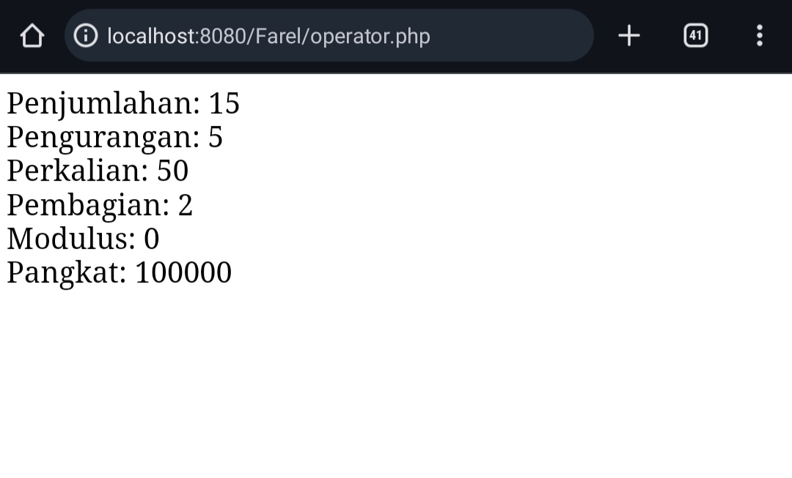
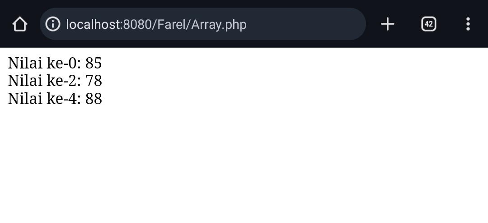
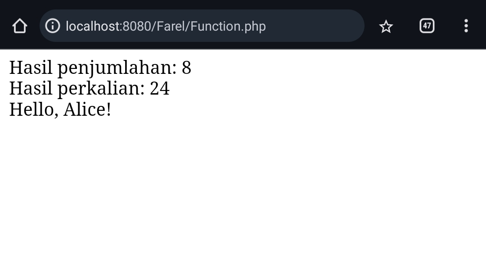

# Langkah - Langkah Penggunaan apache (web server)


1. **Instalasi Apache**:
    
    - Unduh paket instalasi Apache dari situs web resminya atau gunakan package manager jika Anda menggunakan sistem operasi Linux. Untuk Windows, Anda dapat menggunakan installer yang disediakan.
2. **Konfigurasi Apache**:
    
    - Setelah instalasi selesai, Anda perlu melakukan beberapa konfigurasi dasar, seperti menentukan direktori root web, mengatur virtual host jika Anda memiliki beberapa situs, dan mengonfigurasi modul Apache sesuai kebutuhan.
3. **Memulai Server**:
    
    - Setelah konfigurasi selesai, Anda bisa memulai Apache. Di Linux, Anda bisa menggunakan perintah seperti `sudo systemctl start apache2` untuk Debian/Ubuntu, atau `sudo systemctl start httpd` untuk CentOS/RHEL. Di Windows, Anda bisa memulai Apache melalui layanan "Services" atau dengan menjalankan perintah `httpd -k start` dari command prompt.
4. **Tes Koneksi**:
    
    - Buka browser web dan akses `http://localhost` atau `http://127.0.0.1`. Jika instalasi berhasil, Anda akan melihat halaman selamat datang dari Apache.
5. **Menyimpan File Situs Web**:
    
    - Letakkan file-file situs web Anda di direktori root web yang telah Anda konfigurasi sebelumnya. Secara default, di banyak instalasi Apache, direktori root web terletak di `/var/www/html` untuk Linux atau `C:\xampp\htdocs` untuk Windows.
6. **Mengonfigurasi Situs (Opsional)**:
    
    - Jika Anda memiliki beberapa situs web, Anda dapat menggunakan konfigurasi virtual host untuk mengonfigurasi setiap situs secara terpisah.
7. **Uji Situs Web**:
    
    - Setelah menyimpan file-file situs web Anda, coba akses situs web Anda melalui browser untuk memastikan semuanya berfungsi dengan baik.
8. **Pemantauan dan Pemeliharaan**:
    
    - Secara teratur periksa log aktivitas Apache untuk mengetahui masalah atau serangan keamanan. Pastikan untuk melakukan pemeliharaan rutin, seperti memperbarui software dan mengoptimalkan konfigurasi server.

Itu adalah langkah-langkah umum untuk menggunakan Apache sebagai web server. Pastikan untuk merujuk ke dokumentasi resmi Apache untuk informasi lebih lanjut atau konfigurasi khusus yang mungkin diperlukan.


# Apa itu WEB DINAMIS & PHP


## WEB DINAMIS 


### Penjelasan 

Sebuah situs web dinamis adalah situs yang kontennya dapat berubah atau disesuaikan berdasarkan interaksi pengguna atau faktor lainnya. Hal ini berbeda dengan situs web statis yang kontennya tetap tidak berubah kecuali diubah secara manual oleh pengembang. Situs web dinamis sering menggunakan bahasa pemrograman server-side seperti PHP, Python, atau Ruby untuk menghasilkan halaman web yang berubah secara dinamis sesuai dengan permintaan pengguna. Ini memungkinkan pengalaman pengguna yang lebih interaktif dan personalisasi yang lebih baik.


## PHP


### Penjelasan 

PHP adalah singkatan dari "Hypertext Preprocessor". Ini adalah bahasa pemrograman server-side yang digunakan untuk mengembangkan situs web dinamis. PHP berjalan di server web, yang berarti kode PHP dieksekusi di sisi server sebelum hasilnya dikirimkan ke peramban web pengguna. PHP sering digunakan untuk mengakses basis data, memproses formulir, menghasilkan halaman web secara dinamis, dan melakukan banyak fungsi lainnya yang diperlukan untuk mengembangkan situs web interaktif.


## WEB DINAMIS & PHP


### Penjelasan 

Sebuah website dinamis adalah situs web yang kontennya dapat berubah sesuai dengan interaksi pengguna, data yang tersedia, atau faktor lainnya. PHP (Hypertext Preprocessor) adalah bahasa pemrograman yang digunakan untuk mengembangkan aplikasi web dinamis. Dengan PHP, Anda dapat membuat halaman web yang berinteraksi dengan basis data, menghasilkan konten secara dinamis, dan melakukan berbagai tugas pemrograman lainnya untuk membuat situs web yang interaktif dan responsif.


# ECHO & COMMENTAR


## echo


### Penjelasan 

Dalam PHP, fungsi `echo` digunakan untuk menampilkan teks atau data ke dalam halaman web. Ini memungkinkan Anda untuk menampilkan informasi dinamis, seperti nilai variabel, hasil operasi, atau pesan kepada pengguna. Contohnya, `echo "Hello, world!";` akan menampilkan teks "Hello, world!" di halaman web ketika halaman PHP tersebut dijalankan.


### kode 

```PHP

<?php 

echo "Halo, Farel";

?>


```


### Hasil

>


### Kesimpulan

Kode tersebut menggunakan fungsi `echo` untuk mencetak string "Halo, Farel" ke layar. Ketika dijalankan, output yang dihasilkan adalah teks "Halo, Farel".


## commentar


### Penjelasan 

Komentar dalam PHP digunakan untuk menyisipkan catatan atau penjelasan di dalam kode, yang tidak akan dieksekusi oleh interpreter PHP. Ini membantu programmer dalam memahami atau menjelaskan bagian-bagian tertentu dari kode. Ada dua jenis komentar dalam PHP:

1. Komentar satu baris: Dimulai dengan // dan berlaku hanya untuk satu baris kode. Contoh: `// Ini adalah komentar satu baris`
    
2. Komentar multi-baris: Dimulai dengan `/*` dan diakhiri dengan `*/`. Ini dapat mencakup beberapa baris kode.


### Kode 


**KOMENTAR 1 BARIS**

```PHP

// Ini adalah satu baris

```


KOMENTAR MULTI BARIS

```PHP

/* 
Ini
Adalah 
Multi 
Baris
*/

```


# variable, const


## variable


### Penjelasan 

Variabel dalam PHP adalah sebuah nama yang digunakan untuk menyimpan nilai, seperti teks, angka, atau objek. Variabel digunakan untuk menyimpan dan memanipulasi data dalam program PHP. Setiap variabel memiliki nama yang unik dan nilai yang terkait dengannya.


### Kode 

```PHP

<?php 

$nama = "Farel";
$umur = 17;

echo 'Halo, ' .$nama . ' yang berumur ' .$umur . ' tahun';

?>


```


### Hasil 


>


### Kesimpulan 

Kode tersebut mendefinisikan dua variabel, `$nama` dengan nilai "Farel" dan `$umur` dengan nilai 17. Kemudian, menggunakan fungsi `echo`, kode tersebut mencetak string yang menggabungkan teks dan nilai variabel tersebut.


## const 


### Penjelasan 

Dalam PHP, `const` digunakan untuk mendefinisikan konstanta. Konstanta adalah nilai yang tidak dapat berubah selama eksekusi skrip PHP. Mereka biasanya digunakan untuk menyimpan nilai-nilai yang tidak berubah, seperti konfigurasi aplikasi, nilai-nilai tetap, atau kunci API.


### Kode

```PHP


<?php 

$nama = "Farel";
$umur = 17;
const nama_panjang = "Alfahrezi";
define('kelas', 'XI RPL 1');

echo 'Halo, ' .$nama . ' yang berumur ' .$umur . ' tahun';
echo "<br>";
echo 'Nama Panjangnya ' . nama_panjang . ' Kelas ' . kelas;

?>


```


### Hasil

>


### Kesimpulan 

Kode tersebut mendefinisikan beberapa variabel dan konstanta, kemudian mencetak teks yang menggabungkan nilai-nilai tersebut. Detailnya sebagai berikut:

1. Dua variabel, `$nama` dengan nilai "Farel" dan `$umur` dengan nilai 17, didefinisikan.
2. Satu konstanta `nama_panjang` dengan nilai "Alfahrezi" didefinisikan menggunakan `const`.
3. Satu konstanta `kelas` dengan nilai "XI RPL 1" didefinisikan menggunakan `define`.
4. Menggunakan fungsi `echo`, kode tersebut mencetak string:
    - "Halo, Farel yang berumur 17 tahun".
    - "Nama Panjangnya Alfahrezi Kelas XI RPL 1".


# Operator
## Aritmatika
### Penjelasan

Aritmatika adalah cabang matematika yang berkaitan dengan operasi-operasi dasar pada bilangan, seperti penjumlahan, pengurangan, perkalian, dan pembagian. Dalam pemrograman, khususnya dalam PHP, operator aritmatika digunakan untuk melakukan operasi-operasi ini pada nilai-nilai numerik. Berikut adalah penjelasan singkat tentang masing-masing operator aritmatika:

1. `Penjumlahan (+)`: Operator penjumlahan digunakan untuk menambahkan dua nilai numerik bersama-sama.
    
2. `Pengurangan (-)`: Operator pengurangan digunakan untuk mengurangkan nilai kedua dari nilai pertama.
    
3. `Perkalian (*)`: Operator perkalian digunakan untuk mengalikan dua nilai bersama-sama.
    
4. `Pembagian (/)`: Operator pembagian digunakan untuk membagi nilai pertama dengan nilai kedua.
    
5. `Modulus (%)`: Operator modulus mengembalikan sisa pembagian dari nilai pertama dengan nilai kedua.
    
6. `Pangkat (**)`: Operator pangkat digunakan untuk menghitung nilai pertama pangkat nilai kedua.

### Struktur

```php

<?php
// Penjumlahan
$a = nilai_a;
$b = nilai_b;
$penjumlahan = $a + $b;
echo "Penjumlahan: " . $penjumlahan . "<br>";

// Pengurangan
$pengurangan = $a - $b;
echo "Pengurangan: " . $pengurangan . "<br>";

// Perkalian
$perkalian = $a * $b;
echo "Perkalian: " . $perkalian . "<br>";

// Pembagian
$pembagian = $a / $b;
echo "Pembagian: " . $pembagian . "<br>";

// Modulus
$modulus = $a % $b;
echo "Modulus: " . $modulus . "<br>";

// Pangkat
$pangkat = $a ** $b;
echo "Pangkat: " . $pangkat . "<br>";
?>


```
### Program

```php

<?php
// Penjumlahan
$a = 10;
$b = 5;
$penjumlahan = $a + $b;
echo "Penjumlahan: " . $penjumlahan . "<br>";

// Pengurangan
$pengurangan = $a - $b;
echo "Pengurangan: " . $pengurangan . "<br>";

// Perkalian
$perkalian = $a * $b;
echo "Perkalian: " . $perkalian . "<br>";

// Pembagian
$pembagian = $a / $b;
echo "Pembagian: " . $pembagian . "<br>";

// Modulus
$modulus = $a % $b;
echo "Modulus: " . $modulus . "<br>";

// Pangkat
$pangkat = $a ** $b;
echo "Pangkat: " . $pangkat . "<br>";
?>


```
### Hasil

>

### Analisis

- **Penjumlahan**: Variabel `$a` diisi dengan nilai 10 dan variabel `$b` diisi dengan nilai 5.
    - Operator penjumlahan `+` digunakan untuk menambahkan nilai dari variabel `$a` dan `$b`.
    - Hasil penjumlahan disimpan dalam variabel `$penjumlahan`.
    - Hasil penjumlahan kemudian dicetak menggunakan perintah `echo`.

- **Pengurangan**: Operator pengurangan `-` digunakan untuk mengurangkan nilai `$b` dari nilai `$a`.
    - Hasil pengurangan disimpan dalam variabel `$pengurangan`.
    - Hasil pengurangan kemudian dicetak menggunakan perintah `echo`.

- **Perkalian**: Operator perkalian `*` digunakan untuk mengalikan nilai dari variabel `$a` dan `$b`.
    - Hasil perkalian disimpan dalam variabel `$perkalian`.
    - Hasil perkalian kemudian dicetak menggunakan perintah `echo`.

- **Pembagian**: Operator pembagian `/` digunakan untuk membagi nilai dari variabel `$a` dengan nilai `$b`.
    - Hasil pembagian disimpan dalam variabel `$pembagian`.
    - Hasil pembagian kemudian dicetak menggunakan perintah `echo`.

- **Modulus**: Operator modulus `%` digunakan untuk menghitung sisa pembagian dari nilai `$a` dengan nilai `$b`.
    - Hasil modulus disimpan dalam variabel `$modulus`.
    - Hasil modulus kemudian dicetak menggunakan perintah `echo`.

- **Pangkat**: Operator pangkat `**` digunakan untuk menghitung nilai `$a` pangkat `$b`.
    - Hasil pangkat disimpan dalam variabel `$pangkat`.
    - Hasil pangkat kemudian dicetak menggunakan perintah `echo`.

### Kesimpulan Program

operator aritmatika dalam PHP untuk melakukan berbagai operasi matematika dasar seperti penjumlahan, pengurangan, perkalian, pembagian, modulus, dan pangkat. Setiap operasi dilakukan dengan memanfaatkan variabel `$a` dan `$b`, dan hasilnya ditampilkan sebagai output dengan menggunakan perintah `echo`.

## Perbandingan
### Penjelasan

Operator perbandingan digunakan dalam PHP untuk membandingkan dua nilai dan menghasilkan nilai boolean (true atau false) berdasarkan hasil perbandingan. Berikut adalah penjelasan singkat tentang masing-masing operator perbandingan:

1. **Sama dengan (`==`)**:
    
    - Operator ini digunakan untuk memeriksa apakah dua nilai sama.
    - Hasilnya adalah true jika kedua nilai sama, dan false jika tidak.
    
2. **Tidak sama dengan (`!=`)**:
    - Operator ini digunakan untuk memeriksa apakah dua nilai tidak sama.
    - Hasilnya adalah true jika kedua nilai tidak sama, dan false jika sama.
    
3. **Lebih besar dari (`>`)**:
    - Operator ini digunakan untuk memeriksa apakah nilai pertama lebih besar dari nilai kedua.
    - Hasilnya adalah true jika nilai pertama lebih besar, dan false jika tidak.
    
4. **Lebih kecil dari (`<`)**:
    - Operator ini digunakan untuk memeriksa apakah nilai pertama lebih kecil dari nilai kedua.
    - Hasilnya adalah true jika nilai pertama lebih kecil, dan false jika tidak.
    
5. **Lebih besar atau sama dengan (`>=`)**:
    - Operator ini digunakan untuk memeriksa apakah nilai pertama lebih besar atau sama dengan nilai kedua.
    - Hasilnya adalah true jika nilai pertama lebih besar atau sama dengan nilai kedua, dan false jika tidak.
    
6. **Lebih kecil atau sama dengan (`<=`)**:
    - Operator ini digunakan untuk memeriksa apakah nilai pertama lebih kecil atau sama dengan nilai kedua.
    - Hasilnya adalah true jika nilai pertama lebih kecil atau sama dengan nilai kedua, dan false jika tidak.

### Struktur

```php

<?php
$a = nilai_a;
$b = nilai_b;

// Sama dengan
$sama = ($a == $b); // false

// Tidak sama dengan
$tidaksama = ($a != $b); // true

// Lebih besar dari
$lebih = ($a > $b); // true

// Lebih kecil dari
$kecil = ($a < $b); // false

// Lebih besar atau sama dengan
$besarsama = ($a >= $b); // true

// Lebih kecil atau sama dengan
$kecilsama = ($a <= $b); // false

// Output hasil perbandingan
echo "Hasil Sama dengan: " . ($sama ? 'true' : 'false') . "<br>";
echo "Hasil Tidak sama dengan: " . ($tidaksama ? 'true' : 'false') . "<br>";
echo "Hasil Lebih besar dari: " . ($lebih ? 'true' : 'false') . "<br>";
echo "Hasil Lebih kecil dari: " . ($kecil ? 'true' : 'false') . "<br>";
echo "Hasil Lebih besar atau sama dengan: " . ($besarsama ? 'true' : 'false') . "<br>";
echo "Hasil Lebih kecil atau sama dengan: " . ($kecilsama ? 'true' : 'false') . "<br>";
?>


```

### Program

```php


<?php
$a = 10;
$b = 5;

// Sama dengan
$sama = ($a == $b); // false

// Tidak sama dengan
$tidaksama = ($a != $b); // true

// Lebih besar dari
$lebih = ($a > $b); // true

// Lebih kecil dari
$kecil = ($a < $b); // false

// Lebih besar atau sama dengan
$besarsama = ($a >= $b); // true

// Lebih kecil atau sama dengan
$kecilsama = ($a <= $b); // false

// Output hasil perbandingan
echo "Hasil Sama dengan: " . ($sama ? 'true' : 'false') . "<br>";
echo "Hasil Tidak sama dengan: " . ($tidaksama ? 'true' : 'false') . "<br>";
echo "Hasil Lebih besar dari: " . ($lebih ? 'true' : 'false') . "<br>";
echo "Hasil Lebih kecil dari: " . ($kecil ? 'true' : 'false') . "<br>";
echo "Hasil Lebih besar atau sama dengan: " . ($besarsama ? 'true' : 'false') . "<br>";
echo "Hasil Lebih kecil atau sama dengan: " . ($kecilsama ? 'true' : 'false') . "<br>";
?>


```

### Hasil

>

### Analisis

1. **Pendefinisian Variabel**:
    
    - Variabel `$a` diberi nilai 10 dan variabel `$b` diberi nilai 5.
2. **Operator Perbandingan**:

	a. **Sama dengan (`==`)**:
    
    - Variabel `$sama` diisi dengan hasil dari perbandingan apakah nilai `$a` sama dengan nilai `$b`.
    - Hasilnya adalah false karena 10 tidak sama dengan 5.
    
    b. **Tidak sama dengan (`!=`)**:
    
    - Variabel `$tidaksama` diisi dengan hasil dari perbandingan apakah nilai `$a` tidak sama dengan nilai `$b`.
    - Hasilnya adalah true karena 10 tidak sama dengan 5.
    
    c. **Lebih besar dari (`>`)**:
    
    - Variabel `$lebih` diisi dengan hasil dari perbandingan apakah nilai `$a` lebih besar dari nilai `$b`.
    - Hasilnya adalah true karena 10 lebih besar dari 5.
    
    d. **Lebih kecil dari (`<`)**:
    
    - Variabel `$kecil` diisi dengan hasil dari perbandingan apakah nilai `$a` lebih kecil dari nilai `$b`.
    - Hasilnya adalah false karena 10 tidak lebih kecil dari 5.
    
    e. **Lebih besar atau sama dengan (`>=`)**:
    
    - Variabel `$besarsama` diisi dengan hasil dari perbandingan apakah nilai `$a` lebih besar atau sama dengan nilai `$b`.
    - Hasilnya adalah true karena 10 lebih besar dari 5.
    
    f. **Lebih kecil atau sama dengan (`<=`)**:
    
    - Variabel `$kecilsama` diisi dengan hasil dari perbandingan apakah nilai `$a` lebih kecil atau sama dengan nilai `$b`.
    - Hasilnya adalah false karena 10 tidak lebih kecil dari 5.
3. **Output Hasil**:
    
    - Setiap hasil perbandingan kemudian dicetak sebagai output program menggunakan perintah `echo`, disertai dengan pesan yang menjelaskan jenis perbandingan yang dilakukan.

### Kesimpulan Program

Dengan menggunakan operator perbandingan ini, kita dapat memeriksa hubungan antara dua nilai numerik dan membuat keputusan dalam program berdasarkan hasil perbandingan tersebut. Semua operasi ini berguna untuk mengontrol alur eksekusi program sesuai dengan kondisi yang ditentukan.

operator perbandingan dalam PHP. Setiap operasi perbandingan memeriksa hubungan antara dua nilai numerik dan menghasilkan nilai boolean (`true` atau `false`). Hasilnya kemudian dicetak sebagai output dengan pesan yang jelas, memberikan informasi yang mudah dipahami tentang hasil perbandingan.
## Logika
### Penjelasan

Operator logika digunakan untuk menggabungkan atau memanipulasi nilai-nilai kebenaran (boolean) dari pernyataan-pernyataan logika. Berikut adalah penjelasan singkat tentang masing-masing operator logika:

1. **AND (&&)**:
    
    - Operator AND menghasilkan nilai true jika kedua pernyataan yang diperiksa bernilai true.
    - Jika salah satu atau kedua pernyataan bernilai false, maka hasilnya akan menjadi false.
    - Contoh: `$a && $b` menghasilkan true hanya jika `$a` dan `$b` sama-sama true.
2. **OR (||)**:
    
    - Operator OR menghasilkan nilai true jika salah satu dari kedua pernyataan yang diperiksa bernilai true.
    - Hanya jika kedua pernyataan bernilai false, maka hasilnya akan menjadi false.
    - Contoh: `$a || $b` menghasilkan true jika `$a` atau `$b` atau keduanya bernilai true.
3. **NOT (!)**:
    
    - Operator NOT menghasilkan nilai kebalikan dari nilai pernyataan yang diperiksa.
    - Jika pernyataan awalnya bernilai true, maka hasilnya akan menjadi false, dan sebaliknya.
    - Contoh: `!$a` menghasilkan nilai false jika `$a` bernilai true, dan sebaliknya.

### Struktur

```php

<?php
$a = true;
$b = false;

// Operator AND
$result1 = ($a && $b); // false

// Operator OR
$result2 = ($a || $b); // true

// Operator NOT
$result3 = !$a; // false

// Output hasil
echo "Hasil Operator AND: " . ($result1 ? 'true' : 'false') . "<br>";
echo "Hasil Operator OR: " . ($result2 ? 'true' : 'false') . "<br>";
echo "Hasil Operator NOT: " . ($result3 ? 'true' : 'false') . "<br>";
?>


```

### Program

```php

<?php
$a = true;
$b = false;

// Operator AND
$result1 = ($a && $b); // false

// Operator OR
$result2 = ($a || $b); // true

// Operator NOT
$result3 = !$a; // false

// Output hasil
echo "Hasil Operator AND: " . ($result1 ? 'true' : 'false') . "<br>";
echo "Hasil Operator OR: " . ($result2 ? 'true' : 'false') . "<br>";
echo "Hasil Operator NOT: " . ($result3 ? 'true' : 'false') . "<br>";
?>


```

### Hasil

>

### Analisis

1. **Pendefinisian Variabel**:
    - Variabel `$a` diberi nilai `true`, sedangkan variabel `$b` diberi nilai `false`.
    
2. **Operator Logika**:

	a. **Operator AND (&&)**:
    - Variabel `$result1` diisi dengan hasil dari operasi logika AND antara nilai `$a` dan `$b`.
    - Karena salah satu nilai adalah false, hasilnya adalah false.
    
    b. **Operator OR (||)**:
    - Variabel `$result2` diisi dengan hasil dari operasi logika OR antara nilai `$a` dan `$b`.
    - Karena salah satu nilai adalah true, hasilnya adalah true.
    
    c. **Operator NOT (!)**:
    - Variabel `$result3` diisi dengan hasil dari operasi logika NOT pada nilai `$a`.
    - Karena nilai `$a` adalah true, hasilnya adalah false setelah dilakukan negasi.
    
3. **Output Hasil**:
    - Setiap hasil dari operasi logika kemudian dicetak sebagai output program.
    - Pesan yang jelas ditambahkan untuk menjelaskan hasil dari setiap operasi logika.
    
4. **Analisis Hasil**:
    - Setiap hasil operasi logika sesuai dengan aturan logika boolean.
    - Kode tersebut memberikan hasil yang diharapkan sesuai dengan kondisi input yang diberikan.

### Kesimpulan Program

Dengan analisis ini, kita mendapatkan pemahaman yang lebih mendetail tentang bagaimana operator logika digunakan untuk memanipulasi nilai-nilai boolean dan membuat keputusan berdasarkan logika tertentu.


operator logika dalam PHP. Setiap operator logika digunakan untuk memanipulasi nilai-nilai boolean dan menghasilkan hasil yang sesuai. Hasil dari operasi-operasi logika tersebut kemudian dicetak sebagai output program dengan pesan yang jelas. Dengan demikian, kode tersebut memberikan contoh yang singkat, padat, dan jelas tentang penggunaan operator logika dalam pemrograman PHP.

# Conditional Statement
## IF
### Penjelasan 

kondisional `IF` digunakan untuk mengevaluasi suatu kondisi boolean. Jika kondisi tersebut bernilai true, blok kode yang terkait dengan `IF` akan dieksekusi. Jika kondisi tersebut bernilai false, blok kode tersebut akan dilewati dan tidak dieksekusi.

### Struktur 

```php

if (kondisi) {
    // Blok kode yang dieksekusi jika kondisi bernilai true
}

```


### Program 

```php

<?php

$nilai = 80;

// Jika nilai lebih besar atau sama dengan 70, maka pesan lulus akan dicetak
if ($nilai >= 70) {
    echo "Selamat, Anda lulus!";
}

?>

```

### Hasil 

>

### Analisis 

1. 1. **Pendefinisian Variabel**:
    
    - Variabel `$nilai` diberi nilai 80. Ini adalah nilai yang akan dievaluasi dalam pernyataan kondisional IF.
2. **Eksekusi Kondisional**:
    
    - Pernyataan kondisional IF digunakan untuk mengevaluasi apakah nilai variabel `$nilai` lebih besar atau sama dengan 70.
    - Jika kondisi tersebut bernilai true, maka blok kode di dalam IF akan dieksekusi.
3. **Hasil Eksekusi**:
    
    - Dalam contoh ini, karena nilai variabel `$nilai` adalah 80 (yang memenuhi kondisi), maka pesan "Selamat, Anda lulus!" akan dicetak.
4. **Pengabaian Kondisi**:
    
    - Jika kondisi dalam IF dievaluasi sebagai false, maka blok kode di dalamnya akan diabaikan dan tidak dieksekusi.
    - Dalam contoh ini, jika nilai variabel `$nilai` kurang dari 70, tidak akan ada output yang dihasilkan.
 
### Kesimpulan Program 

Dalam contoh kode menggunakan pernyataan kondisional `IF`, kita memberikan nilai kepada variabel `$nilai`, kemudian menggunakan pernyataan `IF` untuk memeriksa apakah nilai tersebut memenuhi kondisi tertentu. Jika kondisi terpenuhi, maka blok kode di dalam `IF` akan dieksekusi; jika tidak, blok kode tersebut akan dilewati. Dengan demikian, pernyataan kondisional `IF` memungkinkan kita untuk membuat keputusan dalam program berdasarkan kondisi yang ditentukan.

## IF-ELSE
### Penjelasan

kondisional `IF`-`ELSE` digunakan untuk mengevaluasi kondisi boolean. Jika kondisi tersebut bernilai true, blok kode yang terkait dengan `IF` akan dieksekusi. Namun, jika kondisi tersebut bernilai false, blok kode yang terkait dengan `ELSE` akan dieksekusi.

### Struktur

```php

if (kondisi) {
    // Blok kode yang dieksekusi jika kondisi bernilai true
} else {
    // Blok kode yang dieksekusi jika kondisi bernilai false
}


```

### Program

```php

<?PHP


$nilai = 60;

if ($nilai >= 70) {
    echo "Selamat, Anda lulus!";
} else {
    echo "Maaf, Anda belum lulus.";
}

?>

```

### Hasil

>

### Analisis

1. **Ekspresi Kondisional**:
    
    - Ekspresi dalam `IF`-`ELSE` adalah kondisi yang akan dievaluasi.
    - Ini bisa berupa perbandingan, pengujian kesetaraan, atau ekspresi boolean lainnya.
    - Dalam contoh, ekspresi `$nilai >= 70` mengevaluasi apakah nilai variabel `$nilai` lebih besar atau sama dengan 70.
2. **Eksekusi Blok Kode Jika Kondisi True**:
    
    - Jika kondisi dalam `IF` dievaluasi sebagai true, maka blok kode di dalam `IF` akan dieksekusi.
    - Dalam contoh, jika nilai variabel `$nilai` adalah 60, dan kondisi `$nilai >= 70` tidak terpenuhi, maka blok kode di dalam `ELSE` yang akan dieksekusi.
3. **Eksekusi Blok Kode Jika Kondisi False**:
    
    - Jika kondisi dalam `IF` dievaluasi sebagai false, maka blok kode di dalam `ELSE` akan dieksekusi.
    - Dalam contoh, jika nilai variabel `$nilai` adalah 60, maka blok kode di dalam `ELSE` akan dieksekusi, sehingga pesan "Maaf, Anda belum lulus." akan dicetak.
4. **Pengabaian Kondisi**:
    
    - Jika kondisi dalam `IF`-`ELSE` tidak terpenuhi, maka blok kode yang sesuai tidak akan dieksekusi.
    - Dengan demikian, kita bisa memastikan bahwa hanya satu blok kode yang akan dieksekusi sesuai dengan hasil evaluasi kondisi.

### Kesimpulan Program

Dalam contoh ini, jika nilai variabel `$nilai` adalah 60, maka pernyataan IF akan dievaluasi sebagai false, sehingga blok kode di dalam ELSE yang akan dieksekusi. Sebagai hasilnya, pesan "Maaf, Anda belum lulus." akan dicetak.

## IF-ELSE IF-ELSE
### Penjelasan

kondisional `IF`-`ELSE` `IF`-`ELSE` digunakan untuk mengevaluasi serangkaian kondisi secara berturut-turut dan menjalankan blok kode yang sesuai dengan kondisi pertama yang terpenuhi. Jika tidak ada kondisi yang terpenuhi, blok kode di dalam `ELSE` terakhir akan dieksekusi.

### Struktur

```php

if (kondisi1) {
    // Blok kode yang dieksekusi jika kondisi1 terpenuhi
} else if (kondisi2) {
    // Blok kode yang dieksekusi jika kondisi2 terpenuhi
} else {
    // Blok kode yang dieksekusi jika tidak ada kondisi yang terpenuhi
}


```

### Program

```php

<?php

$nilai = 75;

if ($nilai >= 80) {
    echo "Anda mendapat nilai A.";
} else if ($nilai >= 70) {
    echo "Anda mendapat nilai B.";
} else if ($nilai >= 60) {
    echo "Anda mendapat nilai C.";
} else {
    echo "Anda tidak lulus.";
}

?>


```

### Hasil

>

### Analisis

1. **Urutan Evaluasi**:
    
    - Pernyataan `IF`-`ELSE` `IF`-`ELSE` mengevaluasi serangkaian kondisi secara berturut-turut dari atas ke bawah.
    - Evaluasi dimulai dari `IF` pertama dan berlanjut ke `ELSE` `IF` berikutnya.
    - Jika tidak ada kondisi yang terpenuhi, blok kode di dalam `ELSE` akan dieksekusi.
2. **Ekspresi Kondisional**:
    
    - Setiap kondisi dalam `IF`-`ELSE` `IF`-`ELSE` adalah ekspresi boolean yang dievaluasi untuk menentukan apakah kondisi tersebut terpenuhi.
    - Kondisi-kondisi ini dapat berupa perbandingan, pengujian kesetaraan, atau ekspresi boolean lainnya.
3. **Eksekusi Blok Kode**:
    
    - Jika kondisi dalam `IF` atau `ELSE` `IF` dievaluasi sebagai true, maka blok kode yang terkait akan dieksekusi.
    - Jika tidak ada kondisi yang terpenuhi, blok kode di dalam `ELSE` akan dieksekusi.
4. **Pengaturan Prioritas**:
    
    - Urutan kondisi dalam `IF`-`ELSE` `IF`-`ELSE` sangat penting karena blok kode hanya dieksekusi berdasarkan kondisi pertama yang terpenuhi.
    - Oleh karena itu, urutan kondisi harus dipikirkan secara cermat untuk memastikan hasil yang diinginkan.
5. **Ketidaktertentuan Evaluasi**:
    
    - Perlu diperhatikan bahwa dalam `IF`-`ELSE` `IF`-`ELSE`, hanya satu blok kode yang akan dieksekusi, meskipun beberapa kondisi dapat memenuhi syarat.
    - Hal ini karena evaluasi berhenti setelah menemukan kondisi yang terpenuhi pertama kali.

### Kesimpulan Program

Dalam contoh ini, nilai variabel `$nilai` akan dievaluasi berurutan. Jika nilainya lebih besar atau sama dengan 80, pesan "Anda mendapat nilai A." akan dicetak. Jika nilainya antara 70 dan 79, pesan "Anda mendapat nilai B." akan dicetak, dan seterusnya. Jika tidak ada kondisi yang terpenuhi, maka pesan "Anda tidak lulus." akan dicetak.

## SWITCH CASE
### Penjelasan

`switch-case` digunakan untuk memeriksa nilai suatu variabel dan mengeksekusi blok kode yang sesuai dengan nilai tersebut. Ini menyediakan cara alternatif untuk mengevaluasi ekspresi yang memiliki beberapa kemungkinan nilai.


### Struktur

```php

switch ($variabel) {
    case nilai1:
        // Blok kode yang dieksekusi jika variabel sama dengan nilai1
        break;
    case nilai2:
        // Blok kode yang dieksekusi jika variabel sama dengan nilai2
        break;
    // dan seterusnya
    default:
        // Blok kode yang dieksekusi jika tidak ada case yang cocok
}


```

### Program

```php

<?php

$hari = "Senin";

switch ($hari) {
    case "Senin":
        echo "Hari ini adalah hari Senin.";
        break;
    case "Selasa":
        echo "Hari ini adalah hari Selasa.";
        break;
    default:
        echo "Hari ini adalah hari lainnya.";
}


?>

```


### Hasil

>

### Analisis

1. **Variabel Evaluasi**:
    
    - Pernyataan `switch-case` memeriksa nilai suatu variabel untuk menentukan jalur eksekusi berdasarkan nilai tersebut.
    - Variabel yang dievaluasi dapat berupa ekspresi atau variabel dengan nilai tertentu.
2. **Kemungkinan Nilai**:
    
    - Setiap `case` dalam `switch-case` menyediakan kemungkinan nilai yang mungkin dari variabel tersebut.
    - Ketika nilai variabel cocok dengan salah satu `case`, blok kode yang terkait dengan `case` tersebut akan dieksekusi.
3. **Penggunaan Default**:
    
    - Bagian default dari `switch-case` adalah opsional.
    - Jika tidak ada `case` yang cocok dengan nilai variabel, blok kode default akan dieksekusi.
    - Ini memberikan penanganan untuk nilai yang tidak sesuai dengan kasus yang telah ditentukan.
4. **Penggunaan Break**:
    
    - Setiap `case` biasanya diakhiri dengan kata kunci `break`.
    - Ini diperlukan untuk menghentikan eksekusi `switch-case` setelah blok kode yang sesuai dieksekusi.
    - Tanpa `break`, eksekusi akan melanjutkan ke `case` berikutnya, yang mungkin menghasilkan perilaku yang tidak diinginkan.
5. **Penggunaan Multiple Case**:
    
    - Kadang-kadang, beberapa `case` dapat mengarah ke blok kode yang sama.
    - Untuk menghindari pengulangan kode, kita dapat menggunakan multiple `case` yang mengarah ke blok kode yang sama tanpa memerlukan `break` di setiap `case`.


### Kesimpulan Program

Dalam contoh ini, variabel `$hari` dievaluasi dalam `switch-case`. Blok kode yang sesuai dengan nilai variabel akan dieksekusi. Jika tidak ada case yang cocok, blok kode default akan dieksekusi.

# Array
## Array 1 dimensi
### Penjelasan

`Array` satu dimensi dalam PHP adalah struktur data yang digunakan untuk menyimpan kumpulan nilai dengan tipe data yang sama, yang diatur dalam satu baris. Setiap elemen dalam `array` memiliki indeks numerik yang dimulai dari 0 dan berurutan. `Array` ini bisa berisi nilai-nilai `numerik`, `string`, atau tipe data lainnya. `Array` satu dimensi digunakan untuk menyimpan data yang terstruktur, memungkinkan pengaksesan dan manipulasi data dengan mudah menggunakan indeks. Misalnya, sebuah `array` satu dimensi dalam PHP dapat digunakan untuk menyimpan daftar nama pengguna, nilai-nilai dari formulir, atau data-data dari database.

### Struktur

```php

$array_satu_dimensi = array(nilai_1, nilai_2, nilai_3, ...);

```

### Program

```php

<?php

// Mendefinisikan array satu dimensi
$nilai = array(85, 90, 78, 95, 88);

// Mengakses elemen-elemen array dengan indeks
echo "Nilai ke-0: " . $nilai[0] . "<br>";
echo "Nilai ke-2: " . $nilai[2] . "<br>";
echo "Nilai ke-4: " . $nilai[4] . "<br>";

?>

```

### Hasil

>

### Analisis

1. **Pendefinisian Array:**
    - Kode dimulai dengan mendefinisikan sebuah `array` bernama `$nilai`.
    - Array ini diinisialisasi dengan menggunakan fungsi `array()` dan diisi dengan beberapa nilai numerik (85, 90, 78, 95, 88).

2. **Akses Elemen Array:**
    - Setelah `array` didefinisikan, kode menunjukkan cara mengakses elemen-elemennya.
    - Elemen-elemen `array` diakses dengan menggunakan sintaks `$nilai[index]`, di mana `index` adalah indeks elemen yang ingin diakses.
    - Dalam contoh ini, nilai-nilai pada indeks ke-0, ke-2, dan ke-4 diambil dari array `$nilai` dan ditampilkan menggunakan fungsi `echo`.

3. **Output:**
    - Output dari kode ini adalah nilai-nilai yang berhasil diambil dari `array` dan ditampilkan di layar.
    - Kita dapat melihat bahwa nilai pada indeks ke-0, ke-2, dan ke-4 dari `array` `$nilai` adalah 85, 78, dan 88, sesuai dengan yang diharapkan.

### Kesimpulan Program

Ini menunjukkan cara mendefinisikan `array` satu dimensi dengan nilai-nilai tertentu dan mengakses elemen-elemennya menggunakan indeks numerik.

## Array Asosiatif
### Penjelasan

Array asosiatif adalah tipe data dalam banyak bahasa pemrograman, termasuk PHP, yang memungkinkan penggunaan kunci (biasanya dalam bentuk string) sebagai pengenal untuk setiap elemen dalam array. Dalam array asosiatif, setiap elemen terdiri dari pasangan kunci-nilai yang disimpan bersama. Ini berbeda dengan array numerik, di mana kunci secara otomatis dihasilkan berdasarkan indeks numerik.

### Struktur

```php

array_asosiatif = array(
    "kunci_1" => nilai_1,
    "kunci_2" => nilai_2,
    "kunci_3" => nilai_3,
    ...
);

```

### Program

```php

<?php

// Mendefinisikan array asosiatif
$siswa = array(
    "nama" => "John",
    "umur" => 25,
    "nilai" => 85
);

// Mengakses nilai-nilai dalam array asosiatif
echo "Nama: " . $siswa["nama"] . "<br>";
echo "Umur: " . $siswa["umur"] . " tahun"."<br>";
echo "Nilai: " . $siswa["nilai"] . "<br>";

?>

```

### Hasil

>

### Analisis

1. Pendefinisian Array Asosiatif:
	- Dalam PHP, array asosiatif didefinisikan dengan menggunakan fungsi `array()`.
	- Dalam contoh ini, `$siswa` adalah variabel yang digunakan untuk menyimpan array asosiatif.
	- Setiap elemen dalam array terdiri dari pasangan kunci-nilai yang dipisahkan dengan tanda panah `=>`.
	- Kunci ("nama", "umur", "nilai") adalah pengenal untuk setiap nilai yang disimpan dalam array.
	- Nilai-nilai ("John", 25, 85) adalah data yang terkait dengan masing-masing kunci.

2. Akses Elemen Array Asosiatif:
	- Elemen-elemen array asosiatif diakses menggunakan kunci sebagai indeks.
	- Misalnya, `$siswa["nama"]` mengakses nilai yang terkait dengan kunci "nama" dalam array `$siswa`.
	- Kita menggunakan sintaks `["kunci"]` untuk mengakses nilai tertentu dalam array asosiatif.

3. Output:
	- Output menampilkan nilai-nilai yang diambil dari array asosiatif dan ditampilkan ke layar.
	- Kita dapat melihat nama, umur, dan nilai siswa yang telah disimpan dalam array asosiatif.

### Kesimpulan Program

Dengan array asosiatif, kita dapat dengan mudah mengakses nilai-nilai menggunakan kuncinya, seperti `$siswa["nama"]` untuk mengakses nama siswa, `$siswa["umur"]` untuk mengakses umur siswa, dan seterusnya. Ini memberikan fleksibilitas yang lebih besar dalam pengorganisasian dan pengelolaan data.


Dalam contoh ini, "nama", "umur", dan "nilai" adalah kunci yang terkait dengan nilai-nilai "John", 25, dan 85. Dengan menggunakan array asosiatif, kita dapat mengakses nilai-nilai ini dengan menggunakan kunci yang sesuai, seperti `$siswa["nama"]` untuk mengakses nama siswa.

## Array Multidimensi 
### Penjelasan

`Array` multidimensi adalah struktur data yang terdiri dari dua atau lebih dimensi, yang memungkinkan kita untuk menyimpan data dalam bentuk tabel dengan baris dan kolom. Setiap elemen dalam `array` multidimensi dapat diakses menggunakan indeks yang sesuai dengan posisi elemen tersebut dalam setiap dimensi.

### Struktur

```php

// Mendefinisikan array multidimensi
$nama_array = array(
    array(nilai11, nilai12, nilai13, ...),
    array(nilai21, nilai22, nilai23, ...),
    array(nilai31, nilai32, nilai33, ...),
    // dan seterusnya...
);

```

### Program

```php

<?php

$data_siswa = array(
    array("Nama", "Umur", "Alamat"),
    array("Farel", 17, "jl.korban"),
    array("Adiguna", 17, "jl.adipura"),
    array("Capo", 17, "jl.racing")
);

echo "Nama: " . $data_siswa[1][0] . ", Umur: " . $data_siswa[1][1] . ", Alamat: " . $data_siswa[1][2] . "<br>";
echo "Nama: " . $data_siswa[2][0] . ", Umur: " . $data_siswa[2][1] . ", Alamat: " . $data_siswa[2][2] . "<br>";
echo "Nama: " . $data_siswa[3][0] . ", Umur: " . $data_siswa[3][1] . ", Alamat: " . $data_siswa[3][2];

?>

```


### Hasil

>

### Analisis

1. Pendefinisian Array Multidimensi:  
	- Variabel `$data_siswa` didefinisikan sebagai `array` multidimensi yang menyimpan informasi tentang siswa.
	- Setiap elemen `array` utama merupakan satu baris dari data siswa, yang terdiri dari nama, umur, dan alamat.
	- Elemen-elemen `array` dalam `array` utama mewakili nilai dari setiap atribut siswa.

2. Penggunaan Echo untuk Menampilkan Informasi Siswa:
	- `Echo` digunakan untuk menampilkan informasi siswa ke layar.
	- Setiap baris `Echo` mencetak informasi tentang satu siswa dengan menggunakan indeks `array` untuk mengakses nilai yang sesuai (nama, umur, alamat).
	- Elemen pertama dalam setiap baris Echo (`$data_siswa[x][0]`) adalah nama siswa, yang diikuti oleh umur (`$data_siswa[x][1]`) dan alamat (`$data_siswa[x][2]`).
	
3. Output:
	- Setiap baris menampilkan informasi tentang satu siswa, dengan nama, umur, dan alamatnya.
	- Informasi siswa dipisahkan oleh koma (,) dan diakhiri dengan tag `<br>` untuk menciptakan baris baru dalam tampilan HTML.


### Kesimpulan Program

Program tersebut menggunakan `array` multidimensi untuk menyimpan informasi siswa seperti nama, umur, dan alamat. Kemudian, informasi tersebut ditampilkan menggunakan pernyataan `echo`.


# Var_dump


## Penjelasan

`var_dump` adalah sebuah fungsi bawaan dalam PHP yang digunakan untuk menampilkan informasi detail tentang sebuah variabel, termasuk tipe data, panjang (jika array atau string), dan nilai-nilai yang terkandung di dalamnya. Ini adalah alat penting untuk debugging karena memberikan wawasan mendalam tentang struktur variabel yang sedang diuji.


## Struktur


```PHP

var_dump($variable);

```


## Program


```PHP

<?php

// Array asosiatif
$student = array(
    "name" => "John Doe",
    "age" => 20,
    "grade" => "A"
);

// Menampilkan informasi menggunakan var_dump
echo "Informasi mahasiswa: <br>";
var_dump($student);

// Array multidimensi
$students = array(
    array(
        "name" => "John Doe",
        "age" => 20,
        "grade" => "A"
    ),
    array(
        "name" => "Jane Smith",
        "age" => 22,
        "grade" => "B"
    ),
    array(
        "name" => "Michael Johnson",
        "age" => 21,
        "grade" => "A"
    )
);

// Menampilkan informasi menggunakan var_dump
echo "<br> Informasi beberapa mahasiswa: <br>";
var_dump($students);

?>


```


## Hasil

>


## Analisis


1. **Array Asosiatif:**
    
    - Pada baris 4-6, kita mendefinisikan array asosiatif `$student` dengan menggunakan sintaks `array(key => value)`.
    - Kunci (key) digunakan untuk mengidentifikasi atribut dari mahasiswa, seperti "name", "age", dan "grade".
    - Nilai (value) sesuai dengan atribut yang terkait, seperti nama mahasiswa, usia, dan nilai.
    - Variabel `$student` menjadi sebuah array dengan tiga pasangan kunci-nilai.
    - Pada baris 9, kita menggunakan `echo` untuk menampilkan teks "Informasi mahasiswa: <br>".
    - Pada baris 10, `var_dump($student)` digunakan untuk mencetak informasi detail tentang variabel `$student`, termasuk tipe data dan nilai-nilai yang disimpan di dalamnya.
2. **Array Multidimensi:**
    
    - Pada baris 14-22, kita mendefinisikan array multidimensi `$students`.
    - `$students` adalah array yang terdiri dari beberapa elemen array, di mana setiap elemen mewakili informasi tentang satu mahasiswa.
    - Setiap elemen array dalam `$students` adalah array asosiatif yang menyimpan informasi tentang nama, usia, dan nilai dari setiap mahasiswa.
    - Pada baris 25, kita menggunakan `echo` untuk menampilkan teks "Informasi beberapa mahasiswa: <br>".
    - Pada baris 26, `var_dump($students)` digunakan untuk mencetak informasi detail tentang variabel `$students`, yang merupakan array multidimensi yang berisi informasi tentang beberapa mahasiswa.


Kedua bagian kode menampilkan informasi tentang mahasiswa menggunakan `var_dump`, yang memberikan informasi detail tentang struktur data yang digunakan. Ini sangat berguna untuk debugging dan pemahaman tentang bagaimana data disimpan dan diakses dalam PHP.

## Kesimpulan Program

Dalam contoh di atas, `$student` adalah array asosiatif yang menyimpan informasi tentang seorang mahasiswa, sedangkan `$students` adalah array multidimensi yang menyimpan informasi tentang beberapa mahasiswa.


# Looping (Perulangan)
## For
### Penjelasan

Looping `for` digunakan untuk melakukan iterasi atau perulangan sejumlah tertentu berdasarkan kondisi yang telah ditentukan. Berikut adalah struktur umum dari loop `for`

### Struktur

```php

for (initialization; condition; increment/decrement) {
    // statements to be executed
}

```

### Program

```php

<?php

for ($i = 0; $i < 5; $i++) {
    echo "Nilai i adalah: " . $i . "<br>";
}

?>

```

### Hasil

>


### Analisis

1. 1. **Inisialisasi Loop**:
	- Variabel `$i` diinisialisasi dengan nilai 0. Ini adalah nilai awal dari variabel loop.

2. **Kondisi Loop**:
    - Loop akan terus berjalan selama nilai `$i` kurang dari 5. Ini adalah kondisi yang menentukan berapa kali loop akan dieksekusi.
    
3. **Increment Loop**:
    - Setiap iterasi loop selesai, nilai `$i` akan ditambah satu. Ini memastikan bahwa loop berakhir saat nilai `$i` mencapai 5.
    
4. **Pernyataan di Dalam Loop**:
    - Setiap iterasi loop, pernyataan ini akan mencetak nilai dari `$i`, beserta pesan "Nilai i adalah:", ke layar.

5. **Output**:
    - Output dari kode ini adalah lima baris yang berisi nilai `$i` dari 0 hingga 4, sesuai dengan iterasi loop.


### Kesimpulan Program

Pada contoh di atas, loop `for` akan dieksekusi selama nilai `$i` kurang dari 5. Setiap iterasi, nilai `$i` akan bertambah 1.


Dengan demikian, loop `for` tersebut melakukan iterasi lima kali, dimulai dari nilai 0 dan berakhir saat mencapai nilai 4, sesuai dengan kondisi yang telah ditentukan. Setiap iterasi, nilai `$i` ditampilkan bersama dengan pesan yang disertakan.


## While 
### Penjelasan

Looping `while` digunakan untuk melakukan iterasi atau perulangan selama kondisi yang diberikan bernilai true. Berikut adalah struktur umum dari loop `while`:


### Struktur

```php

while (condition) {
    // statements to be executed
    // inside the loop
}

```

### Program

```php

<?php

$i = 0;
while ($i < 5) {
    echo "Nilai i adalah: " . $i . "<br>";
    $i++;
}

?>

```


### Hasil

>


### Analisis

1. 1. **Inisialisasi Variabel**:
    - Variabel `$i` diinisialisasi dengan nilai 0 sebelum memulai loop. Ini adalah langkah awal sebelum melakukan iterasi.
2. **Kondisi Loop**:
    - Loop `while` akan terus berjalan selama nilai variabel `$i` kurang dari 5. Ini adalah kondisi yang menentukan apakah loop akan dieksekusi atau tidak.
3. **Pernyataan di Dalam Loop**:
    - Pada setiap iterasi loop, pernyataan pertama mencetak nilai variabel `$i` ke layar dengan menyertakan pesan "Nilai i adalah:", kemudian nilai variabel `$i` ditambah 1.
    - Ini berarti bahwa setiap kali iterasi, nilai variabel `$i` akan bertambah 1.
4. **Output**:
    - Output dari kode ini adalah lima baris yang berisi nilai variabel `$i` dari 0 hingga 4, sesuai dengan iterasi loop.

### Kesimpulan Program

Pada contoh di atas, loop `while` akan terus berjalan selama nilai `$i` kurang dari 5. Setiap iterasi, nilai `$i` akan bertambah 1.


- Loop `while` digunakan untuk melakukan iterasi selama kondisi yang diberikan bernilai true.
- Pada contoh ini, loop `while` digunakan untuk melakukan iterasi selama nilai variabel `$i` kurang dari 5.
- Setiap iterasi, nilai variabel `$i` akan ditampilkan bersama dengan pesan, dan kemudian nilai `$i` akan bertambah 1.

## Do-while
### Penjelasan

Looping `do while` mirip dengan loop `while`, namun perbedaannya terletak pada urutan evaluasi kondisi. Pada loop `do while`, pernyataan di dalam blok akan dieksekusi setidaknya satu kali, bahkan jika kondisi yang diberikan bernilai false.


### Struktur

```php

do {
    // statements to be executed
} while (condition);


```


### Program

```php

<?php

$i = 0;
do {
    echo "Nilai i adalah: " . $i . "<br>";
    $i++;
} while ($i < 5);

?>

```


### Hasil

>


### Analisis

1. **Inisialisasi Variabel**:
    - Variabel `$i` diinisialisasi dengan nilai 0 sebelum memulai loop. Ini adalah nilai awal dari variabel loop.
2. **Pernyataan di Dalam Loop**:
    - Pernyataan pertama mencetak nilai variabel `$i` ke layar dengan menyertakan pesan "Nilai i adalah:", kemudian nilai variabel `$i` ditambah 1.
    - Ini berarti bahwa nilai variabel `$i` akan ditampilkan pada setiap iterasi loop.
3. **Kondisi Loop**:
    - Setelah pernyataan dalam blok `do` dieksekusi, kondisi `$i < 5` akan dievaluasi.
    - Jika kondisi masih bernilai true, loop akan terus dieksekusi. Jika kondisi bernilai false, loop akan berhenti.
4. **Output**:
    - Output dari kode ini adalah lima baris yang berisi nilai variabel `$i` dari 0 hingga 4, sesuai dengan iterasi loop.

### Kesimpulan Program

Pada contoh di atas, pernyataan dalam blok `do` akan dieksekusi terlebih dahulu, kemudian kondisi `$i < 5` akan dievaluasi. Jika kondisi masih bernilai true, loop akan terus dieksekusi. Jika kondisi bernilai false pada awalnya, pernyataan dalam blok `do` akan tetap dieksekusi sekali.

## Foreach
### Penjelasan

Looping `foreach` digunakan untuk melakukan iterasi melalui setiap elemen dalam array atau objek. Ini sangat berguna ketika kita ingin memproses setiap elemen dalam struktur data tanpa perlu mengaksesnya menggunakan indeks. Berikut adalah struktur umum dari loop `foreach`

### Struktur

```php

foreach ($array as $value) {
    // statements to be executed
}

```

### Program

```php

<?php

$fruits = array("Apple", "Banana", "Orange");
foreach ($fruits as $fruit) {
    echo $fruit . "<br>";
}

?>

```

### Hasil

>


### Analisis

1. **Inisialisasi Variabel Array**:
    - Variabel `$fruits` diinisialisasi sebagai `array` yang berisi beberapa elemen buah.
2. **Looping `foreach`**:
    - Setiap elemen dalam array `$fruits` akan diambil satu per satu dan disimpan dalam variabel `$fruit`.
    - Loop `foreach` akan berjalan melalui setiap elemen dalam `array` `$fruits`, menjalankan pernyataan di dalam bloknya untuk setiap elemen.
3. **Pernyataan di Dalam Loop**:
    - Setiap elemen dalam `array` `$fruits` (disebut sebagai `$fruit` dalam loop `foreach`) akan dicetak ke layar, diikuti dengan tag `<br>` untuk membuat baris baru.
4. **Output**:
    - Output dari kode ini adalah tiga baris yang berisi nilai dari setiap elemen dalam `array` `$fruits`, yaitu "Apple", "Banana", dan "Orange".


### Kesimpulan Program

Pada contoh di atas, setiap elemen dalam array `$fruits` akan disimpan dalam variabel `$fruit` pada setiap iterasi loop. Variabel `$fruit` kemudian digunakan untuk mencetak nilai elemen tersebut ke layar.


- Looping `foreach` sangat berguna ketika kita ingin melakukan iterasi melalui setiap elemen dalam `array` atau objek tanpa perlu menggunakan indeks.
- Dalam contoh ini, setiap nilai buah dalam `array` `$fruits` diambil satu per satu dan dicetak ke layar.


# Function

## Penjelasan

Function adalah blok kode yang dapat digunakan untuk melakukan tugas tertentu. Mereka membantu dalam mengorganisir kode, mempromosikan pemakaian ulang, dan membuat kode lebih mudah dipelihara.


Program PHP ini mendefinisikan tiga fungsi: `add()` untuk penjumlahan, `multiply()` untuk perkalian, dan `greet()` untuk memberi salam. Setelah mendefinisikan fungsi-fungsi tersebut, program memanggil masing-masing fungsi dengan parameter yang sesuai dan mencetak hasilnya.


## Struktur


```PHP

<?php

// Deklarasi fungsi
function nama_fungsi($parameter1, $parameter2, ...) {
    // Isi dari fungsi
    // Lakukan operasi atau manipulasi data di sini
    return $hasil;
}

// Memanggil fungsi dengan parameter tertentu
$hasil = nama_fungsi(nilai_parameter1, nilai_parameter2, ...);

?>


```


## Program


```PHP


<?php
// Fungsi untuk menambahkan dua angka
function add($angka1, $angka2) {
    return $angka1 + $angka2;
}

// Fungsi untuk mengalikan dua angka
function multiply($angka1, $angka2) {
    return $angka1 * $angka2;
}

// Fungsi untuk mencetak pesan sapaan
function greet($name) {
    echo "Hello, $name!";
}

// Memanggil fungsi-fungsi yang telah didefinisikan
$tambah = add(5, 3);
echo "Hasil penjumlahan: $tambah <br>";

$kali = multiply(4, 6);
echo "Hasil perkalian: $kali <br>";

greet("Alice");

?>


```


## Hasil


>


## Analisis


1. **Pendefinisian Fungsi**:
    
    - Fungsi `add($angka1, $angka2)`: Menerima dua parameter `$angka1` dan `$angka2`, kemudian mengembalikan hasil penjumlahan keduanya dengan operator `+`.
    - Fungsi `multiply($angka1, $angka2)`: Mirip dengan fungsi `add()`, namun mengembalikan hasil perkalian dari kedua parameter dengan operator `*`.
    - Fungsi `greet($name)`: Menerima satu parameter `$name`, dan menggunakan perintah `echo` untuk mencetak pesan sapaan "Hello, $name!".
2. **Pemanggilan Fungsi**:
    
    - Fungsi `add()` dipanggil dengan argumen 5 dan 3, dan hasilnya disimpan dalam variabel `$tambah`.
    - Fungsi `multiply()` dipanggil dengan argumen 4 dan 6, dan hasilnya disimpan dalam variabel `$kali`.
    - Fungsi `greet()` dipanggil dengan argumen "Alice" untuk mencetak pesan sapaan.
3. **Output**:
    
    - Setelah pemanggilan fungsi, hasil dari operasi matematika dan pesan sapaan dicetak menggunakan `echo`.
    - Pesan sapaan dicetak dalam bentuk "Hello, $name!" diikuti dengan nilai yang diberikan ke fungsi `greet()`.


## Kesimpulan Program

Dalam contoh ini, ada tiga fungsi yang didefinisikan: `add()`, `multiply()`, dan `greet()`. Fungsi `add()` dan `multiply()` menerima dua parameter dan mengembalikan hasil penjumlahan dan perkalian, sedangkan `greet()` menerima satu parameter dan mencetak pesan sapaan. Program kemudian memanggil fungsi-fungsi ini dengan parameter yang sesuai dan mencetak hasilnya.


# PHPForm
## GET Method
### Penjelasan

PHP memungkinkan Anda untuk membuat formulir HTML yang berinteraksi dengan skrip PHP menggunakan metode `GET`. Dalam metode ini, data formulir dikirim melalui URL sebagai query string, yang dapat diakses oleh skrip PHP menggunakan variabel global `$_GET`.


### Struktur


```HTML

<!DOCTYPE html>
<html>
<head>
    <title>Form dengan Metode GET</title>
</head>
<body>

<!-- Form dengan metode GET -->
<form action="proses.php" method="GET">
    <label for="nama">Nama:</label><br>
    <input type="text" id="nama" name="nama"><br>
    <label for="email">Email:</label><br>
    <input type="email" id="email" name="email"><br><br>
    <input type="submit" value="Submit">
</form>

</body>
</html>


```


### Program


**FILE HTML**

```HTML

<!DOCTYPE html>
<html>
<head>
    <title>Form PHP dengan Metode GET</title>
</head>
<body>
    <h2>Form PHP dengan Metode GET</h2>
    <form action="PhpForm.php" method="get">
        <label for="nama">Nama:</label>
        <input type="text" name="nama" id="nama"><br><br>
        <label for="email">Email:</label>
        <input type="text" name="email" id="email"><br><br>
        <input type="submit" value="Submit">
    </form>
</body>
</html>


```


**FILE PHP**

```PHP

<?php
if (isset($_GET['nama']) && isset($_GET['email'])) {
    $nama = $_GET['nama'];
    $email = $_GET['email'];
    echo "Nama: $nama <br>";
    echo "Email: $email";
} else {
    echo "Silakan isi semua bidang dalam formulir.";
}
?>


```


### Hasil

>


### Analisis


1. **Pengecekan Data**:
    
    - `isset($_GET['nama'])`: Ini adalah pernyataan kondisional yang memeriksa apakah parameter `nama` telah disertakan dalam query string menggunakan metode `GET`. Fungsi `isset()` mengembalikan `true` jika parameter `nama` telah disertakan, dan `false` jika tidak.
    - `isset($_GET['email'])`: Sama seperti pengecekan sebelumnya, ini memeriksa apakah parameter `email` telah disertakan dalam query string.
2. **Pengambilan Nilai**:
    
    - Jika kedua parameter, `nama` dan `email`, telah disertakan dalam query string, maka nilai-nilai dari kedua parameter tersebut diambil.
    - `$_GET['nama']`: Mengambil nilai dari parameter `nama` yang dikirimkan melalui URL.
    - `$_GET['email']`: Mengambil nilai dari parameter `email` yang dikirimkan melalui URL.
    - Nilai-nilai ini kemudian disimpan dalam variabel `$nama` dan `$email`.
3. **Pencetakan Data**:
    
    - Jika kedua parameter telah disertakan, kode akan mencetak nama dan email menggunakan perintah `echo`.
    - Pesan "Nama: $nama <br>" akan mencetak nilai dari parameter `nama`.
    - Pesan "Email: $email" akan mencetak nilai dari parameter `email`.
4. **Penanganan Formulir Kosong**:
    
    - Jika salah satu atau kedua parameter tidak tersedia dalam query string, maka blok `else` akan dieksekusi.
    - Dalam hal ini, pesan "Silakan isi semua bidang dalam formulir." akan dicetak. Ini memberi tahu pengguna bahwa mereka perlu mengisi semua bidang dalam formulir sebelum dapat melanjutkan.


Dengan demikian, kode ini mengambil data dari URL menggunakan metode `GET`, mengelola data tersebut, dan memberikan respons sesuai dengan keadaan.


### Kesimpulan Program

Skrip PHP di atas akan mengambil nilai `nama` dan `email` dari query string yang dikirim melalui metode `GET`. Jika kedua nilai tersebut ada dalam query string, skrip akan mencetaknya. Jika tidak, maka akan mencetak pesan untuk mengisi semua bidang formulir.

Dengan menggunakan metode `GET`, Anda dapat dengan mudah mengakses dan memproses data formulir dalam PHP. Namun, perlu diingat bahwa data yang dikirim melalui URL dapat terlihat oleh pengguna, sehingga tidak cocok untuk data sensitif seperti kata sandi.


## POST Method
### Penjelasan

Metode POST adalah cara pengiriman data formulir dari halaman HTML ke server tanpa menambahkan data ke URL. Data yang dikirimkan melalui metode POST dikirimkan dalam body permintaan HTTP dan tidak terlihat oleh pengguna. Data tersebut dapat diakses oleh skrip PHP menggunakan variabel global `$_POST`.


### Struktur

```HTML

<!DOCTYPE html>
<html>
<head>
    <title>Form dengan Metode POST</title>
</head>
<body>

<!-- Form dengan metode POST -->
<form action="proses.php" method="POST">
    <label for="nama">Nama:</label><br>
    <input type="text" id="nama" name="nama"><br>
    <label for="email">Email:</label><br>
    <input type="email" id="email" name="email"><br><br>
    <input type="submit" value="Submit">
</form>

</body>
</html>


```


### Program

**FILE HTML** 

```HTML


<!DOCTYPE html>
<html>
<head>
    <title>Form PHP dengan Metode POST</title>
</head>
<body>
    <h2>Form PHP dengan Metode POST</h2>
    <form action="PhpForm.php" method="post">
        <label for="nama">Nama:</label>
        <input type="text" name="nama" id="nama"><br><br>
        <label for="email">Email:</label>
        <input type="text" name="email" id="email"><br><br>
        <input type="submit" value="Submit">
    </form>
</body>
</html>


```


**FILE PHP**

```PHP

<?php
if (isset($_POST['nama']) && isset($_POST['email'])) {
    $nama = $_POST['nama'];
    $email = $_POST['email'];
    echo "Nama: $nama <br>";
    echo "Email: $email";
} else {
    echo "Silakan isi semua bidang dalam formulir";
}
?>


```


### Hasil

>


### Analisis


1. **Pengecekan Data**:
    
    - `isset($_POST['nama'])`: Ini adalah pernyataan kondisional yang memeriksa apakah parameter `nama` telah disertakan dalam data yang dikirimkan melalui metode `POST`. Fungsi `isset()` mengembalikan `true` jika parameter `nama` telah disertakan, dan `false` jika tidak.
    - `isset($_POST['email'])`: Sama seperti pengecekan sebelumnya, ini memeriksa apakah parameter `email` telah disertakan dalam data yang dikirimkan melalui metode `POST`.
2. **Pengambilan Nilai**:
    
    - Jika kedua parameter, `nama` dan `email`, telah disertakan dalam data yang dikirimkan melalui metode `POST`, maka nilai dari masing-masing parameter tersebut diambil.
    - `$_POST['nama']`: Mengambil nilai dari parameter `nama`.
    - `$_POST['email']`: Mengambil nilai dari parameter `email`.
    - Nilai-nilai ini kemudian disimpan dalam variabel `$nama` dan `$email`.
3. **Pencetakan Data**:
    
    - Jika kedua parameter telah disertakan, kode akan mencetak nama dan email menggunakan perintah `echo`.
    - Pesan "Nama: $nama <br>" akan mencetak nilai dari parameter `nama`.
    - Pesan "Email: $email" akan mencetak nilai dari parameter `email`.
4. **Penanganan Formulir Kosong**:
    
    - Jika salah satu atau kedua parameter tidak tersedia dalam data yang dikirimkan melalui metode `POST`, maka blok `else` akan dieksekusi.
    - Dalam hal ini, pesan "Silakan isi semua bidang dalam formulir." akan dicetak. Ini memberi tahu pengguna bahwa mereka perlu mengisi semua bidang dalam formulir sebelum dapat melanjutkan.


Dengan pendekatan ini, skrip PHP memproses data yang diterima melalui metode `POST`, mengambil nilai yang diperlukan, dan memberikan respons sesuai dengan keberadaan data tersebut.


### Kesimpulan Program


Skrip PHP di atas akan mengambil nilai `nama` dan `email` yang dikirimkan melalui metode `POST`.  Jika kedua nilai tersebut ada, skrip akan mencetaknya. Jika tidak, maka akan mencetak pesan untuk mengisi semua bidang formulir.