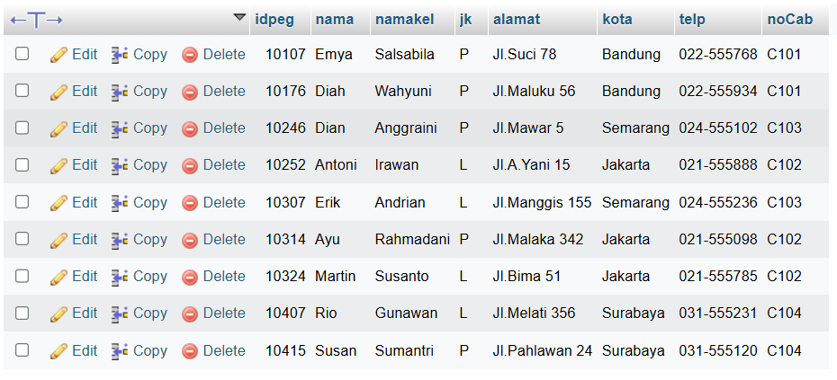
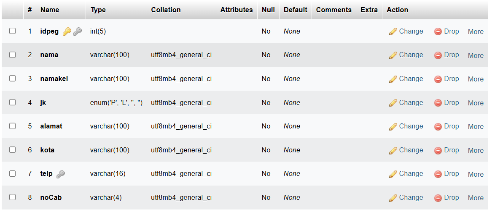
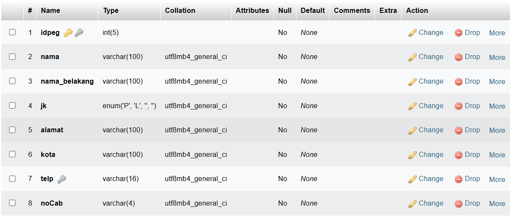
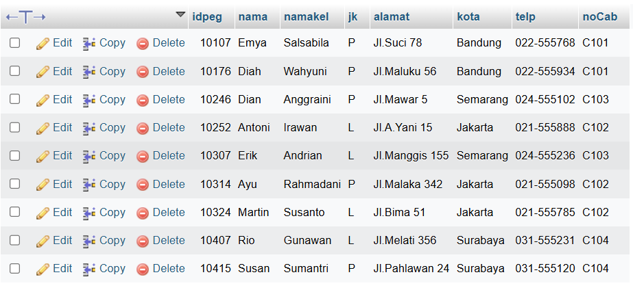
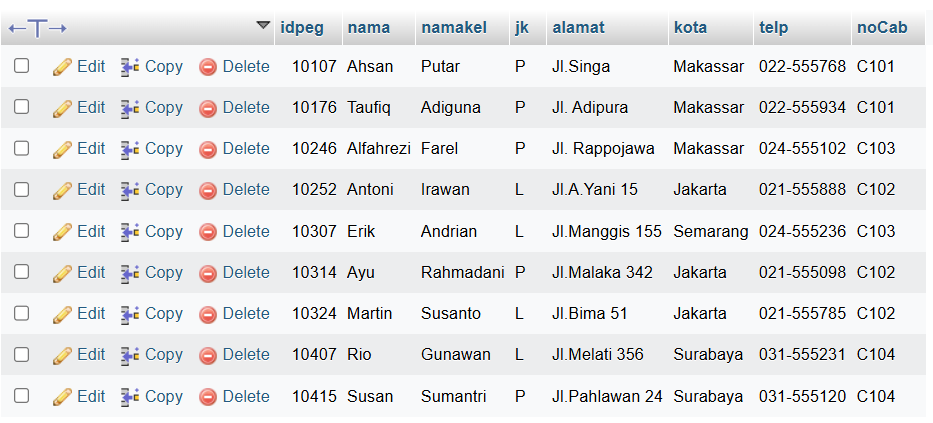
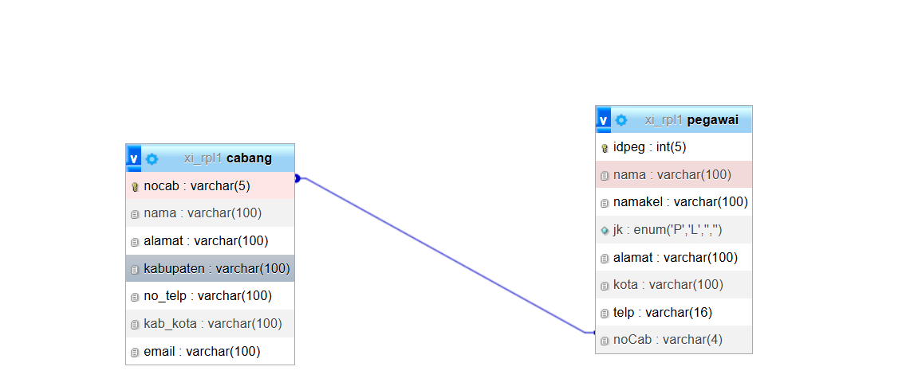
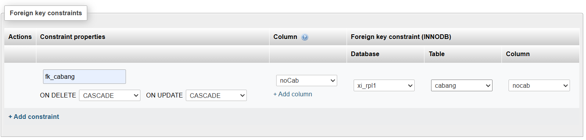

# Menggunakan XAMPP ( PHP_MYADMIN )

XAMPP adalah salah satu paket perangkat lunak yang populer digunakan untuk membuat lingkungan pengembangan web lokal. Ini termasuk Apache, MySQL, PHP, dan Perl. PHPMyAdmin adalah antarmuka web yang memungkinkan Anda mengelola basis data MySQL Anda melalui browser web.

Berikut adalah langkah-langkah umum untuk menggunakan XAMPP dengan PHPMyAdmin:

1. **Unduh XAMPP**: Kunjungi situs web resmi XAMPP di https://www.apachefriends.org/index.html. Di sana, Anda akan menemukan versi terbaru XAMPP yang sesuai dengan sistem operasi Anda. Unduh file instalasi yang sesuai dan ikuti petunjuk untuk menginstalnya di komputer Anda.
    
2. **Instal XAMPP**: Setelah selesai mengunduh, buka file instalasi XAMPP dan ikuti panduan instalasi yang diberikan. Proses instalasi akan memandu Anda melalui pengaturan dasar seperti direktori instalasi dan komponen yang ingin Anda pasang. Pastikan Anda memilih Apache dan MySQL selama proses instalasi.
    
3. **Mulai XAMPP**: Setelah instalasi selesai, Anda dapat membuka XAMPP Control Panel. Di sini, Anda akan melihat opsi untuk memulai dan menghentikan Apache, MySQL, dan komponen lainnya yang mungkin Anda instal (seperti PHP dan Perl).
    
4. **Mulai Apache dan MySQL**: Klik tombol "Start" di sebelah Apache dan MySQL di XAMPP Control Panel untuk memulai server Apache dan database MySQL. Anda akan melihat indikator yang menunjukkan bahwa kedua layanan telah berhasil dimulai.
    
5. **Verifikasi Instalasi**: Untuk memastikan bahwa XAMPP berjalan dengan baik, buka browser web Anda dan ketik `http://localhost` di bilah alamat. Jika halaman pengujian XAMPP muncul, itu berarti server Apache berjalan dengan baik. Selanjutnya, untuk memeriksa MySQL, buka `http://localhost/phpmyadmin/` di browser Anda. Jika antarmuka PHPMyAdmin muncul, MySQL berfungsi dengan baik.
    
6. **Menggunakan XAMPP**: Sekarang, Anda dapat mulai mengembangkan dan menguji aplikasi web Anda menggunakan lingkungan pengembangan lokal ini. Letakkan file PHP Anda dalam direktori `htdocs` di dalam direktori instalasi XAMPP, dan Anda dapat mengaksesnya melalui browser Anda dengan menavigasi ke `http://localhost/nama_file.php`.
    
7. **Menghentikan XAMPP**: Setelah selesai menggunakan XAMPP, pastikan untuk menghentikan Apache dan MySQL dari XAMPP Control Panel untuk membebaskan sumber daya sistem.

# Data Tabel Pegawai

## Hasil

>

# Perubahan Struktur Tabel

## BEFORE

>

## AFTER

>

# Perubahan Data Tabel

## BEFORE

>

## AFTER

>

# Hasil Relasi Tabel Pegawai & Cabang (Designer)

## Hasil

>

# Query Relasi dan Hasil

## Query

>

## Hasil

>