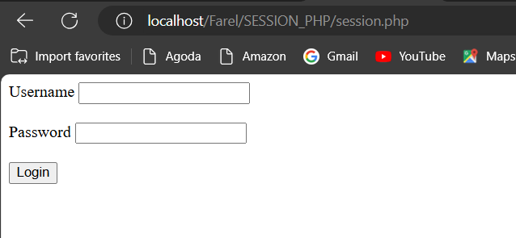

# koneksi database 
## Program

```PHP

<?php

  

$koneksi = mysqli_connect('localhost', 'root', '', 'xi_rpl1');

  

if ($koneksi) {

    echo "<br> koneksi aman <br>";

} else {

    echo "error, tidak bisa koneksi ke database";

}

  
?>


```
## hasil


>


## analisis


1. **Fungsi `mysqli_connect`**
    
    `$koneksi = mysqli_connect('localhost', 'root', '', 'xi_rpl1');`
    
    - **Tujuan:** Membuat koneksi ke database MySQL.
    - **Parameter:**
        - `'localhost'`: Nama host server database. 'localhost' berarti server database berjalan pada mesin yang sama dengan server web.
        - `'root'`: Nama pengguna MySQL. 'root' adalah pengguna default dengan hak akses penuh.
        - `''`: Kata sandi untuk pengguna MySQL. Dalam contoh ini, tidak ada kata sandi yang diatur.
        - `'xi_rpl1'`: Nama database yang akan digunakan. Di sini, database yang digunakan adalah `xi_rpl1`.
    - **Hasil:** Mengembalikan objek koneksi jika berhasil, atau `false` jika gagal.
    
1. **Memeriksa Koneksi**
    
    `if ($koneksi) {     echo "<br> koneksi aman <br>"; } else {     echo "error, tidak bisa koneksi ke database"; }`
    
    - **Tujuan:** Memeriksa apakah koneksi ke database berhasil.
    - **Logika:**
        - `if ($koneksi)`: Memeriksa apakah objek koneksi bukan `false`. Jika koneksi berhasil, ini akan bernilai `true`.
        - `echo "<br> koneksi aman <br>";`: Jika koneksi berhasil, mencetak pesan bahwa koneksi aman.
        - `else`: Jika koneksi gagal.
        - `echo "error, tidak bisa koneksi ke database";`: Jika koneksi gagal, mencetak pesan kesalahan.


## kesimpulan

Kode PHP yang diberikan bertujuan untuk menghubungkan aplikasi PHP dengan database MySQL dan memeriksa keberhasilan koneksi. Berikut adalah poin-poin penting yang dapat disimpulkan:

1. **Inisialisasi Koneksi:**
    
    - Menggunakan `mysqli_connect` untuk membuat koneksi ke database MySQL dengan parameter `localhost` (host), `root` (username), `''` (password kosong), dan `xi_rpl1` (nama database).
2. **Pemeriksaan Koneksi:**
    
    - Jika koneksi berhasil, mencetak pesan "koneksi aman".
    - Jika koneksi gagal, mencetak pesan "error, tidak bisa koneksi ke database".


# tampilkan data
## Program

```PHP

<?php

$select = mysqli_query($koneksi, "SELECT * FROM siswa_rpl1");

  

$result = mysqli_fetch_assoc($select);

  

var_dump($result);

  

echo 'Berikut mobil-mobil beserta pemiliknya<br>';

  

$a = 1;

foreach ($select as $key => $data) {

    echo $a++ . ". " . $data['nis'] . " : " . $data['ttl'] . '<br>';

}

  

echo 'Halo ' . $result['nama'] . '!!<br>';

?>

```
## hasil


>


## analisis

- **Query untuk Mengambil Data**
    
    `$select = mysqli_query($koneksi, "SELECT * FROM siswa_rpl1");`
    
    - **Tujuan:** Menjalankan kueri SQL untuk mengambil semua data dari tabel `siswa_rpl1`.
    - **Parameter:**
        - `$koneksi`: Objek koneksi ke database.
        - `"SELECT * FROM siswa_rpl1"`: Kueri SQL untuk mengambil semua data dari tabel `siswa_rpl1`.
    - **Hasil:** Mengembalikan objek `mysqli_result` yang berisi hasil Query.
    
- **Mengambil Satu Baris Data**
    
    `$result = mysqli_fetch_assoc($select);`
    
    - **Tujuan:** Mengambil baris pertama dari hasil kueri sebagai array asosiatif.
    - **Parameter:**
        - `$select`: Objek `mysqli_result` yang berisi hasil kueri.
    - **Hasil:** Mengembalikan array asosiatif yang berisi baris pertama dari hasil query.
    
- **Menampilkan Data dengan `var_dump`**
    
    `var_dump($result);`
    
    - **Tujuan:** Menampilkan struktur dan isi dari array `$result` untuk debugging.
    - **Hasil:** Menampilkan detail dari array `$result`.
    
- **Mencetak Pesan**
    
    `echo 'Berikut mobil-mobil beserta pemiliknya<br>';`
    
    - **Tujuan:** Mencetak pesan statis ke layar.
    
- **Menampilkan Data dalam Loop `foreach`**
    
    `$a = 1; foreach ($select as $key => $data) {     echo $a++ . ". " . $data['nis'] . " : " . $data['ttl'] . '<br>'; }`
    
    - **Tujuan:** Loop melalui hasil kueri dan mencetak setiap baris data.
    - **Parameter:**
        - `$select`: Objek `mysqli_result` yang berisi hasil kueri.
    - **Isi Loop:**
        - Mencetak nomor urut, `nis`, dan `ttl` dari setiap baris data.
    - **Masalah:** Loop ini tidak akan berjalan dengan benar karena objek `mysqli_result` tidak dapat langsung di-iterasi. Harus menggunakan `mysqli_fetch_assoc` dalam loop.
    
- **Mencetak Nama**
    
    `echo 'Halo ' . $result['nama'] . '!!<br>';`
    
    - **Tujuan:** Mencetak pesan yang menggabungkan teks statis dengan nilai dari array `$result`.
    - **Parameter:**
        - `$result['nama']`: Mengambil nilai `nama` dari array `$result`.


## kesimpulan

Kode PHP ini berfungsi untuk mengambil data dari tabel `siswa_rpl1` dalam database, menampilkan informasi tersebut, dan mencetak pesan tertentu.


- **Fungsi Kode:**
    
    - Mengambil data dari tabel `siswa_rpl1` dan menampilkan informasi tersebut.
- **Perbaikan:**
    
    - hasil Query menggunakan `mysqli_fetch_assoc`.
    - Menambahkan pengecekan kesalahan Query.
- **Hasil:**
    
    - Kode menjadi lebih fungsional dan lebih mudah di-debug jika terjadi kesalahan koneksi atau kueri.


# tambahkan data 
## Program

```PHP

<!DOCTYPE html>

<html lang="en">

<head>

    <title>Document</title>

</head>

<body>

    <h2>Tambah Data</h2>

    <?php

    include "database.php";

  

    if(isset($_POST['nama'])){

        $id           = $_POST['id'];

        $nis          = $_POST['nis'];

        $nama         = $_POST['nama'];

        $alamat         = $_POST['alamat'];

        $ttl         = $_POST['ttl'];

        $no_telp         = $_POST['no_telp'];

        $jk         = $_POST['jk'];

  

        $query = mysqli_query($koneksi, "INSERT into siswa_rpl1(id,nis,nama,alamat,ttl,no_telp,jk) values ('$id','$nis','$nama','$alamat','$ttl','$no_telp','$jk')");

        if($query) {

            echo "<script>

            alert('Tambah data Berhasil')

            window.location.href='index.php'

            </script>";

        }else {

            echo '<script>alert("Tambah data gagal")</script>';

        }

    }

  
  

    ?>

    <form method="post" >

        <table>

        <tr>

                <td>Id</td>

                <td><input type="number" name="id"></td>

            </tr>

            <tr>

                <td>Nis</td>

                <td><input type="number" name="nis"></td>

            </tr>

            <tr>

                <td>Nama</td>

                <td><input type="text" name="nama"></td>

            </tr>

            <tr>

                <td>Alamat</td>

                <td><input type="text" name="alamat"></td>

            </tr>

            <tr>

                <td>ttl</td>

                <td><input type="date" name="ttl"></td>

            </tr>

            <tr>

                <td>No_Telp</td>

                <td><input type="text" name="no_telp"></td>

            </tr>

  

            <tr>

                <td>Jenis Kelamin</td>

                <td>>

                    <select name="jk">

                        <option>Laki-Laki</option>

                        <option>Perempuan</option>

                    </select>  

                </td>

            </tr>

  

            <tr>

                <td></td>

                <td>

                    <button type="submit">Simpan</button>

                    <button type="reset">Reset</button>

                    <a href="index.php">Kembali</a>

                </td>

            </tr>

        </table>

    </form>

</body>

</html>

```
## hasil


>


## analisis

- **Header dan Inklusi File**
    
```PHP

<h2>Tambah Data</h2> <?php include "database.php";

```
    
- **Tujuan:** Menampilkan header "Tambah Data" dan memasukkan file `database.php` yang berisi konfigurasi koneksi database.
    
- **Proses Formulir Jika Dikirim**
    
```PHP

if(isset($_POST['nama'])){
    $id = $_POST['id'];
    $nis = $_POST['nis'];
    $nama = $_POST['nama'];
    $alamat = $_POST['alamat'];
    $ttl = $_POST['ttl'];
    $no_telp = $_POST['no_telp'];
    $jk = $_POST['jk'];
    
    $query = mysqli_query($koneksi, "INSERT into siswa_rpl1(id,nis,nama,alamat,ttl,no_telp,jk) values ('$id','$nis','$nama','$alamat','$ttl','$no_telp','$jk')");
    
    if($query) {
        echo "<script>
        alert('Tambah data Berhasil')
        window.location.href='index.php'
        </script>";
    } else {
        echo '<script>alert("Tambah data gagal")</script>';
    }
}

    
```

    
- **Tujuan:** Mengambil data dari form, menyusunnya ke dalam query SQL `INSERT`, menjalankan query tersebut, dan memberikan feedback apakah data berhasil ditambahkan atau tidak.
    - **Masalah Keamanan:** Menggunakan input langsung dari pengguna dalam query SQL tanpa sanitasi bisa menyebabkan SQL Injection. Gunakan prepared statements untuk keamanan yang lebih baik.
    
- **Formulir HTML untuk Input Data**
    
```PHP
<form method="post">
    <table>
        <tr>
            <td>Id</td>
            <td><input type="number" name="id"></td>
        </tr>
        <tr>
            <td>Nis</td>
            <td><input type="number" name="nis"></td>
        </tr>
        <tr>
            <td>Nama</td>
            <td><input type="text" name="nama"></td>
        </tr>
        <tr>
            <td>Alamat</td>
            <td><input type="text" name="alamat"></td>
        </tr>
        <tr>
            <td>ttl</td>
            <td><input type="date" name="ttl"></td>
        </tr>
        <tr>
            <td>No_Telp</td>
            <td><input type="text" name="no_telp"></td>
        </tr>
        <tr>
            <td>Jenis Kelamin</td>
            <td>
                <select name="jk">
                    <option>Laki-Laki</option>
                    <option>Perempuan</option>
                </select>
            </td>
        </tr>
        <tr>
            <td></td>
            <td>
                <button type="submit">Simpan</button>
                <button type="reset">Reset</button>
                <a href="index.php">Kembali</a>
            </td>
        </tr>
    </table>
</form>


```


- **Tujuan:** Menyediakan form HTML yang memungkinkan pengguna memasukkan data siswa yang akan disimpan ke dalam database.


## kesimpulan

Kode ini merupakan sebuah form HTML yang digunakan untuk menambahkan data ke dalam tabel `siswa_rpl1` dalam database MySQL.

- **Fungsi Kode:**
    
    - Mengambil data dari form HTML dan menyimpannya ke dalam database MySQL.
- **Perbaikan:**
    
    - Menggunakan prepared statements untuk menghindari SQL Injection.
    - Menambahkan validasi input untuk memastikan data sesuai dengan tipe dan format yang diharapkan.
    - Memperbaiki penanganan kesalahan untuk memberikan feedback yang lebih informatif.
- **Hasil:**
    
    - Kode menjadi lebih aman, andal, dan lebih informatif jika terjadi kesalahan.


# ubah data 
## Program

```PHP

<!DOCTYPE html>

<html lang="en">

<head>

    <title>Ubah Data</title>

</head>

<body>

    <h2>Ubah Data</h2>

    <?php

    include "database.php";

  

    $id = $_GET['id'];

  

    if(isset($_POST['S'])) {

       $id           = $_POST['id'];

        $nis          = $_POST['nis'];

        $nama         = $_POST['nama'];

        $alamat         = $_POST['alamat'];

        $ttl         = $_POST['ttl'];

        $no_telp         = $_POST['no_telp'];

        $jk         = $_POST['jk'];

        $query = mysqli_query($koneksi, "UPDATE siswa_rpl1 SET id='$id', nis='$nis', nama='$nama', alamat='$alamat', ttl='$ttl', no_telp='$no_telp', jk='$jk' WHERE id=$id");

        if($query) {

            echo "<script>

            alert('Ubah data Berhasil')

            window.location.href='index.php'

            </script>";

        }else {

            echo '<script>alert("Ubahh data gagal")</script>';

        }

    }

  

    $query = mysqli_query($koneksi, "SELECT * FROM siswa_rpl1 WHERE id=$id");

    $data = mysqli_fetch_array($query);

    ?>

  

    <form method="post" >

        <table>

        <tr>

                <td>Id</td>

                <td><input type="number" name="id" value="<?php echo $data['id']; ?>"></td>

            </tr>

            <tr>

                <td>Nis</td>

                <td><input type="number" name="nis" value="<?php echo $data['nis']; ?>"></td>

            </tr>

            <tr>

                <td>Nama</td>

                <td><input type="text" name="nama" value="<?php echo $data['nama']; ?>"></td>

            </tr>

            <tr>

                <td>Alamat</td>

                <td><input type="text" name="alamat" value="<?php echo $data['alamat']; ?>"></td>

            </tr>

            <tr>

                <td>ttl</td>

                <td><input type="date" name="ttl" value="<?php echo $data['ttl']; ?>"></td>

            </tr>

            <tr>

                <td>No_Telp</td>

                <td><input type="text" name="no_telp" value="<?php echo $data['no_telp']; ?>"></td>

            </tr>

  

            <tr>

                <td>Jenis Kelamin</td>

                <td>>

                    <select name="jk">

                        <option <?php if($data['jk'] == "Laki-Laki") echo 'selected'; ?>>Laki-Laki</option>

                        <option <?php if($data['jk'] == "Perempuan") echo 'selected'; ?>>Perempuan</option>

                    </select>  

                </td>

            </tr>

  

            <tr>

                <td></td>

                <td>

                    <button type="submit" name="S">Simpan</button>

                    <button type="reset">Reset</button>

                    <a href="index.php">Kembali</a>

                </td>

            </tr>

        </table>

    </form>

</body>

</html>

```
## hasil


>


## analisis

### PHP dan Logika Form

1. **Inklusi File Database**: `include "database.php";` menyertakan file yang berisi koneksi database.
2. **Pengambilan ID**: `$id = $_GET['id'];` mengambil parameter `id` dari URL.
3. **Pengolahan Data Form**:
    - **Cek Submit**: `if(isset($_POST['S'])) { ... }` memeriksa apakah form telah disubmit.
    - **Pengambilan Data**: Data dari form diambil menggunakan `$_POST` seperti `$id`, `$nis`, `$nama`, `$alamat`, `$ttl`, `$no_telp`, dan `$jk`.
    - **Query Update**: `mysqli_query($koneksi, "UPDATE siswa_rpl1 SET ... WHERE id=$id");` menjalankan query SQL untuk memperbarui data dalam tabel `siswa_rpl1`.
    - **Feedback**: Menggunakan JavaScript `alert` untuk memberikan feedback apakah data berhasil diubah atau gagal.
4. **Pengambilan Data dari Database**:
    - **Query Select**: `mysqli_query($koneksi, "SELECT * FROM siswa_rpl1 WHERE id=$id");` menjalankan query SQL untuk mengambil data dari database berdasarkan ID.
    - **Fetch Data**: `mysqli_fetch_array($query);` mengambil data hasil query dan menyimpannya dalam array `$data`.

### Form HTML

1. **Form**: Tag `<form>` dengan metode `post`.
2. **Input Fields**: Berbagai input fields untuk ID, NIS, Nama, Alamat, TTL, No_Telp, dan Jenis Kelamin dengan nilai default diisi dari array `$data`.
    - **ID**: `<input type="number" name="id" value="<?php echo $data['id']; ?>">`
    - **NIS**: `<input type="number" name="nis" value="<?php echo $data['nis']; ?>">`
    - **Nama**: `<input type="text" name="nama" value="<?php echo $data['nama']; ?>">`
    - **Alamat**: `<input type="text" name="alamat" value="<?php echo $data['alamat']; ?>">`
    - **TTL**: `<input type="date" name="ttl" value="<?php echo $data['ttl']; ?>">`
    - **No_Telp**: `<input type="text" name="no_telp" value="<?php echo $data['no_telp']; ?>">`
    - **Jenis Kelamin**: `<select name="jk">`
        - **Laki-Laki** dan **Perempuan**: `<option <?php if($data['jk'] == "Laki-Laki") echo 'selected'; ?>>Laki-Laki</option>` dan `<option <?php if($data['jk'] == "Perempuan") echo 'selected'; ?>>Perempuan</option>`
3. **Buttons**:
    - **Simpan**: `<button type="submit" name="S">Simpan</button>`
    - **Reset**: `<button type="reset">Reset</button>`
    - **Kembali**: `<a href="index.php">Kembali</a>`


## kesimpulan

Secara keseluruhan, kode ini berfungsi untuk memperbarui data dalam database dan menampilkan form yang diisi dengan data yang sudah ada, namun perlu ditingkatkan dari segi keamanan dan validasi data.


# hapus data 
## Program
```PHP

<?php

  

include('database.php');

  

if(isset($_GET['id'])){

  
  

    $id = $_GET['id'];

  

    $query = mysqli_query($koneksi, "DELETE FROM siswa_rpl1 WHERE id = $id");

  

   if($query) {

            echo "<script>

            alert('Hapus data Berhasil')

            window.location.href='index.php'

            </script>";

        }else {

            echo '<script>alert("Hapus data gagal")</script>';

        }

}

  

?>

```


## hasil


>


## analisis

#### 1. Inklusi File Database


```PHP

include('database.php');

```


- **Deskripsi**: Menyertakan file `database.php` yang biasanya berisi kode untuk koneksi ke database.
- **Tujuan**: Memastikan koneksi ke database tersedia untuk digunakan dalam operasi selanjutnya.

#### 2. Memeriksa dan Mengambil Parameter ID dari URL


```PHP

if(isset($_GET['id'])) {
    $id = $_GET['id'];

```


- **Deskripsi**: Memeriksa apakah parameter `id` ada dalam URL (`http://example.com/script.php?id=123`).
- **Tujuan**: Mengambil nilai `id` dari parameter URL untuk digunakan dalam query penghapusan.

#### 3. Melakukan Query Penghapusan Data


```PHP

$query = mysqli_query($koneksi, "DELETE FROM siswa_rpl1 WHERE id = $id");

```


- **Deskripsi**: Menjalankan query SQL untuk menghapus baris dari tabel `siswa_rpl1` di mana kolom `id` sama dengan nilai `id` yang diterima dari URL.
- **Tujuan**: Menghapus data siswa yang sesuai dengan `id` yang diberikan.

#### 4. Memberikan Feedback kepada Pengguna


```PHP

if($query) {
        echo "<script>
        alert('Hapus data Berhasil');
        window.location.href='index.php';
        </script>";
    } else {
        echo '<script>alert("Hapus data gagal")</script>';
    }

```


- **Deskripsi**: Memeriksa apakah query penghapusan berhasil.
    - Jika berhasil (`$query` bernilai true), menampilkan pesan sukses menggunakan `alert` JavaScript dan mengarahkan pengguna kembali ke `index.php`.
    - Jika gagal (`$query` bernilai false), menampilkan pesan gagal menggunakan `alert` JavaScript.
- **Tujuan**: Memberikan umpan balik kepada pengguna tentang status operasi penghapusan.


## kesimpulan

Kode ini berfungsi untuk menghapus data siswa dari database dengan mengambil ID dari URL, namun rentan terhadap serangan SQL Injection dan memiliki penanganan kesalahan yang minimal. Disarankan untuk meningkatkan keamanan dengan menggunakan prepared statements dan menambah validasi serta sanitasi input.


# session/login

## Session

### Program 


```PHP

<?php

session_start();

  

// $username = "Farel";

// $alamat = "RPJ";

  

// $_SESSION['username'] = $username;

// $_SESSION['alamat'] = $alamat;

  

if (isset($_POST['submit'])) {

    // var_dump($_POST);

    $username = $_POST['username'];

    $password = $_POST['password'];

  

    $koneksi = mysqli_connect('localhost', 'root', '', 'xi_rpl1') or die('error koneksi');

    $result = mysqli_query($koneksi, "SELECT * FROM user WHERE username = '$username' AND password = '$password'");

  

    $data = mysqli_fetch_assoc($result);

  

    // var_dump($data);

  

    if(isset($data)) {

        $_SESSION['username'] = $data['username'];

        $_SESSION['nama'] = $data['nama'];

        $_SESSION['status'] = 'login';

        header('Location: user.php');

    } else {

        echo "Username dan Password Salah";

    }

}

?>

  

<!DOCTYPE html>

<html lang="en">

<head>

    <meta charset="UTF-8">

    <meta name="viewport" content="width=device-width, initial-scale=1.0">

    <title>FORM LOG IN SESSION</title>

</head>

<body>

    <form method="post">

        <label>Username</label>

        <input type="text" name="username">

        <br>

        <br>

        <label>Password</label>

        <input type="password" name="password">

        <br>

        <br>

        <button type="submit" name="submit">Login</button>

    </form>

</body>

</html>


```


### Hasil


>


### Analisis

#### Session Handling


```PHP

session_start();

```


- **Deskripsi**: Memulai sesi PHP untuk memungkinkan penggunaan variabel sesi.
- **Tujuan**: Mengelola status login pengguna.

#### 2. Form Handling


```PHP

if (isset($_POST['submit'])) {

```


- **Deskripsi**: Memeriksa apakah form telah disubmit dengan memeriksa apakah tombol submit telah ditekan.
- **Tujuan**: Melanjutkan proses login hanya jika form telah disubmit.

#### 3. Database Connection


```PHP

$koneksi = mysqli_connect('localhost', 'root', '', 'xi_rpl1') or die('error koneksi');

```


- **Deskripsi**: Membuat koneksi ke database `xi_rpl1` menggunakan MySQLi.
- **Tujuan**: Menghubungkan skrip dengan database yang berisi tabel pengguna.

#### 4. User Authentication


```PHP

$result = mysqli_query($koneksi, "SELECT * FROM user WHERE username = '$username' AND password = '$password'");
$data = mysqli_fetch_assoc($result);

```


- **Deskripsi**: Menjalankan query untuk mencari user dengan username dan password yang cocok.
- **Tujuan**: Memverifikasi kredensial pengguna terhadap data yang ada di database.

#### 5. Session Management


```PHP

if(isset($data)) {
    $_SESSION['username'] = $data['username'];
    $_SESSION['nama'] = $data['nama'];
    $_SESSION['status'] = 'login';
    header('Location: user.php');
} else {
    echo "Username dan Password Salah";
}

```


- **Deskripsi**:
    - Jika user ditemukan, menyimpan informasi user dalam variabel sesi dan mengarahkan pengguna ke `user.php`.
    - Jika user tidak ditemukan, menampilkan pesan error.
- **Tujuan**: Mengatur status login dan memberikan akses ke halaman user.

#### 6. HTML Form


```PHP

<!DOCTYPE html>
<html lang="en">
<head>
    <meta charset="UTF-8">
    <meta name="viewport" content="width=device-width, initial-scale=1.0">
    <title>FORM LOG IN SESSION</title>
</head>
<body>
    <form method="post">
        <label>Username</label>
        <input type="text" name="username">
        <br>
        <br>
        <label>Password</label>
        <input type="password" name="password">
        <br>
        <br>
        <button type="submit" name="submit">Login</button>
    </form>
</body>
</html>

```


- **Deskripsi**: HTML form sederhana dengan input untuk username dan password serta tombol submit.
- **Tujuan**: Mengumpulkan input dari pengguna untuk diproses oleh skrip PHP.


### Kesimpulan

#### Fungsi Utama:

- Mengelola sesi login pengguna.
- Mengotentikasi pengguna berdasarkan username dan password dari database.
- Menyimpan status login dalam session dan mengarahkan pengguna ke halaman user jika login berhasil.


Kode PHP ini digunakan untuk membuat form login yang mengautentikasi pengguna berdasarkan username dan password yang disimpan dalam database, serta menggunakan session untuk menyimpan status login.


## User
### Program


```PHP

<?php

session_start();

  

if ($_SESSION['status'] == 'login' && $_SESSION['username'] == 'Admin') {

    header("Location: admin.php");

}

if ($_SESSION['status'] != 'login') {

    header('Location: session.php');

}

  

?>

<!DOCTYPE html>

<html lang="en">

  

<head>

    <title>Document</title>

</head>

  

<body>

    <h1>Halaman User</h1>

  

    <h1>Halo, <?= $_SESSION['nama'] ?></h1>

    <a href="logout.php">Logout</a>

  

</body>

  

</html>


```


### Hasil


>


### Analisis

#### 1. Session Handling


```PHP

session_start();

```


- **Deskripsi**: Memulai sesi PHP untuk memungkinkan penggunaan variabel sesi.
- **Tujuan**: Mengelola status dan informasi login pengguna.

#### 2. Redirection Berdasarkan Status dan Role


```PHP

if ($_SESSION['status'] == 'login' && $_SESSION['username'] == 'Admin') {
    header("Location: admin.php");
}
if ($_SESSION['status'] != 'login') {
    header('Location: session.php');
}

```


- **Deskripsi**:
    - **Redirection untuk Admin**: Jika pengguna login sebagai 'Admin', maka diarahkan ke `admin.php`.
    - **Redirection untuk Pengguna Tidak Login**: Jika pengguna tidak login, maka diarahkan ke `session.php`.
- **Tujuan**: Mengontrol akses halaman berdasarkan status login dan role pengguna.

#### 3. HTML Output


```HTML

<!DOCTYPE html>
<html lang="en">
<head>
    <title>Document</title>
</head>
<body>
    <h1>Halaman User</h1>
    <h1>Halo, <?= $_SESSION['nama'] ?></h1>
    <a href="logout.php">Logout</a>
</body>
</html>

```


- **Deskripsi**:
    - **Header Halaman**: Menampilkan judul halaman "Halaman User".
    - **Salam Pengguna**: Menampilkan salam personal menggunakan nama dari session (`$_SESSION['nama']`).
    - **Link Logout**: Menyediakan link untuk logout.
- **Tujuan**: Menyajikan antarmuka halaman user dan menampilkan informasi pengguna yang login.


### Kesimpulan

Kode ini berfungsi untuk mengelola akses halaman user berdasarkan status login dan role pengguna, serta menampilkan informasi pengguna yang login. Namun, ada beberapa kelemahan dalam hal keamanan dan struktur HTML yang dapat diperbaiki untuk meningkatkan keamanan dan kualitas kode. Disarankan untuk menambahkan pemeriksaan inisialisasi session, memperbaiki struktur kontrol redirection, dan meningkatkan struktur HTML serta sanitasi output untuk pengalaman pengguna yang lebih baik.


## Admin

### Program


```PHP

<?php

session_start();

  

if ($_SESSION['status'] == 'login' && $_SESSION['username'] != 'Admin') {

    header("Location: user.php");

}

  

if ($_SESSION['status'] != 'login') {

    header('Location: session.php');

}

  

?>

<!DOCTYPE html>

<html lang="en">

  

<head>

    <title>Document</title>

</head>

  

<body>

    <h1>Halaman Admin</h1>

  

    <h1>Halo, <?= $_SESSION['nama'] ?></h1>

    <a href="logout.php">Logout</a>

  

</body>

  

</html>


```


### Hasil


>


### Analisis

#### 1. Session Handling


```PHP

session_start();

```


- **Deskripsi**: Memulai sesi PHP untuk memungkinkan penggunaan variabel sesi.
- **Tujuan**: Mengelola status dan informasi login pengguna.

#### 2. Redirection Berdasarkan Status dan Role


```PHP

if ($_SESSION['status'] == 'login' && $_SESSION['username'] != 'Admin') {
    header("Location: user.php");
}

if ($_SESSION['status'] != 'login') {
    header('Location: session.php');
}

```


- **Deskripsi**:
    - **Redirection untuk Non-Admin**: Jika pengguna login tetapi bukan 'Admin', maka diarahkan ke `user.php`.
    - **Redirection untuk Pengguna Tidak Login**: Jika pengguna tidak login, maka diarahkan ke `session.php`.
- **Tujuan**: Mengontrol akses halaman berdasarkan status login dan role pengguna.

#### 3. HTML Output


```HTML

<!DOCTYPE html>
<html lang="en">
<head>
    <title>Document</title>
</head>
<body>
    <h1>Halaman Admin</h1>
    <h1>Halo, <?= $_SESSION['nama'] ?></h1>
    <a href="logout.php">Logout</a>
</body>
</html>

```


- **Deskripsi**:
    - **Header Halaman**: Menampilkan judul halaman "Halaman Admin".
    - **Salam Pengguna**: Menampilkan salam personal menggunakan nama dari session (`$_SESSION['nama']`).
    - **Link Logout**: Menyediakan link untuk logout.
- **Tujuan**: Menyajikan antarmuka halaman admin dan menampilkan informasi pengguna yang login.


### Kesimpulan

Kode ini berfungsi untuk mengelola akses halaman admin berdasarkan status login dan role pengguna, serta menampilkan informasi pengguna yang login. Namun, ada beberapa kelemahan dalam hal keamanan dan struktur HTML yang dapat diperbaiki untuk meningkatkan keamanan dan kualitas kode. Disarankan untuk menambahkan pemeriksaan inisialisasi session, memperbaiki struktur kontrol redirection, dan meningkatkan struktur HTML serta sanitasi output untuk pengalaman pengguna yang lebih baik.


## LogOut

### Program


```PHP

<?php

  

session_start();

  

session_destroy();

session_unset();

  

header('Location: session.php');


```


### Hasil


>


### Analisis

Kode PHP ini bertanggung jawab untuk mengakhiri sesi pengguna dan mengarahkannya kembali ke halaman login (`session.php`). Mari kita analisis lebih detail:

1. **`session_start()`**: Fungsi ini memulai atau melanjutkan sesi yang sudah ada di server.
    
2. **`session_destroy()`**: Fungsi ini menghapus semua data sesi yang tersimpan. Ini mencakup menghapus semua variabel sesi yang ditetapkan dan mengakhiri sesi itu sendiri.
    
3. **`session_unset()`**: Fungsi ini menghapus semua variabel dari sesi saat ini. Namun, itu tidak menghancurkan sesi itu sendiri.
    
4. **`header('Location: session.php')`**: Ini adalah header HTTP yang digunakan untuk mengarahkan pengguna kembali ke halaman login (session.php) setelah sesi diakhiri.


### Kesimpulan

Kode tersebut bertujuan untuk mengakhiri sesi pengguna dan mengarahkannya kembali ke halaman login. Ini dilakukan dengan memanggil fungsi `session_destroy()` dan `session_unset()` untuk menghapus semua data sesi dan mengakhiri sesi, serta menggunakan `header('Location: session.php')` untuk mengarahkan pengguna kembali ke halaman login.


## Cek_User_Admin

### Program


```PHP

<?php

  

if ($_SESSION['status'] == 'login' && $_SESSION['username'] != 'admin') {

    header("Location: user.php");

} else if ($_SESSION['status'] == 'login' && $_SESSION['username'] == 'admin') {

    header("Location: admin.php");

}else{

    header("Location: session.php");

}

  

?>


```


### Hasil

**User**

>


**Admin**

>


### Analisis

Kode PHP ini bertujuan untuk mengarahkan pengguna ke halaman yang sesuai berdasarkan status login dan peran (role) pengguna. Mari kita analisis lebih detail:

1. **Pemeriksaan Status Login dan Peran Pengguna**:
    

```PHP

if ($_SESSION['status'] == 'login' && $_SESSION['username'] != 'admin') {
    header("Location: user.php");
} else if ($_SESSION['status'] == 'login' && $_SESSION['username'] == 'admin') {
    header("Location: admin.php");
} else {
    header("Location: session.php");
}

```

    
    - Kode ini melakukan beberapa pemeriksaan kondisional untuk menentukan halaman tujuan pengguna berdasarkan status login dan peran pengguna.
    - Jika pengguna telah login dan peran pengguna bukan 'admin', maka akan diarahkan ke halaman pengguna (user.php).
    - Jika pengguna telah login dan peran pengguna adalah 'admin', maka akan diarahkan ke halaman admin (admin.php).
    - Jika pengguna tidak login, maka akan diarahkan ke halaman login (session.php).


### Kesimpulan

Kode PHP tersebut bertujuan untuk mengarahkan pengguna ke halaman yang sesuai berdasarkan status login dan peran (`role`) pengguna. Jika pengguna telah login, maka mereka akan diarahkan ke halaman sesuai dengan peran mereka, yaitu halaman pengguna (`user.php`) jika bukan admin, dan halaman admin (`admin.php`) jika peran pengguna adalah 'admin'. Jika pengguna belum login, mereka akan diarahkan kembali ke halaman login (`session.php`).


# upload dan download

## Upload

### Program

```PHP

function upload(): string
{

    $nameImage = $_FILES['gambar']['name'];
    $directoryFile = $_FILES['gambar']['tmp_name'];
    $errorImage = intval($_FILES['gambar']['error']);
    $sizeFile = $_FILES['gambar']['size'];

    // cek apakah gambar ada
    if ($errorImage === 4) {
        echo "<script>alert('Anda Belum Upload Gambar')</script>";
        return false;
    }

    // mengambil ekstensi file
    $validType = ['svg', 'jpg', 'png', 'jpeg', 'webp'];
    $extensionFile = explode(".", $nameImage);
    $extensionValid = strtolower(end($extensionFile));

    // cek apakah yang diupload gambar atau bukan
    if (!in_array($extensionValid, $validType)) {
        echo "<script>alert('yang anda Upload bukan gambar')</script>";
        return false;
    }

    // cek size file
    if ($sizeFile > 3_000_000) {
        echo "<script>alert('Ukuran File Terlalu Besar!!(Maks 3MB)')</script>";
        return false;
    }

    // upload file
    $nameImage = uniqid() . "." . $extensionValid;
    move_uploaded_file($directoryFile, "img/{$nameImage}");

    // mengembalikan namafile yg sudah divalidasi
    return $nameImage;
}

```

### hasil

>


>


### analisis

Kode PHP tersebut mendefinisikan sebuah fungsi `upload()` yang menangani pengunggahan file gambar. Berikut adalah analisis rinci dari kode tersebut:

1. **Inisialisasi Variabel**:
    
    - `$nameImage` menyimpan nama asli file yang diunggah.
    - `$directoryFile` menyimpan direktori sementara tempat file diunggah.
    - `$errorImage` menyimpan kode kesalahan terkait pengunggahan file.
    - `$sizeFile` menyimpan ukuran file dalam byte.
2. **Cek Apakah Gambar Ada**:
    
    - Jika `$errorImage` bernilai 4 (yang berarti tidak ada file yang diunggah), sebuah alert akan muncul dengan pesan "Anda Belum Upload Gambar" dan fungsi akan mengembalikan `false`.
3. **Mengambil Ekstensi File**:
    
    - `explode(".", $nameImage)` memecah nama file berdasarkan titik untuk mendapatkan ekstensi file.
    - `strtolower(end($extensionFile))` memastikan ekstensi file dalam huruf kecil.
4. **Cek Tipe File yang Valid**:
    
    - `in_array($extensionValid, $validType)` memeriksa apakah ekstensi file yang diunggah termasuk dalam daftar ekstensi yang valid (`svg`, `jpg`, `png`, `jpeg`, `webp`).
    - Jika tidak valid, sebuah alert akan muncul dengan pesan "yang anda Upload bukan gambar" dan fungsi akan mengembalikan `false`.
5. **Cek Ukuran File**:
    
    - Jika ukuran file lebih besar dari 3MB, sebuah alert akan muncul dengan pesan "Ukuran File Terlalu Besar!!(Maks 3MB)" dan fungsi akan mengembalikan `false`.
6. **Upload File**:
    
    - `uniqid()` digunakan untuk membuat nama file yang unik sehingga menghindari konflik nama file.
    - `move_uploaded_file($directoryFile, "img/{$nameImage}")` memindahkan file dari direktori sementara ke direktori tujuan ("img/").
7. **Mengembalikan Nama File**:
    
    - Fungsi mengembalikan nama file yang telah divalidasi dan diunggah.

Dengan demikian, fungsi `upload()` ini menangani berbagai langkah yang diperlukan untuk mengunggah file gambar dengan validasi tipe file, ukuran file, dan pembuatan nama file yang unik untuk penyimpanan.


### kesimpulan

Fungsi `upload()` menangani pengunggahan file gambar dengan melakukan beberapa langkah validasi dan penanganan kesalahan:

1. **Inisialisasi Variabel**: Mengambil informasi tentang file yang diunggah (nama, direktori sementara, kesalahan, ukuran).
2. **Cek Keberadaan File**: Memastikan ada file yang diunggah, jika tidak, memberikan peringatan dan mengembalikan `false`.
3. **Validasi Ekstensi File**: Memastikan file yang diunggah memiliki ekstensi yang valid (svg, jpg, png, jpeg, webp), jika tidak, memberikan peringatan dan mengembalikan `false`.
4. **Validasi Ukuran File**: Memastikan ukuran file tidak lebih dari 3MB, jika lebih, memberikan peringatan dan mengembalikan `false`.
5. **Proses Pengunggahan**: Menghasilkan nama file yang unik dan memindahkan file dari direktori sementara ke direktori tujuan ("img/").
6. **Mengembalikan Nama File**: Mengembalikan nama file yang telah diunggah jika semua validasi berhasil.

Fungsi ini membantu dalam memastikan bahwa hanya file gambar dengan ukuran yang sesuai yang dapat diunggah, serta memberikan penanganan kesalahan yang sesuai jika terdapat masalah selama proses pengunggahan.


## Download 

### Program

```PHP

<?php
include "database.php";

$query = mysqli_query($koneksi, 'SELECT * FROM siswa_rpl1');

$data = [];
$data[] = ["id", "nis" , "nama", "alamat", "ttl" , "no_telp" , "jk"];
while ($row = mysqli_fetch_assoc($query)) {
    $data[] = [
        $row['id'],
        $row['nis'],
        $row['nama'],
        $row['alamat'],
        $row['ttl'],
        $row['no_telp'],
        $row['jk'],
    ];
}

$namafile = "excel_data.xls";
header("Content-Type: application/vnd.ms-excel");
header("Content-Disposition: attachment;filename=\"$namafile\"");
header("Cache-Control: max-age=0");

$output = fopen("php://output", "w");

foreach ($data as $row) {
    fputcsv($output, $row, "\t");
}

fclose($output);
exit;

```

### hasil

>


### analisis

Kode PHP ini berfungsi untuk mengambil data dari basis data dan mengekspornya ke file Excel. Berikut adalah analisis rinci dari kode tersebut:

1. **Menyertakan File Database**:


```PHP

include "database.php";

```


    
- Baris ini menyertakan file `database.php`, yang diasumsikan berisi koneksi ke basis data.
2. **Mengambil Data dari Basis Data**:


```PHP

$query = mysqli_query($koneksi, 'SELECT * FROM siswa_rpl1');

```


    
- Baris ini menjalankan query SQL untuk mengambil semua data dari tabel `siswa_rpl1`.
3. **Menyiapkan Data**:


```PHP

$data = [];
$data[] = ["id", "nis", "nama", "alamat", "ttl", "no_telp", "jk"];
while ($row = mysqli_fetch_assoc($query)) {
    $data[] = [
        $row['id'],
        $row['nis'],
        $row['nama'],
        $row['alamat'],
        $row['ttl'],
        $row['no_telp'],
        $row['jk'],
    ];
}

```


- Data diinisialisasi sebagai array kosong.
- Baris pertama array `$data` diisi dengan header kolom.
- Loop `while` digunakan untuk mengisi array `$data` dengan data yang diambil dari basis data.
4. **Menyiapkan Header untuk Ekspor Excel**:
    

```PHP

$namafile = "excel_data.xls";
header("Content-Type: application/vnd.ms-excel");
header("Content-Disposition: attachment;filename=\"$namafile\"");
header("Cache-Control: max-age=0");


```


    
- Menetapkan nama file untuk file Excel yang akan dihasilkan.
- Header HTTP dikonfigurasi untuk menunjukkan bahwa konten yang dikirim adalah file Excel dan memaksa browser untuk mendownload file tersebut dengan nama yang ditentukan.
5. **Menulis Data ke Output**:
    

```PHP

$output = fopen("php://output", "w");

foreach ($data as $row) {
    fputcsv($output, $row, "\t");
}

fclose($output);
exit;


```

    
- Membuka stream output dengan `fopen("php://output", "w")`.
- Menggunakan `fputcsv` untuk menulis setiap baris data ke output, dengan tab sebagai delimiter.
- Menutup stream output dengan `fclose($output)`.
- Menghentikan eksekusi script dengan `exit`.


### kesimpulan

Kode ini mengambil data dari tabel `siswa_rpl1` dalam basis data, menyimpannya dalam array, dan kemudian mengekspornya ke file Excel dengan nama `excel_data.xls`. File ini kemudian dikirim ke browser untuk diunduh. Fungsi utama yang digunakan adalah `mysqli_query` untuk mengambil data, `mysqli_fetch_assoc` untuk memproses data hasil query, serta `fputcsv` untuk menulis data ke file Excel dengan delimiter tab.


 

