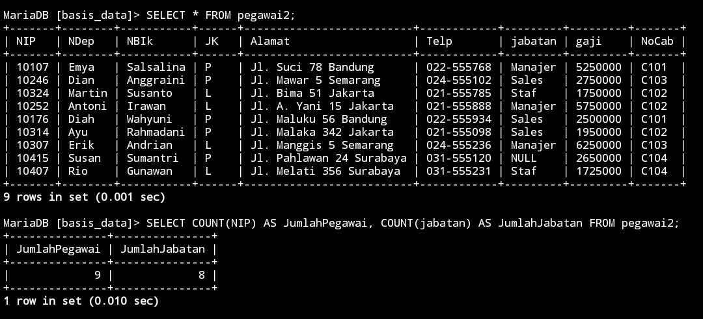

# PRAKTIKUM 5 (1)


## CONTOH


```MySQL

SELECT COUNT(NIP) AS JumlahPegawai, COUNT(jabatan) AS JumlahJabatan FROM pegawai2;

```


## HASIL

>


## ANALISIS 


- `SELECT` : Untuk memilih kolom apa saja yang ingin dipilih (untuk dihitung)
- `COUNT(NIP)` : Untuk menghitung jumlah barisan data yang mempunyai isi data dari kolom yang dipilih. `NIP` adalah nama kolom yang dipilih untuk dihitung 
- `AS` : Untuk mengubah nama dari suatu kolom untuk sementara 
- "JumlahPegawai" : merupakan nama ubahan dari perintah AS yang digunakan merupakan nama sementara dari perintah `COUNT(NIP)`
- `COUNT(jabatan)` : untuk menghitung jumlah barisan data yang mempunyai isi data dari kolom yang dipilih `jabatan` adalah nama kolom yang dipilih untuk dihitung
- `AS` : Untuk mengubah nama dari suatu kolom untuk sementara 
- "JumlahJabatan" : merupakan nama sementara dari perintah `COUNT(jabatan)`
- `FROM` "pegawai2" : merupakan dari tabel mana datanya yang digunakan "pegawai2" adalah nama tabel yang datanya ingin digunakan
- Hasilnya : karena ada 9 barisan data, yang ingin dihitung adalah kolom `NIP`, jumlah dari kolom `NIP` (isi datanya) ada 9, ditampilkan sebagai "JumlahPegawai". Kolom "jabatan" juga dihitung, akan tetapi ada satu data yang berisi `NULL`(kosong) oleh karena itu hanya ada 8 data ditampilkan sebagai "JumlahJabatan"


